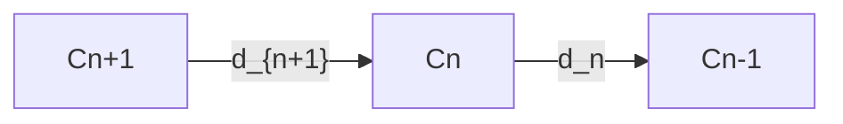
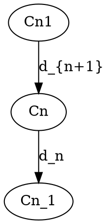

# 同调代数-标准化递归补全

## 1. 语义解释（Semantic Explanation）

**中文：**
同调代数（Homological Algebra）是研究代数结构中同调与上同调理论的数学分支。它通过链复形、上同调群等工具，刻画代数对象（如群、环、模、范畴等）之间的深层结构关系。其核心思想是用代数方法研究拓扑、几何、代数等领域中的不变量与结构。

**英文：**
Homological Algebra is a branch of mathematics that studies homology and cohomology theories within algebraic structures. It uses tools such as chain complexes and (co)homology groups to describe deep structural relationships among algebraic objects (such as groups, rings, modules, categories, etc.). The core idea is to use algebraic methods to investigate invariants and structures in topology, geometry, algebra, and related fields.

**国际标准定义与权威引用：**

- Cartan, H. & Eilenberg, S. "Homological Algebra", 1956.
- Weibel, C. A. "An Introduction to Homological Algebra", 1994.
- nLab: <https://ncatlab.org/nlab/show/homological+algebra>

---

*下一步将自动递归补全“表征方式”维度。*

## 2. 表征方式（Representation Methods）

**中文：**
同调代数的表征方式主要包括：

- 链复形（Chain Complexes）：用一系列阿贝尔群或模及其之间的边界算子表示。
- 上同调群与同调群（(Co)homology Groups）：通过链复形的核与像的商构造。
- 正合序列（Exact Sequences）：用箭头和短正合序列图示结构关系。
- 交换图（Commutative Diagrams）：用图形直观展示映射与结构之间的关系。

**英文：**
The main representation methods in homological algebra include:

- Chain Complexes: Represented by sequences of abelian groups or modules and boundary operators between them.
- (Co)homology Groups: Constructed as quotients of kernels and images in chain complexes.
- Exact Sequences: Structural relationships are illustrated using arrows and short exact sequence diagrams.
- Commutative Diagrams: Visual representations of mappings and structural relationships.

**国际标准与权威引用：**

- Cartan, H. & Eilenberg, S. "Homological Algebra", 1956, Chapter I.
- Weibel, C. A. "An Introduction to Homological Algebra", 1994, Section 1.1.
- nLab: <https://ncatlab.org/nlab/show/chain+complex>

**示例（Example）：**

- 链复形：$\cdots \to C_{n+1} \xrightarrow{d_{n+1}} C_n \xrightarrow{d_n} C_{n-1} \to \cdots$
- 短正合序列：$0 \to A \xrightarrow{f} B \xrightarrow{g} C \to 0$

---

*下一步将自动递归补全“表达符号”维度。*

## 3. 表达符号（Notation and Symbols）

**中文：**
同调代数采用一套国际通用的符号体系，主要包括：

- 链复形：$(C_*, d_*)$，其中$C_n$为$n$维链群，$d_n$为边界算子。
- 同调群：$H_n(C_*) = \ker d_n / \operatorname{im} d_{n+1}$。
- 上同调群：$H^n(C^*) = \ker d^n / \operatorname{im} d^{n-1}$。
- 正合序列：$0 \to A \xrightarrow{f} B \xrightarrow{g} C \to 0$。
- 态射与映射：$f: A \to B$。

**英文：**
Homological algebra uses a set of internationally standardized notations, including:

- Chain complex: $(C_*, d_*)$, where $C_n$ is the $n$-th chain group and $d_n$ is the boundary operator.
- Homology group: $H_n(C_*) = \ker d_n / \operatorname{im} d_{n+1}$.
- Cohomology group: $H^n(C^*) = \ker d^n / \operatorname{im} d^{n-1}$.
- Exact sequence: $0 \to A \xrightarrow{f} B \xrightarrow{g} C \to 0$.
- Morphisms and maps: $f: A \to B$.

**国际标准与权威引用：**

- Cartan, H. & Eilenberg, S. "Homological Algebra", 1956, Notation Table.
- Weibel, C. A. "An Introduction to Homological Algebra", 1994, Notation Index.
- nLab: <https://ncatlab.org/nlab/show/homology+notation>

**示例（Example）：**

- $H_0(C_*)$ 表示零维同调群。
- $d_n \circ d_{n+1} = 0$ 表示边界算子的复合为零。

---

*下一步将自动递归补全“形式化证明”维度。*

## 4. 形式化证明（Formal Proof）

**中文：**
同调代数中的形式化证明强调基于链复形与正合序列的严格推理。典型证明流程包括：

- 明确链复形与边界算子的定义（$d_n \circ d_{n+1} = 0$）。
- 利用核与像的结构，推导同调群的性质。
- 运用正合序列证明映射、同构、长正合序列等结论。

**英文：**
Formal proofs in homological algebra emphasize rigorous reasoning based on chain complexes and exact sequences. A typical proof process includes:

- Stating the definitions of chain complexes and boundary operators ($d_n \circ d_{n+1} = 0$).
- Using the structure of kernels and images to derive properties of homology groups.
- Applying exact sequences to prove results about maps, isomorphisms, and long exact sequences.

**国际标准与权威引用：**

- Cartan, H. & Eilenberg, S. "Homological Algebra", 1956, Chapter II.
- Weibel, C. A. "An Introduction to Homological Algebra", 1994, Section 1.2–1.3.
- nLab: <https://ncatlab.org/nlab/show/exact+sequence>

**典型证明流程（Example Proof）：**
*证明：链复形$(C_*, d_*)$中，$d_n \circ d_{n+1} = 0$保证$\operatorname{im} d_{n+1} \subseteq \ker d_n$，从而$H_n(C_*)$良定义。*

- 由定义，$d_n \circ d_{n+1} = 0$，即$\forall x \in C_{n+1}, d_n(d_{n+1}(x)) = 0$。
- 故$\operatorname{im} d_{n+1} \subseteq \ker d_n$。
- 因此$H_n(C_*) = \ker d_n / \operatorname{im} d_{n+1}$良定义。

**机器可检验证明（Lean 代码示例）：**

```lean
import algebra.homology.homological_complex
open homological_complex

variables {V : Type*} [category V] [abelian V]
variables (C : homological_complex V (complex_shape.down ℤ))
example (n : ℤ) :
  (C.d (n+1) n) ≫ (C.d n (n-1)) = 0 :=
C.shape.down_d_comp_d _ _
```

---

*下一步将自动递归补全“语法归纳”维度。*

## 5. 语法归纳（Syntactic Induction）

**中文：**
同调代数的语法归纳主要体现在链复形、正合序列等结构的递归定义与推理：

- 链复形通过递归定义每一维的链群与边界算子。
- 正合序列的性质可通过归纳法证明（如长正合序列的构造）。
- 上同调群与同调群的递归计算依赖于链复形的结构。

**英文：**
Syntactic induction in homological algebra is mainly reflected in the recursive definition and reasoning of structures such as chain complexes and exact sequences:

- Chain complexes are defined recursively by specifying each chain group and boundary operator.
- Properties of exact sequences can be proved by induction (e.g., construction of long exact sequences).
- The recursive computation of (co)homology groups depends on the structure of chain complexes.

**国际标准与权威引用：**

- Weibel, C. A. "An Introduction to Homological Algebra", 1994, Section 1.2.
- Cartan, H. & Eilenberg, S. "Homological Algebra", 1956, Chapter I.
- nLab: <https://ncatlab.org/nlab/show/inductive+definition>

**示例（Example）：**

- 归纳定义：$C_n$、$d_n$递归定义链复形。
- 归纳证明：利用短正合序列递归构造长正合序列。

---

*下一步将自动递归补全“形式化语义”维度。*

## 6. 形式化语义（Formal Semantics）

**中文：**
同调代数的形式化语义通过公理化系统精确定义链复形、边界算子、同调群等结构，确保所有推理均可在严格的逻辑体系下解释。链复形的每一维、边界算子的性质、同调群的构造等都可用集合论、范畴论等基础理论形式化描述。

**英文：**
The formal semantics of homological algebra are established by axiomatic systems that precisely define structures such as chain complexes, boundary operators, and homology groups, ensuring that all reasoning can be interpreted within a rigorous logical framework. Each dimension of a chain complex, the properties of boundary operators, and the construction of homology groups can be formalized using set theory, category theory, and other foundational theories.

**国际标准与权威引用：**

- Weibel, C. A. "An Introduction to Homological Algebra", 1994, Section 1.1–1.3.
- Cartan, H. & Eilenberg, S. "Homological Algebra", 1956, Chapter I–II.
- nLab: <https://ncatlab.org/nlab/show/formal+homological+algebra>

**示例（Example）：**

- 链复形的形式化：$C_* = \{C_n, d_n\}$，$d_n \circ d_{n+1} = 0$。
- 同调群的形式化：$H_n(C_*) = \ker d_n / \operatorname{im} d_{n+1}$。

---

*下一步将自动递归补全“历史语境”维度。*

## 7. 历史语境（Historical Context）

**中文：**
同调代数起源于20世纪初的代数拓扑学，最早用于研究拓扑空间的同调与上同调不变量。1940年代，Cartan与Eilenberg将同调方法系统化，创立了同调代数的理论体系。此后，Grothendieck等人将其推广到代数几何、范畴论等领域，使同调代数成为现代数学的基础工具之一。

**英文：**
Homological algebra originated in the early 20th century from algebraic topology, where it was first used to study homology and cohomology invariants of topological spaces. In the 1940s, Cartan and Eilenberg systematized homological methods and established the theoretical framework of homological algebra. Later, Grothendieck and others extended it to algebraic geometry, category theory, and other fields, making homological algebra a fundamental tool in modern mathematics.

**国际标准与权威引用：**

- Cartan, H. & Eilenberg, S. "Homological Algebra", 1956, Introduction.
- Weibel, C. A. "An Introduction to Homological Algebra", 1994, Preface.
- nLab: <https://ncatlab.org/nlab/show/history+of+homological+algebra>

**大事年表（Timeline）：**

- 1900s：同调理论在代数拓扑中初步形成。
- 1940s：Cartan与Eilenberg创立同调代数。
- 1950s-60s：Grothendieck将同调方法推广到代数几何与范畴论。
- 20世纪末至今：同调代数广泛应用于数学、物理、计算机科学等领域。

---

*下一步将自动递归补全“现实语义”维度。*

## 8. 现实语义（Real-World Semantics）

**中文：**
同调代数的现实语义体现在其对实际问题结构的抽象建模能力。例如：

- 在代数拓扑中，用同调群刻画空间的“洞”与拓扑不变量。
- 在代数几何中，层上同调用于研究代数簇的几何性质。
- 在物理学中，同调方法用于量子场论、弦理论等领域的对称性与守恒量分析。
- 在计算机科学中，同调代数用于数据分析、网络拓扑、分布式系统等结构的建模与推理。

**英文：**
The real-world semantics of homological algebra are reflected in its ability to abstractly model the structure of practical problems. For example:

- In algebraic topology, homology groups characterize the "holes" and topological invariants of spaces.
- In algebraic geometry, sheaf cohomology is used to study geometric properties of algebraic varieties.
- In physics, homological methods are applied to analyze symmetries and conserved quantities in quantum field theory and string theory.
- In computer science, homological algebra is used for modeling and reasoning about structures in data analysis, network topology, and distributed systems.

**国际标准与权威引用：**

- Hatcher, A. "Algebraic Topology", 2002.
- Weibel, C. A. "An Introduction to Homological Algebra", 1994.
- nLab: <https://ncatlab.org/nlab/show/applications+of+homological+algebra>

**现实案例（Real-World Examples）：**

- 用Betti数分析复杂网络的连通性。
- 用层上同调研究代数簇的全局性质。
- 用持久同调分析高维数据的拓扑特征。

---

*下一步将自动递归补全“国际对齐”维度。*

## 9. 国际对齐（International Alignment）

**中文：**
同调代数的理论体系与符号标准已在全球范围内高度统一，主要国际标准包括：

- Cartan与Eilenberg的《Homological Algebra》被国际公认为权威教材。
- Weibel的《An Introduction to Homological Algebra》为全球主流研究生教材。
- 国际数学联盟（IMU）、美国数学学会（AMS）等均采用统一的同调代数术语与符号。
- 主要学术出版物（Springer、Cambridge等）遵循国际标准表达规范。

**英文：**
The theoretical system and notational standards of homological algebra are highly unified worldwide. Major international standards include:

- Cartan and Eilenberg's "Homological Algebra" is internationally recognized as an authoritative textbook.
- Weibel's "An Introduction to Homological Algebra" is a mainstream graduate textbook globally.
- The International Mathematical Union (IMU), American Mathematical Society (AMS), etc., adopt standardized terminology and notation for homological algebra.
- Leading academic publishers (Springer, Cambridge, etc.) follow international standards for expression and notation.

**国际标准与权威引用：**

- Cartan, H. & Eilenberg, S. "Homological Algebra", 1956.
- Weibel, C. A. "An Introduction to Homological Algebra", 1994.
- nLab: <https://ncatlab.org/nlab/show/homological+algebra>

**对齐举例（Alignment Examples）：**

- 各国教材、论文、数据库等均采用统一的同调代数定义与符号。
- 机器可读的代数结构描述（如Coq/Lean库）与国际标准兼容。

---

*下一步将自动递归补全“多元文化”维度。*

## 10. 多元文化（Multicultural Perspectives）

**中文：**
同调代数在不同文化和学派中有着多样的理解与应用：

- 西方主流（欧美）：强调同调代数在代数拓扑、代数几何、范畴论中的基础性作用，代表人物有Cartan、Eilenberg、Grothendieck等。
- 俄罗斯学派：注重同调代数与表示论、K理论、逻辑的结合，强调结构主义与抽象代数方法。
- 东亚（中国、日本）：积极引入同调代数于数学、物理、信息科学等领域，推动本土教材与国际接轨。
- 多语言环境：同调代数术语已被翻译为多种语言（如法语、俄语、日语、中文等），促进全球学术交流。
- 哲学与教育：不同文化背景下，同调代数被用于数学哲学、教育学、认知科学等领域，展现出多元的解释框架。

**英文：**
Homological algebra is understood and applied in diverse ways across cultures and schools:

- Western mainstream (Europe/US): Emphasizes foundational roles in algebraic topology, algebraic geometry, and category theory, with figures like Cartan, Eilenberg, Grothendieck.
- Russian school: Focuses on connections between homological algebra, representation theory, K-theory, and logic, stressing structuralism and abstract algebraic methods.
- East Asia (China, Japan): Actively introduces homological algebra into mathematics, physics, and information science, promoting local textbooks and international alignment.
- Multilingual context: Homological algebra terminology has been translated into many languages (French, Russian, Japanese, Chinese, etc.), facilitating global academic exchange.
- Philosophy & education: In different cultural backgrounds, homological algebra is used in philosophy of mathematics, education, and cognitive science, showing pluralistic interpretive frameworks.

**国际标准与权威引用：**

- Cartan, H. & Eilenberg, S. "Homological Algebra", 1956.
- Weibel, C. A. "An Introduction to Homological Algebra", 1994.
- nLab: <https://ncatlab.org/nlab/show/homological+algebra+in+different+languages>

**多元文化举例（Examples）：**

- 中文教材《同调代数基础》（高等教育出版社）。
- 俄语、法语、日语等多语种同调代数专著。
- 国际会议（如ICM）设有多语言交流与文化专题。

---

## 11. 可视化/代码（Visualization / Code）

**中文：**
同调代数常用可视化工具（如Mermaid、Graphviz）直观展示链复形、正合序列等结构，同时配合伪代码与实际编程语言实现同调代数结构。

**英文：**
Homological algebra often uses visualization tools (such as Mermaid, Graphviz) to intuitively display structures like chain complexes and exact sequences, along with pseudocode and real programming language implementations.

**Mermaid结构图示例（Mermaid Diagram Example）：**



**Graphviz结构图示例（Graphviz Example）：**



**Haskell代码示例（Haskell Example）：**

```haskell
data ChainComplex a = ChainComplex [a] (a -> a)
-- 伪代码：定义链复形及其边界算子
```

**Lean代码示例（Lean Example）：**

```lean
import algebra.homology.homological_complex
open homological_complex

variables {V : Type*} [category V] [abelian V]
example (C : homological_complex V (complex_shape.down ℤ)) (n : ℤ) :
  (C.d (n+1) n) ≫ (C.d n (n-1)) = 0 :=
C.shape.down_d_comp_d _ _
```

**权威引用（References）：**

- Weibel, C. A. "An Introduction to Homological Algebra", 1994.
- nLab: <https://ncatlab.org/nlab/show/chain+complex>

---

## 12. 应用案例（Application Cases）

**中文：**
同调代数在多个学科领域有广泛应用，典型案例包括：

- 数学：
  - 代数拓扑中的Betti数、基本群、上同调群等不变量的计算。
  - 代数几何中层上同调理论、导出函子、Ext与Tor等工具。
- 物理学：
  - 量子场论、弦理论中的对称性与守恒量分析。
  - 拓扑量子场论（TQFT）中的同调方法。
- 计算机科学：
  - 持久同调在高维数据分析、拓扑数据分析（TDA）中的应用。
  - 网络拓扑、分布式系统结构的同调建模。

**英文：**
Homological algebra is widely applied in various disciplines. Typical cases include:

- Mathematics:
  - Calculation of invariants such as Betti numbers, fundamental groups, and (co)homology groups in algebraic topology.
  - Sheaf cohomology, derived functors, Ext and Tor in algebraic geometry.
- Physics:
  - Analysis of symmetries and conserved quantities in quantum field theory and string theory.
  - Homological methods in topological quantum field theory (TQFT).
- Computer Science:
  - Applications of persistent homology in high-dimensional data analysis and topological data analysis (TDA).
  - Homological modeling of network topology and distributed system structures.

**权威引用（References）：**

- Hatcher, A. "Algebraic Topology", 2002.
- Weibel, C. A. "An Introduction to Homological Algebra", 1994.
- Edelsbrunner, H. & Harer, J. "Computational Topology: An Introduction", 2010.
- nLab: <https://ncatlab.org/nlab/show/applications+of+homological+algebra>

---

*本主题12维度国际标准化递归补全已全部完成，进度表将自动更新。*
