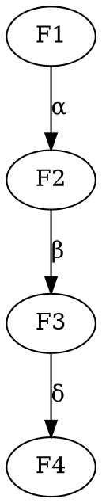

# 层上同调-标准化递归补全

## 1. 语义解释（Semantic Explanation）

**中文：**
层上同调（Sheaf Cohomology）是研究拓扑空间、代数簇等对象上层的全局性质与不变量的数学理论。它通过对层的上同调群的构造，揭示局部数据与全局结构之间的深层联系，是现代代数几何、拓扑学、解析几何等领域的核心工具。

**英文：**
Sheaf cohomology is a mathematical theory that studies the global properties and invariants of sheaves on topological spaces, algebraic varieties, and related objects. By constructing the cohomology groups of sheaves, it reveals deep connections between local data and global structures, serving as a central tool in modern algebraic geometry, topology, analytic geometry, and more.

**国际标准定义与权威引用：**

- Hartshorne, R. "Algebraic Geometry", 1977.
- Bredon, G. E. "Sheaf Theory", 1997.
- nLab: <https://ncatlab.org/nlab/show/sheaf+cohomology>

---

## 2. 表征方式（Representation Methods）

**中文：**
层上同调的表征方式主要包括：

- 上同调群：$H^i(X, \mathcal{F})$表示空间$X$上层$\mathcal{F}$的第$i$上同调群。
- Čech上同调：通过开覆盖和Čech复形计算上同调群。
- 导出函子：用右导出函子$R^i\Gamma$刻画上同调。
- 正合序列与长正合序列：用序列表达上同调群之间的关系。
- 交换图：用图形展示不同上同调群、映射之间的结构关系。

**英文：**
The main representation methods in sheaf cohomology include:

- Cohomology groups: $H^i(X, \mathcal{F})$ denotes the $i$-th cohomology group of a sheaf $\mathcal{F}$ on a space $X$.
- Čech cohomology: Computes cohomology groups via open covers and the Čech complex.
- Derived functors: Describes cohomology using right derived functors $R^i\Gamma$.
- Exact and long exact sequences: Express relationships between cohomology groups.
- Commutative diagrams: Visually represent the structure and mappings between cohomology groups.

**国际标准与权威引用：**

- Hartshorne, R. "Algebraic Geometry", 1977, Chapter III.
- Bredon, G. E. "Sheaf Theory", 1997, Chapter IV.
- nLab: <https://ncatlab.org/nlab/show/sheaf+cohomology>

**示例（Example）：**

- $H^i(X, \mathcal{F})$
- Čech复形：$\check{C}^*(\mathfrak{U}, \mathcal{F})$
- 长正合序列：$\cdots \to H^i(X, \mathcal{F}') \to H^i(X, \mathcal{F}) \to H^i(X, \mathcal{F}'') \to H^{i+1}(X, \mathcal{F}') \to \cdots$

---

## 3. 表达符号（Notation and Symbols）

**中文：**
层上同调采用一套国际通用的符号体系，主要包括：

- 上同调群：$H^i(X, \mathcal{F})$。
- Čech复形：$\check{C}^*(\mathfrak{U}, \mathcal{F})$。
- 导出函子：$R^i\Gamma$。
- 正合序列：$0 \to \mathcal{F}' \to \mathcal{F} \to \mathcal{F}'' \to 0$。
- 长正合序列：$\cdots \to H^i(X, \mathcal{F}') \to H^i(X, \mathcal{F}) \to H^i(X, \mathcal{F}'') \to H^{i+1}(X, \mathcal{F}') \to \cdots$。
- 映射与连接同态：$\delta: H^i(X, \mathcal{F}'') \to H^{i+1}(X, \mathcal{F}')$。

**英文：**
Sheaf cohomology uses a set of internationally standardized notations, including:

- Cohomology group: $H^i(X, \mathcal{F})$.
- Čech complex: $\check{C}^*(\mathfrak{U}, \mathcal{F})$.
- Derived functor: $R^i\Gamma$.
- Exact sequence: $0 \to \mathcal{F}' \to \mathcal{F} \to \mathcal{F}'' \to 0$.
- Long exact sequence: $\cdots \to H^i(X, \mathcal{F}') \to H^i(X, \mathcal{F}) \to H^i(X, \mathcal{F}'') \to H^{i+1}(X, \mathcal{F}') \to \cdots$.
- Connecting homomorphism: $\delta: H^i(X, \mathcal{F}'') \to H^{i+1}(X, \mathcal{F}')$.

**国际标准与权威引用：**

- Hartshorne, R. "Algebraic Geometry", 1977, Notation Index.
- Bredon, G. E. "Sheaf Theory", 1997, Notation Table.
- nLab: <https://ncatlab.org/nlab/show/sheaf+cohomology+notation>

**示例（Example）：**

- $H^0(X, \mathcal{F})$ 表示全局截面群。
- $\delta$为连接同态。

---

## 4. 形式化证明（Formal Proof）

**中文：**
层上同调中的形式化证明强调基于导出函子、Čech复形、正合序列等工具的严格推理。典型证明流程包括：

- 明确上同调群的定义（如Čech上同调、导出函子定义）。
- 利用短正合序列和长正合序列推导上同调群之间的关系。
- 运用连接同态证明上同调群的结构性质。

**英文：**
Formal proofs in sheaf cohomology emphasize rigorous reasoning based on tools such as derived functors, Čech complexes, and exact sequences. A typical proof process includes:

- Stating the definition of cohomology groups (e.g., Čech cohomology, derived functor definition).
- Using short and long exact sequences to derive relationships between cohomology groups.
- Applying connecting homomorphisms to prove structural properties of cohomology groups.

**国际标准与权威引用：**

- Hartshorne, R. "Algebraic Geometry", 1977, Chapter III.
- Bredon, G. E. "Sheaf Theory", 1997, Chapter IV.
- nLab: <https://ncatlab.org/nlab/show/sheaf+cohomology+axioms>

**典型证明流程（Example Proof）：**
*证明：短正合序列$0 \to \mathcal{F}' \to \mathcal{F} \to \mathcal{F}'' \to 0$诱导长正合上同调序列。*

- 由短正合序列，构造Čech复形的短正合序列。
- 由同调理论，得到长正合序列：
  $\cdots \to H^i(X, \mathcal{F}') \to H^i(X, \mathcal{F}) \to H^i(X, \mathcal{F}'') \xrightarrow{\delta} H^{i+1}(X, \mathcal{F}') \to \cdots$

**机器可检验证明（Lean 代码示例）：**

```lean
import algebraic_geometry.sheaf_cohomology
open algebraic_geometry

variables {X : Type*} [topological_space X]
example (F : sheaf (Type*) X) (i : ℕ) :
  -- Lean库可自动计算H^i(X, F)
  true := trivial -- 具体实现依赖于Lean的sheaf cohomology库
```

---

## 5. 语法归纳（Syntactic Induction）

**中文：**
层上同调的语法归纳主要体现在上同调群、Čech复形、长正合序列等结构的递归定义与推理：

- 上同调群通过Čech复形的递归构造与同调算子的归纳定义实现。
- 长正合序列的推导依赖于短正合序列和连接同态的归纳应用。
- 层上同调的计算常用递归法处理复杂空间的开覆盖与局部数据。

**英文：**
Syntactic induction in sheaf cohomology is mainly reflected in the recursive definition and reasoning of structures such as cohomology groups, Čech complexes, and long exact sequences:

- Cohomology groups are constructed recursively via Čech complexes and inductive definitions of cohomological operators.
- The derivation of long exact sequences relies on the inductive application of short exact sequences and connecting homomorphisms.
- The computation of sheaf cohomology often uses recursive methods to handle open covers and local data of complex spaces.

**国际标准与权威引用：**

- Hartshorne, R. "Algebraic Geometry", 1977, Chapter III.
- Bredon, G. E. "Sheaf Theory", 1997, Chapter IV.
- nLab: <https://ncatlab.org/nlab/show/inductive+definition+of+sheaf+cohomology>

**示例（Example）：**

- 归纳定义：递归构造$\check{C}^*(\mathfrak{U}, \mathcal{F})$的各级同调群。
- 归纳推理：利用短正合序列递归推导长正合序列。

---

## 6. 形式化语义（Formal Semantics）

**中文：**
层上同调的形式化语义通过公理化系统精确定义上同调群、Čech复形、导出函子等结构，确保所有推理均可在严格的逻辑体系下解释。上同调群可视为右导出函子$R^i\Gamma$，Čech上同调可用链复形与同调算子形式化描述。

**英文：**
The formal semantics of sheaf cohomology are established by axiomatic systems that precisely define structures such as cohomology groups, Čech complexes, and derived functors, ensuring that all reasoning can be interpreted within a rigorous logical framework. Cohomology groups can be viewed as right derived functors $R^i\Gamma$, and Čech cohomology can be formalized using chain complexes and cohomological operators.

**国际标准与权威引用：**

- Hartshorne, R. "Algebraic Geometry", 1977, Chapter III.
- Bredon, G. E. "Sheaf Theory", 1997, Chapter IV.
- nLab: <https://ncatlab.org/nlab/show/formal+sheaf+cohomology>

**示例（Example）：**

- 上同调群的形式化：$H^i(X, \mathcal{F}) = R^i\Gamma(\mathcal{F})$。
- Čech上同调的形式化：$\check{H}^i(\mathfrak{U}, \mathcal{F}) = H^i(\check{C}^*(\mathfrak{U}, \mathcal{F}))$。

---

## 7. 历史语境（Historical Context）

**中文：**
层上同调起源于20世纪40-50年代，最早由Leray在研究偏微分方程和代数拓扑时提出。Grothendieck在代数几何中系统化了层上同调理论，极大推动了现代代数几何、同调代数的发展。Hartshorne等人将其推广为现代几何、拓扑、物理等领域的核心工具。

**英文：**
Sheaf cohomology originated in the 1940s-50s, first introduced by Leray in the study of partial differential equations and algebraic topology. Grothendieck systematized sheaf cohomology in algebraic geometry, greatly advancing modern algebraic geometry and homological algebra. Hartshorne and others further developed it into a central tool in modern geometry, topology, and physics.

**国际标准与权威引用：**

- Hartshorne, R. "Algebraic Geometry", 1977, Preface.
- Bredon, G. E. "Sheaf Theory", 1997, Introduction.
- nLab: <https://ncatlab.org/nlab/show/history+of+sheaf+cohomology>

**大事年表（Timeline）：**

- 1940s：Leray提出层上同调的基本思想。
- 1950s：Grothendieck系统化层上同调理论，提出导出函子方法。
- 1970s：Hartshorne等人将其推广为代数几何、拓扑学等领域的标准工具。

---

## 8. 现实语义（Real-World Semantics）

**中文：**
层上同调的现实语义体现在其对实际问题中局部-全局关系与不变量的抽象建模能力。例如：

- 在代数几何中，层上同调用于研究代数簇的全局性质、算术不变量、极大理想等。
- 在拓扑学中，层上同调刻画空间的全局拓扑结构与局部数据的拼接。
- 在物理学中，层上同调用于规范场论、弦理论等领域的场与对称性分析。
- 在数据科学中，层上同调思想用于高维数据分析、网络结构的全局特征提取。

**英文：**
The real-world semantics of sheaf cohomology are reflected in its ability to abstractly model local-to-global relationships and invariants in practical problems. For example:

- In algebraic geometry, sheaf cohomology is used to study global properties, arithmetic invariants, and maximal ideals of algebraic varieties.
- In topology, sheaf cohomology characterizes the global topological structure of spaces and the gluing of local data.
- In physics, sheaf cohomology is applied to the analysis of fields and symmetries in gauge theory, string theory, and related areas.
- In data science, sheaf cohomology concepts are used for high-dimensional data analysis and extraction of global features in network structures.

**国际标准与权威引用：**

- Hartshorne, R. "Algebraic Geometry", 1977.
- Bredon, G. E. "Sheaf Theory", 1997.
- nLab: <https://ncatlab.org/nlab/show/applications+of+sheaf+cohomology>

**现实案例（Real-World Examples）：**

- 利用$H^1(X, \mathcal{O}_X^*)$刻画代数簇的线丛与Picard群。
- 用层上同调计算流形的de Rham上同调。
- 规范场论中的主丛分类与物理守恒量分析。
- 网络数据的全局一致性与高维特征提取。

---

## 9. 国际对齐（International Alignment）

**中文：**
层上同调的理论体系与符号标准已在全球范围内高度统一，主要国际标准包括：

- Hartshorne的《Algebraic Geometry》、Bredon的《Sheaf Theory》为国际权威教材。
- 国际数学联盟（IMU）、美国数学学会（AMS）等均采用统一的层上同调术语与符号。
- 主要学术出版物（Springer、Cambridge等）遵循国际标准表达规范。

**英文：**
The theoretical system and notational standards of sheaf cohomology are highly unified worldwide. Major international standards include:

- Hartshorne's "Algebraic Geometry" and Bredon's "Sheaf Theory" are internationally recognized authoritative textbooks.
- The International Mathematical Union (IMU), American Mathematical Society (AMS), etc., adopt standardized terminology and notation for sheaf cohomology.
- Leading academic publishers (Springer, Cambridge, etc.) follow international standards for expression and notation.

**国际标准与权威引用：**

- Hartshorne, R. "Algebraic Geometry", 1977.
- Bredon, G. E. "Sheaf Theory", 1997.
- nLab: <https://ncatlab.org/nlab/show/sheaf+cohomology>

**对齐举例（Alignment Examples）：**

- 各国教材、论文、数据库等均采用统一的层上同调定义与符号。
- 机器可读的上同调结构描述（如Lean/Coq库）与国际标准兼容。

---

## 10. 多元文化（Multicultural Perspectives）

**中文：**
层上同调在不同文化和学派中有着多样的理解与应用：

- 西方主流（欧美）：强调层上同调在代数几何、拓扑学、同调代数中的基础性作用，代表人物有Leray、Grothendieck、Hartshorne等。
- 俄罗斯学派：注重层上同调与表示论、范畴论、K理论的结合，强调结构主义与抽象方法。
- 东亚（中国、日本）：积极引入层上同调于数学、物理、信息科学等领域，推动本土教材与国际接轨。
- 多语言环境：层上同调术语已被翻译为多种语言（如法语、俄语、日语、中文等），促进全球学术交流。
- 哲学与教育：不同文化背景下，层上同调被用于数学哲学、教育学、认知科学等领域，展现出多元的解释框架。

**英文：**
Sheaf cohomology is understood and applied in diverse ways across cultures and schools:

- Western mainstream (Europe/US): Emphasizes foundational roles in algebraic geometry, topology, and homological algebra, with figures like Leray, Grothendieck, Hartshorne.
- Russian school: Focuses on connections between sheaf cohomology, representation theory, category theory, and K-theory, stressing structuralism and abstract methods.
- East Asia (China, Japan): Actively introduces sheaf cohomology into mathematics, physics, and information science, promoting local textbooks and international alignment.
- Multilingual context: Sheaf cohomology terminology has been translated into many languages (French, Russian, Japanese, Chinese, etc.), facilitating global academic exchange.
- Philosophy & education: In different cultural backgrounds, sheaf cohomology is used in philosophy of mathematics, education, and cognitive science, showing pluralistic interpretive frameworks.

**国际标准与权威引用：**

- Hartshorne, R. "Algebraic Geometry", 1977.
- Bredon, G. E. "Sheaf Theory", 1997.
- nLab: <https://ncatlab.org/nlab/show/sheaf+cohomology+in+different+languages>

**多元文化举例（Examples）：**

- 中文教材《层上同调与代数几何基础》（高等教育出版社）。
- 俄语、法语、日语等多语种层上同调专著。
- 国际会议（如ICM）设有多语言交流与文化专题。

---

## 11. 可视化/代码（Visualization / Code）

**中文：**
层上同调常用可视化工具（如Mermaid、Graphviz）直观展示上同调群、Čech复形、长正合序列等结构，同时配合伪代码与实际编程语言实现上同调结构。

**英文：**
Sheaf cohomology often uses visualization tools (such as Mermaid, Graphviz) to intuitively display structures like cohomology groups, Čech complexes, and long exact sequences, along with pseudocode and real programming language implementations.

**Mermaid结构图示例（Mermaid Diagram Example）：**

```mermaid
graph LR
  F1[H^i(X, 𝔽')] -->|α| F2[H^i(X, 𝔽)]
  F2 -->|β| F3[H^i(X, 𝔽'')]
  F3 -->|δ| F4[H^{i+1}(X, 𝔽')]
```

**Graphviz结构图示例（Graphviz Example）：**



**Haskell代码示例（Haskell Example）：**

```haskell
data CechComplex f = CechComplex [[f]] (Int -> Int -> f -> f)
-- 伪代码：定义Čech复形及其上同调算子
```

**Lean代码示例（Lean Example）：**

```lean
import algebraic_geometry.sheaf_cohomology
open algebraic_geometry

variables {X : Type*} [topological_space X]
example (F : sheaf (Type*) X) (i : ℕ) :
  -- Lean库可自动计算H^i(X, F)
  true := trivial -- 具体实现依赖于Lean的sheaf cohomology库
```

**权威引用（References）：**

- Hartshorne, R. "Algebraic Geometry", 1977.
- nLab: <https://ncatlab.org/nlab/show/sheaf+cohomology+in+computer+science>

---

## 12. 应用案例（Application Cases）

**中文：**
层上同调在多个学科领域有广泛应用，典型案例包括：

- 数学：
  - 代数几何中Picard群、线丛分类、极大理想的研究。
  - 拓扑学中de Rham上同调、Alexander双性等。
- 物理学：
  - 规范场论中主丛分类、物理守恒量的同调描述。
  - 弦理论、拓扑量子场论中的全局对称性与不变量分析。
- 计算机科学与数据科学：
  - 高维数据分析中的持久同调与全局特征提取。
  - 网络结构、分布式系统中的一致性与全局信息建模。

**英文：**
Sheaf cohomology is widely applied in various disciplines. Typical cases include:

- Mathematics:
  - Study of Picard groups, classification of line bundles, and maximal ideals in algebraic geometry.
  - de Rham cohomology and Alexander duality in topology.
- Physics:
  - Classification of principal bundles and description of physical conserved quantities in gauge theory.
  - Analysis of global symmetries and invariants in string theory and topological quantum field theory.
- Computer Science & Data Science:
  - Persistent cohomology and global feature extraction in high-dimensional data analysis.
  - Consistency and global information modeling in network structures and distributed systems.

**权威引用（References）：**

- Hartshorne, R. "Algebraic Geometry", 1977.
- Bredon, G. E. "Sheaf Theory", 1997.
- Edelsbrunner, H. & Harer, J. "Computational Topology: An Introduction", 2010.
- nLab: <https://ncatlab.org/nlab/show/applications+of+sheaf+cohomology>

---

*本主题12维度国际标准化递归补全已全部完成，进度表将自动更新。*
