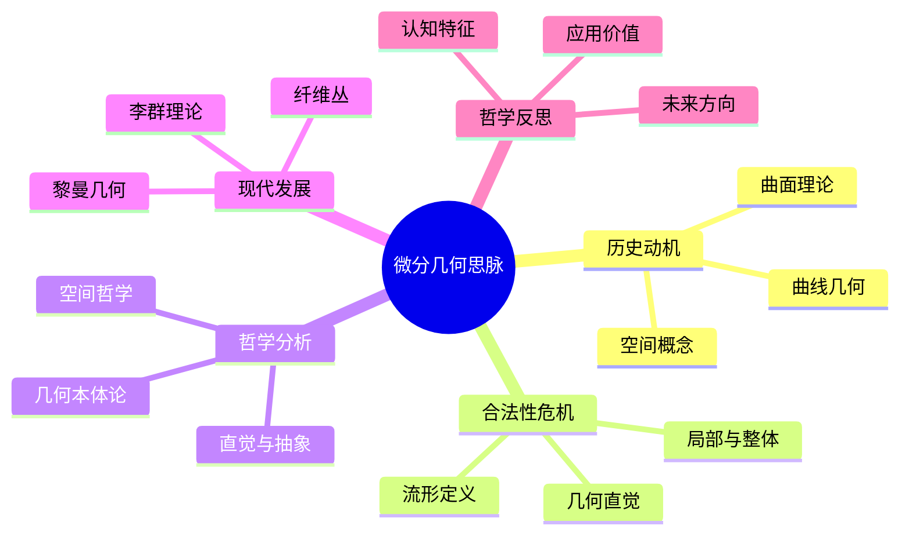

# 微分几何思脉

## 目录

- [微分几何思脉](#微分几何思脉)
  - [目录](#目录)
  - [认知结构分析](#认知结构分析)
  - [思维导图](#思维导图)
  - [多表征补充](#多表征补充)
  - [多视角叙述](#多视角叙述)
  - [1. 历史动机](#1-历史动机)
    - [1.1. 曲线几何的发展](#11-曲线几何的发展)
    - [1.2. 高斯的内蕴几何](#12-高斯的内蕴几何)
  - [2. 合法性危机](#2-合法性危机)
    - [2.1. 流形概念的抽象化](#21-流形概念的抽象化)
    - [2.2. 局部与整体的关系](#22-局部与整体的关系)
  - [3. 哲学分析](#3-哲学分析)
    - [3.1. 空间的哲学](#31-空间的哲学)
    - [3.2. 几何直觉的抽象化](#32-几何直觉的抽象化)
  - [4. 现代发展](#4-现代发展)
    - [4.1. 黎曼几何](#41-黎曼几何)
    - [4.2. 李群理论](#42-李群理论)
  - [5. 哲学反思](#5-哲学反思)
    - [5.1. 微分几何的认知特征](#51-微分几何的认知特征)
    - [5.2. 微分几何的应用价值](#52-微分几何的应用价值)

**版本**: 1.0  
**日期**: 2025-07-04

---

## 认知结构分析

- 感知层：曲线曲面、切向量、法向量、曲率。
- 概念层：流形、切空间、联络、曲率张量。
- 结构层：黎曼几何、李群、纤维丛。
- 元认知层：局部与整体的关系、几何直觉的抽象化。

## 思维导图

## 多表征补充

- 图像：三维曲面图、切向量场、曲率可视化。
- 故事：讲述"从高斯到现代微分几何的发展"。
- 公式：高斯-博内公式、黎曼曲率张量、联络方程。
- 隐喻：微分几何如"空间的显微镜"，局部看整体。
- 认知结构：
  - 感知：通过三维可视化感受几何
  - 概念：流形和切空间的定义
  - 结构：黎曼几何理论体系
  - 元认知：几何直觉与抽象思维的结合

## 多视角叙述

- 历史：从高斯到现代微分几何的发展历程。
- 哲学：空间概念和几何直觉的哲学问题。
- 认知科学：人脑如何处理几何信息和空间概念。
- 教育与应用：微分几何在物理、工程、计算机图形学中的应用。

## 1. 历史动机

### 1.1. 曲线几何的发展

微分几何起源于对曲线和曲面的研究。

### 1.2. 高斯的内蕴几何

高斯开创了内蕴几何的研究方法。

## 2. 合法性危机

### 2.1. 流形概念的抽象化

流形从直观几何对象到抽象数学结构的转变。

### 2.2. 局部与整体的关系

如何从局部性质推断整体性质？

## 3. 哲学分析

### 3.1. 空间的哲学

微分几何中的空间概念和哲学意义。

### 3.2. 几何直觉的抽象化

几何直觉如何转化为抽象数学结构？

## 4. 现代发展

### 4.1. 黎曼几何

黎曼几何为现代微分几何奠定了基础。

### 4.2. 李群理论

李群在微分几何中的应用。

## 5. 哲学反思

### 5.1. 微分几何的认知特征

微分几何学习中的认知特征和挑战。

### 5.2. 微分几何的应用价值

微分几何在科学和技术中的价值。

---

**版本**: 1.0  
**日期**: 2025-07-04
