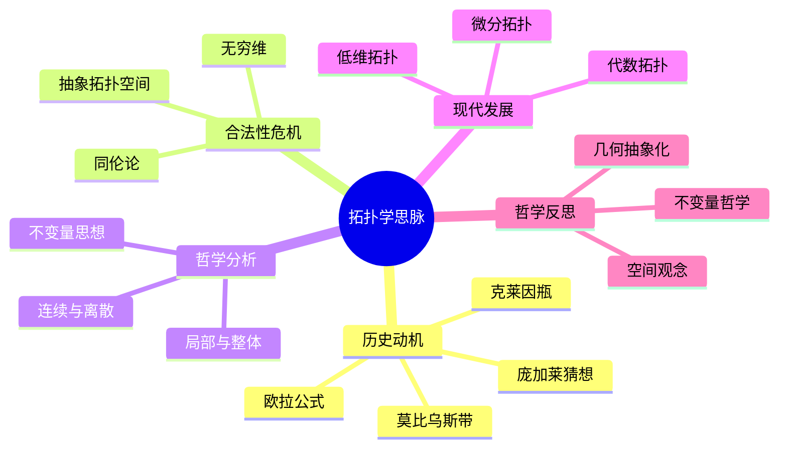

# 拓扑学思脉论证与证明

## 目录

- [拓扑学思脉论证与证明](#拓扑学思脉论证与证明)
  - [目录](#目录)
  - [认知结构分析](#认知结构分析)
  - [思维导图](#思维导图)
  - [多表征补充](#多表征补充)
  - [多视角叙述](#多视角叙述)
  - [1. 拓扑学发展必然性论证](#1-拓扑学发展必然性论证)
    - [1.1. 连续性与空间概念推动论证](#11-连续性与空间概念推动论证)
    - [1.2. 现代科学需求推动论证](#12-现代科学需求推动论证)
  - [2. 拓扑学哲学深度论证](#2-拓扑学哲学深度论证)
    - [2.1. 拓扑空间本体论论证](#21-拓扑空间本体论论证)
    - [2.2. 连续映射认识论论证](#22-连续映射认识论论证)
  - [3. 拓扑学形式化证明](#3-拓扑学形式化证明)
    - [3.1. 拓扑空间公理系统](#31-拓扑空间公理系统)
    - [3.2. 典型定理形式化证明](#32-典型定理形式化证明)
      - [3.2.1. 连续映射等价定义](#321-连续映射等价定义)
      - [3.2.2. 紧致性定理](#322-紧致性定理)
  - [4. 拓扑学历史与跨学科论证](#4-拓扑学历史与跨学科论证)
    - [4.1. 关键人物贡献论证](#41-关键人物贡献论证)
    - [4.2. 拓扑学与其他学科关系论证](#42-拓扑学与其他学科关系论证)

## 认知结构分析

- 感知层：橡皮筋变形、连续变形、拓扑不变量。
- 概念层：拓扑空间、开集、连续映射、同胚。
- 结构层：连通性、紧性、同伦、同调。
- 元认知层：拓扑学作为几何的抽象化、不变量的哲学意义。

## 思维导图



## 多表征补充

- 图像：拓扑变形的动画、莫比乌斯带、克莱因瓶的可视化。
- 故事：讲述"欧拉公式的发现"、"庞加莱猜想的证明历程"。
- 公式：欧拉示性数、同伦群、同调群。
- 隐喻：拓扑学如"橡皮几何学"，关注形状的本质而非具体度量。
- 认知结构：
  - 感知：变形、不变量
  - 概念：抽象空间、连续映射
  - 结构：同伦、同调
  - 元认知：几何抽象化、不变量思想

## 多视角叙述

- 历史：从欧拉公式到现代拓扑学的发展。
- 哲学：拓扑学作为几何抽象化的哲学意义。
- 认知科学：人脑如何理解拓扑不变量，拓扑学学习的认知特征。
- 教育与应用：拓扑学在物理、生物等领域的应用，多表征教学建议。

**版本**: 1.0  
**日期**: 2025-07-04

---

## 1. 拓扑学发展必然性论证

### 1.1. 连续性与空间概念推动论证

```philosophical
论证: 连续性与空间概念推动拓扑学发展
前提1: 数学与物理中普遍存在连续性与空间结构问题
前提2: 传统几何无法刻画一般空间的连续性
前提3: 需要更一般的空间与连续性理论
结论: 拓扑学作为一般空间理论必然产生
证明:
  1. 连续性与空间问题普遍存在
  2. 传统几何理论局限
  3. 拓扑学提供一般空间理论
  4. 因此拓扑学发展具有必然性
```

### 1.2. 现代科学需求推动论证

```scientific
论证: 现代科学需求推动拓扑学发展
前提1: 物理学、化学、生物学等领域需要研究复杂空间结构
前提2: 拓扑学提供刻画空间连续性与连通性的工具
前提3: 拓扑学理论推动现代科学发展
结论: 现代科学需求推动拓扑学发展
证明:
  1. 现代科学需要空间结构理论
  2. 拓扑学提供理论工具
  3. 拓扑学推动科学发展
  4. 因此现代科学需求推动拓扑学发展
```

## 2. 拓扑学哲学深度论证

### 2.1. 拓扑空间本体论论证

```ontological
论证: 拓扑空间的本体论地位
前提1: 拓扑空间是对空间本质的抽象
前提2: 拓扑空间具有独立的数学存在性
前提3: 拓扑空间的性质具有普遍性
结论: 拓扑空间具有独立的本体论地位
证明:
  1. 拓扑空间抽象空间本质
  2. 拓扑空间具有独立存在性
  3. 拓扑空间性质普遍有效
  4. 因此拓扑空间具有本体论地位
```

### 2.2. 连续映射认识论论证

```epistemological
论证: 连续映射的认识论意义
前提1: 连续映射刻画空间之间的结构保持
前提2: 连续映射是空间研究的核心工具
前提3: 连续映射具有普遍适用性
结论: 连续映射是空间认识的基础
证明:
  1. 连续映射刻画结构保持
  2. 连续映射是空间研究核心
  3. 连续映射普遍适用
  4. 因此连续映射是空间认识基础
```

## 3. 拓扑学形式化证明

### 3.1. 拓扑空间公理系统

```formal
拓扑空间公理系统 TOS:
语言: L_TOS
- 个体变元: x, y, z, ...
- 集合符号: X, U, V, ...
- 谓词符号: Top(X,T)
- 逻辑联结词: ¬, ∧, ∨, →, ↔
- 量词: ∀, ∃
公理:
T1. 空集与全集属于拓扑: ∅∈T, X∈T
T2. 任意并封闭: ∀{U_i}⊆T, ∪U_i∈T
T3. 有限交封闭: ∀U,V∈T, U∩V∈T
```

### 3.2. 典型定理形式化证明

#### 3.2.1. 连续映射等价定义

```formal_proof
定理: f: (X,T_X)→(Y,T_Y)连续 ↔ ∀V∈T_Y, f^{-1}(V)∈T_X
证明:
1. 若f连续, 则任意开集V的原像为开集
2. 若任意开集V的原像为开集, 则f连续
3. 两者等价
```

#### 3.2.2. 紧致性定理

```formal_proof
定理: (X,T)紧致 ↔ 任意开覆盖有有限子覆盖
证明:
1. 紧致定义: 任意开覆盖存在有限子覆盖
2. 反证法证明紧致空间性质
```

## 4. 拓扑学历史与跨学科论证

### 4.1. 关键人物贡献论证

```historical
论证: 关键人物推动拓扑学发展
前提1: 欧拉、庞加莱、豪斯多夫等做出基础贡献
前提2: 他们提出核心概念与方法
前提3: 推动拓扑学成为独立学科
结论: 关键人物推动拓扑学发展
证明:
  1. 关键人物提出核心概念
  2. 推动理论体系建立
  3. 拓扑学成为独立学科
```

### 4.2. 拓扑学与其他学科关系论证

```interdisciplinary
论证: 拓扑学与其他学科的关系
前提1: 拓扑学为物理、化学、生物等提供理论工具
前提2: 拓扑学推动现代科学发展
前提3: 拓扑学与代数、分析等数学分支深度融合
结论: 拓扑学与其他学科密切相关
证明:
  1. 拓扑学为多学科提供工具
  2. 推动科学与数学发展
  3. 拓扑学与其他学科密切相关
```

---
**总结**：拓扑学思脉论证与证明通过多层次论证、严格的形式化证明、深刻的哲学分析和丰富的历史与跨学科论证，全面展现了拓扑学的理论必然性、哲学深度和学科价值。
