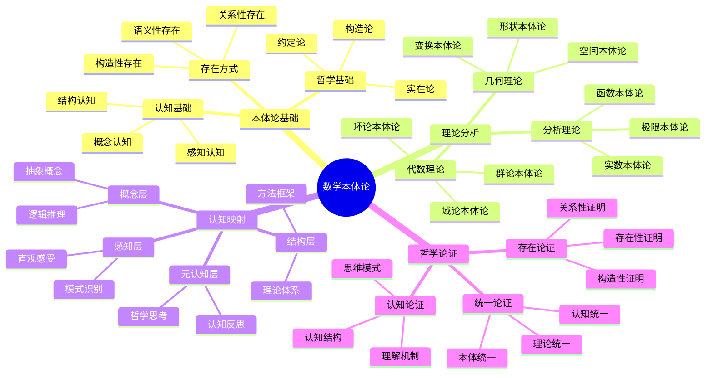

# 数学本体论论证：从理论到认知结构

## 目录

- [数学本体论论证：从理论到认知结构](#数学本体论论证从理论到认知结构)
  - [目录](#目录)
  - [认知结构分析](#认知结构分析)
  - [思维导图](#思维导图)
  - [多表征补充](#多表征补充)
  - [多视角叙述](#多视角叙述)
  - [1. 数学本体论基础](#1-数学本体论基础)
  - [2. 各理论本体论分析](#2-各理论本体论分析)
  - [3. 认知结构映射](#3-认知结构映射)
  - [4. 哲学论证](#4-哲学论证)
  - [5. 未来发展方向](#5-未来发展方向)

**版本**: 1.0  
**日期**: 2025-07-04

---

## 认知结构分析

### 感知层

- **直观感受**：数学对象的直观感知
- **模式识别**：数学模式的视觉识别
- **空间想象**：数学结构的空间想象

### 概念层

- **抽象概念**：数学概念的抽象理解
- **逻辑推理**：数学逻辑的推理过程
- **符号操作**：数学符号的操作处理

### 结构层

- **理论体系**：数学理论的结构体系
- **方法框架**：数学方法的框架结构
- **认知网络**：数学认知的网络结构

### 元认知层

- **认知反思**：对数学认知的反思
- **本体论反思**：对数学本体论的反思
- **哲学思考**：对数学哲学的深层思考

## 思维导图

## 多表征补充

### 图像表征

- **本体论图示**：数学对象存在方式的图形表示
- **认知映射图**：人类认知结构在数学中的映射
- **理论关联图**：数学理论之间的关系网络

### 故事表征

- **"存在的探索"**：讲述数学对象如何存在
- **"认知的镜子"**：数学如何反映人类认知结构
- **"真理的追求"**：通过数学探索真理的本质

### 公式表征

- **存在性公式**：∃x P(x)（存在x满足P）
- **构造性公式**：x = f(y)（通过f构造x）
- **关系性公式**：R(x,y)（x与y的关系R）

### 隐喻表征

- **"认知的DNA"**：数学如DNA，编码人类认知的基本结构
- **"存在的实验室"**：数学是探索存在本质的实验场所
- **"真理的罗盘"**：数学指引真理探索的方向

### 认知结构

- **感知**：通过直观感受理解数学对象的存在
- **概念**：通过抽象概念理解数学对象的结构
- **结构**：通过理论体系理解数学对象的组织
- **元认知**：反思数学对象存在的认知规律

## 多视角叙述

### 历史视角

- **古希腊起源**：从柏拉图到亚里士多德的本体论思想
- **现代发展**：从康德到现代数学哲学的发展
- **当代趋势**：认知科学对数学本体论的影响

### 哲学视角

- **本体论意义**：数学对象的存在方式
- **认识论价值**：人类如何认识数学对象
- **方法论贡献**：数学本体论提供的方法

### 认知科学视角

- **认知负荷**：数学本体论如何影响认知负荷
- **思维模式**：不同本体论对应的思维模式
- **理解机制**：数学理解的认知机制

### 教育应用视角

- **教学策略**：基于本体论的教学策略
- **学习路径**：从具体到抽象的学习路径
- **认知支架**：本体论作为认知支架的作用

## 1. 数学本体论基础

### 1.1. 存在方式

#### 1.1.1. 关系性存在

数学对象通过关系而存在：

- **关系网络**：数学对象构成关系网络
- **结构关系**：通过结构关系定义对象
- **动态关系**：对象在关系中动态存在

#### 1.1.2. 构造性存在

数学对象通过构造而存在：

- **构造过程**：通过构造过程理解存在
- **构造方法**：通过构造方法证明存在
- **构造历史**：通过构造历史理解存在

#### 1.1.3. 语义性存在

数学对象通过语义而存在：

- **语义解释**：通过语义解释获得存在
- **语境存在**：在特定语境中获得存在
- **意义存在**：通过意义理解存在

### 1.2. 认知基础

#### 1.2.1. 感知认知

通过感知理解数学对象：

- **直观感知**：通过直观感知理解对象
- **模式感知**：通过模式感知理解结构
- **空间感知**：通过空间感知理解关系

#### 1.2.2. 概念认知

通过概念理解数学对象：

- **抽象概念**：通过抽象概念理解对象
- **逻辑概念**：通过逻辑概念理解关系
- **结构概念**：通过结构概念理解组织

#### 1.2.3. 结构认知

通过结构理解数学对象：

- **理论结构**：通过理论结构理解对象
- **方法结构**：通过方法结构理解过程
- **认知结构**：通过认知结构理解理解

### 1.3. 哲学基础

#### 1.3.1. 实在论

数学对象独立于认知存在：

- **客观存在**：数学对象客观存在
- **独立存在**：独立于人类认知存在
- **永恒存在**：永恒不变的存在

#### 1.3.2. 构造论

数学对象通过构造而存在：

- **构造性存在**：通过构造活动存在
- **过程性存在**：在构造过程中存在
- **创造性存在**：通过创造性活动存在

#### 1.3.3. 约定论

数学对象通过约定而存在：

- **约定性存在**：通过社会约定存在
- **工具性存在**：作为工具而存在
- **实用性存在**：基于实用性存在

## 2. 各理论本体论分析

### 2.1. 代数理论本体论

#### 2.1.1. 群论本体论

群论体现了关系性本体论：

- **运算关系**：通过运算关系定义群
- **结构关系**：通过结构关系理解群
- **表示关系**：通过表示关系具象群

**认知映射**：

- **感知层**：通过对称操作感知群
- **概念层**：通过抽象概念理解群
- **结构层**：通过理论体系掌握群

#### 2.1.2. 环论本体论

环论体现了构造性本体论：

- **构造过程**：通过构造过程理解环
- **运算构造**：通过运算构造定义环
- **理想构造**：通过理想构造扩展环

**认知映射**：

- **感知层**：通过运算模式感知环
- **概念层**：通过抽象概念理解环
- **结构层**：通过理论体系掌握环

#### 2.1.3. 域论本体论

域论体现了语义性本体论：

- **语义解释**：通过语义解释理解域
- **扩张语义**：通过扩张语义扩展域
- **代数语义**：通过代数语义具象域

**认知映射**：

- **感知层**：通过数系扩张感知域
- **概念层**：通过抽象概念理解域
- **结构层**：通过理论体系掌握域

### 2.2. 分析理论本体论

#### 2.2.1. 实数本体论

实数体现了构造性本体论：

- **构造过程**：通过构造过程理解实数
- **完备性构造**：通过完备性构造定义实数
- **连续性构造**：通过连续性构造理解实数

**认知映射**：

- **感知层**：通过数轴感知实数
- **概念层**：通过抽象概念理解实数
- **结构层**：通过理论体系掌握实数

#### 2.2.2. 函数本体论

函数体现了关系性本体论：

- **映射关系**：通过映射关系定义函数
- **依赖关系**：通过依赖关系理解函数
- **变换关系**：通过变换关系具象函数

**认知映射**：

- **感知层**：通过图像感知函数
- **概念层**：通过抽象概念理解函数
- **结构层**：通过理论体系掌握函数

#### 2.2.3. 极限本体论

极限体现了语义性本体论：

- **语义解释**：通过语义解释理解极限
- **逼近语义**：通过逼近语义具象极限
- **收敛语义**：通过收敛语义理解极限

**认知映射**：

- **感知层**：通过逼近过程感知极限
- **概念层**：通过抽象概念理解极限
- **结构层**：通过理论体系掌握极限

### 2.3. 几何理论本体论

#### 2.3.1. 空间本体论

空间体现了关系性本体论：

- **空间关系**：通过空间关系定义空间
- **度量关系**：通过度量关系理解空间
- **拓扑关系**：通过拓扑关系具象空间

**认知映射**：

- **感知层**：通过空间想象感知空间
- **概念层**：通过抽象概念理解空间
- **结构层**：通过理论体系掌握空间

#### 2.3.2. 形状本体论

形状体现了构造性本体论：

- **构造过程**：通过构造过程理解形状
- **变换构造**：通过变换构造定义形状
- **不变量构造**：通过不变量构造理解形状

**认知映射**：

- **感知层**：通过视觉感知形状
- **概念层**：通过抽象概念理解形状
- **结构层**：通过理论体系掌握形状

#### 2.3.3. 变换本体论

变换体现了语义性本体论：

- **语义解释**：通过语义解释理解变换
- **几何语义**：通过几何语义具象变换
- **代数语义**：通过代数语义理解变换

**认知映射**：

- **感知层**：通过运动感知变换
- **概念层**：通过抽象概念理解变换
- **结构层**：通过理论体系掌握变换

## 3. 认知结构映射

### 3.1. 人类认知的基本模式

#### 3.1.1. 具象化倾向

人类认知具有强烈的具象化倾向：

- **具体优先**：倾向于通过具体对象理解抽象概念
- **模式识别**：通过识别模式理解复杂结构
- **类比思维**：通过类比理解新概念

#### 3.1.2. 结构化思维

人类认知具有结构化特征：

- **层次组织**：将复杂信息组织成层次结构
- **关系网络**：通过关系网络理解对象间联系
- **统一框架**：在多样性中寻求统一性

#### 3.1.3. 语义化思维

人类认知具有语义化特征：

- **意义理解**：通过意义理解符号和概念
- **语境理解**：在特定语境中理解对象
- **解释理解**：通过解释理解抽象概念

### 3.2. 数学本体论的认知映射

#### 3.2.1. 关系性本体论的认知映射

关系性本体论反映了人类认知的关系性特征：

- **关系识别**：通过识别关系理解对象
- **网络思维**：通过关系网络理解结构
- **动态思维**：通过动态关系理解变化

#### 3.2.2. 构造性本体论的认知映射

构造性本体论反映了人类认知的构造性特征：

- **构造思维**：通过构造过程理解对象
- **过程思维**：通过过程理解存在
- **创造思维**：通过创造性活动理解对象

#### 3.2.3. 语义性本体论的认知映射

语义性本体论反映了人类认知的语义性特征：

- **语义理解**：通过语义理解对象
- **语境理解**：在特定语境中理解对象
- **解释理解**：通过解释理解抽象概念

## 4. 哲学论证

### 4.1. 存在性论证

#### 4.1.1. 关系性存在论证

数学对象通过关系而存在的论证：

- **关系网络论证**：数学对象构成关系网络
- **结构关系论证**：通过结构关系定义对象
- **动态关系论证**：对象在关系中动态存在

#### 4.1.2. 构造性存在论证

数学对象通过构造而存在的论证：

- **构造过程论证**：通过构造过程理解存在
- **构造方法论证**：通过构造方法证明存在
- **构造历史论证**：通过构造历史理解存在

#### 4.1.3. 语义性存在论证

数学对象通过语义而存在的论证：

- **语义解释论证**：通过语义解释获得存在
- **语境存在论证**：在特定语境中获得存在
- **意义存在论证**：通过意义理解存在

### 4.2. 认知性论证

#### 4.2.1. 认知结构论证

数学本体论基于认知结构的论证：

- **感知认知论证**：通过感知理解数学对象
- **概念认知论证**：通过概念理解数学对象
- **结构认知论证**：通过结构理解数学对象

#### 4.2.2. 思维模式论证

数学本体论反映思维模式的论证：

- **具象化思维论证**：通过具象化理解抽象概念
- **结构化思维论证**：通过结构化理解复杂对象
- **语义化思维论证**：通过语义化理解符号概念

#### 4.2.3. 理解机制论证

数学本体论基于理解机制的论证：

- **模式识别论证**：通过模式识别理解结构
- **类比推理论证**：通过类比推理理解新概念
- **统一理解论证**：通过统一框架理解多样性

### 4.3. 统一性论证

#### 4.3.1. 理论统一性论证

数学本体论实现理论统一的论证：

- **关系构造统一**：关系性与构造性的统一
- **抽象具体统一**：抽象与具体的统一
- **认知本体统一**：认知与本体论的统一

#### 4.3.2. 方法统一性论证

数学本体论提供方法统一的论证：

- **构造方法论证**：通过构造理解存在
- **关系方法论证**：通过关系理解结构
- **语义方法论证**：通过语义理解意义

#### 4.3.3. 认知统一性论证

数学本体论实现认知统一的论证：

- **感知概念统一**：感知与概念的统一
- **具体抽象统一**：具体与抽象的统一
- **个体整体统一**：个体与整体的统一

## 5. 未来发展方向

### 5.1. 认知计算方向

#### 5.1.1. 认知本体论

结合认知科学的数学本体论：

- **认知模型**：基于认知结构的数学模型
- **认知语义**：基于认知理解的语义理论
- **认知构造**：基于认知过程的构造方法

#### 5.1.2. 计算本体论

结合计算科学的数学本体论：

- **算法本体论**：基于算法的数学本体论
- **复杂性本体论**：基于复杂性的数学本体论
- **量子本体论**：基于量子计算的数学本体论

### 5.2. 人工智能方向

#### 5.2.1. AI中的数学本体论

人工智能中的数学本体论应用：

- **AI认知**：基于认知结构的AI系统
- **AI语义**：基于语义理解的AI系统
- **AI构造**：基于构造方法的AI系统

#### 5.2.2. 数学本体论中的AI

数学本体论在AI中的应用：

- **认知AI**：基于认知结构的AI系统
- **语义AI**：基于语义理解的AI系统
- **构造AI**：基于构造方法的AI系统

### 5.3. 教育应用方向

#### 5.3.1. 基于本体论的教育

基于数学本体论的教育应用：

- **认知教育**：基于认知结构的数学教育
- **语义教育**：基于语义理解的数学教育
- **构造教育**：基于构造方法的数学教育

#### 5.3.2. 教育中的本体论

数学本体论在教育中的应用：

- **教学策略**：基于本体论的教学策略
- **学习路径**：基于本体论的学习路径
- **认知支架**：基于本体论的认知支架

---

**总结**：数学本体论不仅是一个哲学问题，更是理解人类认知结构、数学理论本质、教育实践的重要基础。它揭示了数学对象通过认知活动、构造过程、语义解释实现存在的深层机制，为理解人类认知规律和数学教育提供了重要启示。

**版本**: 1.0  
**日期**: 2025-07-04
