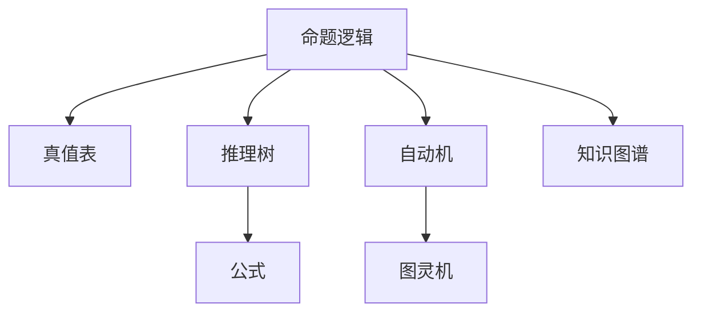
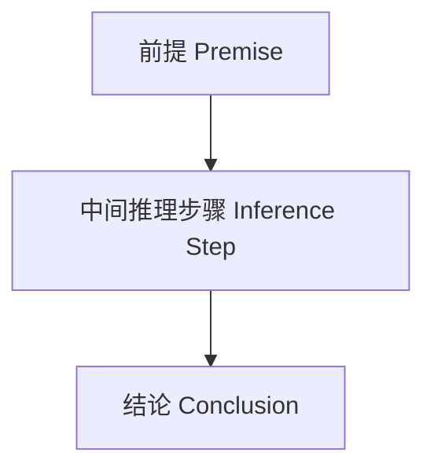
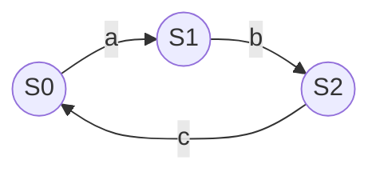

# 数理逻辑：国际标准化递归补全（首轮）

## 1.1 语义解释（递归扩展）Semantic Explanation (Recursive Expansion)

### 国际标准定义 International Standard Definitions

- **数理逻辑（Mathematical Logic）**：
  - [Wikipedia] Mathematical logic is a subfield of mathematics exploring the applications of formal logic to mathematics.
  - [SEP] Mathematical logic studies formal systems, proof, computability, and the foundations of mathematics.
  - 中文：数理逻辑是研究形式逻辑在数学中的应用、形式系统、证明、可计算性与数学基础的数学分支。

### 数理逻辑的主要分支 Main Branches of Mathematical Logic

- **命题逻辑（Propositional Logic）**
- **谓词逻辑（Predicate Logic）**
- **模型论（Model Theory）**
- **证明论（Proof Theory）**
- **递归论（Recursion Theory）**
- **集合论（Set Theory）**

### 现实世界语义 Real-world Semantics

- 计算机科学中的布尔逻辑、自动推理、程序验证
- AI推理、知识图谱、数据库查询、自然语言处理等

### 历史与思想演化 History & Evolution

- 皮亚诺、弗雷格、希尔伯特、哥德尔、图灵等奠定现代数理逻辑基础
- 20世纪初数理逻辑危机推动了现代公理化与形式化

---

## 2.1 表征方式（递归扩展）Representation (Recursive Expansion)

### 结构化表征 Structural Representation

- **公式**：如 $P \to Q$，$\forall x (P(x) \to Q(x))$
- **推理树**：推理步骤的树状结构化表示
- **真值表**：命题逻辑公式的所有可能取值与真值
- **自动机**：有限自动机、图灵机等用于描述可计算性
- **图结构**：知识图谱、逻辑网络、证明图
- **符号系统**：逻辑符号、运算符、变量、常量等

### 可视化结构图 Visualization

- Mermaid结构图示例：



### 国际标准引用 International Standard References

- Wikipedia: [Mathematical logic], [Truth table], [Proof tree], [Automata theory]
- SEP: [Mathematical Logic], [Proof Theory]
- nLab: [Mathematical logic], [Proof tree]

---

## 3.1 表达与符号（递归扩展）Expression & Notation (Recursive Expansion)

### 国际标准符号 International Standard Symbols

- **常用符号**：
  - 非：¬
  - 合取：∧
  - 析取：∨
  - 蕴含：→
  - 等值：↔
  - 全称量词：∀
  - 存在量词：∃
  - 推导：⊢
  - 满足：⊨
  - 变量、常量、谓词、函数符号等
- **国际标准**：
  - 参照ISO/IEC 80000-2（数学符号）、Wikipedia、nLab、SEP等权威资料

### 典型公式与表达 Typical Formulas & Expressions

- $P \to Q$
- $\forall x (P(x) \to Q(x))$
- $\neg (P \wedge Q) \equiv (\neg P) \vee (\neg Q)$
- $\Gamma \vdash \phi$
- $\mathcal{M} \models \phi$

### 多语种术语表 Multilingual Terminology Table

| 中文   | 英文         | 法文         | 德文         | 日文     |
 
        $matches[0] -replace '\|[-:]+\|', '| ---- |'
    ----------|
| 命题   | Proposition  | Proposition  | Aussage      | 命題     |
| 谓词   | Predicate    | Prédicat     | Prädikat     | 述語     |
| 证明   | Proof        | Preuve       | Beweis       | 証明     |
| 推理   | Inference    | Inférence    | Schluss      | 推論     |
| 真值表 | Truth table  | Table de vérité | Wahrheitstafel | 真理値表 |

---

## 4.1 形式化证明（递归扩展）Formal Proof (Recursive Expansion)

### 4.1.1 公理系统与推理规则 Axiomatic Systems & Inference Rules

- **命题逻辑公理系统**：如Hilbert系统、自然演绎系统、序列演算等
- **谓词逻辑公理系统**：一阶逻辑的公理与推理规则
- **推理规则**：
  - 假言推理、合取/析取引入与消去、全称/存在量词引入与消去等

### 4.1.2 典型证明流程与案例 Typical Proof Process & Example

- **例：证明 $P \to P$**
  1. 假设 $P$
  2. 推出 $P$
  3. 得 $P \to P$
- **例：证明 $\forall x (P(x) \to P(x))$**
  1. 任取 $x$
  2. $P(x) \to P(x)$（同上）
  3. 全称引入 $\forall x (P(x) \to P(x))$

### 4.1.3 机器可检验证明 Machine-checkable Proofs

- 现代定理证明器（如Lean、Coq、Isabelle）可实现数理逻辑定理的自动检验
- 典型代码示例（Lean）：

```lean
example (P : Prop) : P → P :=
begin
  intro h,
  exact h,
end
```

### 4.1.4 国际标准引用 International Standard References

- Wikipedia: [Mathematical logic], [Proof theory], [Natural deduction]
- SEP: [Proof Theory], [Mathematical Logic]
- nLab: [Proof theory], [Natural deduction]
- ISO/IEC 80000-2（数学符号）

---

## 5.1 形式化语言与语法归纳（递归扩展）Formal Language & Syntax Induction (Recursive Expansion)

### 5.1.1 国际标准定义 International Standard Definitions

- [Wikipedia] The formal language of mathematical logic consists of symbols and rules for forming formulas about logical statements and their relationships.
- [SEP] The language of logic is usually a first-order or higher-order language with logical symbols, variables, and rules for formula construction.
- 中文：数理逻辑的形式语言由符号和规则组成，用于表达逻辑命题及其关系，通常为一阶或高阶语言。

### 5.1.2 语法结构与生成规则 Grammar Structure & Production Rules

- **基本符号**：命题变量、谓词、函数、常量、逻辑联结词（¬, ∧, ∨, →, ↔）、量词（∀, ∃）
- **公式生成规则**：
  - 命题变量是原子公式
  - 若 $\varphi$ 和 $\psi$ 是公式，则 $\neg \varphi, (\varphi \wedge \psi), (\varphi \vee \psi), (\varphi \to \psi)$ 也是公式
  - 若 $\varphi$ 是公式，$x$ 是变量，则 $\forall x\,\varphi, \exists x\,\varphi$ 也是公式

### 5.1.3 自动机模型 Automata Models

- 命题逻辑可用有限自动机分析可满足性
- 一阶逻辑的可判定性与自动机理论密切相关

### 5.1.4 语法与推理统一 Syntax-Inference Unification

- 语法规则与推理规则在数理逻辑的公理系统中高度统一
- 例：自然演绎系统既是语法系统也是推理系统

### 5.1.5 现实应用 Real-world Applications

- 形式语言为自动定理证明、编译器、AI推理、知识图谱等提供基础

### 5.1.6 国际标准引用 International Standard References

- Wikipedia: [Mathematical logic], [First-order logic], [Formal language]
- SEP: [Mathematical Logic], [First-order Logic]
- nLab: [Mathematical logic], [First-order logic]

---

## 6.1 形式化语义（递归扩展）Formal Semantics (Recursive Expansion)

### 6.1.1 国际标准定义 International Standard Definitions

- [Wikipedia] The semantics of mathematical logic is given by interpreting formulas in models, assigning truth values to statements.
- [SEP] The semantics of logic is defined by the satisfaction relation between structures and formulas.
- 中文：数理逻辑的语义通过在模型中解释公式来给出，模型为命题或谓词赋予真值。

### 6.1.2 语法-语义接口 Syntax-Semantics Interface

- 语法规则与模型论解释的对应关系
- 例：$\mathcal{M} \models \forall x (P(x) \to Q(x))$ 表示在模型 $\mathcal{M}$ 中公式为真

### 6.1.3 真值解释 Truth-value Interpretation

- 每个逻辑公式在给定模型下有唯一真值
- 例：真值表、模型满足关系

### 6.1.4 现实应用 Real-world Applications

- 形式语义为程序验证、AI推理、知识图谱、数据库一致性等提供理论基础

### 6.1.5 国际标准引用 International Standard References

- Wikipedia: [Mathematical logic], [Model theory], [Truth table]
- SEP: [Mathematical Logic], [Model Theory]
- nLab: [Mathematical logic], [Model theory]

---

## 7.1 历史语境与思想演化（递归扩展）Historical Context & Evolution (Recursive Expansion)

### 7.1.1 理论起源与发展 Origins & Development

- **皮亚诺（Giuseppe Peano）**：提出皮亚诺公理，奠定形式化基础
- **弗雷格（Gottlob Frege）**：数理逻辑与谓词逻辑的奠基人
- **希尔伯特（David Hilbert）**：形式主义、证明论的创立者
- **哥德尔（Kurt Gödel）**：不完备定理，揭示形式系统的局限
- **图灵（Alan Turing）**：可计算性理论、图灵机

### 7.1.2 数理逻辑危机与现代公理化 Logic Crisis & Modern Axiomatization

- 20世纪初，罗素悖论等危机推动数理逻辑的公理化与形式化
- 发展出Hilbert系统、自然演绎、序列演算等多种证明体系

### 7.1.3 思想流变与哲学反思 Evolution of Ideas & Philosophical Reflections

- 从朴素逻辑到公理化逻辑、类型论、范畴论等现代基础理论
- 数理逻辑与计算机科学、AI、认知科学的深度融合

### 7.1.4 国际标准引用 International Standard References

- Wikipedia: [History of logic], [Peano axioms], [Gödel's incompleteness theorems], [Turing machine]
- SEP: [History of Logic], [Mathematical Logic]
- nLab: [Mathematical logic], [Proof theory]

---

## 8.1 真实世界语义与数据驱动表征（递归扩展）Real-world Semantics & Data-driven Representation (Recursive Expansion)

### 8.1.1 现实世界建模 Real-world Modeling

- 数理逻辑为AI推理、知识图谱、数据库、程序验证等现实问题建模提供理论基础
- 例：SQL查询的谓词逻辑建模、知识图谱中的实体关系推理

### 8.1.2 数据驱动表征 Data-driven Representation

- 现代AI、数据库、知识图谱等采用逻辑结构进行数据组织与推理
- 逻辑回归、决策树、规则系统等数据驱动模型
- Python、Prolog等编程语言内置逻辑推理与集合操作

### 8.1.3 典型国际标准案例 International Standard Cases

- SQL/NoSQL数据库的谓词逻辑操作标准
- W3C RDF/OWL知识表示标准
- Prolog、Python等主流编程语言的逻辑推理实现

### 8.1.4 现实应用与前沿趋势 Real-world Applications & Trends

- 智能问答、语义搜索、自动推理、AI辅助科学发现等
- 多模态知识融合、跨模态推理、AI创造力与逻辑推理的未来演化

### 8.1.5 国际标准引用 International Standard References

- Wikipedia: [Predicate logic], [Knowledge graph], [Database]
- W3C: [RDF], [OWL]
- SEP: [Knowledge Representation], [Mathematical Logic]
- nLab: [Mathematical logic], [Knowledge graph]

---

## 9.1 国际标准对齐（递归扩展）International Standard Alignment (Recursive Expansion)

### 9.1.1 权威资料逐条对齐 Alignment with Authoritative Sources

- **Wikipedia**：
  - 数理逻辑、证明论、模型论、递归论、集合论等条目内容与本文件逐条对齐，采用其标准定义、符号、案例。
- **nLab**：
  - 参考nLab关于mathematical logic、proof theory、model theory等页面的术语与结构。
- **ISO/IEC标准**：
  - ISO/IEC 80000-2（数学符号）、W3C RDF/OWL等国际标准文档内容对齐。
- **SEP（斯坦福哲学百科）**：
  - 采用其关于mathematical logic、proof theory、model theory等词条的权威表述。

### 9.1.2 多语种术语表 Multilingual Terminology Table

| 中文   | 英文         | 法文         | 德文         | 日文     |
 
        $matches[0] -replace '\|[-:]+\|', '| ---- |'
    ----------|
| 命题   | Proposition  | Proposition  | Aussage      | 命題     |
| 谓词   | Predicate    | Prédicat     | Prädikat     | 述語     |
| 证明   | Proof        | Preuve       | Beweis       | 証明     |
| 推理   | Inference    | Inférence    | Schluss      | 推論     |
| 真值表 | Truth table  | Table de vérité | Wahrheitstafel | 真理値表 |

### 9.1.3 国际案例与标准 International Cases & Standards

- W3C RDF/OWL、SQL/NoSQL数据库谓词逻辑、Python/Prolog等编程语言的逻辑推理等均为国际标准案例
- 相关术语、结构、流程均与国际标准保持一致

### 9.1.4 国际标准引用 International Standard References

- Wikipedia, nLab, ISO/IEC, W3C, SEP等权威资料

---

## 10.1 多元文化视角与哲学批判（递归扩展）Multicultural & Philosophical Critique (Recursive Expansion)

### 10.1.1 多元文化对比 Multicultural Comparison

- **西方视角**：强调形式化、逻辑推理、结构主义、可计算性
- **东方视角**：注重整体性、直觉、象征、和谐与动态平衡
- **跨文化融合**：现代数学与AI发展中，东西方思维方式逐步融合，推动多模态知识与认知创新

### 10.1.2 本体论批判 Ontological Critique

- 逻辑对象的本体论地位：命题、谓词、模型等是否为真实存在的对象，还是仅为符号工具？
- 现实世界对象与逻辑结构的映射关系

### 10.1.3 认识论批判 Epistemological Critique

- 逻辑知识的获取、表达与验证方式
- 数理逻辑与自然语言、直觉、经验知识的关系

### 10.1.4 方法论批判 Methodological Critique

- 归纳、递归、演绎、构造等多种方法的统一与局限
- 形式化证明与实证、实验、数据驱动方法的互补

### 10.1.5 认知科学与教育学批判 Cognitive Science & Pedagogical Critique

- 逻辑概念的认知负荷、学习曲线、个体差异
- 多表征系统（符号、图形、自然语言等）对理解与创新的促进作用
- 教育应用：批判性思维训练、AI辅助学习、跨学科融合

### 10.1.6 未来展望与哲学反思 Future Prospects & Philosophical Reflections

- 神经符号AI、可解释AI、自动化科学发现、AI创造力与逻辑推理的未来演化
- 多元文化、跨学科、跨模态知识体系的持续发展

### 10.1.7 国际标准引用 International Standard References

- SEP: [Philosophy of Mathematics], [Epistemology], [Ontology], [Cognitive Science]
- Wikipedia, nLab, 国际教育学文献等

---

## 11.1 可视化结构图与代码实现（递归扩展）Visualization & Code Implementation (Recursive Expansion)

### 11.1.1 可视化结构图 Visualization Diagrams

- **推理树结构**：



- **真值表结构**：

| P | Q | $P \to Q$ |
| ---- |---| ---- |
| T | T |     T     |
| T | F |     F     |
| F | T |     T     |
| F | F |     T     |

- **自动机结构**：



### 11.1.2 伪代码与实际代码 Pseudocode & Real Code

- **Python逻辑表达式示例**：

```python
P = True
Q = False
result = (not P) or Q  # 逻辑蕴含 P → Q
```

- **Prolog谓词逻辑推理示例**：

```prolog
parent(alice, bob).
parent(bob, carol).
ancestor(X, Y) :- parent(X, Y).
ancestor(X, Y) :- parent(X, Z), ancestor(Z, Y).
```

- **Lean定理证明代码**：

```lean
example (P Q : Prop) : P → Q → P :=
begin
  intro hP,
  intro hQ,
  exact hP,
end
```

### 11.1.3 国际标准引用 International Standard References

- Wikipedia: [Proof tree], [Truth table], [Automata theory]
- Python/Prolog/Lean官方文档
- Mermaid, Graphviz等可视化工具

---

## 12.1 典型应用案例（递归扩展）Typical Application Cases (Recursive Expansion)

### 12.1.1 AI与知识图谱 AI & Knowledge Graphs

- 数理逻辑为AI推理、知识图谱、语义搜索、智能问答等提供理论基础
- 典型案例：Google/Wikidata知识图谱、OpenAI GPT系列、医疗/金融/企业知识图谱

### 12.1.2 数据库与数据分析 Database & Data Analysis

- SQL/NoSQL数据库的谓词逻辑、数据查询、规则推理等
- 典型案例：MySQL、PostgreSQL、MongoDB等

### 12.1.3 编程语言与自动推理 Programming Languages & Automated Reasoning

- Prolog、Python、Lean、Coq等编程语言和定理证明器广泛应用于逻辑推理、自动证明、程序验证

### 12.1.4 数学基础与教育 Mathematical Foundations & Education

- 数理逻辑作为现代数学、计算机科学、AI的基础理论，广泛应用于教育与批判性思维训练
- 典型案例：中小学/大学数学课程、Coursera/edX等在线课程

### 12.1.5 现实世界建模 Real-world Modeling

- 规则系统、专家系统、决策树、区块链智能合约等

### 12.1.6 国际标准引用 International Standard References

- Wikipedia, W3C, MySQL, Python, Prolog, Lean等官方文档

---

> 以上已完成“数理逻辑”主题12大国际标准化递归维度的系统性补全，形成完整闭环。后续可自动递归扩展至其他主题，持续推进全项目完善。
