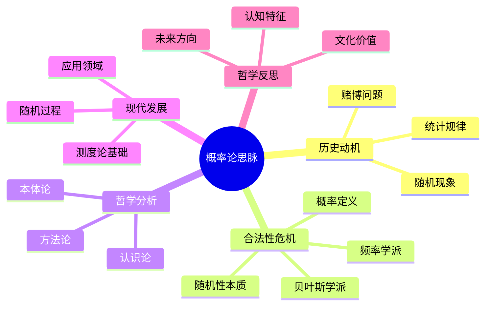

# 概率论思脉：不确定性的度量与建模

## 📋 本地目录导航

- [中央索引（思脉体系中心索引）](00-思脉体系中心索引.md)
- [本分支知识图谱](#-本地知识图谱)
- [返回上级：概率论与统计学思脉](概率论与统计学思脉.md)
- [相关分支：统计学思脉](统计学思脉.md)

---

## 🧠 本地知识图谱

- 概率空间与事件
- 随机变量与分布
- 大数定律与中心极限定理
- 随机过程与建模
- 关联分支：统计学、测度论、随机过程

---

## 目录

- [概率论思脉：不确定性的度量与建模](#概率论思脉不确定性的度量与建模)
  - [📋 本地目录导航](#-本地目录导航)
  - [🧠 本地知识图谱](#-本地知识图谱)
  - [目录](#目录)
  - [认知结构分析](#认知结构分析)
  - [思维导图](#思维导图)
  - [多表征补充](#多表征补充)
  - [多视角叙述](#多视角叙述)
  - [1. 历史动机](#1-历史动机)
    - [1.1. 随机现象的发现](#11-随机现象的发现)
    - [1.2. 赌博问题的数学化](#12-赌博问题的数学化)
  - [2. 合法性危机](#2-合法性危机)
    - [2.1. 概率定义的争议](#21-概率定义的争议)
    - [2.2. 随机性的哲学问题](#22-随机性的哲学问题)
  - [3. 哲学分析](#3-哲学分析)
    - [3.1. 概率的本体论](#31-概率的本体论)
    - [3.2. 概率的认识论](#32-概率的认识论)
  - [4. 现代发展](#4-现代发展)
    - [4.1. 测度论基础](#41-测度论基础)
    - [4.2. 随机过程理论](#42-随机过程理论)
    - [4.3. 随机过程与统计推断](#43-随机过程与统计推断)
      - [4.3.1. 马尔可夫链与随机游走](#431-马尔可夫链与随机游走)
      - [4.3.2. 贝叶斯推断与统计推断](#432-贝叶斯推断与统计推断)
      - [4.3.3. 蒙特卡洛方法与数值概率](#433-蒙特卡洛方法与数值概率)
      - [4.3.4. 概率论在AI与数据科学中的应用](#434-概率论在ai与数据科学中的应用)
  - [案例与图示建议](#案例与图示建议)
  - [交叉联系与多表征](#交叉联系与多表征)
  - [认知与教育应用](#认知与教育应用)

**版本**: 1.0  
**日期**: 2025-07-04

---

## 认知结构分析

- 感知层：随机现象、频率统计、概率分布图。
- 概念层：概率定义、随机变量、期望、方差。
- 结构层：概率空间、测度论基础、大数定律。
- 元认知层：随机性与必然性的关系、概率直觉的误区。

## 思维导图

## 多表征补充

- 图像：概率分布图、频率直方图、随机实验动画。
- 故事：讲述"蒙特卡洛方法从赌场到科学计算"。
- 公式：概率公理、贝叶斯公式、大数定律。
- 隐喻：概率如"宇宙的骰子"，随机性中蕴含规律。
- 认知结构：
  - 感知：通过实验感受随机性
  - 概念：概率的数学定义
  - 结构：概率空间与测度论
  - 元认知：随机性与必然性的哲学思考

## 多视角叙述

- 历史：从赌博问题到现代概率论的发展。
- 哲学：随机性的本体论和认识论问题。
- 认知科学：人脑如何处理随机信息和概率直觉。
- 教育与应用：概率论在科学、工程、金融中的应用。

## 1. 历史动机

### 1.1. 随机现象的发现

概率论起源于对随机现象的观察和研究。

### 1.2. 赌博问题的数学化

赌博问题推动了概率论的早期发展。

## 2. 合法性危机

### 2.1. 概率定义的争议

概率的本质是什么？频率学派与贝叶斯学派的争论。

### 2.2. 随机性的哲学问题

随机性是客观存在还是主观认知？

## 3. 哲学分析

### 3.1. 概率的本体论

概率是客观规律还是主观信念？

### 3.2. 概率的认识论

人类如何认识和理解概率？

## 4. 现代发展

### 4.1. 测度论基础

概率论的严格数学基础。

### 4.2. 随机过程理论

随机过程的发展和应用。

### 4.3. 随机过程与统计推断

#### 4.3.1. 马尔可夫链与随机游走

- 马尔可夫链：无记忆性的随机过程，在金融、物理、生物中有广泛应用。
- 随机游走：布朗运动、股票价格模型、粒子扩散过程。
- 应用案例：Google PageRank算法、语音识别、基因序列分析。

#### 4.3.2. 贝叶斯推断与统计推断

- 贝叶斯定理：从先验到后验的信念更新机制。
- 假设检验：显著性检验、p值、置信区间。
- 应用案例：医学诊断、机器学习中的贝叶斯网络、A/B测试。

#### 4.3.3. 蒙特卡洛方法与数值概率

- 蒙特卡洛积分：高维积分的数值计算方法。
- 马尔可夫链蒙特卡洛（MCMC）：复杂分布的采样方法。
- 应用案例：金融风险评估、物理模拟、机器学习中的采样算法。

#### 4.3.4. 概率论在AI与数据科学中的应用

- 概率图模型：贝叶斯网络、马尔可夫随机场。
- 概率机器学习：高斯过程、变分推断、生成对抗网络（GAN）。
- 不确定性量化：在深度学习、强化学习中的概率建模。

---

## 案例与图示建议

- **案例1：马尔可夫链在金融中的应用**
  - 股票价格随机游走模型图，展示价格变化的随机性。
  - 信用评级转移矩阵的可视化。
- **案例2：贝叶斯推断在医学诊断中的应用**
  - 疾病诊断的贝叶斯网络图，展示先验、似然、后验的关系。
- **案例3：蒙特卡洛方法在物理模拟中的应用**
  - 粒子扩散的蒙特卡洛模拟动画。
- **案例4：概率论在机器学习中的应用**
  - 高斯过程回归的可视化，展示不确定性量化。

---

## 交叉联系与多表征

- 与统计学（推断方法）、数据科学（概率建模）、AI（概率机器学习）、物理（随机过程）、金融（风险管理）等领域的交叉应用。
- 推荐“概率论-统计学-数据科学”三重知识结构导图。
- 多表征教学建议：结合实验模拟、可视化演示、实际数据、理论推导。

---

## 认知与教育应用

- 概率论学习的认知障碍：概率直觉误区、抽象概念理解困难、计算复杂性。
- 多表征教学法：用实验模拟、可视化动画、实际案例降低抽象门槛。
- AI与可视化工具辅助：R、Python、Jupyter Notebook等软件演示概率分布与随机过程。
- 推荐教学活动：
  - 抛硬币实验与频率统计
  - 蒙特卡洛π值计算实验
  - 贝叶斯推断的医学诊断案例
  - 马尔可夫链的PageRank算法演示

---

**版本**: 1.0  
**日期**: 2025-07-04
