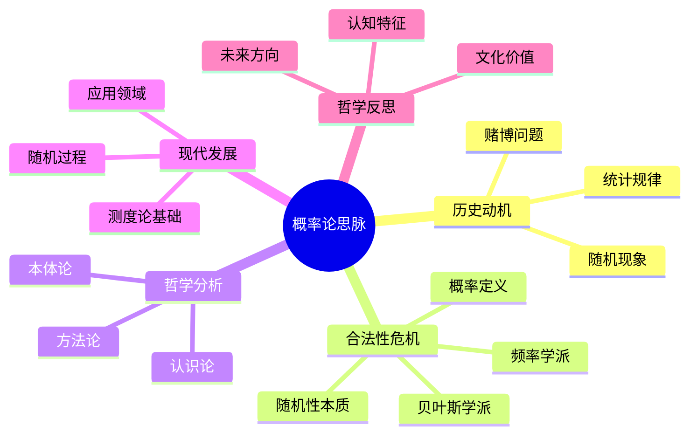

# 概率论思脉

## 目录

- [概率论思脉](#概率论思脉)
  - [目录](#目录)
  - [认知结构分析](#认知结构分析)
  - [思维导图](#思维导图)
  - [多表征补充](#多表征补充)
  - [多视角叙述](#多视角叙述)
  - [1. 历史动机](#1-历史动机)
    - [1.1. 随机现象的发现](#11-随机现象的发现)
    - [1.2. 赌博问题的数学化](#12-赌博问题的数学化)
  - [2. 合法性危机](#2-合法性危机)
    - [2.1. 概率定义的争议](#21-概率定义的争议)
    - [2.2. 随机性的哲学问题](#22-随机性的哲学问题)
  - [3. 哲学分析](#3-哲学分析)
    - [3.1. 概率的本体论](#31-概率的本体论)
    - [3.2. 概率的认识论](#32-概率的认识论)
  - [4. 现代发展](#4-现代发展)
    - [4.1. 测度论基础](#41-测度论基础)
    - [4.2. 随机过程理论](#42-随机过程理论)
  - [5. 哲学反思](#5-哲学反思)
    - [5.1. 概率的认知特征](#51-概率的认知特征)
    - [5.2. 概率的文化价值](#52-概率的文化价值)

**版本**: 1.0  
**日期**: 2025-07-04

---

## 认知结构分析

- 感知层：随机现象、频率统计、概率分布图。
- 概念层：概率定义、随机变量、期望、方差。
- 结构层：概率空间、测度论基础、大数定律。
- 元认知层：随机性与必然性的关系、概率直觉的误区。

## 思维导图

## 多表征补充

- 图像：概率分布图、频率直方图、随机实验动画。
- 故事：讲述"蒙特卡洛方法从赌场到科学计算"。
- 公式：概率公理、贝叶斯公式、大数定律。
- 隐喻：概率如"宇宙的骰子"，随机性中蕴含规律。
- 认知结构：
  - 感知：通过实验感受随机性
  - 概念：概率的数学定义
  - 结构：概率空间与测度论
  - 元认知：随机性与必然性的哲学思考

## 多视角叙述

- 历史：从赌博问题到现代概率论的发展。
- 哲学：随机性的本体论和认识论问题。
- 认知科学：人脑如何处理随机信息和概率直觉。
- 教育与应用：概率论在科学、工程、金融中的应用。

## 1. 历史动机

### 1.1. 随机现象的发现

概率论起源于对随机现象的观察和研究。

### 1.2. 赌博问题的数学化

赌博问题推动了概率论的早期发展。

## 2. 合法性危机

### 2.1. 概率定义的争议

概率的本质是什么？频率学派与贝叶斯学派的争论。

### 2.2. 随机性的哲学问题

随机性是客观存在还是主观认知？

## 3. 哲学分析

### 3.1. 概率的本体论

概率是客观规律还是主观信念？

### 3.2. 概率的认识论

人类如何认识和理解概率？

## 4. 现代发展

### 4.1. 测度论基础

概率论的严格数学基础。

### 4.2. 随机过程理论

随机过程的发展和应用。

## 5. 哲学反思

### 5.1. 概率的认知特征

概率学习中的认知特征和挑战。

### 5.2. 概率的文化价值

概率论在文化传承中的价值。

---

**版本**: 1.0  
**日期**: 2025-07-04
