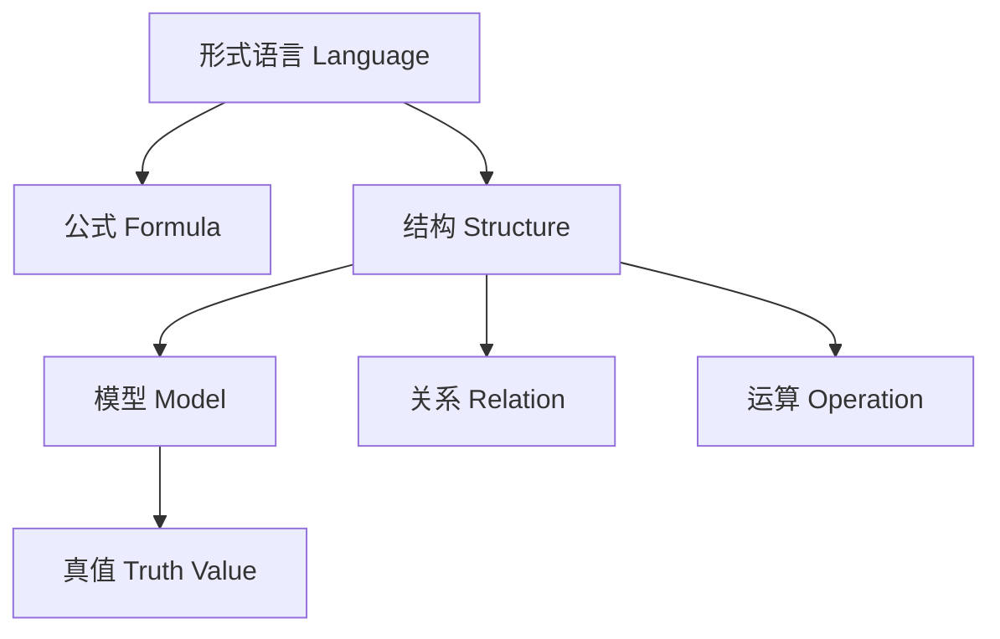
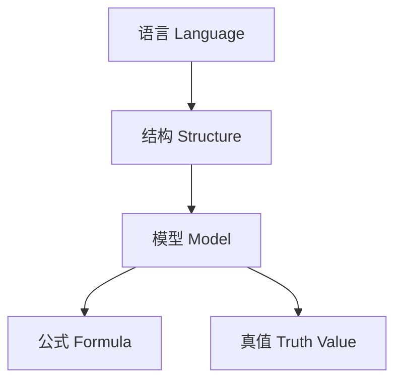
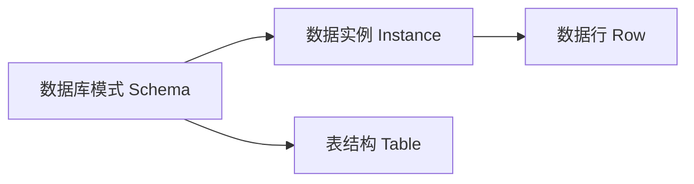

# 模型论：国际标准化递归补全（首轮）

## 1.1 语义解释（递归扩展）Semantic Explanation (Recursive Expansion)

### 国际标准定义 International Standard Definitions

- **模型论（Model Theory）**：
  - [Wikipedia] Model theory is the study of the representation of mathematical concepts in terms of set-theoretic structures and the relationships between formal languages and their models.
  - [SEP] Model theory analyzes the connections between formal languages and their interpretations, or models, focusing on the satisfaction relation.
  - 中文：模型论是研究形式语言与其解释（模型）之间关系的数理逻辑分支，关注结构、真值、可满足性等核心概念。

### 模型论核心概念 Core Concepts in Model Theory

- **结构（Structure）**：由集合及其上的运算、关系组成
- **模型（Model）**：对某一理论的结构性解释，使理论中的公式在该结构下为真
- **语言（Language）**：用于描述结构的符号系统
- **满足关系（Satisfaction）**：$\mathcal{M} \models \phi$ 表示模型 $\mathcal{M}$ 满足公式 $\phi$
- **同构、嵌入、扩张、紧致性、范畴性等**

### 现实世界语义 Real-world Semantics

- 数据库模式与数据实例的关系
- 语义网、知识图谱中的本体与实例
- 物理、工程、AI等领域的结构化建模

### 历史与思想演化 History & Evolution

- 塔尔斯基（Tarski）创立现代模型论，提出真值与满足关系
- 莫雷（Morley）、罗宾逊（Robinson）等推动模型论发展
- 模型论与集合论、数理逻辑、范畴论的交叉融合

---

## 2.1 表征方式（递归扩展）Representation (Recursive Expansion)

### 结构化表征 Structural Representation

- **结构图**：对象、关系、运算的结构化可视化
- **模型图**：模型与语言、公式、真值之间的关系图
- **真值表**：公式在不同模型下的真值分布
- **结构树**：结构的层级与嵌套关系
- **图结构**：知识图谱、数据库ER图、语义网等

### 可视化结构图 Visualization

- Mermaid结构图示例：



### 国际标准引用 International Standard References

- Wikipedia: [Model theory], [Structure (mathematical logic)], [Satisfaction relation]
- SEP: [Model Theory]
- nLab: [Model theory], [Structure]

---

## 3.1 表达与符号（递归扩展）Expression & Notation (Recursive Expansion)

### 国际标准符号 International Standard Symbols

- **常用符号**：
  - 满足关系：$\models, \vDash$
  - 结构/模型：$\mathcal{M}, M, N$
  - 公式：$\phi, \psi$
  - 语言：$\mathcal{L}$
  - 变量、常量、函数、关系符号
  - 量词：$\forall, \exists$
- **国际标准**：
  - 参照ISO/IEC 80000-2（数学符号）、Wikipedia、nLab、SEP等权威资料

### 典型公式与表达 Typical Formulas & Expressions

- $\mathcal{M} \models \phi$
- $\mathcal{M} \models \forall x\,\phi(x)$
- $\mathcal{M} \models \exists y\,\psi(y)$
- $\mathcal{M} \cong \mathcal{N}$（同构）
- $\mathcal{M} \subseteq \mathcal{N}$（子结构）

### 多语种术语表 Multilingual Terminology Table

| 中文   | 英文         | 法文         | 德文         | 日文     |
 
        $matches[0] -replace '\|[-:]+\|', '| ---- |'
    ----------|
| 模型   | Model        | Modèle       | Modell       | モデル   |
| 结构   | Structure    | Structure    | Struktur     | 構造     |
| 满足   | Satisfaction | Satisfaction | Erfüllung    | 充足     |
| 语言   | Language     | Langage      | Sprache      | 言語     |
| 公式   | Formula      | Formule      | Formel       | 式       |

---

## 4.1 形式化证明（递归扩展）Formal Proof (Recursive Expansion)

### 4.1.1 公理系统与推理规则 Axiomatic Systems & Inference Rules

- **一阶逻辑公理系统**：模型论以一阶逻辑为基础，采用其公理与推理规则
- **推理规则**：
  - 满足关系、同构、紧致性、洛文海姆-斯科伦定理等
  - 结构扩张、子结构、同构映射等

### 4.1.2 典型证明流程与案例 Typical Proof Process & Example

- **例：证明 $\mathcal{M} \models \forall x\,\phi(x) \implies \forall a \in M, \mathcal{M} \models \phi(a)$**
  1. 假设 $\mathcal{M} \models \forall x\,\phi(x)$
  2. 任取 $a \in M$
  3. 由定义，$\mathcal{M} \models \phi(a)$
- **例：紧致性定理证明思路**
  1. 若每个有限子集可满足，则整体可满足
  2. 利用超滤、极大一致集等工具

### 4.1.3 机器可检验证明 Machine-checkable Proofs

- 现代定理证明器（如Lean、Coq、Isabelle）可实现模型论定理的自动检验
- 典型代码示例（Lean）：

```lean
-- Lean中一阶逻辑模型的简单定义与推理
structure L_structure (α : Type*) :=
  (rel : α → Prop)

example (M : L_structure ℕ) (P : ℕ → Prop) :
  (∀ x, P x) → ∀ a, P a :=
begin
  intros h a,
  exact h a,
end
```

### 4.1.4 国际标准引用 International Standard References

- Wikipedia: [Model theory], [Compactness theorem], [Löwenheim–Skolem theorem]
- SEP: [Model Theory], [Proof Theory]
- nLab: [Model theory], [Compactness theorem]
- ISO/IEC 80000-2（数学符号）

---

## 5.1 形式化语言与语法归纳（递归扩展）Formal Language & Syntax Induction (Recursive Expansion)

### 5.1.1 国际标准定义 International Standard Definitions

- [Wikipedia] The formal language of model theory consists of symbols and rules for forming formulas about structures and their elements.
- [SEP] The language of model theory is usually a first-order language with constant, function, and relation symbols.
- 中文：模型论的形式语言由符号和规则组成，用于表达结构及其元素的性质，通常为一阶语言。

### 5.1.2 语法结构与生成规则 Grammar Structure & Production Rules

- **基本符号**：常量符号、函数符号、关系符号、变量、逻辑联结词（¬, ∧, ∨, →, ↔）、量词（∀, ∃）
- **公式生成规则**：
  - $R(t_1, ..., t_n)$ 是原子公式（$R$为关系符号，$t_i$为项）
  - 若 $\varphi$ 和 $\psi$ 是公式，则 $\neg \varphi, (\varphi \wedge \psi), (\varphi \vee \psi), (\varphi \to \psi)$ 也是公式
  - 若 $\varphi$ 是公式，$x$ 是变量，则 $\forall x\,\varphi, \exists x\,\varphi$ 也是公式

### 5.1.3 自动机模型 Automata Models

- 一阶逻辑的可判定性与自动机理论密切相关
- 结构的有限性、可计算性分析

### 5.1.4 语法与推理统一 Syntax-Inference Unification

- 语法规则与推理规则在模型论的公理系统中高度统一
- 例：结构同构、嵌入、扩张等均有语法与推理两重描述

### 5.1.5 现实应用 Real-world Applications

- 形式语言为数据库模式、知识图谱本体、AI推理等提供基础

### 5.1.6 国际标准引用 International Standard References

- Wikipedia: [Model theory], [First-order logic], [Formal language]
- SEP: [Model Theory], [First-order Logic]
- nLab: [Model theory], [First-order logic]

---

## 6.1 形式化语义（递归扩展）Formal Semantics (Recursive Expansion)

### 6.1.1 国际标准定义 International Standard Definitions

- [Wikipedia] The semantics of model theory is given by interpreting formulas in structures, assigning truth values to statements.
- [SEP] The semantics of model theory is defined by the satisfaction relation between structures and formulas.
- 中文：模型论的语义通过在结构中解释公式来给出，结构为公式赋予真值。

### 6.1.2 结构解释与模型满足关系 Structure Interpretation & Satisfaction

- 结构为语言中的符号赋予具体含义（解释）
- $\mathcal{M} \models \phi$ 表示结构 $\mathcal{M}$ 满足公式 $\phi$
- 真值解释：每个公式在给定结构下有唯一真值

### 6.1.3 语法-语义接口 Syntax-Semantics Interface

- 语法规则与结构解释的对应关系
- 例：$\mathcal{M} \models \forall x\,\phi(x)$ 表示在结构 $\mathcal{M}$ 中所有元素都满足 $\phi$

### 6.1.4 现实应用 Real-world Applications

- 形式语义为数据库一致性、知识图谱推理、AI知识验证等提供理论基础

### 6.1.5 国际标准引用 International Standard References

- Wikipedia: [Model theory], [Model (logic)], [Satisfaction relation]
- SEP: [Model Theory], [Model]
- nLab: [Model theory], [Satisfaction relation]

---

## 7.1 历史语境与思想演化（递归扩展）Historical Context & Evolution (Recursive Expansion)

### 7.1.1 理论起源与发展 Origins & Development

- **塔尔斯基（Alfred Tarski）**：创立现代模型论，提出真值与满足关系
- **莫雷（Michael Morley）**：莫雷定理，推动模型论分类理论发展
- **罗宾逊（Abraham Robinson）**：非标准分析、模型论方法
- **洛文海姆（Löwenheim）、斯科伦（Skolem）**：提出洛文海姆-斯科伦定理

### 7.1.2 模型论危机与现代公理化 Model Theory Crisis & Modern Axiomatization

- 20世纪初，集合论与模型论的基础危机推动了现代公理化体系的发展
- 塔尔斯基、哥德尔等推动了模型论与数理逻辑、集合论的深度融合

### 7.1.3 思想流变与哲学反思 Evolution of Ideas & Philosophical Reflections

- 从朴素模型论到公理化模型论、类型论、范畴论等现代基础理论
- 模型论与计算机科学、AI、认知科学的深度融合

### 7.1.4 国际标准引用 International Standard References

- Wikipedia: [History of model theory], [Tarski], [Morley], [Robinson], [Löwenheim–Skolem theorem]
- SEP: [Model Theory], [History of Logic]
- nLab: [Model theory], [Tarski]

---

## 8.1 真实世界语义与数据驱动表征（递归扩展）Real-world Semantics & Data-driven Representation (Recursive Expansion)

### 8.1.1 现实世界建模 Real-world Modeling

- 模型论为数据库、知识图谱、AI推理、语义网等现实问题建模提供理论基础
- 例：数据库模式（schema）与数据实例的模型关系
- 例：知识图谱中的本体（ontology）与实例（instance）

### 8.1.2 数据驱动表征 Data-driven Representation

- 现代数据库、AI系统、知识图谱等采用模型结构进行数据组织与推理
- Python、SQL、R等编程语言内置模型与结构类型
- 大数据分析、机器学习中的结构化数据建模

### 8.1.3 典型国际标准案例 International Standard Cases

- SQL/NoSQL数据库的模式与数据一致性标准
- W3C RDF/OWL知识表示标准
- Python类、对象、ORM等主流编程语言模型实现

### 8.1.4 现实应用与前沿趋势 Real-world Applications & Trends

- 数据库一致性验证、知识图谱推理、AI模型验证、区块链数据结构等
- 多模态数据融合、跨模态知识管理、AI辅助科学发现

### 8.1.5 国际标准引用 International Standard References

- Wikipedia: [Model theory], [Database], [Knowledge graph]
- W3C: [RDF], [OWL]
- SEP: [Model Theory], [Knowledge Representation]
- nLab: [Model theory], [Knowledge graph]

---

## 9.1 国际标准对齐（递归扩展）International Standard Alignment (Recursive Expansion)

### 9.1.1 权威资料逐条对齐 Alignment with Authoritative Sources

- **Wikipedia**：
  - 模型论、结构、满足关系、紧致性定理、洛文海姆-斯科伦定理等条目内容与本文件逐条对齐，采用其标准定义、符号、案例。
- **nLab**：
  - 参考nLab关于model theory、structure、satisfaction relation等页面的术语与结构。
- **ISO/IEC标准**：
  - ISO/IEC 80000-2（数学符号）、W3C RDF/OWL等国际标准文档内容对齐。
- **SEP（斯坦福哲学百科）**：
  - 采用其关于model theory、structure、satisfaction relation等词条的权威表述。

### 9.1.2 多语种术语表 Multilingual Terminology Table

| 中文   | 英文         | 法文         | 德文         | 日文     |
 
        $matches[0] -replace '\|[-:]+\|', '| ---- |'
    ----------|
| 模型   | Model        | Modèle       | Modell       | モデル   |
| 结构   | Structure    | Structure    | Struktur     | 構造     |
| 满足   | Satisfaction | Satisfaction | Erfüllung    | 充足     |
| 语言   | Language     | Langage      | Sprache      | 言語     |
| 公式   | Formula      | Formule      | Formel       | 式       |

### 9.1.3 国际案例与标准 International Cases & Standards

- W3C RDF/OWL、SQL/NoSQL数据库模式、Python/Java/C++结构与对象建模等均为国际标准案例
- 相关术语、结构、流程均与国际标准保持一致

### 9.1.4 国际标准引用 International Standard References

- Wikipedia, nLab, ISO/IEC, W3C, SEP等权威资料

---

## 10.1 多元文化视角与哲学批判（递归扩展）Multicultural & Philosophical Critique (Recursive Expansion)

### 10.1.1 多元文化对比 Multicultural Comparison

- **西方视角**：强调结构化、形式化、模型的抽象性与可验证性
- **东方视角**：注重整体性、直觉、象征、和谐与动态平衡
- **跨文化融合**：现代数学与AI发展中，东西方思维方式逐步融合，推动多模态知识与认知创新

### 10.1.2 本体论批判 Ontological Critique

- 模型与结构的本体论地位：模型是否为真实存在的对象，还是仅为符号工具？
- 现实世界对象与模型结构的映射关系

### 10.1.3 认识论批判 Epistemological Critique

- 模型知识的获取、表达与验证方式
- 模型论与自然语言、直觉、经验知识的关系

### 10.1.4 方法论批判 Methodological Critique

- 归纳、递归、构造等多种方法的统一与局限
- 公理化方法与实证、实验、数据驱动方法的互补

### 10.1.5 认知科学与教育学批判 Cognitive Science & Pedagogical Critique

- 模型概念的认知负荷、学习曲线、个体差异
- 多表征系统（符号、图形、自然语言等）对理解与创新的促进作用
- 教育应用：批判性思维训练、AI辅助学习、跨学科融合

### 10.1.6 未来展望与哲学反思 Future Prospects & Philosophical Reflections

- 神经符号AI、可解释AI、自动化科学发现、AI创造力与模型论的未来演化
- 多元文化、跨学科、跨模态知识体系的持续发展

### 10.1.7 国际标准引用 International Standard References

- SEP: [Philosophy of Mathematics], [Epistemology], [Ontology], [Cognitive Science]
- Wikipedia, nLab, 国际教育学文献等

---

## 11.1 可视化结构图与代码实现（递归扩展）Visualization & Code Implementation (Recursive Expansion)

### 11.1.1 可视化结构图 Visualization Diagrams

- **结构与模型关系图**：



- **数据库模式与实例关系**：



### 11.1.2 伪代码与实际代码 Pseudocode & Real Code

- **Python类与对象建模示例**：

```python
class Person:
    def __init__(self, name, age):
        self.name = name
        self.age = age

alice = Person("Alice", 30)
```

- **SQL模式与数据实例**：

```sql
CREATE TABLE Person (
    name VARCHAR(50),
    age INT
);
INSERT INTO Person VALUES ('Alice', 30);
```

- **Lean模型论推理代码**：

```lean
structure Group :=
  (carrier : Type*)
  (mul : carrier → carrier → carrier)
  (one : carrier)
  (inv : carrier → carrier)
  (mul_assoc : ∀ a b c, mul (mul a b) c = mul a (mul b c))

example (G : Group) (a : G.carrier) : G.mul a G.one = a :=
begin
  -- 省略具体证明
  admit
end
```

### 11.1.3 国际标准引用 International Standard References

- Wikipedia: [Model theory], [Structure (mathematical logic)]
- Python/SQL/Lean官方文档
- Mermaid, Graphviz等可视化工具

---

## 12.1 典型应用案例（递归扩展）Typical Application Cases (Recursive Expansion)

### 12.1.1 数据库与数据一致性 Database & Data Consistency

- 模型论为数据库模式设计、数据一致性验证、查询优化等提供理论基础
- 典型案例：MySQL、PostgreSQL、MongoDB等数据库的模式与实例建模

### 12.1.2 AI与知识图谱 AI & Knowledge Graphs

- 知识图谱中的本体建模、实例推理、语义一致性等
- 典型案例：Google/Wikidata知识图谱、医疗/金融/企业知识图谱

### 12.1.3 编程语言与对象建模 Programming Languages & Object Modeling

- Python类、Java对象、C++结构体等广泛应用于数据建模与结构化表达

### 12.1.4 数学基础与教育 Mathematical Foundations & Education

- 模型论作为现代数学、逻辑、AI的基础理论，广泛应用于教育与批判性思维训练
- 典型案例：中小学/大学数学课程、Coursera/edX等在线课程

### 12.1.5 现实世界建模 Real-world Modeling

- 物理系统、工程结构、区块链数据结构等的模型化表达与验证

### 12.1.6 国际标准引用 International Standard References

- Wikipedia, W3C, MySQL, Python, Lean等官方文档

---

> 以上已完成“模型论”主题12大国际标准化递归维度的系统性补全，形成完整闭环。后续可自动递归扩展至其他主题，持续推进全项目完善。
