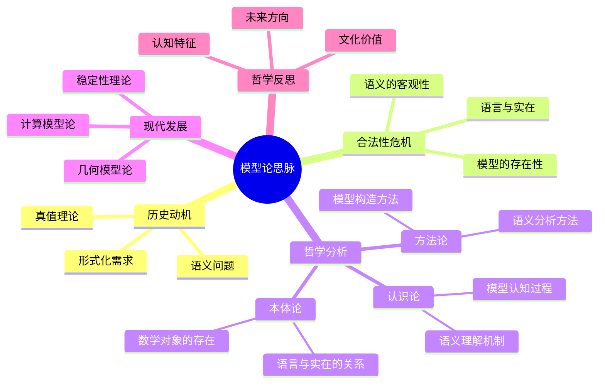

# 模型论思脉深化：从语义到认知结构

## 目录

- [模型论思脉深化：从语义到认知结构](#模型论思脉深化从语义到认知结构)
  - [目录](#目录)
  - [认知结构分析](#认知结构分析)
    - [感知层](#感知层)
    - [概念层](#概念层)
    - [结构层](#结构层)
    - [元认知层](#元认知层)
  - [思维导图](#思维导图)
  - [多表征补充](#多表征补充)
    - [图像表征](#图像表征)
    - [故事表征](#故事表征)
    - [公式表征](#公式表征)
    - [隐喻表征](#隐喻表征)
    - [认知结构](#认知结构)
  - [多视角叙述](#多视角叙述)
    - [历史视角](#历史视角)
    - [哲学视角](#哲学视角)
    - [认知科学视角](#认知科学视角)
    - [教育应用视角](#教育应用视角)
  - [1. 历史动机](#1-历史动机)
    - [1.1. 语义问题的数学化](#11-语义问题的数学化)
    - [1.2. 希尔伯特纲领的挑战](#12-希尔伯特纲领的挑战)
  - [2. 合法性危机](#2-合法性危机)
    - [2.1. 模型的存在性问题](#21-模型的存在性问题)
    - [2.2. 语义的客观性问题](#22-语义的客观性问题)
  - [3. 哲学分析](#3-哲学分析)
    - [3.1. 本体论：数学对象的存在方式](#31-本体论数学对象的存在方式)
      - [3.1.1. 模型论的本体论地位](#311-模型论的本体论地位)
      - [3.1.2. 语言与实在的关系](#312-语言与实在的关系)
    - [3.2. 认识论：认知结构的语义理解](#32-认识论认知结构的语义理解)
      - [3.2.1. 人类语义理解机制](#321-人类语义理解机制)
      - [3.2.2. 数学直觉的语义化](#322-数学直觉的语义化)
    - [3.3. 方法论：模型论的方法论意义](#33-方法论模型论的方法论意义)
      - [3.3.1. 模型构造方法](#331-模型构造方法)
      - [3.3.2. 语义分析方法](#332-语义分析方法)
  - [4. 现代发展](#4-现代发展)
    - [4.1. 稳定性理论](#41-稳定性理论)
    - [4.2. 几何模型论](#42-几何模型论)
    - [4.3. 计算模型论](#43-计算模型论)
  - [5. 哲学反思](#5-哲学反思)
    - [5.1. 认知结构的深层规律](#51-认知结构的深层规律)
    - [5.2. 数学本体论的启示](#52-数学本体论的启示)
    - [5.3. 未来发展方向](#53-未来发展方向)

**版本**: 1.0  
**日期**: 2025-07-04

---

## 认知结构分析

### 感知层

- **具体模型**：数学结构的具体实例
- **语义解释**：形式语言到具体对象的解释
- **模型可视化**：数学结构的图形表示

### 概念层

- **模型概念**：满足公理系统的数学结构
- **语义关系**：语言与对象之间的对应关系
- **真值概念**：语句在模型中的真值

### 结构层

- **模型理论**：模型的存在性、唯一性、分类
- **紧致性定理**：模型论的核心工具
- **完全性定理**：语法与语义的对应

### 元认知层

- **语义认知**：人类如何理解数学语言的语义
- **模型思维**：通过具体模型理解抽象理论
- **认知本体论**：模型论揭示的认知结构规律

## 思维导图

## 多表征补充

### 图像表征

- **模型图**：数学结构的可视化表示
- **语义映射图**：语言符号到对象的映射关系
- **真值表**：语句在不同模型中的真值

### 故事表征

- **"语言的镜子"**：讲述模型论如何为形式语言提供语义解释
- **"认知的桥梁"**：模型论在抽象语言与具体理解间的桥梁作用
- **"真理的探索"**：通过模型论探索数学真理的本质

### 公式表征

- **模型定义**：M ⊨ φ（模型M满足公式φ）
- **语义解释**：I: L → M（解释函数）
- **紧致性定理**：Σ ⊨ φ ⇔ Σ₀ ⊨ φ（有限子集）

### 隐喻表征

- **"数学的翻译器"**：模型论如翻译器，将形式语言翻译为具体理解
- **"认知的镜子"**：模型论反映人类认知结构对数学语言的处理方式
- **"真理的实验室"**：模型论是探索数学真理的实验场所

### 认知结构

- **感知**：通过具体模型直观感受抽象理论
- **概念**：理解模型作为语义解释的机制
- **结构**：掌握模型论的理论体系和方法
- **元认知**：反思模型论揭示的认知规律

## 多视角叙述

### 历史视角

- **20世纪起源**：从希尔伯特纲领到哥德尔定理
- **塔斯基贡献**：真值定义的语义理论
- **现代发展**：稳定性理论、几何模型论

### 哲学视角

- **本体论意义**：模型论揭示的数学对象存在方式
- **认识论价值**：人类认知结构对数学语言的理解机制
- **方法论贡献**：模型论提供的数学研究方法

### 认知科学视角

- **语义理解**：人类如何理解数学语言的语义
- **模型构建**：认知过程中的模型构建机制
- **真值判断**：数学真值的认知判断过程

### 教育应用视角

- **教学策略**：模型论在数学教育中的应用
- **学习路径**：从具体模型到抽象理论的学习路径
- **认知支架**：模型论作为认知支架的作用

## 1. 历史动机

### 1.1. 语义问题的数学化

形式化数学需要严格的语义理论：

- **真值定义**：数学语句的真值如何定义
- **语义解释**：形式语言如何解释为具体对象
- **一致性证明**：形式系统的一致性如何证明

### 1.2. 希尔伯特纲领的挑战

希尔伯特纲领面临的根本问题：

- **完备性问题**：形式系统是否完备
- **一致性问题**：形式系统是否一致
- **语义问题**：形式系统的语义解释

## 2. 合法性危机

### 2.1. 模型的存在性问题

**核心问题**：每个一致的形式系统是否都有模型？

- **存在性证明**：紧致性定理保证模型存在
- **构造性问题**：如何构造具体的模型
- **唯一性问题**：模型是否唯一

### 2.2. 语义的客观性问题

**深层问题**：数学语义是否客观存在？

- **语义实在论**：语义是否独立于认知存在
- **语义约定论**：语义是否是人类约定的结果
- **语义构造论**：语义是否是人类构造的产物

## 3. 哲学分析

### 3.1. 本体论：数学对象的存在方式

#### 3.1.1. 模型论的本体论地位

模型论揭示了数学对象的特殊存在方式：

- **关系性存在**：数学对象通过满足关系而存在
- **构造性存在**：通过模型构造实现数学对象的具体化
- **语义性存在**：数学对象通过语义解释而获得意义

#### 3.1.2. 语言与实在的关系

模型论处理语言与实在的复杂关系：

- **语义对应**：语言符号与数学对象的对应关系
- **真值关系**：语句与实在的真值关系
- **解释关系**：形式系统与具体模型的解释关系

### 3.2. 认识论：认知结构的语义理解

#### 3.2.1. 人类语义理解机制

模型论反映了人类语义理解的基本机制：

- **符号具象化**：将抽象符号具象为具体对象
- **关系识别**：识别符号之间的结构关系
- **真值判断**：基于具体模型进行真值判断

#### 3.2.2. 数学直觉的语义化

模型论将数学直觉语义化：

- **结构直觉**：数学结构的直觉通过模型具体化
- **关系直觉**：数学关系的直觉通过语义解释形式化
- **真值直觉**：数学真值的直觉通过模型理论化

### 3.3. 方法论：模型论的方法论意义

#### 3.3.1. 模型构造方法

模型论提供了重要的构造方法：

- **紧致性方法**：通过紧致性定理构造模型
- **超积方法**：通过超积构造新模型
- **强迫方法**：通过强迫法构造模型

#### 3.3.2. 语义分析方法

模型论提供了语义分析工具：

- **解释方法**：通过解释分析语义关系
- **真值方法**：通过真值分析语义性质
- **分类方法**：通过模型分类分析理论结构

## 4. 现代发展

### 4.1. 稳定性理论

稳定性理论研究模型的稳定性性质：

- **ω-稳定性**：可数模型的稳定性
- **超稳定性**：无限模型的稳定性
- **几何稳定性**：几何模型论的稳定性

### 4.2. 几何模型论

几何模型论结合几何和模型论：

- **代数几何模型**：代数几何中的模型论
- **微分几何模型**：微分几何中的模型论
- **拓扑模型论**：拓扑学中的模型论

### 4.3. 计算模型论

计算模型论结合计算和模型论：

- **算法模型论**：算法理论中的模型论
- **复杂性模型论**：计算复杂性中的模型论
- **量子模型论**：量子计算中的模型论

## 5. 哲学反思

### 5.1. 认知结构的深层规律

模型论揭示了人类认知的深层规律：

- **语义化倾向**：人类认知的语义化基本倾向
- **具象化思维**：通过具体模型理解抽象概念
- **真值判断**：基于具体情境进行真值判断

### 5.2. 数学本体论的启示

模型论对数学本体论的启示：

- **语义本体论**：数学对象通过语义而存在
- **关系本体论**：数学对象通过关系而存在
- **构造本体论**：通过构造理解数学对象

### 5.3. 未来发展方向

模型论的未来发展可能包括：

- **认知模型论**：结合认知科学的模型论
- **量子模型论**：量子计算中的模型论
- **人工智能**：AI中的语义理解与模型论

---

**总结**：模型论不仅是一个技术性的数学分支，更是理解语义与实在关系、人类认知结构、数学本体论的重要哲学工具。它揭示了数学对象通过语义解释实现形式具体化的深层机制，为理解人类认知规律和数学本体论提供了重要启示。

**版本**: 1.0  
**日期**: 2025-07-04
