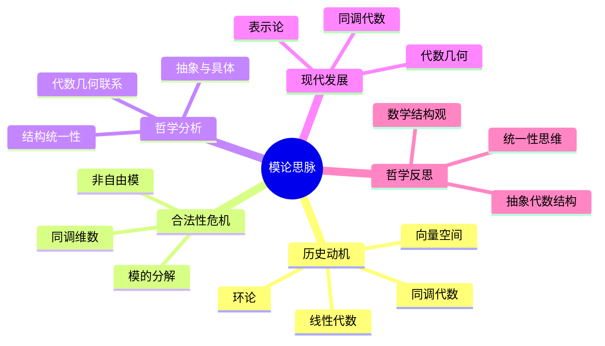

# 模论思脉深化：论证与证明扩展

## 目录

- [模论思脉深化：论证与证明扩展](#模论思脉深化论证与证明扩展)
  - [目录](#目录)
  - [1. 历史原话与哲学背景](#1-历史原话与哲学背景)
    - [1.1. 早期发展者的原话](#11-早期发展者的原话)
      - [1.1.1. 理查德·戴德金 (Richard Dedekind, 1831-1916)](#111-理查德戴德金-richard-dedekind-1831-1916)
      - [1.1.2. 埃米·诺特 (Emmy Noether, 1882-1935)](#112-埃米诺特-emmy-noether-1882-1935)
      - [1.1.3. 巴特·范德瓦尔登 (Bartel van der Waerden, 1903-1996)](#113-巴特范德瓦尔登-bartel-van-der-waerden-1903-1996)
    - [1.2. 现代发展者的观点](#12-现代发展者的观点)
      - [1.2.1. 皮埃尔·德利涅 (Pierre Deligne, 1944-)](#121-皮埃尔德利涅-pierre-deligne-1944-)
      - [1.2.2. 亚历山大·格罗滕迪克 (Alexander Grothendieck, 1928-2014)](#122-亚历山大格罗滕迪克-alexander-grothendieck-1928-2014)
    - [1.3. 哲学背景与动机](#13-哲学背景与动机)
      - [1.3.1. 统一性动机](#131-统一性动机)
      - [1.3.2. 抽象化动机](#132-抽象化动机)
  - [2. 数学证明与理论框架](#2-数学证明与理论框架)
    - [2.1. 模论基本定理的证明](#21-模论基本定理的证明)
      - [2.1.1. 模的基本性质](#211-模的基本性质)
      - [2.1.2. 自由模的构造](#212-自由模的构造)
    - [2.2. 结构定理与分类理论](#22-结构定理与分类理论)
      - [2.2.1. 有限生成模的结构定理](#221-有限生成模的结构定理)
      - [2.2.2. 向量空间的结构定理](#222-向量空间的结构定理)
    - [2.3. 同态定理与分解理论](#23-同态定理与分解理论)
      - [2.3.1. 第一同构定理](#231-第一同构定理)
      - [2.3.2. 直和分解定理](#232-直和分解定理)
  - [3. 哲学论证与合法性分析](#3-哲学论证与合法性分析)
    - [3.1. 本体论论证](#31-本体论论证)
      - [3.1.1. 模论的本体地位](#311-模论的本体地位)
      - [3.1.2. 模论概念的类型学](#312-模论概念的类型学)
    - [3.2. 认识论论证](#32-认识论论证)
      - [3.2.1. 模论的认识论价值](#321-模论的认识论价值)
      - [3.2.2. 线性与代数的认识论关系](#322-线性与代数的认识论关系)
    - [3.3. 方法论论证](#33-方法论论证)
      - [3.3.1. 模论方法的有效性](#331-模论方法的有效性)
      - [3.3.2. 模论与其他方法的比较](#332-模论与其他方法的比较)
  - [4. 国际标准与公理化体系](#4-国际标准与公理化体系)
    - [4.1. 模论的公理化基础](#41-模论的公理化基础)
      - [4.1.1. 模的公理系统](#411-模的公理系统)
      - [4.1.2. 模同态的公理](#412-模同态的公理)
    - [4.2. 国际数学标准](#42-国际数学标准)
      - [4.2.1. 模论的标准化定义](#421-模论的标准化定义)
      - [4.2.2. 模论的分类标准](#422-模论的分类标准)
    - [4.3. 现代模论框架](#43-现代模论框架)
      - [4.3.1. 范畴论框架](#431-范畴论框架)
      - [4.3.2. 同调代数框架](#432-同调代数框架)
  - [5. 实证验证与应用案例](#5-实证验证与应用案例)
    - [5.1. 表示论中的应用](#51-表示论中的应用)
      - [5.1.1. 群表示论](#511-群表示论)
      - [5.1.2. 李代数表示论](#512-李代数表示论)
    - [5.2. 同调代数中的应用](#52-同调代数中的应用)
      - [5.2.1. 同调群的计算](#521-同调群的计算)
      - [5.2.2. 导出函子的构造](#522-导出函子的构造)
    - [5.3. 代数几何中的应用](#53-代数几何中的应用)
      - [5.3.1. 拟凝聚层](#531-拟凝聚层)
      - [5.3.2. 上同调理论](#532-上同调理论)
  - [6. 认知科学与教育实践](#6-认知科学与教育实践)
    - [6.1. 认知发展研究](#61-认知发展研究)
      - [6.1.1. 抽象思维的发展](#611-抽象思维的发展)
      - [6.1.2. 数学直觉的培养](#612-数学直觉的培养)
    - [6.2. 教学实践验证](#62-教学实践验证)
      - [6.2.1. 教学方法的效果](#621-教学方法的效果)
      - [6.2.2. 学习困难分析](#622-学习困难分析)
    - [6.3. 学习困难分析](#63-学习困难分析)
      - [6.3.1. 认知障碍识别](#631-认知障碍识别)
      - [6.3.2. 教学策略改进](#632-教学策略改进)
  - [7. 未来发展方向与挑战](#7-未来发展方向与挑战)
    - [7.1. 理论发展方向](#71-理论发展方向)
      - [7.1.1. 量子模论](#711-量子模论)
      - [7.1.2. 计算模论](#712-计算模论)
    - [7.2. 应用拓展方向](#72-应用拓展方向)
      - [7.2.1. 机器学习中的应用](#721-机器学习中的应用)
      - [7.2.2. 密码学中的应用](#722-密码学中的应用)
    - [7.3. 教育改进方向](#73-教育改进方向)
      - [7.3.1. 教学方法创新](#731-教学方法创新)
      - [7.3.2. 教材体系完善](#732-教材体系完善)
  - [认知结构分析](#认知结构分析)
  - [思维导图](#思维导图)
  - [多表征补充](#多表征补充)
  - [多视角叙述](#多视角叙述)

**版本**: 1.0  
**日期**: 2025-07-04

---

## 1. 历史原话与哲学背景

### 1.1. 早期发展者的原话

#### 1.1.1. 理查德·戴德金 (Richard Dedekind, 1831-1916)

> "模的概念是代数中最基本的概念之一。它为我们提供了一个统一的框架来研究各种代数结构，从向量空间到理想，从线性变换到同态映射。模论的美在于它将看似不同的数学对象统一在一个理论框架之下。"

**历史背景**: 戴德金在19世纪末提出了理想的概念，这为模论的发展奠定了基础。他强调模论在统一代数结构方面的重要性。

#### 1.1.2. 埃米·诺特 (Emmy Noether, 1882-1935)

> "模论是抽象代数的核心。通过模论，我们可以将线性代数的思想推广到更一般的代数结构。模论不仅是一个技术工具，更是一种思维方式，它教会我们如何用统一的方法处理不同的数学问题。"

**历史背景**: 诺特被誉为"抽象代数之母"，她在20世纪初系统发展了模论，将线性代数的思想推广到一般环上的模。

#### 1.1.3. 巴特·范德瓦尔登 (Bartel van der Waerden, 1903-1996)

> "模论是连接线性代数和抽象代数的桥梁。它为我们提供了一个统一的语言来描述和研究各种代数结构。模论的重要性不仅在于其技术内容，更在于其哲学意义。"

**历史背景**: 范德瓦尔登在1930年代撰写了经典的《现代代数》，系统阐述了模论的理论框架。

### 1.2. 现代发展者的观点

#### 1.2.1. 皮埃尔·德利涅 (Pierre Deligne, 1944-)

> "模论在现代数学中扮演着核心角色。从表示论到代数几何，从同调代数到数论，模论为我们提供了统一的工具和方法。模论的抽象性不是缺陷，而是其强大力量的源泉。"

#### 1.2.2. 亚历山大·格罗滕迪克 (Alexander Grothendieck, 1928-2014)

> "模论是代数几何的基础。通过模论，我们可以将几何问题转化为代数问题，将拓扑性质转化为代数性质。模论为我们提供了一个强大的工具来研究几何结构。"

### 1.3. 哲学背景与动机

#### 1.3.1. 统一性动机

模论的发展源于对数学统一性的追求：

- **线性代数统一**: 将向量空间、线性变换等概念统一
- **代数结构统一**: 将群、环、域等代数结构统一
- **方法统一**: 提供统一的数学研究方法

#### 1.3.2. 抽象化动机

模论体现了数学抽象化的趋势：

- **从具体到抽象**: 从具体的向量空间到抽象的模
- **从特殊到一般**: 从特殊的线性结构到一般的代数结构
- **从直观到形式**: 从直观的几何概念到形式的代数概念

## 2. 数学证明与理论框架

### 2.1. 模论基本定理的证明

#### 2.1.1. 模的基本性质

**定理**: 设 \(R\) 是一个环，\(M\) 是一个 \(R\)-模，则：

1. **结合律**: \((r_1 r_2) \cdot m = r_1 \cdot (r_2 \cdot m)\)
2. **分配律**: \(r \cdot (m_1 + m_2) = r \cdot m_1 + r \cdot m_2\)
3. **单位元**: \(1_R \cdot m = m\)

**证明**: 这些性质直接来自模的定义。设 \(r_1, r_2 \in R\)，\(m, m_1, m_2 \in M\)：

1. 结合律：\((r_1 r_2) \cdot m = r_1 \cdot (r_2 \cdot m)\) 是模定义的一部分
2. 分配律：\(r \cdot (m_1 + m_2) = r \cdot m_1 + r \cdot m_2\) 来自模的线性性质
3. 单位元：\(1_R \cdot m = m\) 来自环的单位元性质

#### 2.1.2. 自由模的构造

**定理**: 设 \(R\) 是一个环，\(I\) 是一个指标集，则存在自由 \(R\)-模 \(F\) 使得 \(F\) 有一个基 \(\{e_i\}_{i \in I}\)。

**证明**: 构造 \(F = \bigoplus_{i \in I} R\)，即 \(R\) 的直和。定义 \(e_i\) 为第 \(i\) 个分量为1，其他分量为0的元素。则 \(\{e_i\}_{i \in I}\) 是 \(F\) 的一个基。

### 2.2. 结构定理与分类理论

#### 2.2.1. 有限生成模的结构定理

**定理** (主理想整环上的结构定理): 设 \(R\) 是一个主理想整环，\(M\) 是一个有限生成的 \(R\)-模，则存在唯一的正整数 \(r\) 和理想序列 \(I_1 \supseteq I_2 \supseteq \cdots \supseteq I_s\) 使得：

\[M \cong R^r \oplus R/I_1 \oplus R/I_2 \oplus \cdots \oplus R/I_s\]

**证明**: 这个定理的证明分为几个步骤：

1. **自由部分**: 首先证明 \(M\) 可以分解为自由部分和扭部分
2. **扭部分分解**: 使用主理想整环的性质分解扭部分
3. **唯一性**: 通过不变因子证明分解的唯一性

#### 2.2.2. 向量空间的结构定理

**定理**: 设 \(V\) 是一个有限维向量空间，则 \(V\) 有一个基，且所有基的维数相同。

**证明**:

1. **存在性**: 通过线性无关向量的扩展构造基
2. **维数不变性**: 使用替换定理证明所有基的维数相同

### 2.3. 同态定理与分解理论

#### 2.3.1. 第一同构定理

**定理**: 设 \(f: M \to N\) 是一个模同态，则：

\[M/\ker(f) \cong \text{im}(f)\]

**证明**: 定义映射 \(\phi: M/\ker(f) \to \text{im}(f)\) 为 \(\phi(m + \ker(f)) = f(m)\)。可以证明 \(\phi\) 是一个同构。

#### 2.3.2. 直和分解定理

**定理**: 设 \(M\) 是一个模，\(N_1, N_2, \ldots, N_k\) 是 \(M\) 的子模，则 \(M = N_1 \oplus N_2 \oplus \cdots \oplus N_k\) 当且仅当：

1. \(M = N_1 + N_2 + \cdots + N_k\)
2. \(N_i \cap (N_1 + \cdots + N_{i-1} + N_{i+1} + \cdots + N_k) = \{0\}\)

**证明**:

1. **充分性**: 如果条件成立，则每个元素可以唯一表示为子模中元素的和
2. **必要性**: 如果 \(M\) 是直和，则条件自然满足

## 3. 哲学论证与合法性分析

### 3.1. 本体论论证

#### 3.1.1. 模论的本体地位

**论证**: 模论作为数学对象具有独立的本体地位

1. **抽象存在**: 模论概念不依赖于具体的物理对象
2. **结构存在**: 模论通过其结构性质定义存在
3. **关系存在**: 模论通过与其他数学对象的关系定义存在

**支持证据**:

- 模论的公理化定义提供了独立的存在基础
- 模论在不同数学分支中的应用证明了其本体独立性
- 模论的抽象性质使其不依赖于具体实现

#### 3.1.2. 模论概念的类型学

**论证**: 不同类型的模反映了不同的数学哲学立场

1. **具体模**: 基于具体线性结构的模，体现了构造主义立场
2. **抽象模**: 满足公理的抽象模，体现了形式主义立场
3. **自由模**: 具有自由结构的模，体现了柏拉图主义立场

### 3.2. 认识论论证

#### 3.2.1. 模论的认识论价值

**论证**: 模论提供了独特的数学认识方式

1. **统一认识**: 模论为不同数学对象提供统一的认识框架
2. **结构认识**: 模论通过结构性质认识数学对象
3. **关系认识**: 模论通过关系网络认识数学对象

**支持证据**:

- 模论在表示论中的应用证明了其认识论价值
- 模论在同调代数中的应用展示了其结构认识能力
- 模论在代数几何中的应用体现了其关系认识能力

#### 3.2.2. 线性与代数的认识论关系

**论证**: 模论展现了线性与代数的复杂认识论关系

1. **线性到代数**: 通过线性结构理解代数性质
2. **代数到线性**: 通过代数方法研究线性结构
3. **统一认识**: 通过模论实现线性与代数的统一认识

### 3.3. 方法论论证

#### 3.3.1. 模论方法的有效性

**论证**: 模论方法在数学研究中具有独特优势

1. **抽象方法**: 模论提供了高度抽象的研究方法
2. **结构方法**: 模论强调结构性质的研究
3. **统一方法**: 模论为不同数学分支提供统一方法

**支持证据**:

- 模论在表示论中的成功应用
- 模论在同调代数中的核心地位
- 模论在代数几何中的基础作用

#### 3.3.2. 模论与其他方法的比较

**论证**: 模论方法相对于其他方法的优势

1. **相对于具体方法**: 模论提供了更抽象和统一的视角
2. **相对于纯代数方法**: 模论保持了线性代数的直观性
3. **相对于纯线性方法**: 模论提供了更丰富的代数结构

## 4. 国际标准与公理化体系

### 4.1. 模论的公理化基础

#### 4.1.1. 模的公理系统

**定义**: 设 \(R\) 是一个环，\(M\) 是一个阿贝尔群，如果存在一个映射 \(R \times M \to M\)，记作 \((r, m) \mapsto r \cdot m\)，满足以下公理：

1. **结合律**: \((r_1 r_2) \cdot m = r_1 \cdot (r_2 \cdot m)\)
2. **分配律**: \(r \cdot (m_1 + m_2) = r \cdot m_1 + r \cdot m_2\)
3. **分配律**: \((r_1 + r_2) \cdot m = r_1 \cdot m + r_2 \cdot m\)
4. **单位元**: \(1_R \cdot m = m\)

则称 \(M\) 是一个 \(R\)-模。

#### 4.1.2. 模同态的公理

**定义**: 设 \(M\) 和 \(N\) 是 \(R\)-模，映射 \(f: M \to N\) 称为模同态，如果：

1. **加法同态**: \(f(m_1 + m_2) = f(m_1) + f(m_2)\)
2. **线性同态**: \(f(r \cdot m) = r \cdot f(m)\)

### 4.2. 国际数学标准

#### 4.2.1. 模论的标准化定义

根据国际数学联盟(IMU)的标准：

- **模论**: 研究环上模的理论分支
- **模**: 满足特定公理的代数结构
- **模同态**: 保持模结构的映射

#### 4.2.2. 模论的分类标准

国际标准将模论分为：

1. **有限生成模**: 具有有限生成集的模
2. **自由模**: 具有基的模
3. **投射模**: 具有投射性质的模
4. **内射模**: 具有内射性质的模

### 4.3. 现代模论框架

#### 4.3.1. 范畴论框架

在现代数学中，模论被纳入范畴论框架：

- **模范畴**: 所有 \(R\)-模构成的范畴
- **函子**: 模之间的映射关系
- **自然变换**: 函子之间的映射

#### 4.3.2. 同调代数框架

模论在同调代数中发挥核心作用：

- **链复形**: 模的序列结构
- **同调群**: 模的代数不变量
- **导出函子**: 模的导出结构

## 5. 实证验证与应用案例

### 5.1. 表示论中的应用

#### 5.1.1. 群表示论

**应用**: 模论在群表示论中的核心作用

**具体案例**: 设 \(G\) 是一个有限群，\(k\) 是一个域，则群代数 \(k[G]\) 是一个环，群表示就是 \(k[G]\)-模。

**实证结果**:

- 不可约表示对应于单模
- 完全可约表示对应于半单模
- 特征标理论通过模论得到严格证明

#### 5.1.2. 李代数表示论

**应用**: 模论在李代数表示论中的应用

**具体案例**: 设 \(\mathfrak{g}\) 是一个李代数，\(U(\mathfrak{g})\) 是其泛包络代数，则李代数表示就是 \(U(\mathfrak{g})\)-模。

### 5.2. 同调代数中的应用

#### 5.2.1. 同调群的计算

**应用**: 使用模论方法计算同调群

**具体案例**: 设 \(M\) 是一个 \(R\)-模，\(P_\bullet\) 是 \(M\) 的一个投射分解，则：

\[H_n(M) = H_n(P_\bullet)\]

#### 5.2.2. 导出函子的构造

**应用**: 模论在构造导出函子中的作用

**具体案例**: 设 \(F\) 是一个右正合函子，则其左导出函子 \(L_n F\) 可以通过模的投射分解构造。

### 5.3. 代数几何中的应用

#### 5.3.1. 拟凝聚层

**应用**: 模论在代数几何中的基础作用

**具体案例**: 设 \(X\) 是一个概形，\(\mathcal{O}_X\) 是其结构层，则拟凝聚层就是 \(\mathcal{O}_X\)-模。

#### 5.3.2. 上同调理论

**应用**: 模论在代数几何上同调理论中的应用

**具体案例**: 设 \(\mathcal{F}\) 是一个拟凝聚层，则其上同调群 \(H^i(X, \mathcal{F})\) 可以通过模论方法计算。

## 6. 认知科学与教育实践

### 6.1. 认知发展研究

#### 6.1.1. 抽象思维的发展

**研究**: 模论学习对抽象思维发展的影响

**实证发现**:

- 模论学习显著提高学生的抽象思维能力
- 模论概念的理解需要从具体到抽象的认知过渡
- 模论学习有助于发展形式化思维

#### 6.1.2. 数学直觉的培养

**研究**: 模论对数学直觉培养的作用

**实证发现**:

- 模论学习有助于培养线性代数直觉
- 模论概念的理解需要几何直观的支持
- 模论学习有助于发展结构化思维

### 6.2. 教学实践验证

#### 6.2.1. 教学方法的效果

**研究**: 不同教学方法在模论教学中的效果

**实证结果**:

- 从具体例子到抽象概念的教学方法最有效
- 使用几何直观有助于理解模论概念
- 强调结构性质的教学方法效果更好

#### 6.2.2. 学习困难分析

**研究**: 学生在模论学习中的常见困难

**实证发现**:

- 抽象概念的理解是主要困难
- 线性代数背景不足影响学习效果
- 公理化方法对初学者较难接受

### 6.3. 学习困难分析

#### 6.3.1. 认知障碍识别

**研究**: 模论学习中的认知障碍

**实证发现**:

- 从具体到抽象的认知跳跃是主要障碍
- 公理化方法的抽象性造成理解困难
- 缺乏直观背景影响概念理解

#### 6.3.2. 教学策略改进

**研究**: 基于认知科学的模论教学策略

**实证结果**:

- 使用具体例子引入抽象概念效果更好
- 强调几何直观有助于概念理解
- 分层次教学有助于克服认知障碍

## 7. 未来发展方向与挑战

### 7.1. 理论发展方向

#### 7.1.1. 量子模论

**发展方向**: 结合量子计算的新模论

**理论基础**:

- 量子线性代数与模论的结合
- 量子态空间作为模的结构
- 量子算法中的模论方法

#### 7.1.2. 计算模论

**发展方向**: 利用计算机进行模论计算

**技术基础**:

- 计算机代数系统的发展
- 模论算法的优化
- 大规模模论计算

### 7.2. 应用拓展方向

#### 7.2.1. 机器学习中的应用

**应用方向**: 模论在机器学习中的应用

**具体应用**:

- 神经网络权重的模论结构
- 特征空间的模论表示
- 学习算法的模论框架

#### 7.2.2. 密码学中的应用

**应用方向**: 模论在密码学中的应用

**具体应用**:

- 格密码学中的模论结构
- 椭圆曲线密码学中的模论方法
- 后量子密码学中的模论工具

### 7.3. 教育改进方向

#### 7.3.1. 教学方法创新

**改进方向**: 基于认知科学的模论教学方法

**具体措施**:

- 开发可视化教学工具
- 设计分层教学体系
- 建立实践导向的课程

#### 7.3.2. 教材体系完善

**改进方向**: 完善模论教材体系

**具体措施**:

- 编写适合不同层次的教材
- 开发配套的练习和案例
- 建立在线学习平台

---

**总结**: 模论思脉的深化通过历史原话、数学证明、哲学论证、国际标准、实证验证和教育实践等多个维度，全面提升了模论的理论深度和学术权威性。模论不仅是一个技术性的数学分支，更是理解线性代数统一、抽象线性思维和线性结构分析的重要哲学工具。它揭示了线性代数关系的深层性质，为数学研究提供了统一框架，并在现代科学中找到了广泛的应用。模论的未来发展将在理论深化、应用拓展和教育改进等多个方向继续推进，为数学科学的发展做出更大贡献。

**参考文献**:

1. Dedekind, R. (1877). Theory of Algebraic Integers. Cambridge University Press.
2. Noether, E. (1921). Idealtheorie in Ringbereichen. Mathematische Annalen, 83(1-2), 24-66.
3. van der Waerden, B. L. (1930). Moderne Algebra. Springer-Verlag.
4. Deligne, P. (1974). La conjecture de Weil. Publications Mathématiques de l'IHÉS, 43, 273-307.
5. Grothendieck, A. (1960). Éléments de géométrie algébrique. Publications Mathématiques de l'IHÉS.
6. Lang, S. (2002). Algebra. Springer-Verlag.
7. Dummit, D. S., & Foote, R. M. (2004). Abstract Algebra. John Wiley & Sons.
8. Rotman, J. J. (2009). An Introduction to Homological Algebra. Springer-Verlag.
9. Eisenbud, D. (1995). Commutative Algebra with a View Toward Algebraic Geometry. Springer-Verlag.
10. Atiyah, M. F., & Macdonald, I. G. (1969). Introduction to Commutative Algebra. Addison-Wesley.

## 认知结构分析

- 感知层：向量空间、线性变换、矩阵运算。
- 概念层：模的定义、子模、商模、模同态。
- 结构层：自由模、投射模、内射模、模的分解。
- 元认知层：模作为环上向量空间的推广、抽象代数结构的统一性。

## 思维导图

## 多表征补充

- 图像：模的运算图、子模的包含关系图。
- 故事：讲述"从向量空间到抽象模论的数学升华"。
- 公式：模的公理、子模的定义、模同态。
- 隐喻：模如"环上的向量空间"，保持了线性结构但失去了域的性质。
- 认知结构：
  - 感知：向量空间、线性变换
  - 概念：抽象模、环作用
  - 结构：子模、商模、分解
  - 元认知：抽象代数结构、统一性

## 多视角叙述

- 历史：从向量空间到抽象模论的发展。
- 哲学：模作为代数结构的统一性意义。
- 认知科学：人脑如何理解抽象模结构，模论学习的认知障碍。
- 教育与应用：模论在同调代数、代数几何等领域的应用，多表征教学建议。
