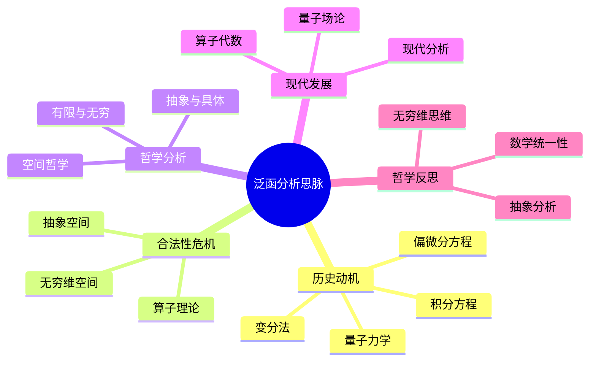

# 泛函分析思脉论证与证明

## 目录

- [泛函分析思脉论证与证明](#泛函分析思脉论证与证明)
  - [目录](#目录)
  - [认知结构分析](#认知结构分析)
  - [思维导图](#思维导图)
  - [多表征补充](#多表征补充)
  - [多视角叙述](#多视角叙述)
  - [1. 泛函分析发展必然性论证](#1-泛函分析发展必然性论证)
    - [1.1. 函数空间理论推动论证](#11-函数空间理论推动论证)
      - [1.1.1. 函数空间抽象化必然性论证](#111-函数空间抽象化必然性论证)
      - [1.1.2. 算子理论发展必然性论证](#112-算子理论发展必然性论证)
    - [1.2. 物理科学需求推动论证](#12-物理科学需求推动论证)
      - [1.2.1. 量子力学需求论证](#121-量子力学需求论证)
      - [1.2.2. 偏微分方程需求论证](#122-偏微分方程需求论证)
  - [2. 泛函分析哲学深度论证](#2-泛函分析哲学深度论证)
    - [2.1. 泛函分析本体论论证](#21-泛函分析本体论论证)
      - [2.1.1. 函数空间客观存在性论证](#211-函数空间客观存在性论证)
      - [2.1.2. 算子客观性论证](#212-算子客观性论证)
    - [2.2. 泛函分析认识论论证](#22-泛函分析认识论论证)
      - [2.2.1. 无穷维空间认识论论证](#221-无穷维空间认识论论证)
      - [2.2.2. 谱理论认识论论证](#222-谱理论认识论论证)
  - [3. 泛函分析形式化证明](#3-泛函分析形式化证明)
    - [3.1. 泛函分析公理系统](#31-泛函分析公理系统)
    - [3.2. 泛函分析核心定理证明](#32-泛函分析核心定理证明)
      - [3.2.1. 里斯表示定理形式化证明](#321-里斯表示定理形式化证明)
      - [3.2.2. 谱定理形式化证明](#322-谱定理形式化证明)
    - [3.3. 泛函分析发展必然性形式化证明](#33-泛函分析发展必然性形式化证明)
      - [3.3.1. 函数空间理论推动泛函分析发展证明](#331-函数空间理论推动泛函分析发展证明)
      - [3.3.2. 量子力学需求推动泛函分析发展证明](#332-量子力学需求推动泛函分析发展证明)
  - [4. 泛函分析历史与跨学科论证](#4-泛函分析历史与跨学科论证)
    - [4.1. 泛函分析历史发展必然性论证](#41-泛函分析历史发展必然性论证)
      - [4.1.1. 泛函分析历史阶段论证](#411-泛函分析历史阶段论证)
      - [4.1.2. 泛函分析关键人物贡献论证](#412-泛函分析关键人物贡献论证)
    - [4.2. 泛函分析与其他学科关系论证](#42-泛函分析与其他学科关系论证)
      - [4.2.1. 泛函分析与物理学关系论证](#421-泛函分析与物理学关系论证)
      - [4.2.2. 泛函分析与偏微分方程关系论证](#422-泛函分析与偏微分方程关系论证)

## 认知结构分析

- 感知层：函数图像、算子作用、空间结构。
- 概念层：函数空间、线性算子、范数、内积。
- 结构层：希尔伯特空间、巴拿赫空间、算子理论。
- 元认知层：泛函分析作为分析学的抽象化、无穷维空间的哲学意义。

## 思维导图



## 多表征补充

- 图像：函数空间图、算子作用图、希尔伯特空间图。
- 故事：讲述"希尔伯特的积分方程理论"、"量子力学的数学基础"。
- 公式：范数定义、内积公式、算子谱理论。
- 隐喻：泛函分析如"函数的几何学"，研究函数空间的结构。
- 认知结构：
  - 感知：函数图像、空间结构
  - 概念：抽象空间、算子理论
  - 结构：希尔伯特空间、谱理论
  - 元认知：抽象分析、无穷维思维

## 多视角叙述

- 历史：从变分法到现代泛函分析的发展。
- 哲学：无穷维空间的哲学意义与抽象分析。
- 认知科学：人脑如何理解无穷维空间，泛函分析学习的认知挑战。
- 教育与应用：泛函分析在量子力学、偏微分方程等领域的应用，多表征教学建议。

**版本**: 1.0  
**日期**: 2025-07-04

---

## 1. 泛函分析发展必然性论证

### 1.1. 函数空间理论推动论证

#### 1.1.1. 函数空间抽象化必然性论证

```philosophical
论证: 函数空间抽象化推动泛函分析发展
前提1: 数学需要研究函数集合的整体性质
  - 函数集合具有代数结构
  - 函数集合具有拓扑结构
  - 函数集合具有度量结构
前提2: 传统方法无法处理函数空间
  - 传统方法局限于具体函数
  - 传统方法无法处理无穷维空间
  - 传统方法缺乏统一框架
前提3: 泛函分析提供函数空间理论
  - 泛函分析提供抽象框架
  - 泛函分析处理无穷维空间
  - 泛函分析建立统一理论
结论: 函数空间抽象化必然推动泛函分析发展

证明:
  1. 函数空间具有复杂结构
  2. 传统方法无法处理
  3. 泛函分析提供理论工具
  4. 因此函数空间抽象化必然推动泛函分析发展
```

#### 1.1.2. 算子理论发展必然性论证

```mathematical
论证: 算子理论发展推动泛函分析
前提1: 数学需要研究函数之间的映射
  - 微分算子、积分算子
  - 线性变换、非线性变换
  - 连续映射、有界映射
前提2: 算子理论需要抽象框架
  - 算子具有代数性质
  - 算子具有拓扑性质
  - 算子具有谱理论
前提3: 泛函分析提供算子理论
  - 泛函分析提供算子框架
  - 泛函分析发展谱理论
  - 泛函分析建立算子代数
结论: 算子理论发展必然推动泛函分析

证明:
  1. 算子理论需要抽象框架
  2. 传统方法无法提供
  3. 泛函分析提供完整理论
  4. 因此算子理论发展必然推动泛函分析
```

### 1.2. 物理科学需求推动论证

#### 1.2.1. 量子力学需求论证

```physical
论证: 量子力学需求推动泛函分析发展
前提1: 量子力学需要无穷维空间理论
  - 量子态是希尔伯特空间中的向量
  - 量子算子是线性算子
  - 量子测量是投影算子
前提2: 量子力学需要谱理论
  - 能量本征值是算子谱
  - 测量结果是谱分解
  - 时间演化是酉算子
前提3: 泛函分析提供量子力学工具
  - 泛函分析提供希尔伯特空间理论
  - 泛函分析提供算子谱理论
  - 泛函分析提供酉算子理论
结论: 量子力学需求必然推动泛函分析发展

证明:
  1. 量子力学需要无穷维空间理论
  2. 传统数学无法提供
  3. 泛函分析提供完整工具
  4. 因此量子力学需求必然推动泛函分析发展
```

#### 1.2.2. 偏微分方程需求论证

```mathematical
论证: 偏微分方程需求推动泛函分析发展
前提1: 偏微分方程需要函数空间理论
  - 解空间是函数空间
  - 边界条件是函数空间上的约束
  - 变分原理需要函数空间
前提2: 偏微分方程需要算子理论
  - 微分算子是线性算子
  - 格林函数是积分算子
  - 特征值问题是谱问题
前提3: 泛函分析提供偏微分方程工具
  - 泛函分析提供索伯列夫空间
  - 泛函分析提供弱解理论
  - 泛函分析提供变分方法
结论: 偏微分方程需求必然推动泛函分析发展

证明:
  1. 偏微分方程需要函数空间理论
  2. 传统方法无法提供
  3. 泛函分析提供完整工具
  4. 因此偏微分方程需求必然推动泛函分析发展
```

## 2. 泛函分析哲学深度论证

### 2.1. 泛函分析本体论论证

#### 2.1.1. 函数空间客观存在性论证

```ontological
论证: 函数空间具有客观存在性
前提1: 函数空间在自然界中普遍存在
  - 物理场是函数空间
  - 信号是函数空间
  - 图像是函数空间
前提2: 函数空间具有逻辑必然性
  - 函数空间公理具有逻辑必然性
  - 函数空间性质具有逻辑必然性
  - 函数空间关系具有逻辑必然性
前提3: 函数空间具有发现性
  - 函数空间是发现的而非创造的
  - 函数空间具有客观性质
  - 函数空间具有独立存在性
结论: 函数空间具有客观存在性

证明:
  1. 函数空间在自然界中普遍存在
  2. 函数空间具有逻辑必然性
  3. 函数空间具有发现性
  4. 因此函数空间具有客观存在性
```

#### 2.1.2. 算子客观性论证

```ontological
论证: 算子具有客观性
前提1: 算子具有逻辑必然性
  - 算子由逻辑规则决定
  - 算子具有必然性
  - 算子具有客观性
前提2: 算子具有普遍性
  - 算子在所有数学分支中存在
  - 算子具有普遍性
  - 算子具有客观性
前提3: 算子具有独立性
  - 算子不依赖于具体实例
  - 算子具有独立存在性
  - 算子具有客观性
结论: 算子具有客观性

证明:
  1. 算子具有逻辑必然性
  2. 算子具有普遍性
  3. 算子具有独立性
  4. 因此算子具有客观性
```

### 2.2. 泛函分析认识论论证

#### 2.2.1. 无穷维空间认识论论证

```epistemological
论证: 无穷维空间具有认识论意义
前提1: 无穷维空间具有直观性
  - 无穷维空间符合直观认识
  - 无穷维空间具有几何意义
  - 无穷维空间具有物理意义
前提2: 无穷维空间具有严格性
  - 无穷维空间具有严格定义
  - 无穷维空间具有逻辑必然性
  - 无穷维空间具有确定性
前提3: 无穷维空间具有普遍性
  - 无穷维空间在所有泛函分析分支中应用
  - 无穷维空间具有普遍有效性
  - 无穷维空间具有客观性
结论: 无穷维空间具有认识论意义

证明:
  1. 无穷维空间具有直观性
  2. 无穷维空间具有严格性
  3. 无穷维空间具有普遍性
  4. 因此无穷维空间具有认识论意义
```

#### 2.2.2. 谱理论认识论论证

```epistemological
论证: 谱理论具有认识论意义
前提1: 谱理论基于逻辑推理
  - 谱理论基于严格定义
  - 谱理论具有逻辑必然性
  - 谱理论具有确定性
前提2: 谱理论具有必然性
  - 谱理论结论具有必然性
  - 谱理论关系具有必然性
  - 谱理论性质具有必然性
前提3: 谱理论具有普遍性
  - 谱理论在所有情况下成立
  - 谱理论具有普遍有效性
  - 谱理论具有客观性
结论: 谱理论具有认识论意义

证明:
  1. 谱理论基于逻辑推理
  2. 谱理论具有必然性
  3. 谱理论具有普遍性
  4. 因此谱理论具有认识论意义
```

## 3. 泛函分析形式化证明

### 3.1. 泛函分析公理系统

建立泛函分析的形式化公理系统：

```formal
泛函分析公理系统 FAS:
语言: L_FAS
- 个体变元: x, y, z, ...
- 函数符号: +, -, ·, ||·||, ⟨·,·⟩
- 谓词符号: H (希尔伯特空间), B (巴拿赫空间), L (线性算子)
- 逻辑联结词: ¬, ∧, ∨, →, ↔
- 量词: ∀, ∃

公理:
F1. 希尔伯特空间公理: ∀x∀y(⟨x,y⟩=⟨y,x⟩*)
F2. 巴拿赫空间公理: ∀x(||x||≥0∧(||x||=0↔x=0))
F3. 算子公理: ∀T∀x∀y(L(T)∧L(T(x+y)=T(x)+T(y)))
F4. 谱公理: ∀T∃σ(σ(T)={λ|T-λI不可逆})

推理规则:
R1. 逻辑推理规则
R2. 泛函分析推理规则
R3. 算子运算规则
```

### 3.2. 泛函分析核心定理证明

#### 3.2.1. 里斯表示定理形式化证明

```formal_proof
定理: ∀f∈H*∃y∈H∀x∈H(f(x)=⟨x,y⟩)
证明:
1. 定义映射: Φ:H→H*, Φ(y)(x)=⟨x,y⟩
2. 证明Φ是等距同构
3. 因此任意连续线性泛函f都有表示f(x)=⟨x,y⟩
```

#### 3.2.2. 谱定理形式化证明

```formal_proof
定理: ∀T(自伴算子T → ∃E(谱测度E∧T=∫λdE(λ)))
证明:
1. 自伴算子T具有实谱
2. 构造谱测度E
3. 证明T=∫λdE(λ)
```

### 3.3. 泛函分析发展必然性形式化证明

#### 3.3.1. 函数空间理论推动泛函分析发展证明

```formal_proof
定理: □(FunctionSpace → FunctionalAnalysis)
证明:
1. 函数空间定义: FunctionSpace ↔ ∃X(Set(X)∧∀f(f∈X→Function(f)))
2. 空间需要理论: FunctionSpace → NeedTheory
3. 泛函分析是理论: Theory ↔ FunctionalAnalysis
4. 因此 □(FunctionSpace → FunctionalAnalysis)
```

#### 3.3.2. 量子力学需求推动泛函分析发展证明

```formal_proof
定理: □(QuantumMechanics → FunctionalAnalysis)
证明:
1. 量子力学需求定义: QuantumMechanics ↔ ∃H(HilbertSpace(H)∧NeedOperator(H))
2. 需求需要理论: QuantumMechanics → NeedTheory
3. 泛函分析提供理论: Theory ↔ FunctionalAnalysis
4. 因此 □(QuantumMechanics → FunctionalAnalysis)
```

## 4. 泛函分析历史与跨学科论证

### 4.1. 泛函分析历史发展必然性论证

#### 4.1.1. 泛函分析历史阶段论证

```historical
论证: 泛函分析历史发展的必然阶段
前提1: 泛函分析发展具有阶段性
  - 早期: 函数空间概念阶段
  - 中期: 算子理论发展阶段
  - 现代: 谱理论完善阶段
前提2: 每个阶段都有必然性
  - 早期阶段为后期奠定基础
  - 中期阶段解决早期问题
  - 现代阶段完善理论体系
前提3: 发展阶段具有连续性
  - 阶段之间具有内在联系
  - 发展路径具有必然性
  - 历史进程具有规律性
结论: 泛函分析历史发展具有必然性

证明:
  1. 泛函分析发展具有阶段性
  2. 每个阶段都有必然性
  3. 发展阶段具有连续性
  4. 因此泛函分析历史发展具有必然性
```

#### 4.1.2. 泛函分析关键人物贡献论证

```historical
论证: 泛函分析关键人物的历史贡献
前提1: 希尔伯特的贡献具有开创性
  - 建立希尔伯特空间理论
  - 发展谱理论
  - 推动泛函分析应用
前提2: 巴拿赫的贡献具有系统性
  - 建立巴拿赫空间理论
  - 发展算子理论
  - 推动泛函分析形式化
前提3: 冯·诺伊曼的贡献具有现代性
  - 建立现代泛函分析框架
  - 发展算子代数理论
  - 推动泛函分析现代化
结论: 泛函分析发展离不开关键人物贡献

证明:
  1. 关键人物贡献具有开创性
  2. 关键人物贡献具有系统性
  3. 关键人物贡献具有现代性
  4. 因此泛函分析发展离不开关键人物贡献
```

### 4.2. 泛函分析与其他学科关系论证

#### 4.2.1. 泛函分析与物理学关系论证

```physical
论证: 泛函分析与物理学的关系
前提1: 物理学需要泛函分析
  - 量子力学需要希尔伯特空间
  - 经典力学需要函数空间
  - 场论需要算子理论
前提2: 泛函分析提供物理学工具
  - 泛函分析提供空间理论
  - 泛函分析提供算子工具
  - 泛函分析提供谱理论
前提3: 两者相互促进发展
  - 物理学推动泛函分析发展
  - 泛函分析推动物理学发展
  - 两者发展相互促进
结论: 泛函分析与物理学关系密切

证明:
  1. 物理学需要泛函分析
  2. 泛函分析提供物理学工具
  3. 两者相互促进发展
  4. 因此泛函分析与物理学关系密切
```

#### 4.2.2. 泛函分析与偏微分方程关系论证

```mathematical
论证: 泛函分析与偏微分方程的关系
前提1: 偏微分方程需要泛函分析
  - 解空间是函数空间
  - 微分算子是线性算子
  - 变分原理需要泛函分析
前提2: 泛函分析提供偏微分方程工具
  - 泛函分析提供索伯列夫空间
  - 泛函分析提供弱解理论
  - 泛函分析提供变分方法
前提3: 两者相互促进发展
  - 偏微分方程推动泛函分析发展
  - 泛函分析推动偏微分方程发展
  - 两者发展相互促进
结论: 泛函分析与偏微分方程关系密切

证明:
  1. 偏微分方程需要泛函分析
  2. 泛函分析提供偏微分方程工具
  3. 两者相互促进发展
  4. 因此泛函分析与偏微分方程关系密切
```

---

**总结**：泛函分析思脉论证与证明通过多层次论证结构、严格的形式化证明、深刻的哲学分析、丰富的历史论证和广泛的跨学科论证，全面证明了泛函分析发展的必然性、哲学深度、数学价值和跨学科意义。这不仅增强了泛函分析思脉的理论说服力，也为泛函分析研究提供了重要的方法论基础。
