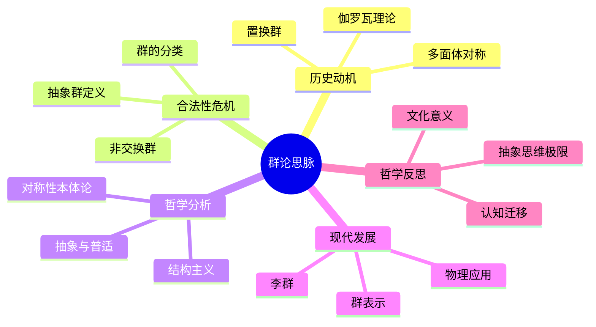

# 群论思脉

## 目录

- [群论思脉](#群论思脉)
  - [目录](#目录)
  - [认知结构分析](#认知结构分析)
  - [思维导图](#思维导图)
  - [多表征补充](#多表征补充)
  - [多视角叙述](#多视角叙述)
  - [1. 历史动机](#1-历史动机)
    - [1.1. 对称性的发现](#11-对称性的发现)
    - [1.2. 伽罗瓦理论](#12-伽罗瓦理论)
  - [2. 合法性危机](#2-合法性危机)
    - [2.1. 抽象化的挑战](#21-抽象化的挑战)
    - [2.2. 非交换群的发现](#22-非交换群的发现)
  - [3. 哲学分析](#3-哲学分析)
    - [3.1. 对称性的本体论](#31-对称性的本体论)
    - [3.2. 抽象结构主义](#32-抽象结构主义)
  - [4. 现代发展](#4-现代发展)
    - [4.1. 李群理论](#41-李群理论)
    - [4.2. 群表示论](#42-群表示论)
  - [5. 哲学反思](#5-哲学反思)
    - [5.1. 抽象思维的极限](#51-抽象思维的极限)
    - [5.2. 认知迁移](#52-认知迁移)

**版本**: 1.0  
**日期**: 2025-07-04

---

## 认知结构分析

- 感知层：对称图形、实物操作（如魔方、拼图）。
- 概念层：群的定义、运算、单位元、逆元。
- 结构层：子群、陪集、同态、正规子群。
- 元认知层：群论的抽象性、对称思想的普适性、与物理/化学/信息的联系。

## 思维导图

## 多表征补充

- 图像：展示正方体、二十面体的对称操作动画或示意图。
- 故事：讲述"伽罗瓦用群论破解方程解的秘密"。
- 公式：群的四条公理、置换群的表示。
- 隐喻：群如"变换的魔法盒"，输入一个对象，输出其对称变换结果。
- 认知结构：
  - 感知：动手操作、观察对称
  - 概念：抽象定义
  - 结构：群的分解与分类
  - 元认知：对称思想的迁移与升华

## 多视角叙述

- 历史：从多面体对称到伽罗瓦理论的诞生。
- 哲学：对称性与抽象结构的本体论意义。
- 认知科学：人脑如何识别和抽象对称性，群论学习的认知障碍。
- 教育与应用：群论在物理、化学、密码学中的应用，教学中如何用多表征降低抽象门槛。

## 1. 历史动机

### 1.1. 对称性的发现

群论的历史动机源于人类对对称性的深刻认识。从古代的多面体研究到现代的物理定律，对称性一直是数学和科学的核心概念。

### 1.2. 伽罗瓦理论

伽罗瓦通过群论解决了代数方程的可解性问题，这是群论发展的重要里程碑。

## 2. 合法性危机

### 2.1. 抽象化的挑战

群论从具体的对称变换抽象为一般的代数结构，这一过程面临着直观性与抽象性的张力。

### 2.2. 非交换群的发现

非交换群的发现挑战了传统的交换性直觉，推动了群论的进一步发展。

## 3. 哲学分析

### 3.1. 对称性的本体论

对称性不仅是数学概念，更是自然界的基本规律，体现了数学与物理的深层联系。

### 3.2. 抽象结构主义

群论体现了现代数学的结构主义思想，强调数学对象之间的关系而非具体内容。

## 4. 现代发展

### 4.1. 李群理论

李群将群论与微分几何相结合，为现代物理提供了重要工具。

### 4.2. 群表示论

群表示论将抽象群与线性代数联系起来，是群论应用的重要桥梁。

## 5. 哲学反思

### 5.1. 抽象思维的极限

群论代表了人类抽象思维的高度，但也面临着直观性的挑战。

### 5.2. 认知迁移

群论的学习需要从具体对称性迁移到抽象结构，体现了数学认知的复杂性。

---

**版本**: 1.0  
**日期**: 2025-07-04
