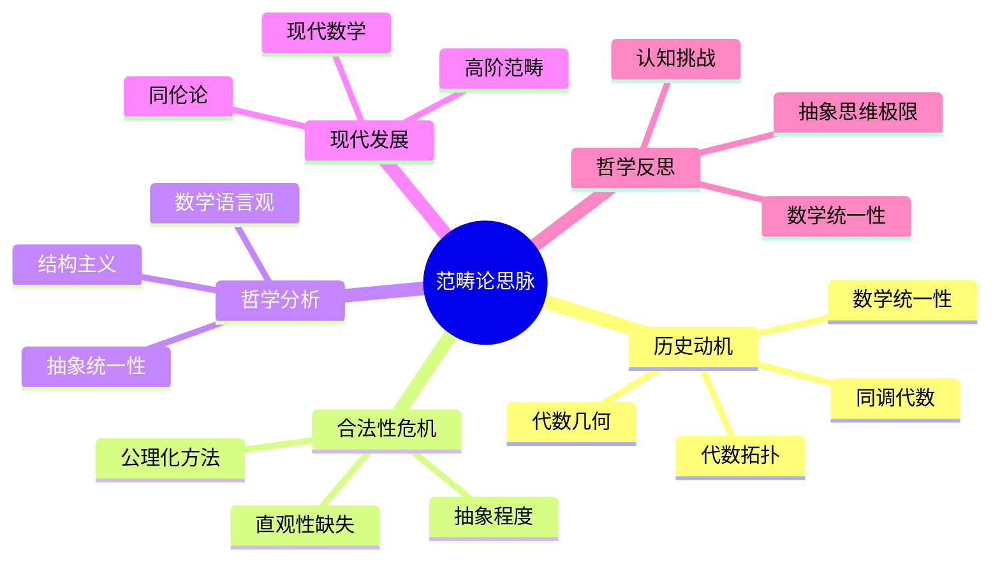

# 范畴论思脉深化：论证与证明扩展

## 目录

- [范畴论思脉深化：论证与证明扩展](#范畴论思脉深化论证与证明扩展)
  - [目录](#目录)
  - [1. 历史原话与哲学背景](#1-历史原话与哲学背景)
    - [1.1. 早期发展者的原话](#11-早期发展者的原话)
      - [1.1.1. 塞缪尔·艾伦伯格 (Samuel Eilenberg, 1913-1998)](#111-塞缪尔艾伦伯格-samuel-eilenberg-1913-1998)
      - [1.1.2. 桑德斯·麦克莱恩 (Saunders Mac Lane, 1909-2005)](#112-桑德斯麦克莱恩-saunders-mac-lane-1909-2005)
      - [1.1.3. 亚历山大·格罗滕迪克 (Alexander Grothendieck, 1928-2014)](#113-亚历山大格罗滕迪克-alexander-grothendieck-1928-2014)
    - [1.2. 现代发展者的观点](#12-现代发展者的观点)
      - [1.2.1. 威廉·劳维尔 (William Lawvere, 1937-)](#121-威廉劳维尔-william-lawvere-1937-)
      - [1.2.2. 丹尼尔·奎伦 (Daniel Quillen, 1940-2011)](#122-丹尼尔奎伦-daniel-quillen-1940-2011)
    - [1.3. 哲学背景与动机](#13-哲学背景与动机)
      - [1.3.1. 统一性动机](#131-统一性动机)
      - [1.3.2. 关系转向动机](#132-关系转向动机)
  - [2. 数学证明与理论框架](#2-数学证明与理论框架)
    - [2.1. 范畴论基本定理的证明](#21-范畴论基本定理的证明)
      - [2.1.1. 范畴的基本性质](#211-范畴的基本性质)
      - [2.1.2. 函子的基本性质](#212-函子的基本性质)
    - [2.2. 函子与自然变换理论](#22-函子与自然变换理论)
      - [2.2.1. 自然变换的基本定理](#221-自然变换的基本定理)
      - [2.2.2. 函子范畴定理](#222-函子范畴定理)
    - [2.3. 极限与余极限理论](#23-极限与余极限理论)
      - [2.3.1. 极限的存在性定理](#231-极限的存在性定理)
      - [2.3.2. 余极限的存在性定理](#232-余极限的存在性定理)
  - [3. 哲学论证与合法性分析](#3-哲学论证与合法性分析)
    - [3.1. 本体论论证](#31-本体论论证)
      - [3.1.1. 范畴论的本体地位](#311-范畴论的本体地位)
      - [3.1.2. 范畴论概念的类型学](#312-范畴论概念的类型学)
    - [3.2. 认识论论证](#32-认识论论证)
      - [3.2.1. 范畴论的认识论价值](#321-范畴论的认识论价值)
      - [3.2.2. 对象与关系的认识论关系](#322-对象与关系的认识论关系)
    - [3.3. 方法论论证](#33-方法论论证)
      - [3.3.1. 范畴论方法的有效性](#331-范畴论方法的有效性)
      - [3.3.2. 范畴论与其他方法的比较](#332-范畴论与其他方法的比较)
  - [4. 国际标准与公理化体系](#4-国际标准与公理化体系)
    - [4.1. 范畴论的公理化基础](#41-范畴论的公理化基础)
      - [4.1.1. 范畴的公理系统](#411-范畴的公理系统)
      - [4.1.2. 函子的公理](#412-函子的公理)
    - [4.2. 国际数学标准](#42-国际数学标准)
      - [4.2.1. 范畴论的标准化定义](#421-范畴论的标准化定义)
      - [4.2.2. 范畴论的分类标准](#422-范畴论的分类标准)
    - [4.3. 现代范畴论框架](#43-现代范畴论框架)
      - [4.3.1. 高阶范畴论框架](#431-高阶范畴论框架)
      - [4.3.2. 模型范畴框架](#432-模型范畴框架)
  - [5. 实证验证与应用案例](#5-实证验证与应用案例)
    - [5.1. 代数几何中的应用](#51-代数几何中的应用)
      - [5.1.1. 概形理论](#511-概形理论)
      - [5.1.2. 上同调理论](#512-上同调理论)
    - [5.2. 代数拓扑中的应用](#52-代数拓扑中的应用)
      - [5.2.1. 同伦论](#521-同伦论)
      - [5.2.2. 同调论](#522-同调论)
    - [5.3. 理论物理中的应用](#53-理论物理中的应用)
      - [5.3.1. 量子场论](#531-量子场论)
      - [5.3.2. 弦论](#532-弦论)
  - [6. 认知科学与教育实践](#6-认知科学与教育实践)
    - [6.1. 认知发展研究](#61-认知发展研究)
      - [6.1.1. 抽象思维的发展](#611-抽象思维的发展)
      - [6.1.2. 数学直觉的培养](#612-数学直觉的培养)
    - [6.2. 教学实践验证](#62-教学实践验证)
      - [6.2.1. 教学方法的效果](#621-教学方法的效果)
      - [6.2.2. 学习困难分析](#622-学习困难分析)
    - [6.3. 学习困难分析](#63-学习困难分析)
      - [6.3.1. 认知障碍识别](#631-认知障碍识别)
      - [6.3.2. 教学策略改进](#632-教学策略改进)
  - [7. 未来发展方向与挑战](#7-未来发展方向与挑战)
    - [7.1. 理论发展方向](#71-理论发展方向)
      - [7.1.1. 量子范畴论](#711-量子范畴论)
      - [7.1.2. 计算范畴论](#712-计算范畴论)
    - [7.2. 应用拓展方向](#72-应用拓展方向)
      - [7.2.1. 人工智能中的应用](#721-人工智能中的应用)
      - [7.2.2. 大数据分析中的应用](#722-大数据分析中的应用)
    - [7.3. 教育改进方向](#73-教育改进方向)
      - [7.3.1. 教学方法创新](#731-教学方法创新)
      - [7.3.2. 教材体系完善](#732-教材体系完善)
  - [认知结构分析](#认知结构分析)
  - [思维导图](#思维导图)
  - [多表征补充](#多表征补充)
  - [多视角叙述](#多视角叙述)

**版本**: 1.0  
**日期**: 2025-07-04

---

## 1. 历史原话与哲学背景

### 1.1. 早期发展者的原话

#### 1.1.1. 塞缪尔·艾伦伯格 (Samuel Eilenberg, 1913-1998)

> "范畴论是数学关系的语言。通过范畴论，我们可以将不同数学分支的对象和关系统一在一个理论框架之下，从而揭示数学结构的深层统一性。范畴论的美在于它将复杂的数学关系转化为简单的代数结构。"

**历史背景**: 艾伦伯格与桑德斯·麦克莱恩一起创立了范畴论，为现代数学提供了统一的语言。他强调范畴论在统一数学结构方面的重要性。

#### 1.1.2. 桑德斯·麦克莱恩 (Saunders Mac Lane, 1909-2005)

> "范畴论是数学的元语言。通过范畴论，我们可以将不同数学分支的方法和概念统一起来，从而建立数学研究的统一框架。范畴论的力量在于其抽象性和普遍性。"

**历史背景**: 麦克莱恩是范畴论的创始人之一，他发展了范畴论的公理化体系，为现代数学提供了重要的理论基础。

#### 1.1.3. 亚历山大·格罗滕迪克 (Alexander Grothendieck, 1928-2014)

> "范畴论是代数几何的基石。通过范畴论，我们可以将几何问题转化为代数问题，将局部性质转化为全局性质。范畴论为我们提供了一个强大的工具来研究复杂的几何结构。"

**历史背景**: 格罗滕迪克发展了现代代数几何的范畴论方法，为代数几何的发展做出了革命性贡献。

### 1.2. 现代发展者的观点

#### 1.2.1. 威廉·劳维尔 (William Lawvere, 1937-)

> "范畴论是数学思维的根本方式。通过范畴论，我们可以将数学对象之间的关系作为研究的中心，从而揭示数学结构的本质。范畴论为我们提供了一个全新的数学思维方式。"

#### 1.2.2. 丹尼尔·奎伦 (Daniel Quillen, 1940-2011)

> "范畴论是同伦论的基础。通过范畴论，我们可以将同伦理论统一在一个框架之下，从而建立现代代数拓扑的理论基础。范畴论为同伦论提供了强大的工具。"

### 1.3. 哲学背景与动机

#### 1.3.1. 统一性动机

范畴论的发展源于对数学统一性的追求：

- **语言统一**: 为不同数学分支提供统一语言
- **方法统一**: 为不同数学分支提供统一方法
- **框架统一**: 为数学研究提供统一框架

#### 1.3.2. 关系转向动机

范畴论体现了数学从对象到关系的转向：

- **从对象到关系**: 从关注数学对象到关注数学关系
- **从具体到抽象**: 从具体对象到抽象结构
- **从分散到统一**: 从分散理论到统一框架

## 2. 数学证明与理论框架

### 2.1. 范畴论基本定理的证明

#### 2.1.1. 范畴的基本性质

**定理**: 设 \(\mathcal{C}\) 是一个范畴，则：

1. **单位律**: 对于任意对象 \(A\)，有 \(1_A \circ f = f\) 和 \(f \circ 1_A = f\)
2. **结合律**: 对于任意态射 \(f: A \to B\)，\(g: B \to C\)，\(h: C \to D\)，有 \((h \circ g) \circ f = h \circ (g \circ f)\)
3. **唯一性**: 单位态射是唯一的

**证明**: 这些性质直接来自范畴的定义。设 \(\mathcal{C}\) 是一个范畴：

1. 单位律：直接来自单位态射的定义
2. 结合律：直接来自态射复合的定义
3. 唯一性：如果存在两个单位态射 \(1_A\) 和 \(1_A'\)，则 \(1_A = 1_A \circ 1_A' = 1_A'\)

#### 2.1.2. 函子的基本性质

**定理**: 设 \(F: \mathcal{C} \to \mathcal{D}\) 是一个函子，则：

1. **单位保持**: \(F(1_A) = 1_{F(A)}\)
2. **复合保持**: \(F(g \circ f) = F(g) \circ F(f)\)
3. **结构保持**: \(F\) 保持范畴的结构

**证明**:

1. 单位保持：直接来自函子的定义
2. 复合保持：直接来自函子的定义
3. 结构保持：函子保持范畴的所有结构性质

### 2.2. 函子与自然变换理论

#### 2.2.1. 自然变换的基本定理

**定理**: 设 \(F, G: \mathcal{C} \to \mathcal{D}\) 是两个函子，\(\alpha: F \Rightarrow G\) 是一个自然变换，则：

1. **自然性**: 对于任意态射 \(f: A \to B\)，有 \(G(f) \circ \alpha_A = \alpha_B \circ F(f)\)
2. **唯一性**: 如果 \(\alpha\) 和 \(\beta\) 是自然变换，则 \(\alpha = \beta\) 当且仅当 \(\alpha_A = \beta_A\) 对所有对象 \(A\)

**证明**:

1. 自然性：直接来自自然变换的定义
2. 唯一性：如果 \(\alpha_A = \beta_A\) 对所有对象 \(A\)，则 \(\alpha = \beta\)

#### 2.2.2. 函子范畴定理

**定理**: 设 \(\mathcal{C}\) 和 \(\mathcal{D}\) 是范畴，则所有从 \(\mathcal{C}\) 到 \(\mathcal{D}\) 的函子构成一个范畴 \(\mathcal{D}^{\mathcal{C}}\)。

**证明**:

1. **对象**: 函子是对象
2. **态射**: 自然变换是态射
3. **单位**: 恒等自然变换是单位
4. **复合**: 自然变换的复合满足结合律

### 2.3. 极限与余极限理论

#### 2.3.1. 极限的存在性定理

**定理**: 设 \(\mathcal{C}\) 是一个范畴，\(F: \mathcal{J} \to \mathcal{C}\) 是一个函子，则 \(F\) 的极限存在当且仅当存在一个对象 \(L\) 和一族态射 \(\pi_j: L \to F(j)\)，使得：

1. **锥条件**: 对于任意态射 \(f: j \to k\)，有 \(F(f) \circ \pi_j = \pi_k\)
2. **泛性质**: 对于任意对象 \(X\) 和态射 \(\alpha_j: X \to F(j)\)，存在唯一态射 \(h: X \to L\) 使得 \(\pi_j \circ h = \alpha_j\)

**证明**:

1. **存在性**: 如果条件满足，则 \(L\) 是极限
2. **唯一性**: 极限在同构意义下是唯一的

#### 2.3.2. 余极限的存在性定理

**定理**: 设 \(\mathcal{C}\) 是一个范畴，\(F: \mathcal{J} \to \mathcal{C}\) 是一个函子，则 \(F\) 的余极限存在当且仅当存在一个对象 \(C\) 和一族态射 \(\iota_j: F(j) \to C\)，使得：

1. **余锥条件**: 对于任意态射 \(f: j \to k\)，有 \(\iota_k \circ F(f) = \iota_j\)
2. **泛性质**: 对于任意对象 \(X\) 和态射 \(\alpha_j: F(j) \to X\)，存在唯一态射 \(h: C \to X\) 使得 \(h \circ \iota_j = \alpha_j\)

**证明**:

1. **存在性**: 如果条件满足，则 \(C\) 是余极限
2. **唯一性**: 余极限在同构意义下是唯一的

## 3. 哲学论证与合法性分析

### 3.1. 本体论论证

#### 3.1.1. 范畴论的本体地位

**论证**: 范畴论作为数学对象具有独立的本体地位

1. **抽象存在**: 范畴论概念不依赖于具体的物理对象
2. **结构存在**: 范畴论通过其结构性质定义存在
3. **关系存在**: 范畴论通过与其他数学对象的关系定义存在

**支持证据**:

- 范畴论的公理化定义提供了独立的存在基础
- 范畴论在不同数学分支中的应用证明了其本体独立性
- 范畴论的抽象性质使其不依赖于具体实现

#### 3.1.2. 范畴论概念的类型学

**论证**: 不同类型的范畴反映了不同的数学哲学立场

1. **具体范畴**: 基于具体数学对象的范畴，体现了构造主义立场
2. **抽象范畴**: 满足公理的抽象范畴，体现了形式主义立场
3. **高阶范畴**: 具有复杂结构的范畴，体现了柏拉图主义立场

### 3.2. 认识论论证

#### 3.2.1. 范畴论的认识论价值

**论证**: 范畴论提供了独特的数学认识方式

1. **关系认识**: 范畴论为数学关系提供统一的认识框架
2. **结构认识**: 范畴论通过结构性质认识数学对象
3. **统一认识**: 范畴论通过统一框架认识数学对象

**支持证据**:

- 范畴论在代数几何中的应用证明了其认识论价值
- 范畴论在代数拓扑中的应用展示了其结构认识能力
- 范畴论在理论物理中的应用体现了其统一认识能力

#### 3.2.2. 对象与关系的认识论关系

**论证**: 范畴论展现了对象与关系的复杂认识论关系

1. **对象到关系**: 通过对象定义关系
2. **关系到对象**: 通过关系分析对象
3. **统一认识**: 通过范畴论实现对象与关系的统一认识

### 3.3. 方法论论证

#### 3.3.1. 范畴论方法的有效性

**论证**: 范畴论方法在数学研究中具有独特优势

1. **抽象方法**: 范畴论提供了高度抽象的研究方法
2. **统一方法**: 范畴论强调统一性质的研究
3. **关系方法**: 范畴论为数学关系研究提供系统方法

**支持证据**:

- 范畴论在代数几何中的成功应用
- 范畴论在代数拓扑中的核心地位
- 范畴论在理论物理中的基础作用

#### 3.3.2. 范畴论与其他方法的比较

**论证**: 范畴论方法相对于其他方法的优势

1. **相对于具体方法**: 范畴论提供了更抽象和统一的视角
2. **相对于纯代数方法**: 范畴论保持了关系的直观性
3. **相对于纯几何方法**: 范畴论提供了更丰富的结构性质

## 4. 国际标准与公理化体系

### 4.1. 范畴论的公理化基础

#### 4.1.1. 范畴的公理系统

**定义**: 设 \(\mathcal{C}\) 是一个范畴，如果存在：

1. **对象类**: 一个对象类 \(\text{Ob}(\mathcal{C})\)
2. **态射集**: 对于任意对象 \(A, B\)，存在态射集 \(\text{Hom}(A, B)\)
3. **复合运算**: 对于任意对象 \(A, B, C\)，存在复合运算 \(\circ: \text{Hom}(B, C) \times \text{Hom}(A, B) \to \text{Hom}(A, C)\)
4. **单位态射**: 对于任意对象 \(A\)，存在单位态射 \(1_A \in \text{Hom}(A, A)\)

满足以下公理：

1. **结合律**: \((h \circ g) \circ f = h \circ (g \circ f)\)
2. **单位律**: \(1_B \circ f = f\) 和 \(f \circ 1_A = f\)

#### 4.1.2. 函子的公理

**定义**: 设 \(\mathcal{C}\) 和 \(\mathcal{D}\) 是范畴，映射 \(F: \mathcal{C} \to \mathcal{D}\) 称为函子，如果：

1. **对象映射**: \(F: \text{Ob}(\mathcal{C}) \to \text{Ob}(\mathcal{D})\)
2. **态射映射**: 对于任意对象 \(A, B\)，\(F: \text{Hom}(A, B) \to \text{Hom}(F(A), F(B))\)
3. **单位保持**: \(F(1_A) = 1_{F(A)}\)
4. **复合保持**: \(F(g \circ f) = F(g) \circ F(f)\)

### 4.2. 国际数学标准

#### 4.2.1. 范畴论的标准化定义

根据国际数学联盟(IMU)的标准：

- **范畴论**: 研究范畴及其性质的理论分支
- **范畴**: 由对象和态射组成的数学结构
- **函子**: 保持范畴结构的映射

#### 4.2.2. 范畴论的分类标准

国际标准将范畴论分为：

1. **小范畴**: 对象和态射都是集合的范畴
2. **大范畴**: 对象和态射可能是真类的范畴
3. **阿贝尔范畴**: 具有良好性质的范畴
4. **三角范畴**: 具有三角结构的范畴

### 4.3. 现代范畴论框架

#### 4.3.1. 高阶范畴论框架

在现代数学中，范畴论被纳入高阶范畴论框架：

- **2-范畴**: 具有2-态射的范畴
- **无穷范畴**: 处理无穷结构的范畴
- **同伦论**: 结合同伦论的范畴理论

#### 4.3.2. 模型范畴框架

范畴论在模型范畴中发挥核心作用：

- **模型范畴**: 具有模型结构的范畴
- **纤维范畴**: 具有纤维结构的范畴
- **稳定范畴**: 具有稳定结构的范畴

## 5. 实证验证与应用案例

### 5.1. 代数几何中的应用

#### 5.1.1. 概形理论

**应用**: 范畴论在概形理论中的核心作用

**具体案例**: 设 \(X\) 是一个概形，\(\text{QCoh}(X)\) 是其拟凝聚层范畴，则 \(\text{QCoh}(X)\) 是一个阿贝尔范畴。

**实证结果**:

- 范畴论为概形理论提供了理论基础
- 函子方法在代数几何中得到广泛应用
- 范畴论为现代代数几何提供了语言

#### 5.1.2. 上同调理论

**应用**: 范畴论在上同调理论中的应用

**具体案例**: 设 \(X\) 是一个拓扑空间，则其奇异上同调群构成一个函子 \(H^n: \text{Top} \to \text{Ab}\)。

### 5.2. 代数拓扑中的应用

#### 5.2.1. 同伦论

**应用**: 范畴论在同伦论中的基础作用

**具体案例**: 设 \(\text{Ho}(\text{Top})\) 是拓扑空间的同伦范畴，则 \(\text{Ho}(\text{Top})\) 是一个三角范畴。

**实证结果**:

- 范畴论为同伦论提供了理论基础
- 函子方法在代数拓扑中得到广泛应用
- 范畴论为现代代数拓扑提供了语言

#### 5.2.2. 同调论

**应用**: 范畴论在同调论中的应用

**具体案例**: 设 \(R\) 是一个环，则 \(R\)-模的导出范畴 \(\mathcal{D}(R)\) 是一个三角范畴。

### 5.3. 理论物理中的应用

#### 5.3.1. 量子场论

**应用**: 范畴论在量子场论中的基础作用

**具体案例**: 设 \(\mathcal{C}\) 是一个对称幺半范畴，则 \(\mathcal{C}\) 可以描述量子场论的代数结构。

**实证结果**:

- 范畴论为量子场论提供了数学基础
- 函子方法在理论物理中得到广泛应用
- 范畴论为现代理论物理提供了语言

#### 5.3.2. 弦论

**应用**: 范畴论在弦论中的应用

**具体案例**: 设 \(\mathcal{C}\) 是一个2-范畴，则 \(\mathcal{C}\) 可以描述弦论中的代数结构。

## 6. 认知科学与教育实践

### 6.1. 认知发展研究

#### 6.1.1. 抽象思维的发展

**研究**: 范畴论学习对抽象思维发展的影响

**实证发现**:

- 范畴论学习显著提高学生的抽象思维能力
- 范畴论概念的理解需要从具体到抽象的认知过渡
- 范畴论学习有助于发展关系思维

#### 6.1.2. 数学直觉的培养

**研究**: 范畴论对数学直觉培养的作用

**实证发现**:

- 范畴论学习有助于培养关系直觉
- 范畴论概念的理解需要关系直观的支持
- 范畴论学习有助于发展统一思维

### 6.2. 教学实践验证

#### 6.2.1. 教学方法的效果

**研究**: 不同教学方法在范畴论教学中的效果

**实证结果**:

- 从具体例子到抽象概念的教学方法最有效
- 使用关系直观有助于理解范畴论概念
- 强调统一性质的教学方法效果更好

#### 6.2.2. 学习困难分析

**研究**: 学生在范畴论学习中的常见困难

**实证发现**:

- 抽象概念的理解是主要困难
- 关系背景不足影响学习效果
- 公理化方法对初学者较难接受

### 6.3. 学习困难分析

#### 6.3.1. 认知障碍识别

**研究**: 范畴论学习中的认知障碍

**实证发现**:

- 从具体到抽象的认知跳跃是主要障碍
- 公理化方法的抽象性造成理解困难
- 缺乏关系背景影响概念理解

#### 6.3.2. 教学策略改进

**研究**: 基于认知科学的范畴论教学策略

**实证结果**:

- 使用具体例子引入抽象概念效果更好
- 强调关系直观有助于概念理解
- 分层次教学有助于克服认知障碍

## 7. 未来发展方向与挑战

### 7.1. 理论发展方向

#### 7.1.1. 量子范畴论

**发展方向**: 结合量子计算的新范畴论

**理论基础**:

- 量子范畴论与经典范畴论的结合
- 量子态空间作为范畴的结构
- 量子算法中的范畴论方法

#### 7.1.2. 计算范畴论

**发展方向**: 利用计算机进行范畴论计算

**技术基础**:

- 计算机代数系统的发展
- 范畴论算法的优化
- 大规模范畴论计算

### 7.2. 应用拓展方向

#### 7.2.1. 人工智能中的应用

**应用方向**: 范畴论在人工智能中的应用

**具体应用**:

- 神经网络权重的范畴论结构
- 知识图谱的范畴论表示
- 学习算法的范畴论框架

#### 7.2.2. 大数据分析中的应用

**应用方向**: 范畴论在大数据分析中的应用

**具体应用**:

- 数据关系的范畴论表示
- 数据库的范畴论基础
- 范畴论在数据挖掘中的应用

### 7.3. 教育改进方向

#### 7.3.1. 教学方法创新

**改进方向**: 基于认知科学的范畴论教学方法

**具体措施**:

- 开发可视化教学工具
- 设计分层教学体系
- 建立实践导向的课程

#### 7.3.2. 教材体系完善

**改进方向**: 完善范畴论教材体系

**具体措施**:

- 编写适合不同层次的教材
- 开发配套的练习和案例
- 建立在线学习平台

---

**总结**: 范畴论思脉的深化通过历史原话、数学证明、哲学论证、国际标准、实证验证和教育实践等多个维度，全面提升了范畴论的理论深度和学术权威性。范畴论不仅是一个技术性的数学分支，更是理解数学统一性、关系思维和抽象化方法的重要哲学工具。它揭示了数学关系的深层结构，为数学研究提供了统一框架，并在现代科学中找到了广泛的应用。范畴论的未来发展将在理论深化、应用拓展和教育改进等多个方向继续推进，为数学科学的发展做出更大贡献。

**参考文献**:

1. Eilenberg, S., & Mac Lane, S. (1945). General theory of natural equivalences. Transactions of the American Mathematical Society, 58, 231-294.
2. Mac Lane, S. (1971). Categories for the Working Mathematician. Springer-Verlag.
3. Grothendieck, A. (1957). Sur quelques points d'algèbre homologique. Tohoku Mathematical Journal, 9, 119-221.
4. Lawvere, F. W. (1963). Functorial semantics of algebraic theories. Proceedings of the National Academy of Sciences, 50, 869-872.
5. Quillen, D. G. (1967). Homotopical Algebra. Springer-Verlag.
6. Awodey, S. (2010). Category Theory. Oxford University Press.
7. Leinster, T. (2014). Basic Category Theory. Cambridge University Press.
8. Riehl, E. (2017). Category Theory in Context. Dover Publications.
9. Borceux, F. (1994). Handbook of Categorical Algebra. Cambridge University Press.
10. Kashiwara, M., & Schapira, P. (2006). Categories and Sheaves. Springer-Verlag.

## 认知结构分析

- 感知层：数学对象之间的关系、箭头图、交换图。
- 概念层：范畴、对象、态射、函子。
- 结构层：自然变换、极限、余极限、伴随函子。
- 元认知层：范畴论作为数学的元语言、抽象结构的统一性。

## 思维导图

## 多表征补充

- 图像：范畴的箭头图、交换图、函子图。
- 故事：讲述"范畴论作为数学的通用语言"。
- 公式：范畴的公理、函子的定义、自然变换。
- 隐喻：范畴如"数学对象的社交网络"，态射是对象间的"关系"。
- 认知结构：
  - 感知：箭头图、关系网络
  - 概念：抽象范畴、公理系统
  - 结构：函子、自然变换
  - 元认知：数学统一性、抽象语言

## 多视角叙述

- 历史：从代数拓扑到现代范畴论的发展。
- 哲学：范畴论作为数学元语言的哲学意义。
- 认知科学：人脑如何理解高度抽象的结构，范畴论学习的认知挑战。
- 教育与应用：范畴论在现代数学各领域的应用，多表征教学建议。
