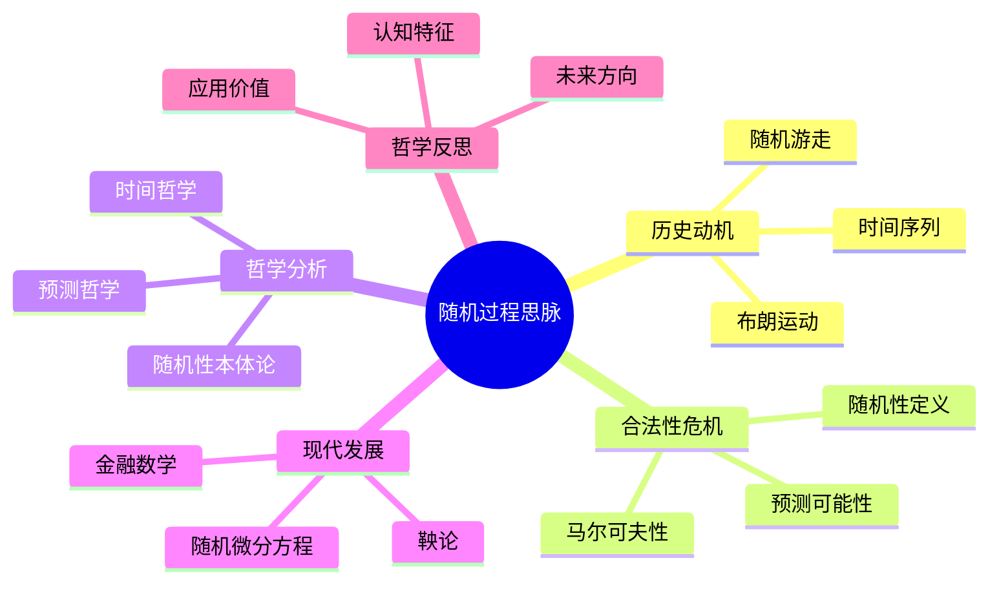

# 随机过程思脉

## 目录

- [随机过程思脉](#随机过程思脉)
  - [目录](#目录)
  - [认知结构分析](#认知结构分析)
  - [思维导图](#思维导图)
  - [多表征补充](#多表征补充)
  - [多视角叙述](#多视角叙述)
  - [1. 历史动机](#1-历史动机)
    - [1.1. 随机游走的发现](#11-随机游走的发现)
    - [1.2. 布朗运动的数学化](#12-布朗运动的数学化)
  - [2. 合法性危机](#2-合法性危机)
    - [2.1. 随机性的定义](#21-随机性的定义)
    - [2.2. 预测的可能性](#22-预测的可能性)
  - [3. 哲学分析](#3-哲学分析)
    - [3.1. 时间的哲学](#31-时间的哲学)
    - [3.2. 随机性的本体论](#32-随机性的本体论)
  - [4. 现代发展](#4-现代发展)
    - [4.1. 鞅论](#41-鞅论)
    - [4.2. 随机微分方程](#42-随机微分方程)
  - [5. 哲学反思](#5-哲学反思)
    - [5.1. 随机过程的认知特征](#51-随机过程的认知特征)
    - [5.2. 随机过程的应用价值](#52-随机过程的应用价值)

**版本**: 1.0  
**日期**: 2025-07-04

---

## 认知结构分析

- 感知层：随机游走、布朗运动、时间序列图。
- 概念层：随机过程、马尔可夫性、平稳性。
- 结构层：随机过程分类、极限定理、鞅论。
- 元认知层：随机性与确定性的关系、随机过程的预测性。

## 思维导图

## 多表征补充

- 图像：随机游走路径图、布朗运动轨迹、时间序列图。
- 故事：讲述"从花粉运动到现代金融数学"。
- 公式：随机微分方程、伊藤公式、鞅不等式。
- 隐喻：随机过程如"时间的舞蹈"，在随机中寻找规律。
- 认知结构：
  - 感知：通过动画感受随机性
  - 概念：随机过程的数学定义
  - 结构：随机过程的理论体系
  - 元认知：随机性与确定性的哲学思考

## 多视角叙述

- 历史：从布朗运动到现代随机分析的发展。
- 哲学：时间、随机性和预测的哲学问题。
- 认知科学：人脑如何处理随机信息和预测。
- 教育与应用：随机过程在物理、金融、生物中的应用。

## 1. 历史动机

### 1.1. 随机游走的发现

随机过程起源于对随机游走现象的观察和研究。

### 1.2. 布朗运动的数学化

布朗运动为随机过程理论提供了重要基础。

## 2. 合法性危机

### 2.1. 随机性的定义

什么是随机性？随机性与确定性的边界。

### 2.2. 预测的可能性

随机过程是否可预测？预测的可靠性问题。

## 3. 哲学分析

### 3.1. 时间的哲学

随机过程中的时间概念和哲学意义。

### 3.2. 随机性的本体论

随机性是客观存在还是主观认知？

## 4. 现代发展

### 4.1. 鞅论

鞅论为随机过程提供了重要工具。

### 4.2. 随机微分方程

随机微分方程的发展和应用。

## 5. 哲学反思

### 5.1. 随机过程的认知特征

随机过程学习中的认知特征和挑战。

### 5.2. 随机过程的应用价值

随机过程在科学和社会中的价值。

---

**版本**: 1.0  
**日期**: 2025-07-04
