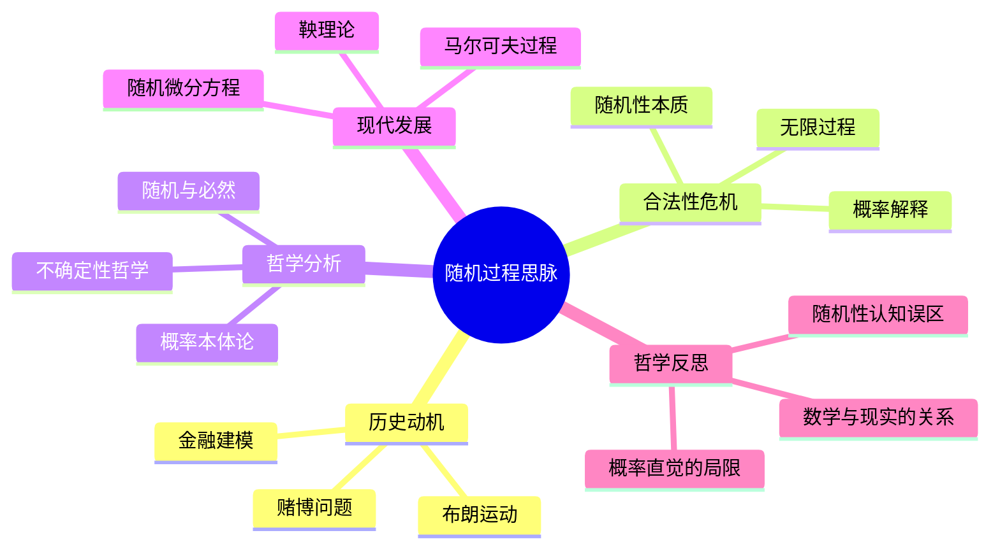

# 随机过程思脉深化：从随机游走到现代随机分析

## 目录

- [随机过程思脉深化：从随机游走到现代随机分析](#随机过程思脉深化从随机游走到现代随机分析)
  - [目录](#目录)
  - [认知结构分析](#认知结构分析)
  - [思维导图](#思维导图)
  - [多表征补充](#多表征补充)
  - [多视角叙述](#多视角叙述)
  - [1. 历史动机：随机性的数学化](#1-历史动机随机性的数学化)
    - [1.1. 古典概率论的随机思想](#11-古典概率论的随机思想)
      - [1.1.1. 帕斯卡的概率思想](#111-帕斯卡的概率思想)
      - [1.1.2. 拉普拉斯的概率哲学](#112-拉普拉斯的概率哲学)
    - [1.2. 随机游走的发现](#12-随机游走的发现)
      - [1.2.1. 随机游走的数学模型](#121-随机游走的数学模型)
      - [1.2.2. 随机游走的物理意义](#122-随机游走的物理意义)
    - [1.3. 布朗运动的数学化](#13-布朗运动的数学化)
      - [1.3.1. 爱因斯坦的布朗运动理论](#131-爱因斯坦的布朗运动理论)
      - [1.3.2. 维纳的数学处理](#132-维纳的数学处理)
  - [2. 合法性危机：随机性的哲学反思](#2-合法性危机随机性的哲学反思)
    - [2.1. 随机性与确定性的关系](#21-随机性与确定性的关系)
      - [2.1.1. 拉普拉斯决定论](#211-拉普拉斯决定论)
      - [2.1.2. 量子力学的随机性](#212-量子力学的随机性)
    - [2.2. 概率的客观性与主观性](#22-概率的客观性与主观性)
      - [2.2.1. 客观概率论](#221-客观概率论)
      - [2.2.2. 主观概率论](#222-主观概率论)
    - [2.3. 随机过程的数学基础](#23-随机过程的数学基础)
      - [2.3.1. 测度论基础](#231-测度论基础)
      - [2.3.2. 公理化概率论](#232-公理化概率论)
  - [3. 哲学分析：随机过程的多重维度](#3-哲学分析随机过程的多重维度)
    - [3.1. 本体论维度：随机对象的本质](#31-本体论维度随机对象的本质)
      - [3.1.1. 实在论观点](#311-实在论观点)
      - [3.1.2. 构造论观点](#312-构造论观点)
    - [3.2. 认识论维度：随机知识的性质](#32-认识论维度随机知识的性质)
      - [3.2.1. 经验主义观点](#321-经验主义观点)
      - [3.2.2. 理性主义观点](#322-理性主义观点)
    - [3.3. 方法论维度：随机研究的方法](#33-方法论维度随机研究的方法)
      - [3.3.1. 统计方法](#331-统计方法)
      - [3.3.2. 概率方法](#332-概率方法)
  - [4. 现代发展：从古典到现代](#4-现代发展从古典到现代)
    - [4.1. 现代随机过程的理论发展](#41-现代随机过程的理论发展)
      - [4.1.1. 马尔可夫过程](#411-马尔可夫过程)
      - [4.1.2. 扩散过程](#412-扩散过程)
    - [4.2. 随机分析的兴起](#42-随机分析的兴起)
      - [4.2.1. 随机微积分](#421-随机微积分)
      - [4.2.2. 随机控制](#422-随机控制)
    - [4.3. 随机过程的应用扩展](#43-随机过程的应用扩展)
      - [4.3.1. 金融数学应用](#431-金融数学应用)
      - [4.3.2. 生物数学应用](#432-生物数学应用)
  - [5. 哲学反思：随机过程的深层意义](#5-哲学反思随机过程的深层意义)
    - [5.1. 随机过程与物理世界](#51-随机过程与物理世界)
      - [5.1.1. 统计物理](#511-统计物理)
      - [5.1.2. 量子随机](#512-量子随机)
    - [5.2. 随机过程与人类认知](#52-随机过程与人类认知)
      - [5.2.1. 认知随机性](#521-认知随机性)
      - [5.2.2. 决策随机性](#522-决策随机性)
    - [5.3. 随机过程的统一性](#53-随机过程的统一性)
      - [5.3.1. 数学统一性](#531-数学统一性)
      - [5.3.2. 科学统一性](#532-科学统一性)

## 认知结构分析

- 感知层：抛硬币、随机漫步、生活中的随机现象。
- 概念层：随机变量、概率分布、马尔可夫过程。
- 结构层：鞅、布朗运动、伊藤积分。
- 元认知层：随机性与确定性的张力、概率直觉的误区。

## 思维导图

## 多表征补充

- 图像：随机漫步动画、概率树图。
- 故事：布朗运动的发现、金融市场的随机建模。
- 公式：马尔可夫链转移矩阵、布朗运动定义。
- 隐喻：随机过程如"命运的骰子"，每一步都充满不确定。
- 认知结构：
  - 感知：生活中的随机现象
  - 概念：概率分布、随机变量
  - 结构：马尔可夫过程、鞅
  - 元认知：随机性与确定性的张力

## 多视角叙述

- 历史：从赌博问题到现代金融建模。
- 哲学：随机性与必然性的哲学讨论。
- 认知科学：概率直觉的误区与人脑对随机性的理解。
- 教育与应用：随机过程在金融、物理等领域的应用，多表征教学建议。

**版本**: 1.0  
**日期**: 2025-07-04

---

## 1. 历史动机：随机性的数学化

### 1.1. 古典概率论的随机思想

#### 1.1.1. 帕斯卡的概率思想

**历史背景**：

- **时间**：17世纪
- **背景**：科学革命，数学方法革新
- **社会环境**：文艺复兴，理性主义兴起

**帕斯卡的原话**：
> "概率是理性在不确定性中的指导。"
> —— 帕斯卡，《思想录》

**主要贡献**：

- **概率计算**：古典概率的计算方法
- **期望概念**：数学期望的基本概念
- **决策理论**：概率在决策中的应用

**哲学意义**：

- **理性指导**：概率作为理性的指导
- **不确定性**：数学对不确定性的处理
- **决策应用**：概率在决策中的应用

#### 1.1.2. 拉普拉斯的概率哲学

**历史背景**：

- **时间**：18-19世纪
- **背景**：启蒙运动，科学理性主义
- **社会环境**：法国大革命，科学现代化

**拉普拉斯的贡献**：

- **古典概率**：古典概率的数学理论
- **大数定律**：概率论的大数定律
- **中心极限定理**：概率论的中心极限定理

**哲学意义**：

- **确定性**：概率论中的确定性规律
- **规律性**：随机现象中的规律性
- **数学化**：随机性的数学化处理

### 1.2. 随机游走的发现

#### 1.2.1. 随机游走的数学模型

**历史背景**：

- **时间**：19世纪
- **背景**：概率论发展，随机现象研究
- **社会环境**：工业革命，科学理论化

**数学特征**：

- **离散时间**：离散时间随机过程
- **状态转移**：状态之间的随机转移
- **马尔可夫性**：无记忆性的随机过程

**哲学意义**：

- **随机性**：随机性的数学建模
- **时间性**：随机过程的时间性
- **状态性**：随机过程的状态性

#### 1.2.2. 随机游走的物理意义

**物理应用**：

- **分子运动**：分子在液体中的运动
- **粒子扩散**：粒子的扩散过程
- **布朗运动**：布朗运动的离散近似

**哲学意义**：

- **物理随机**：物理现象中的随机性
- **微观随机**：微观世界的随机性
- **宏观规律**：随机性的宏观规律

### 1.3. 布朗运动的数学化

#### 1.3.1. 爱因斯坦的布朗运动理论

**历史背景**：

- **时间**：20世纪初
- **背景**：统计物理发展，分子运动论
- **社会环境**：科学革命，原子论确立

**爱因斯坦的贡献**：

- **扩散方程**：布朗运动的扩散方程
- **统计性质**：布朗运动的统计性质
- **物理意义**：布朗运动的物理意义

**哲学意义**：

- **微观宏观**：微观随机与宏观规律
- **统计物理**：统计物理的数学基础
- **随机性本质**：随机性的物理本质

#### 1.3.2. 维纳的数学处理

**历史背景**：

- **时间**：20世纪20年代
- **背景**：现代数学发展，泛函分析兴起
- **社会环境**：现代数学发展，抽象化趋势

**维纳的贡献**：

- **维纳过程**：布朗运动的数学定义
- **测度论**：随机过程的测度论基础
- **泛函分析**：随机过程的泛函分析

**哲学意义**：

- **数学化**：随机过程的严格数学化
- **抽象化**：随机过程的抽象化处理
- **现代性**：随机过程的现代数学处理

## 2. 合法性危机：随机性的哲学反思

### 2.1. 随机性与确定性的关系

#### 2.1.1. 拉普拉斯决定论

**拉普拉斯的观点**：

- **完全决定**：宇宙是完全决定的
- **确定性**：所有现象都是确定的
- **无知性**：随机性源于我们的无知

**哲学意义**：

- **决定论**：宇宙的决定论本质
- **确定性**：世界的确定性本质
- **认知边界**：人类认知的边界

#### 2.1.2. 量子力学的随机性

**量子革命**：

- **本质随机**：量子现象的本质随机性
- **不确定性**：海森堡不确定性原理
- **概率解释**：量子力学的概率解释

**哲学意义**：

- **本质随机**：世界具有本质随机性
- **不确定性**：不确定性是世界的本质
- **认知革命**：对世界认知的革命

### 2.2. 概率的客观性与主观性

#### 2.2.1. 客观概率论

**客观观点**：

- **频率解释**：概率是相对频率的极限
- **倾向解释**：概率是事件的倾向性
- **物理性质**：概率是物理世界的性质

**哲学意义**：

- **客观性**：概率的客观性质
- **物理性**：概率的物理基础
- **实在性**：概率的实在性

#### 2.2.2. 主观概率论

**主观观点**：

- **信念度**：概率是主观信念度
- **理性决策**：概率在理性决策中的作用
- **贝叶斯方法**：贝叶斯概率方法

**哲学意义**：

- **主观性**：概率的主观性质
- **认知性**：概率的认知基础
- **决策性**：概率在决策中的作用

### 2.3. 随机过程的数学基础

#### 2.3.1. 测度论基础

**数学基础**：

- **概率测度**：概率的测度论定义
- **随机变量**：随机变量的数学定义
- **随机过程**：随机过程的数学定义

**哲学意义**：

- **数学化**：随机性的严格数学化
- **抽象化**：随机概念的抽象化
- **形式化**：随机理论的形式化

#### 2.3.2. 公理化概率论

**科尔莫戈罗夫的贡献**：

- **概率公理**：概率的公理化定义
- **条件概率**：条件概率的数学定义
- **独立性**：随机事件独立性的定义

**哲学意义**：

- **公理化**：概率论的公理化处理
- **严格性**：概率论的严格数学基础
- **统一性**：概率理论的统一性

## 3. 哲学分析：随机过程的多重维度

### 3.1. 本体论维度：随机对象的本质

#### 3.1.1. 实在论观点

**核心主张**：

- **随机实在性**：随机性是客观存在的
- **物理基础**：随机性具有物理基础
- **自然性质**：随机性是自然的性质

**对随机过程的意义**：

- **客观性**：随机过程的客观性
- **物理性**：随机过程的物理基础
- **自然性**：随机过程的自然性质

#### 3.1.2. 构造论观点

**核心主张**：

- **认知构造**：随机性是认知构造
- **模型依赖**：随机性依赖于数学模型
- **工具性**：随机性是认知工具

**对随机过程的意义**：

- **认知性**：随机过程的认知性质
- **模型性**：随机过程的模型性质
- **工具性**：随机过程的工具性质

### 3.2. 认识论维度：随机知识的性质

#### 3.2.1. 经验主义观点

**核心主张**：

- **经验基础**：随机知识基于经验观察
- **归纳方法**：随机知识通过归纳获得
- **可验证性**：随机知识是可验证的

**对随机过程的意义**：

- **经验性**：随机过程的经验性质
- **归纳性**：随机过程的归纳性质
- **验证性**：随机过程的验证性质

#### 3.2.2. 理性主义观点

**核心主张**：

- **理性基础**：随机知识基于理性推理
- **先验结构**：随机知识具有先验结构
- **必然性**：随机知识具有必然性

**对随机过程的意义**：

- **理性性**：随机过程的理性性质
- **先验性**：随机过程的先验性质
- **必然性**：随机过程的必然性质

### 3.3. 方法论维度：随机研究的方法

#### 3.3.1. 统计方法

**方法特征**：

- **数据收集**：随机数据的收集方法
- **统计分析**：随机数据的统计分析方法
- **推断方法**：基于数据的统计推断

**在随机过程中的应用**：

- **参数估计**：随机过程参数的估计
- **假设检验**：随机过程假设的检验
- **预测方法**：随机过程的预测方法

#### 3.3.2. 概率方法

**方法特征**：

- **概率计算**：随机事件的概率计算
- **分布理论**：随机变量的分布理论
- **极限理论**：随机过程的极限理论

**在随机过程中的应用**：

- **概率分布**：随机过程的概率分布
- **极限定理**：随机过程的极限定理
- **收敛性**：随机过程的收敛性

## 4. 现代发展：从古典到现代

### 4.1. 现代随机过程的理论发展

#### 4.1.1. 马尔可夫过程

**历史背景**：

- **时间**：20世纪初
- **背景**：概率论发展，随机过程理论
- **社会环境**：现代数学发展，应用需求

**主要特征**：

- **无记忆性**：马尔可夫过程的无记忆性
- **转移概率**：状态转移的概率
- **平稳性**：马尔可夫过程的平稳性

**哲学意义**：

- **简化性**：复杂过程的简化处理
- **预测性**：基于当前状态的预测
- **应用性**：马尔可夫过程的应用价值

#### 4.1.2. 扩散过程

**理论框架**：

- **随机微分方程**：扩散过程的随机微分方程
- **伊藤积分**：随机积分的伊藤理论
- **费曼-卡茨公式**：扩散过程的概率表示

**哲学意义**：

- **连续性**：随机过程的连续性
- **微分性**：随机过程的微分性质
- **分析性**：随机过程的分析性质

### 4.2. 随机分析的兴起

#### 4.2.1. 随机微积分

**发展背景**：

- **时间**：20世纪中叶
- **背景**：现代分析学发展，随机过程理论
- **社会环境**：应用数学发展，金融应用需求

**主要理论**：

- **伊藤积分**：随机积分的伊藤理论
- **随机微分方程**：随机微分方程理论
- **鞅论**：随机过程的鞅理论

**哲学意义**：

- **微积分化**：随机过程的微积分化
- **分析化**：随机过程的分析化
- **应用化**：随机过程的应用化

#### 4.2.2. 随机控制

**理论框架**：

- **随机控制理论**：随机系统的控制理论
- **最优控制**：随机系统的最优控制
- **滤波理论**：随机信号的滤波理论

**哲学意义**：

- **控制性**：随机系统的控制性质
- **最优性**：随机系统的最优性质
- **应用性**：随机控制的应用价值

### 4.3. 随机过程的应用扩展

#### 4.3.1. 金融数学应用

**应用领域**：

- **期权定价**：随机过程在期权定价中的应用
- **风险管理**：随机过程在风险管理中的应用
- **投资组合**：随机过程在投资组合中的应用

**哲学意义**：

- **经济随机**：经济现象中的随机性
- **金融建模**：金融现象的数学建模
- **风险管理**：随机性在风险管理中的作用

#### 4.3.2. 生物数学应用

**应用领域**：

- **种群动态**：随机过程在种群动态中的应用
- **基因传播**：随机过程在基因传播中的应用
- **流行病学**：随机过程在流行病学中的应用

**哲学意义**：

- **生物随机**：生物现象中的随机性
- **生态建模**：生态系统的数学建模
- **进化理论**：随机性在进化中的作用

## 5. 哲学反思：随机过程的深层意义

### 5.1. 随机过程与物理世界

#### 5.1.1. 统计物理

**物理应用**：

- **分子运动**：分子运动的随机过程
- **热力学**：热力学过程的随机性
- **量子力学**：量子现象的随机性

**哲学意义**：

- **物理随机**：物理现象中的随机性
- **统计规律**：随机性的统计规律
- **微观宏观**：微观随机与宏观规律

#### 5.1.2. 量子随机

**量子应用**：

- **量子测量**：量子测量的随机性
- **量子纠缠**：量子纠缠的随机性
- **量子计算**：量子计算的随机性

**哲学意义**：

- **本质随机**：量子现象的本质随机性
- **测量问题**：量子测量的哲学问题
- **认知边界**：随机性对人类认知的挑战

### 5.2. 随机过程与人类认知

#### 5.2.1. 认知随机性

**认知特征**：

- **不确定性**：人类认知中的不确定性
- **随机思维**：人类思维中的随机性
- **概率直觉**：人类的概率直觉

**认知意义**：

- **认知能力**：随机性对人类认知能力的体现
- **认知发展**：随机性对人类认知发展的贡献
- **认知边界**：随机性对人类认知边界的探索

#### 5.2.2. 决策随机性

**决策特征**：

- **不确定性决策**：不确定性环境下的决策
- **风险决策**：风险环境下的决策
- **随机策略**：基于随机性的策略

**决策意义**：

- **决策理论**：随机性在决策理论中的作用
- **行为经济学**：随机性在行为经济学中的作用
- **博弈论**：随机性在博弈论中的作用

### 5.3. 随机过程的统一性

#### 5.3.1. 数学统一性

**统一特征**：

- **概率论**：随机过程与概率论的统一
- **分析学**：随机过程与分析学的统一
- **代数**：随机过程与代数的统一

**统一意义**：

- **理论统一**：数学理论的统一性
- **方法统一**：数学方法的统一性
- **思想统一**：数学思想的统一性

#### 5.3.2. 科学统一性

**科学联系**：

- **物理随机**：物理与随机的联系
- **生物随机**：生物与随机的联系
- **社会随机**：社会与随机的联系

**统一意义**：

- **跨学科统一**：不同学科的统一性
- **方法统一**：科学方法的统一性
- **思想统一**：科学思想的统一性

---

**总结**：随机过程思脉展现了从古典概率论到现代随机分析的完整发展脉络，体现了随机过程在数学基础、物理应用和人类认知方面的重要地位。随机过程不仅连接了古典概率与现代数学，也为理解物理世界和人类认知的随机性提供了重要的数学工具和哲学视角。
