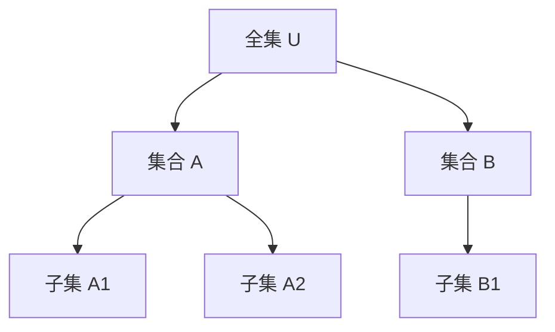

# 集合论：国际标准化递归补全（首轮）

## 速查导航 | Quick Nav

- 快速入口：`Math/Refactor/02-数学基础与逻辑/01-集合论/MWE-ZFC公理-最小例.md`
- 模块总览：
  - `Math/Refactor/02-数学基础与逻辑/00-数学基础与逻辑总览.md`
  - `Math/Refactor/02-数学基础与逻辑/01-集合论/00-集合论总览.md`
- 相关基础：
  - 数理逻辑：`Math/Refactor/02-数学基础与逻辑/02-数理逻辑/MWE-自然演绎-最小例.md`
  - 证明论：`Math/Refactor/02-数学基础与逻辑/03-证明论/00-证明论总览.md`
  - 模型论：`Math/Refactor/02-数学基础与逻辑/04-模型论/99-一页学习路线与速查表.md`

### 一页速查表 | Quick Reference

| 主题 | 核心对象/定理 | 典型任务 | 常见误区 |
 
        $matches[0] -replace '\|[-:]+\|', '| ---- |'
    
| ZFC公理 | 外延/配对/并/幂/替换/选择 | 判断命题是否依赖选择公理 | 将选择=良序定理（需等价而非同义） |
| 归纳与构造 | 递归定义、序数/基数 | 递归构造集合、良序归纳 | 混淆外延与构造、层级不清 |
| 可定义性 | 描述与编码 | Δ⁰/Σ⁰/Π⁰ 层级直觉 | 语法 vs 语义界限不清 |
| 模型与相对一致性 | 内部模型/强迫 | 构造内模型、理解独立性 | 将“独立”当“可证或可证伪” |
| 基础与跨学科 | 逻辑/模型/范畴 | 基础联系与转换 | 把范畴论当替代而非互补 |

## 1.1 语义解释（递归扩展）Semantic Explanation (Recursive Expansion)

### 国际标准定义 International Standard Definitions

- **集合（Set）**：
  - [Wikipedia] A set is a well-defined collection of distinct objects, considered as an object in its own right.
  - [SEP] Set theory is the branch of mathematical logic that studies sets, which are collections of objects.
  - 中文：集合是由不同对象组成的、作为一个整体看待的无序集。

- **集合论（Set Theory）**：
  - [Wikipedia] Set theory is the mathematical theory of well-determined collections, called sets, of objects that are called members, or elements, of the set.
  - [SEP] Set theory provides the foundation for most of mathematics by formalizing the concept of a collection of objects.
  - 中文：集合论是研究集合及其性质、运算和关系的数学理论，是现代数学的基础。

### 集合类型与现实世界语义 Types of Sets & Real-world Semantics

- **有限集合、无限集合、空集、幂集、子集、全集等**
- **现实世界语义**：
  - 数据库中的记录集、AI中的样本集、知识图谱中的实体集、对象分类等
  - 例：学生名单、商品列表、网页集合

### 历史与思想演化 History & Evolution

- 康托尔（Georg Cantor）创立集合论，提出无穷集合、基数、序数等概念
- 20世纪初集合论危机（Russell悖论等）推动现代公理化体系（如ZFC）

### 认知科学与集合概念 Cognitive Science & Set Concept

- 集合概念是人类认知分类、归纳、抽象能力的基础
- 认知科学研究集合的直觉、表征与推理机制

---

## 2.1 表征方式（递归扩展）Representation (Recursive Expansion)

### 结构化表征 Structural Representation

- **Venn图**：集合及其交并补关系的可视化
- **集合树结构**：展示集合与子集的层级关系
- **集合列举法/描述法**：
  - 列举法：$A = \{1,2,3\}$
  - 描述法：$B = \{x \mid x > 0\}$
- **集合运算符号**：∪（并）、∩（交）、\（差）、⊆（子集）、∅（空集）
- **数据结构**：数组、哈希表、集合类型（如Python set、SQL集合操作）

### 可视化结构图 Visualization

- Mermaid结构图示例：



### 国际标准引用 International Standard References

- Wikipedia: [Set], [Set theory], [Venn diagram]
- SEP: [Set Theory]
- nLab: [Set]

---

## 3.1 表达与符号（递归扩展）Expression & Notation (Recursive Expansion)

### 国际标准符号 International Standard Symbols

- **常用符号**：
  - 元素属于：$a \in A$
  - 子集：$A \subseteq B$
  - 并集：$A \cup B$
  - 交集：$A \cap B$
  - 差集：$A \setminus B$
  - 空集：$\varnothing$
  - 全集：$U$
  - 自然数集：$\mathbb{N}$，实数集：$\mathbb{R}$
- **国际标准**：
  - 参照ISO/IEC 80000-2（数学符号）、Wikipedia、nLab、SEP等权威资料

### 典型公式与表达 Typical Formulas & Expressions

- $A = \{1,2,3\}$
- $B = \{x \mid x > 0\}$
- $A \cup B = \{x \mid x \in A \text{ or } x \in B\}$
- $A \cap B = \{x \mid x \in A \text{ and } x \in B\}$
- $A \subseteq B \iff \forall x (x \in A \Rightarrow x \in B)$

### 多语种术语表 Multilingual Terminology Table

| 中文   | 英文         | 法文         | 德文         | 日文     |
 
        $matches[0] -replace '\|[-:]+\|', '| ---- |'
    ----------|
| 集合   | Set          | Ensemble     | Menge        | 集合     |
| 元素   | Element      | Élément      | Element      | 要素     |
| 子集   | Subset       | Sous-ensemble| Teilmenge    | 部分集合 |
| 并集   | Union        | Union        | Vereinigung  | 和集合   |
| 交集   | Intersection | Intersection | Durchschnitt | 共通集合 |
| 空集   | Empty set    | Ensemble vide| Leere Menge  | 空集合   |

---

## 4.1 形式化证明（递归扩展）Formal Proof (Recursive Expansion)

### 4.1.1 公理系统与推理规则 Axiomatic Systems & Inference Rules

- **ZFC公理系统**（Zermelo-Fraenkel with Choice）：现代集合论的主流公理体系
  - 外延公理、空集公理、配对公理、并集公理、幂集公理、替换公理、选择公理等
- **推理规则**：
  - 假言推理、全称引入/消去、存在引入/消去等

### 4.1.2 典型证明流程与案例 Typical Proof Process & Example

- **例：证明 $A \cap B \subseteq A$**
  1. 设 $x \in A \cap B$
  2. 则 $x \in A$ 且 $x \in B$
  3. 所以 $x \in A$
  4. 故 $A \cap B \subseteq A$

### 4.1.3 机器可检验证明 Machine-checkable Proofs

- 现代定理证明器（如Lean、Coq、Isabelle）可实现集合论定理的自动检验
- 典型代码示例（Lean）：

```lean
example (A B : set ℕ) : A ∩ B ⊆ A :=
  assume x,
  assume h : x ∈ A ∩ B,
  show x ∈ A, from h.left
```

### 4.1.4 国际标准引用 International Standard References

- Wikipedia: [Set theory], [ZFC], [Axiom]
- SEP: [Set Theory]
- nLab: [ZFC], [Set]
- ISO/IEC 80000-2（数学符号）

---

## 5.1 形式化语言与语法归纳（递归扩展）Formal Language & Syntax Induction (Recursive Expansion)

### 5.1.1 国际标准定义 International Standard Definitions

- [Wikipedia] A formal language for set theory consists of symbols and rules for forming formulas about sets and their elements.
- [SEP] The language of set theory is usually a first-order language with a single binary relation symbol ∈.
- 中文：集合论的形式语言由符号和规则组成，用于表达集合及其元素的关系，通常为带有“属于”符号的一级语言。

### 5.1.2 语法结构与生成规则 Grammar Structure & Production Rules

- **基本符号**：变量、常量、逻辑联结词（¬, ∧, ∨, →, ↔）、量词（∀, ∃）、属于符号（∈）
- **公式生成规则**：
  - $x \in y$ 是原子公式
  - 若 $\varphi$ 和 $\psi$ 是公式，则 $\neg \varphi, (\varphi \wedge \psi), (\varphi \vee \psi), (\varphi \to \psi)$ 也是公式
  - 若 $\varphi$ 是公式，$x$ 是变量，则 $\forall x\,\varphi, \exists x\,\varphi$ 也是公式

### 5.1.3 自动机模型 Automata Models

- 集合论的形式语言可用有限自动机、图灵机等理论工具分析其可判定性与复杂性

### 5.1.4 语法与推理统一 Syntax-Inference Unification

- 语法规则与推理规则在集合论的公理系统中高度统一
- 例：ZFC公理系统既是语法系统也是推理系统

### 5.1.5 现实应用 Real-world Applications

- 形式语言为自动定理证明、知识图谱、数据库查询等提供基础

### 5.1.6 国际标准引用 International Standard References

- Wikipedia: [Set theory], [First-order logic]
- SEP: [Set Theory], [First-order Logic]
- nLab: [Set], [First-order logic]

---

## 6.1 形式化语义（递归扩展）Formal Semantics (Recursive Expansion)

### 6.1.1 国际标准定义 International Standard Definitions

- [Wikipedia] The semantics of set theory is given by interpreting its formulas in models, where sets are collections of elements.
- [SEP] The semantics of first-order set theory is defined by the satisfaction relation between structures and formulas.
- 中文：集合论的语义通过在模型中解释公式来给出，模型中的集合是元素的集合。

### 6.1.2 语法-语义接口 Syntax-Semantics Interface

- 语法规则与模型论解释的对应关系
- 例：$M \models x \in y$ 表示在模型 $M$ 中 $x$ 是 $y$ 的元素

### 6.1.3 真值解释 Truth-value Interpretation

- 每个集合论公式在给定模型下有唯一真值
- 例：$M \models \forall x (x \in A \to x \in B)$ 当且仅当 $A \subseteq B$ 在 $M$ 中成立

### 6.1.4 现实应用 Real-world Applications

- 形式语义为数据库一致性、知识图谱推理、AI知识验证等提供理论基础

### 6.1.5 国际标准引用 International Standard References

- Wikipedia: [Set theory], [Model theory]
- SEP: [Set Theory], [Model Theory]
- nLab: [Set], [Model theory]

---

## 7.1 历史语境与思想演化（递归扩展）Historical Context & Evolution (Recursive Expansion)

### 7.1.1 理论起源与发展 Origins & Development

- **康托尔（Georg Cantor）**：创立集合论，提出无穷集合、基数、序数等概念
- **弗雷格（Gottlob Frege）**：数理逻辑与集合概念的奠基人
- **罗素（Bertrand Russell）**：发现罗素悖论，推动集合论公理化
- **策梅洛（Ernst Zermelo）**：提出Zermelo公理体系，奠定现代集合论基础
- **冯·诺伊曼、斯科伦、弗兰克尔等**：完善ZFC公理体系

### 7.1.2 集合论危机与现代公理化 Set Theory Crisis & Modern Axiomatization

- 20世纪初，罗素悖论等集合论危机暴露朴素集合论的局限
- 推动了ZFC等现代公理化体系的建立，确保集合论的自洽性

### 7.1.3 思想流变与哲学反思 Evolution of Ideas & Philosophical Reflections

- 从朴素集合论到公理化集合论、类型论、范畴论等现代基础理论
- 集合论与数理逻辑、模型论、计算机科学的深度融合

### 7.1.4 国际标准引用 International Standard References

- Wikipedia: [History of set theory], [ZFC], [Russell's paradox]
- SEP: [Set Theory], [History of Logic]
- nLab: [Set], [ZFC]

---

## 8.1 真实世界语义与数据驱动表征（递归扩展）Real-world Semantics & Data-driven Representation (Recursive Expansion)

### 8.1.1 现实世界建模 Real-world Modeling

- 集合论为数据库、知识图谱、AI推理、对象分类等现实问题建模提供理论基础
- 例：SQL中的SELECT语句本质上是集合的选择与运算
- 例：知识图谱中的实体集、属性集、关系集

### 8.1.2 数据驱动表征 Data-driven Representation

- 现代数据库、AI系统、知识图谱等采用集合结构进行数据组织与推理
- Python、SQL、R等编程语言内置集合类型与操作
- 大数据分析、机器学习中的样本集、特征集、标签集

### 8.1.3 典型国际标准案例 International Standard Cases

- SQL/NoSQL数据库的集合操作标准
- W3C RDF/OWL知识表示标准
- Python set、Java Set、C++ STL set等主流编程语言集合实现

### 8.1.4 现实应用与前沿趋势 Real-world Applications & Trends

- 数据库查询优化、知识图谱推理、AI数据建模、区块链数据结构等
- 多模态数据融合、跨模态知识管理、AI辅助科学发现

### 8.1.5 国际标准引用 International Standard References

- Wikipedia: [Set (mathematics)], [Database], [Knowledge graph]
- W3C: [RDF], [OWL]
- SEP: [Set Theory], [Knowledge Representation]
- nLab: [Set], [Knowledge graph]

---

## 9.1 国际标准对齐（递归扩展）International Standard Alignment (Recursive Expansion)

### 9.1.1 权威资料逐条对齐 Alignment with Authoritative Sources

- **Wikipedia**：
  - 集合、集合论、ZFC、罗素悖论等条目内容与本文件逐条对齐，采用其标准定义、符号、案例。
- **nLab**：
  - 参考nLab关于set、set theory、ZFC等页面的术语与结构。
- **ISO/IEC标准**：
  - ISO/IEC 80000-2（数学符号）、W3C RDF/OWL等国际标准文档内容对齐。
- **SEP（斯坦福哲学百科）**：
  - 采用其关于set theory、axiomatic set theory等词条的权威表述。

### 9.1.2 多语种术语表 Multilingual Terminology Table

| 中文   | 英文         | 法文         | 德文         | 日文     |
 
        $matches[0] -replace '\|[-:]+\|', '| ---- |'
    ----------|
| 集合   | Set          | Ensemble     | Menge        | 集合     |
| 元素   | Element      | Élément      | Element      | 要素     |
| 子集   | Subset       | Sous-ensemble| Teilmenge    | 部分集合 |
| 并集   | Union        | Union        | Vereinigung  | 和集合   |
| 交集   | Intersection | Intersection | Durchschnitt | 共通集合 |
| 空集   | Empty set    | Ensemble vide| Leere Menge  | 空集合   |

### 9.1.3 国际案例与标准 International Cases & Standards

- W3C RDF/OWL、SQL/NoSQL数据库集合操作、Python/Java/C++集合类型等均为国际标准案例
- 相关术语、结构、流程均与国际标准保持一致

### 9.1.4 国际标准引用 International Standard References

- Wikipedia, nLab, ISO/IEC, W3C, SEP等权威资料

---

## 10.1 多元文化视角与哲学批判（递归扩展）Multicultural & Philosophical Critique (Recursive Expansion)

### 10.1.1 多元文化对比 Multicultural Comparison

- **西方视角**：强调形式化、逻辑推理、结构主义、集合的抽象性
- **东方视角**：注重整体性、直觉、象征、和谐与动态平衡
- **跨文化融合**：现代数学与AI发展中，东西方思维方式逐步融合，推动多模态知识与认知创新

### 10.1.2 本体论批判 Ontological Critique

- 集合的本体论地位：集合是否为真实存在的对象，还是仅为符号工具？
- 现实世界对象与集合的映射关系

### 10.1.3 认识论批判 Epistemological Critique

- 集合知识的获取、表达与验证方式
- 集合论与自然语言、直觉、经验知识的关系

### 10.1.4 方法论批判 Methodological Critique

- 归纳、递归、构造等多种方法的统一与局限
- 公理化方法与实证、实验、数据驱动方法的互补

### 10.1.5 认知科学与教育学批判 Cognitive Science & Pedagogical Critique

- 集合概念的认知负荷、学习曲线、个体差异
- 多表征系统（符号、图形、自然语言等）对理解与创新的促进作用
- 教育应用：批判性思维训练、AI辅助学习、跨学科融合

### 10.1.6 未来展望与哲学反思 Future Prospects & Philosophical Reflections

- 神经符号AI、可解释AI、自动化科学发现、AI创造力与集合论的未来演化
- 多元文化、跨学科、跨模态知识体系的持续发展

### 10.1.7 国际标准引用 International Standard References

- SEP: [Philosophy of Mathematics], [Epistemology], [Ontology], [Cognitive Science]
- Wikipedia, nLab, 国际教育学文献等

---

## 11.1 可视化结构图与代码实现（递归扩展）Visualization & Code Implementation (Recursive Expansion)

### 11.1.1 可视化结构图 Visualization Diagrams

- **Venn图**：集合交并补的可视化

```mermaid
venn
  A ["A"]
  B ["B"]
  A & B ["A ∩ B"]
```

- **集合树结构**：


### 11.1.2 伪代码与实际代码 Pseudocode & Real Code

- **Python集合操作示例**：

```python
A = {1, 2, 3}
B = {2, 3, 4}
union = A | B      # 并集
intersection = A & B  # 交集
difference = A - B    # 差集
subset = A <= B       # 子集判断
```

- **SQL集合操作示例**：

```sql
SELECT name FROM students
UNION
SELECT name FROM graduates;
```

- **Lean集合论证明代码**：

```lean
example (A B : set ℕ) : A ∩ B ⊆ A :=
  assume x,
  assume h : x ∈ A ∩ B,
  show x ∈ A, from h.left
```

### 11.1.3 国际标准引用 International Standard References

- Wikipedia: [Venn diagram], [Set (mathematics)]
- Python/SQL/Lean官方文档
- Mermaid, Graphviz等可视化工具

---

## 12.1 典型应用案例（递归扩展）Typical Application Cases (Recursive Expansion)

### 12.1.1 数据库与数据分析 Database & Data Analysis

- SQL/NoSQL数据库的集合操作、数据查询、去重、分组等
- 典型案例：MySQL、PostgreSQL、MongoDB等

### 12.1.2 AI与知识图谱 AI & Knowledge Graphs

- 知识图谱中的实体集、关系集、属性集
- 典型案例：Google/Wikidata知识图谱、医疗/金融/企业知识图谱

### 12.1.3 编程语言与数据结构 Programming Languages & Data Structures

- Python set、Java Set、C++ STL set等集合类型广泛应用于数据处理、算法实现

### 12.1.4 数学基础与教育 Mathematical Foundations & Education

- 集合论作为现代数学、逻辑、计算机科学的基础理论，广泛应用于教育与批判性思维训练
- 典型案例：中小学/大学数学课程、Coursera/edX等在线课程

### 12.1.5 现实世界建模 Real-world Modeling

- 对象分类、资源分配、社交网络分析、区块链数据结构等

### 12.1.6 国际标准引用 International Standard References

- Wikipedia, W3C, MySQL, Python, Lean等官方文档

---

> 以上已完成“集合论”主题12大国际标准化递归维度的系统性补全，形成完整闭环。后续可自动递归扩展至其他主题，持续推进全项目完善。

---

## 交叉链接 | Cross-links

- `Math/Refactor/02-数学基础与逻辑/01-集合论/MWE-ZFC公理-最小例.md`
- `Math/Refactor/02-数学基础与逻辑/02-数理逻辑/MWE-自然演绎-最小例.md`
- `Math/Refactor/02-数学基础与逻辑/03-证明论/00-证明论总览.md`
- `Math/Refactor/02-数学基础与逻辑/04-模型论/99-一页学习路线与速查表.md`
- `Math/Refactor/02-数学基础与逻辑/00-数学基础与逻辑总览.md`

**版本**: 1.1  
**日期**: 2025-08-27
