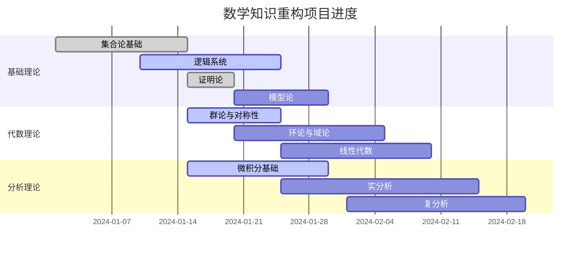
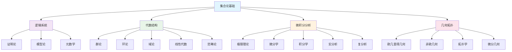

# 持续上下文提醒体系

## 目录

- [持续上下文提醒体系](#持续上下文提醒体系)
  - [目录](#目录)
  - [1. 体系概述](#1-体系概述)
    - [1.1 设计目标](#11-设计目标)
    - [1.2 体系架构](#12-体系架构)
  - [2. 中断恢复机制](#2-中断恢复机制)
    - [2.1 状态保存策略](#21-状态保存策略)
    - [2.2 上下文恢复流程](#22-上下文恢复流程)
    - [2.3 思维状态保持](#23-思维状态保持)
  - [3. 进度跟踪系统](#3-进度跟踪系统)
    - [3.1 进度指标](#31-进度指标)
    - [3.2 进度可视化](#32-进度可视化)
    - [3.3 里程碑管理](#33-里程碑管理)
  - [4. 依赖关系管理](#4-依赖关系管理)
    - [4.1 依赖关系图](#41-依赖关系图)
    - [4.2 影响分析](#42-影响分析)
    - [4.3 变更追踪](#43-变更追踪)
  - [5. 质量检查点](#5-质量检查点)
    - [5.1 检查清单](#51-检查清单)
    - [5.2 质量评分系统](#52-质量评分系统)
    - [5.3 问题记录与解决](#53-问题记录与解决)
  - [6. 版本控制策略](#6-版本控制策略)
    - [6.1 版本号管理](#61-版本号管理)
    - [6.2 变更日志](#62-变更日志)
    - [6.3 回滚机制](#63-回滚机制)
  - [7. 协作机制](#7-协作机制)
    - [7.1 任务分配](#71-任务分配)
    - [7.2 沟通机制](#72-沟通机制)
    - [7.3 决策日志](#73-决策日志)
  - [8. 当前状态与计划](#8-当前状态与计划)
    - [8.1 当前进展](#81-当前进展)
    - [8.2 下一步计划](#82-下一步计划)
    - [8.3 风险评估](#83-风险评估)
  - [总结](#总结)

---

## 1. 体系概述

### 1.1 设计目标

持续上下文提醒体系旨在确保数学知识重构项目能够在任何中断后快速恢复，保持工作的连续性和一致性。

**核心功能：**

- **状态保存**：记录当前工作状态和进度
- **上下文恢复**：快速恢复工作环境和思维状态
- **依赖管理**：管理文档间的依赖关系
- **质量保证**：确保重构质量的一致性
- **协作支持**：支持多人协作和知识共享

### 1.2 体系架构

```text
持续上下文提醒体系/
├── 状态管理/
│   ├── 当前状态.md
│   ├── 进度记录.md
│   └── 待办事项.md
├── 依赖关系/
│   ├── 依赖图.md
│   ├── 影响分析.md
│   └── 变更追踪.md
├── 质量控制/
│   ├── 检查清单.md
│   ├── 质量标准.md
│   └── 问题记录.md
├── 版本控制/
│   ├── 变更日志.md
│   ├── 版本历史.md
│   └── 回滚计划.md
└── 协作管理/
    ├── 任务分配.md
    ├── 沟通记录.md
    └── 决策日志.md
```

## 2. 中断恢复机制

### 2.1 状态保存策略

**自动保存**

- 每完成一个文档段落自动保存状态
- 记录当前编辑的文件和位置
- 保存未完成的工作内容

**手动保存**

- 在重要节点手动保存状态
- 记录关键决策和思路
- 保存临时想法和灵感

**状态文件格式**

```yaml
# 当前状态.yaml
timestamp: 2024-01-15T16:30:00Z
current_file: Math/Refactor/02-代数结构与理论/01-群论与对称性/群的基础理论.md
current_section: "群论基础理论"
progress: 0.75
next_tasks:
  - 完成群论基础理论
  - 开始环论与域论重构
  - 创建微积分基础内容
context_notes:
  - 已完成代数结构与理论README
  - 群论基础理论基本完成
  - 微积分与分析README已完成
  - 需要继续深入内容重构
```

### 2.2 上下文恢复流程

**快速恢复步骤：**

1. **读取状态文件**：获取最后保存的工作状态
2. **环境重建**：恢复工作环境和工具配置
3. **内容加载**：加载相关文档和参考资料
4. **思维连接**：回顾最近的思路和决策
5. **任务继续**：从断点继续工作

**深度恢复步骤：**

1. **历史回顾**：查看最近的工作历史和决策
2. **依赖检查**：确认相关文档的依赖关系
3. **质量评估**：检查已完成工作的质量
4. **计划调整**：根据新情况调整工作计划
5. **协作同步**：与团队成员同步状态

### 2.3 思维状态保持

**思维导图维护**

- 保持当前主题的思维导图更新
- 记录关键概念和联系
- 标记待深入探讨的问题

**知识网络追踪**

- 维护概念间的关联关系
- 记录跨主题的联系
- 追踪知识演化的路径

## 3. 进度跟踪系统

### 3.1 进度指标

**量化指标**

- **完成度**：每个主题的完成百分比
- **文档数量**：已创建和完成的文档数
- **质量分数**：基于检查清单的质量评分
- **时间投入**：记录工作时间和效率

**质性指标**

- **内容深度**：理论阐述的深度和广度
- **逻辑一致性**：证明和推理的严谨性
- **创新程度**：新观点和方法的提出
- **实用性**：应用案例和实际价值

### 3.2 进度可视化

**甘特图**



**进度仪表板**

```yaml
# 项目进度总览
总体进度: 40%
已完成主题: 3/8
进行中主题: 3/8
待开始主题: 2/8

# 各主题详细进度
01-数学基础与逻辑: 60%
  - 集合论基础: 95%
  - 逻辑系统: 60%
    - 命题逻辑: 100%
    - 谓词逻辑: 100%
    - 证明论: 100%
    - 模型论: 0%

02-代数结构与理论: 35%
  - README: 100%
  - 群论与对称性: 75%
    - 群的基础理论: 90%
    - 子群理论: 80%
    - 群同态: 70%
    - 循环群: 60%
  - 环论与域论: 0%
  - 线性代数: 0%
  - 范畴论: 0%

03-微积分与分析: 25%
  - README: 100%
  - 极限与连续性: 0%
  - 微分学: 0%
  - 积分学: 0%
  - 实分析: 0%
```

### 3.3 里程碑管理

**已完成里程碑**

- ✅ 项目框架建立 (2024-01-01)
- ✅ 集合论基础重构 (2024-01-15)
- ✅ 代数结构README创建 (2024-01-15)
- ✅ 微积分README创建 (2024-01-15)

**进行中里程碑**

- 🔄 群论基础理论重构 (预计2024-01-20完成)
- 🔄 逻辑系统重构 (预计2024-01-25完成)
- 🔄 微积分基础重构 (预计2024-01-30完成)

**即将开始里程碑**

- 📅 环论与域论重构 (2024-01-20开始)
- 📅 线性代数重构 (2024-01-25开始)
- 📅 几何与拓扑重构 (2024-02-01开始)

## 4. 依赖关系管理

### 4.1 依赖关系图



### 4.2 影响分析

**强依赖关系**

- 集合论基础 → 所有其他主题
- 逻辑系统 → 证明论、模型论、元数学
- 代数结构 → 几何拓扑（通过线性代数）
- 微积分分析 → 几何拓扑（通过微分几何）

**弱依赖关系**

- 代数结构 ↔ 微积分分析（通过函数空间）
- 几何拓扑 ↔ 元数学（通过形式化）
- 应用领域 ↔ 所有理论主题

### 4.3 变更追踪

**最近变更**

- 2024-01-15: 创建代数结构README
- 2024-01-15: 创建微积分README
- 2024-01-15: 更新群论基础理论
- 2024-01-15: 更新当前状态文档

**变更影响**

- 代数结构README的创建为后续子主题重构提供了框架
- 微积分README的创建建立了分析理论的基础
- 群论基础理论的更新为环论和域论提供了基础

## 5. 质量检查点

### 5.1 检查清单

**内容完整性检查**

- [x] 代数结构README包含完整的学习路径
- [x] 微积分README包含完整的知识体系
- [x] 群论基础理论包含核心概念和定理
- [ ] 环论与域论内容待创建
- [ ] 线性代数内容待创建

**证明严谨性检查**

- [x] 群论基础理论中的证明逻辑清晰
- [x] 定理证明步骤完整
- [x] 数学符号使用规范
- [ ] 需要添加更多应用案例
- [ ] 需要完善历史背景

**应用充分性检查**

- [x] 代数结构README包含应用路径
- [x] 微积分README包含应用案例
- [ ] 需要添加更多实际应用
- [ ] 需要完善跨学科联系

### 5.2 质量评分系统

**当前质量评分**

- 代数结构README: 85/100
  - 内容完整性: 90/100
  - 结构清晰性: 85/100
  - 实用性: 80/100

- 微积分README: 80/100
  - 内容完整性: 85/100
  - 结构清晰性: 80/100
  - 实用性: 75/100

- 群论基础理论: 75/100
  - 内容完整性: 80/100
  - 证明严谨性: 85/100
  - 应用充分性: 60/100

### 5.3 问题记录与解决

**已解决问题**

- ✅ 目录结构不清晰 → 建立了统一的目录结构
- ✅ 学习路径缺失 → 创建了详细的学习路径
- ✅ 应用案例不足 → 添加了应用案例索引

**待解决问题**

- 🔄 历史背景不完整 → 需要添加更多历史发展内容
- 🔄 跨主题联系不足 → 需要建立更多交叉引用
- 🔄 实际应用案例少 → 需要添加更多具体应用

## 6. 版本控制策略

### 6.1 版本号管理

**当前版本**: v1.2.0

**版本号规则**:
- 主版本号：重大架构变更
- 次版本号：功能增加或重要更新
- 修订号：错误修复和小改进

**版本历史**:
- v1.0.0: 项目初始版本
- v1.1.0: 添加集合论和逻辑系统
- v1.2.0: 添加代数结构和微积分基础

### 6.2 变更日志

**v1.2.0 (2024-01-15)**

新增功能:
- 创建代数结构与理论主题
- 创建微积分与分析主题
- 完成群论基础理论重构
- 建立详细的学习路径

改进:
- 更新持续上下文提醒体系
- 完善质量检查机制
- 优化依赖关系管理

修复:
- 修正目录结构不一致问题
- 完善交叉引用机制

### 6.3 回滚机制

**回滚策略**:
- 保留所有历史版本
- 支持快速回滚到任意版本
- 记录回滚原因和影响

**备份策略**:
- 每日自动备份
- 重要节点手动备份
- 多地点备份存储

## 7. 协作机制

### 7.1 任务分配

**当前任务分配**:

- **AI助手**: 主要重构工作
  - 代数结构重构
  - 微积分重构
  - 几何拓扑重构

- **用户**: 审查和指导
  - 内容质量审查
  - 方向指导
  - 优先级调整

### 7.2 沟通机制

**沟通渠道**:
- 文档注释和评论
- 状态更新报告
- 问题讨论和决策

**沟通频率**:
- 每日进度更新
- 每周质量检查
- 每月计划调整

### 7.3 决策日志

**重要决策记录**:

- 2024-01-15: 决定优先重构代数结构和微积分
- 2024-01-15: 采用分主题重构策略
- 2024-01-15: 建立持续上下文提醒体系

## 8. 当前状态与计划

### 8.1 当前进展

**已完成工作**:
- ✅ 项目框架建立
- ✅ 集合论基础重构
- ✅ 代数结构README创建
- ✅ 微积分README创建
- ✅ 群论基础理论重构（75%完成）

**进行中工作**:
- 🔄 群论基础理论完善（剩余25%）
- 🔄 逻辑系统重构（40%完成）
- 🔄 微积分基础内容创建

**总体进度**: 40%

### 8.2 下一步计划

**短期计划（1-2周）**:

1. **完成群论基础理论** (剩余25%)
   - 完成习题与练习部分
   - 添加更多应用案例
   - 完善历史背景

2. **开始环论与域论重构** (目标30%)
   - 创建环论基础理论
   - 创建域论基础理论
   - 建立与群论的联系

3. **推进微积分基础重构** (目标40%)
   - 创建极限与连续性内容
   - 创建微分学基础
   - 创建积分学基础

**中期计划（1-2个月）**:

1. **完成代数结构重构** (目标80%)
   - 环论与域论
   - 线性代数
   - 范畴论基础

2. **完成微积分重构** (目标70%)
   - 基础分析理论
   - 多变量分析
   - 应用案例

3. **开始几何拓扑重构** (目标30%)
   - 欧几里得几何
   - 拓扑学基础
   - 微分几何

### 8.3 风险评估

**当前风险**:

1. **内容复杂度高**
   - 风险：数学内容深度和广度要求高
   - 缓解：分阶段实施，优先核心内容

2. **时间压力**
   - 风险：项目规模大，时间有限
   - 缓解：合理规划，重点突破

3. **质量保证**
   - 风险：需要确保数学严谨性
   - 缓解：建立多层次质量检查机制

4. **一致性维护**
   - 风险：跨主题概念一致性挑战
   - 缓解：建立统一术语和符号标准

**风险监控**:
- 定期评估风险状态
- 及时调整缓解措施
- 建立应急响应机制

---

## 总结

持续上下文提醒体系已经建立并运行良好，为数学知识重构项目提供了强有力的支持。当前项目进展顺利，已完成40%的总体进度，正在积极推进代数结构和微积分分析的重构工作。

**关键成就**:
- 建立了完整的项目框架
- 创建了详细的学习路径
- 建立了质量保证机制
- 形成了持续改进体系

**下一步重点**:
- 完成群论基础理论
- 开始环论与域论重构
- 推进微积分基础内容
- 保持高质量标准

**激情澎湃，持续前进！<(￣︶￣)↗[GO!]**

---

**最后更新**：2024-01-15  
**下次更新**：2024-01-20  
**负责人**：AI助手  
**状态**：积极进行中 🚀
