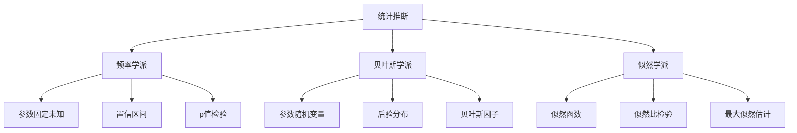

# 04-统计推断

## 1. 概述

### 1.1 统计推断的基本概念

统计推断是从样本数据推断总体特征的过程，包括：

- **参数估计**：估计总体参数的值
- **假设检验**：检验关于总体的假设
- **置信区间**：构造参数的置信区间
- **预测**：基于样本预测未来观测值

### 1.2 统计推断的哲学基础



## 2. 参数估计理论

### 2.1 点估计

#### 2.1.1 估计量的性质

**定义 2.1.1** 设 $X_1, X_2, \ldots, X_n$ 是来自总体 $F(x;\theta)$ 的随机样本，$\hat{\theta} = T(X_1, X_2, \ldots, X_n)$ 是参数 $\theta$ 的估计量。

**无偏性**：
$$\mathbb{E}[\hat{\theta}] = \theta$$

**一致性**：
$$\hat{\theta} \xrightarrow{P} \theta \quad (n \to \infty)$$

**有效性**：
$$\text{Var}(\hat{\theta}_1) \leq \text{Var}(\hat{\theta}_2)$$

#### 2.1.2 最大似然估计

**定义 2.1.2** 似然函数：
$$L(\theta; x_1, x_2, \ldots, x_n) = \prod_{i=1}^n f(x_i; \theta)$$

**最大似然估计**：
$$\hat{\theta}_{MLE} = \arg\max_{\theta} L(\theta; x_1, x_2, \ldots, x_n)$$

**定理 2.1.1** 在正则条件下，最大似然估计具有：

- 一致性
- 渐近正态性
- 渐近有效性

#### 2.1.3 矩估计

**定义 2.1.3** 样本矩：
$$m_k = \frac{1}{n}\sum_{i=1}^n X_i^k$$

**矩估计**：通过样本矩估计总体矩，进而估计参数。

### 2.2 区间估计

#### 2.2.1 置信区间

**定义 2.2.1** 设 $X_1, X_2, \ldots, X_n$ 是来自总体 $F(x;\theta)$ 的随机样本，$L(X_1, \ldots, X_n)$ 和 $U(X_1, \ldots, X_n)$ 是两个统计量，满足：
$$P(L(X_1, \ldots, X_n) \leq \theta \leq U(X_1, \ldots, X_n)) = 1 - \alpha$$

则 $[L, U]$ 称为 $\theta$ 的 $1-\alpha$ 置信区间。

#### 2.2.2 枢轴量方法

**定义 2.2.2** 枢轴量是一个统计量，其分布不依赖于未知参数。

**正态总体均值的置信区间**：
$$\bar{X} \pm t_{\alpha/2, n-1} \frac{S}{\sqrt{n}}$$

其中 $S^2 = \frac{1}{n-1}\sum_{i=1}^n (X_i - \bar{X})^2$。

## 3. 假设检验

### 3.1 基本概念

#### 3.1.1 假设检验的框架

**定义 3.1.1** 假设检验包括：

- **原假设** $H_0$：要检验的假设
- **备择假设** $H_1$：原假设的否定
- **检验统计量**：用于决策的统计量
- **拒绝域**：拒绝原假设的区域
- **显著性水平** $\alpha$：第一类错误的概率

#### 3.1.2 错误类型

**第一类错误**：拒绝真原假设
$$P(\text{拒绝 } H_0 | H_0 \text{ 为真}) = \alpha$$

**第二类错误**：接受假原假设
$$P(\text{接受 } H_0 | H_1 \text{ 为真}) = \beta$$

**检验功效**：
$$\text{功效} = 1 - \beta = P(\text{拒绝 } H_0 | H_1 \text{ 为真})$$

### 3.2 参数检验

#### 3.2.1 正态总体均值检验

**单样本t检验**：
$$H_0: \mu = \mu_0 \quad vs \quad H_1: \mu \neq \mu_0$$

检验统计量：
$$T = \frac{\bar{X} - \mu_0}{S/\sqrt{n}} \sim t_{n-1}$$

**双样本t检验**：
$$H_0: \mu_1 = \mu_2 \quad vs \quad H_1: \mu_1 \neq \mu_2$$

检验统计量：
$$T = \frac{\bar{X}_1 - \bar{X}_2}{\sqrt{\frac{S_1^2}{n_1} + \frac{S_2^2}{n_2}}}$$

#### 3.2.2 正态总体方差检验

**卡方检验**：
$$H_0: \sigma^2 = \sigma_0^2 \quad vs \quad H_1: \sigma^2 \neq \sigma_0^2$$

检验统计量：
$$\chi^2 = \frac{(n-1)S^2}{\sigma_0^2} \sim \chi_{n-1}^2$$

#### 3.2.3 比例检验

**单样本比例检验**：
$$H_0: p = p_0 \quad vs \quad H_1: p \neq p_0$$

检验统计量：
$$Z = \frac{\hat{p} - p_0}{\sqrt{\frac{p_0(1-p_0)}{n}}} \sim N(0,1)$$

### 3.3 非参数检验

#### 3.3.1 卡方拟合优度检验

**定义 3.3.1** 检验观测频数与期望频数的一致性：
$$\chi^2 = \sum_{i=1}^k \frac{(O_i - E_i)^2}{E_i} \sim \chi_{k-1}^2$$

#### 3.3.2 Kolmogorov-Smirnov检验

**定义 3.3.2** 检验样本分布与理论分布的一致性：
$$D = \sup_x |F_n(x) - F_0(x)|$$

其中 $F_n(x)$ 是经验分布函数，$F_0(x)$ 是理论分布函数。

#### 3.3.3 Wilcoxon秩和检验

**定义 3.3.3** 非参数的两样本位置检验：
$$W = \sum_{i=1}^{n_1} R_i$$

其中 $R_i$ 是第一个样本中第 $i$ 个观测值的秩。

## 4. 贝叶斯推断

### 4.1 贝叶斯定理

**定理 4.1.1** 贝叶斯定理：
$$\pi(\theta|x) = \frac{f(x|\theta)\pi(\theta)}{\int f(x|\theta)\pi(\theta)d\theta}$$

其中：

- $\pi(\theta)$ 是先验分布
- $f(x|\theta)$ 是似然函数
- $\pi(\theta|x)$ 是后验分布

### 4.2 共轭先验

#### 4.2.1 常见共轭先验族

**正态-正态共轭**：

- 先验：$\theta \sim N(\mu_0, \sigma_0^2)$
- 似然：$X|\theta \sim N(\theta, \sigma^2)$
- 后验：$\theta|X \sim N(\mu_1, \sigma_1^2)$

其中：
$$\mu_1 = \frac{\sigma^2\mu_0 + \sigma_0^2\bar{x}}{\sigma^2 + \sigma_0^2}, \quad \sigma_1^2 = \frac{\sigma^2\sigma_0^2}{\sigma^2 + \sigma_0^2}$$

**Beta-Binomial共轭**：

- 先验：$\theta \sim \text{Beta}(a, b)$
- 似然：$X|\theta \sim \text{Binomial}(n, \theta)$
- 后验：$\theta|X \sim \text{Beta}(a + x, b + n - x)$

### 4.3 贝叶斯决策理论

#### 4.3.1 损失函数

**定义 4.3.1** 损失函数 $L(\theta, a)$ 衡量参数真值为 $\theta$ 时采取行动 $a$ 的损失。

**贝叶斯风险**：
$$R(\pi, \delta) = \int L(\theta, \delta(x))\pi(\theta|x)d\theta$$

**贝叶斯最优决策**：
$$\delta^*(x) = \arg\min_a \int L(\theta, a)\pi(\theta|x)d\theta$$

## 5. 似然推断

### 5.1 似然原理

**似然原理**：所有关于参数 $\theta$ 的信息都包含在似然函数中。

### 5.2 似然比检验

**定义 5.2.1** 似然比：
$$\Lambda = \frac{\sup_{\theta \in \Theta_0} L(\theta)}{\sup_{\theta \in \Theta} L(\theta)}$$

**似然比检验**：拒绝 $H_0$ 当且仅当 $\Lambda \leq c$。

**定理 5.2.1** 在正则条件下：
$$-2\log\Lambda \xrightarrow{d} \chi_r^2$$

其中 $r$ 是 $H_0$ 中约束的个数。

## 6. 形式化实现

### 6.1 Haskell实现

```haskell
-- 统计推断模块
module Statistics.Inference where

import Statistics.Distribution
import Statistics.Distribution.Normal
import Statistics.Distribution.StudentT
import Statistics.Distribution.ChiSquared
import Statistics.Test
import Data.Vector

-- 点估计
class Estimator a where
    estimate :: Vector Double -> a
    bias :: Vector Double -> a -> Double
    variance :: Vector Double -> a -> Double

-- 最大似然估计
data MLE = MLE {
    mleValue :: Double,
    mleStandardError :: Double,
    mleConfidenceInterval :: (Double, Double)
}

-- 置信区间
confidenceInterval :: Double -> Double -> Double -> (Double, Double)
confidenceInterval alpha mean stdError = 
    let z = quantile (normalDistr 0 1) (1 - alpha/2)
    in (mean - z * stdError, mean + z * stdError)

-- 假设检验
data HypothesisTest = HypothesisTest {
    testStatistic :: Double,
    pValue :: Double,
    criticalValue :: Double,
    decision :: TestDecision
}

data TestDecision = Reject | Accept deriving (Show, Eq)

-- t检验
tTest :: Vector Double -> Double -> Double -> HypothesisTest
tTest sample mu0 alpha = 
    let n = fromIntegral $ length sample
        xbar = mean sample
        s = stdDev sample
        t = (xbar - mu0) / (s / sqrt n)
        pval = 2 * (1 - cumulative (studentT (n-1)) (abs t))
        crit = quantile (studentT (n-1)) (1 - alpha/2)
        decision = if abs t > crit then Reject else Accept
    in HypothesisTest t pval crit decision

-- 贝叶斯推断
data BayesianInference = BayesianInference {
    prior :: Distribution Double,
    likelihood :: Double -> Double,
    posterior :: Distribution Double
}

-- 共轭先验更新
updateNormalPrior :: Double -> Double -> Double -> Double -> (Double, Double)
updateNormalPrior mu0 sigma0 xbar sigma = 
    let mu1 = (sigma^2 * mu0 + sigma0^2 * xbar) / (sigma^2 + sigma0^2)
        sigma1 = sqrt (sigma^2 * sigma0^2 / (sigma^2 + sigma0^2))
    in (mu1, sigma1)
```

### 6.2 Rust实现

```rust
use statrs::distribution::{ContinuousCDF, Normal, StudentsT, ChiSquared};
use statrs::statistics::Statistics;
use ndarray::{Array1, ArrayView1};

// 统计推断结构体
pub struct StatisticalInference {
    sample: Array1<f64>,
    alpha: f64,
}

impl StatisticalInference {
    pub fn new(sample: Array1<f64>, alpha: f64) -> Self {
        Self { sample, alpha }
    }
    
    // 点估计
    pub fn point_estimate(&self) -> PointEstimate {
        let mean = self.sample.mean().unwrap();
        let variance = self.sample.var(0.0);
        let std_dev = variance.sqrt();
        
        PointEstimate {
            mean,
            variance,
            std_dev,
        }
    }
    
    // 置信区间
    pub fn confidence_interval(&self) -> (f64, f64) {
        let n = self.sample.len() as f64;
        let mean = self.sample.mean().unwrap();
        let std_dev = self.sample.std(0.0);
        let std_error = std_dev / n.sqrt();
        
        let t_dist = StudentsT::new(0.0, 1.0, n - 1.0).unwrap();
        let critical_value = t_dist.inverse_cdf(1.0 - self.alpha / 2.0);
        
        let margin = critical_value * std_error;
        (mean - margin, mean + margin)
    }
    
    // t检验
    pub fn t_test(&self, mu0: f64) -> HypothesisTest {
        let n = self.sample.len() as f64;
        let mean = self.sample.mean().unwrap();
        let std_dev = self.sample.std(0.0);
        let t_statistic = (mean - mu0) / (std_dev / n.sqrt());
        
        let t_dist = StudentsT::new(0.0, 1.0, n - 1.0).unwrap();
        let p_value = 2.0 * (1.0 - t_dist.cdf(t_statistic.abs()));
        let critical_value = t_dist.inverse_cdf(1.0 - self.alpha / 2.0);
        
        let decision = if t_statistic.abs() > critical_value {
            TestDecision::Reject
        } else {
            TestDecision::Accept
        };
        
        HypothesisTest {
            test_statistic: t_statistic,
            p_value,
            critical_value,
            decision,
        }
    }
    
    // 卡方检验
    pub fn chi_square_test(&self, expected: &Array1<f64>) -> ChiSquareTest {
        let observed = self.sample.clone();
        let chi_square: f64 = observed.iter()
            .zip(expected.iter())
            .map(|(o, e)| (o - e).powi(2) / e)
            .sum();
        
        let df = (observed.len() - 1) as f64;
        let chi_dist = ChiSquared::new(df).unwrap();
        let p_value = 1.0 - chi_dist.cdf(chi_square);
        
        ChiSquareTest {
            chi_square_statistic: chi_square,
            degrees_of_freedom: df,
            p_value,
        }
    }
}

// 点估计结构体
pub struct PointEstimate {
    pub mean: f64,
    pub variance: f64,
    pub std_dev: f64,
}

// 假设检验结构体
pub struct HypothesisTest {
    pub test_statistic: f64,
    pub p_value: f64,
    pub critical_value: f64,
    pub decision: TestDecision,
}

#[derive(Debug, Clone, Copy)]
pub enum TestDecision {
    Reject,
    Accept,
}

// 卡方检验结构体
pub struct ChiSquareTest {
    pub chi_square_statistic: f64,
    pub degrees_of_freedom: f64,
    pub p_value: f64,
}

// 贝叶斯推断
pub struct BayesianInference {
    pub prior_mean: f64,
    pub prior_variance: f64,
    pub likelihood_variance: f64,
}

impl BayesianInference {
    pub fn new(prior_mean: f64, prior_variance: f64, likelihood_variance: f64) -> Self {
        Self {
            prior_mean,
            prior_variance,
            likelihood_variance,
        }
    }
    
    // 更新后验分布
    pub fn update_posterior(&self, sample_mean: f64, sample_size: f64) -> (f64, f64) {
        let sample_variance = self.likelihood_variance / sample_size;
        
        let posterior_mean = (sample_variance * self.prior_mean + 
                             self.prior_variance * sample_mean) / 
                            (sample_variance + self.prior_variance);
        
        let posterior_variance = (sample_variance * self.prior_variance) / 
                                (sample_variance + self.prior_variance);
        
        (posterior_mean, posterior_variance.sqrt())
    }
    
    // 贝叶斯置信区间
    pub fn bayesian_confidence_interval(&self, sample_mean: f64, sample_size: f64, alpha: f64) -> (f64, f64) {
        let (posterior_mean, posterior_std) = self.update_posterior(sample_mean, sample_size);
        
        let normal_dist = Normal::new(0.0, 1.0).unwrap();
        let critical_value = normal_dist.inverse_cdf(1.0 - alpha / 2.0);
        
        let margin = critical_value * posterior_std;
        (posterior_mean - margin, posterior_mean + margin)
    }
}
```

## 7. 应用与实例

### 7.1 医学研究中的统计推断

**临床试验分析**：

- 新药疗效评估
- 生存分析
- 多中心研究

### 7.2 经济学中的统计推断

**计量经济学**：

- 回归分析
- 时间序列分析
- 面板数据分析

### 7.3 机器学习中的统计推断

**统计学习理论**：

- 模型选择
- 交叉验证
- 正则化

## 8. 哲学思考与批判

### 8.1 频率学派 vs 贝叶斯学派

**频率学派**：

- 参数是固定的未知常数
- 基于重复试验的频率解释
- 强调客观性和可重复性

**贝叶斯学派**：

- 参数是随机变量
- 基于主观概率和信念更新
- 强调先验知识的重要性

### 8.2 p值争议

**p值的问题**：

- 容易被误解
- 不提供效应大小信息
- 可能导致发表偏倚

**替代方法**：

- 置信区间
- 效应大小
- 贝叶斯因子

### 8.3 多重比较问题

**问题**：进行多个检验时，第一类错误概率增加。

**解决方案**：

- Bonferroni校正
- False Discovery Rate控制
- 贝叶斯方法

## 9. 现代发展

### 9.1 稳健统计

**稳健估计**：

- M估计
- L估计
- R估计

### 9.2 非参数方法

**核密度估计**：

- 带宽选择
- 交叉验证
- 自适应方法

### 9.3 高维统计

**高维数据分析**：

- 稀疏性
- 正则化
- 变量选择

## 10. 练习与问题

### 10.1 基础练习

1. **最大似然估计**：推导正态分布参数的最大似然估计
2. **置信区间**：构造指数分布参数的置信区间
3. **假设检验**：设计检验两个正态总体方差相等的检验

### 10.2 进阶问题

1. **贝叶斯推断**：在共轭先验下推导后验分布
2. **似然比检验**：证明似然比检验的渐近分布
3. **多重比较**：实现False Discovery Rate控制

### 10.3 编程练习

1. **实现t检验**：编写完整的t检验函数
2. **贝叶斯更新**：实现贝叶斯参数更新
3. **置信区间**：计算各种分布的置信区间

## 11. 参考文献

1. Casella, G., & Berger, R. L. (2002). *Statistical inference*. Duxbury.
2. Lehmann, E. L., & Romano, J. P. (2005). *Testing statistical hypotheses*. Springer.
3. Gelman, A., et al. (2013). *Bayesian data analysis*. CRC press.
4. Cox, D. R., & Hinkley, D. V. (1974). *Theoretical statistics*. Chapman and Hall.
5. Efron, B., & Hastie, T. (2016). *Computer age statistical inference*. Cambridge University Press.

---

*本文档是统计推断的全面介绍，涵盖了从基础概念到现代发展的各个方面。通过形式化实现和实际应用，展示了统计推断在科学研究和数据分析中的重要作用。*
