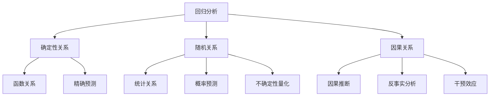

# 05-回归分析与建模

## 1. 概述

### 1.1 回归分析的基本概念

回归分析是研究变量间依赖关系的统计方法，包括：

- **线性回归**：响应变量与预测变量的线性关系
- **非线性回归**：复杂的非线性关系
- **广义线性模型**：指数族分布的推广
- **非参数回归**：不假设具体函数形式

### 1.2 回归分析的哲学基础



## 2. 线性回归模型

### 2.1 简单线性回归

#### 2.1.1 模型设定

**定义 2.1.1** 简单线性回归模型：
$$Y_i = \beta_0 + \beta_1 X_i + \epsilon_i, \quad i = 1, 2, \ldots, n$$

其中：

- $Y_i$ 是响应变量
- $X_i$ 是预测变量
- $\beta_0, \beta_1$ 是回归参数
- $\epsilon_i \sim N(0, \sigma^2)$ 是随机误差

#### 2.1.2 最小二乘估计

**定义 2.1.2** 最小二乘估计：
$$(\hat{\beta}_0, \hat{\beta}_1) = \arg\min_{\beta_0, \beta_1} \sum_{i=1}^n (Y_i - \beta_0 - \beta_1 X_i)^2$$

**定理 2.1.1** 最小二乘估计的解析解：
$$\hat{\beta}_1 = \frac{\sum_{i=1}^n (X_i - \bar{X})(Y_i - \bar{Y})}{\sum_{i=1}^n (X_i - \bar{X})^2}$$
$$\hat{\beta}_0 = \bar{Y} - \hat{\beta}_1 \bar{X}$$

#### 2.1.3 估计量的性质

**定理 2.1.2** 在经典假设下，最小二乘估计具有：

- 无偏性：$\mathbb{E}[\hat{\beta}_0] = \beta_0, \mathbb{E}[\hat{\beta}_1] = \beta_1$
- 最小方差性：在无偏估计中方差最小
- 正态性：$\hat{\beta}_0 \sim N(\beta_0, \sigma^2(\frac{1}{n} + \frac{\bar{X}^2}{S_{XX}}))$

### 2.2 多元线性回归

#### 2.2.1 模型设定

**定义 2.2.1** 多元线性回归模型：
$$\mathbf{Y} = \mathbf{X}\boldsymbol{\beta} + \boldsymbol{\epsilon}$$

其中：

- $\mathbf{Y} = (Y_1, Y_2, \ldots, Y_n)^T$ 是响应向量
- $\mathbf{X}$ 是 $n \times (p+1)$ 的设计矩阵
- $\boldsymbol{\beta} = (\beta_0, \beta_1, \ldots, \beta_p)^T$ 是参数向量
- $\boldsymbol{\epsilon} \sim N(\mathbf{0}, \sigma^2\mathbf{I})$ 是误差向量

#### 2.2.2 最小二乘估计

**定义 2.2.2** 多元最小二乘估计：
$$\hat{\boldsymbol{\beta}} = \arg\min_{\boldsymbol{\beta}} \|\mathbf{Y} - \mathbf{X}\boldsymbol{\beta}\|^2$$

**定理 2.2.1** 当 $\mathbf{X}^T\mathbf{X}$ 可逆时：
$$\hat{\boldsymbol{\beta}} = (\mathbf{X}^T\mathbf{X})^{-1}\mathbf{X}^T\mathbf{Y}$$

#### 2.2.3 方差分析

**定义 2.2.3** 总平方和分解：
$$\text{SST} = \text{SSR} + \text{SSE}$$

其中：

- $\text{SST} = \sum_{i=1}^n (Y_i - \bar{Y})^2$ 是总平方和
- $\text{SSR} = \sum_{i=1}^n (\hat{Y}_i - \bar{Y})^2$ 是回归平方和
- $\text{SSE} = \sum_{i=1}^n (Y_i - \hat{Y}_i)^2$ 是残差平方和

**决定系数**：
$$R^2 = \frac{\text{SSR}}{\text{SST}} = 1 - \frac{\text{SSE}}{\text{SST}}$$

## 3. 模型诊断与检验

### 3.1 残差分析

#### 3.1.1 残差定义

**定义 3.1.1** 残差：
$$e_i = Y_i - \hat{Y}_i = Y_i - \mathbf{x}_i^T\hat{\boldsymbol{\beta}}$$

**标准化残差**：
$$r_i = \frac{e_i}{\hat{\sigma}\sqrt{1 - h_{ii}}}$$

其中 $h_{ii}$ 是帽子矩阵 $\mathbf{H} = \mathbf{X}(\mathbf{X}^T\mathbf{X})^{-1}\mathbf{X}^T$ 的第 $i$ 个对角元素。

#### 3.1.2 残差图分析

**正态性检验**：

- Q-Q图
- Shapiro-Wilk检验
- Kolmogorov-Smirnov检验

**同方差性检验**：

- 残差 vs 拟合值图
- Breusch-Pagan检验
- White检验

**独立性检验**：

- Durbin-Watson检验
- Ljung-Box检验

### 3.2 影响分析

#### 3.2.1 杠杆值

**定义 3.2.1** 杠杆值：
$$h_{ii} = \mathbf{x}_i^T(\mathbf{X}^T\mathbf{X})^{-1}\mathbf{x}_i$$

**判断标准**：$h_{ii} > 2(p+1)/n$ 表示高杠杆值。

#### 3.2.2 Cook距离

**定义 3.2.2** Cook距离：
$$D_i = \frac{(\hat{\boldsymbol{\beta}} - \hat{\boldsymbol{\beta}}_{(i)})^T\mathbf{X}^T\mathbf{X}(\hat{\boldsymbol{\beta}} - \hat{\boldsymbol{\beta}}_{(i)})}{(p+1)\hat{\sigma}^2}$$

**判断标准**：$D_i > 1$ 表示强影响点。

#### 3.2.3 DFFITS

**定义 3.2.3** DFFITS：
$$\text{DFFITS}_i = \frac{\hat{Y}_i - \hat{Y}_{(i)}}{s_{(i)}\sqrt{h_{ii}}}$$

**判断标准**：$|\text{DFFITS}_i| > 2\sqrt{(p+1)/n}$ 表示强影响点。

### 3.3 假设检验

#### 3.3.1 回归系数检验

**t检验**：
$$H_0: \beta_j = 0 \quad vs \quad H_1: \beta_j \neq 0$$

检验统计量：
$$t_j = \frac{\hat{\beta}_j}{\text{SE}(\hat{\beta}_j)} \sim t_{n-p-1}$$

#### 3.3.2 整体显著性检验

**F检验**：
$$H_0: \beta_1 = \beta_2 = \cdots = \beta_p = 0 \quad vs \quad H_1: \text{至少有一个} \beta_j \neq 0$$

检验统计量：
$$F = \frac{\text{SSR}/p}{\text{SSE}/(n-p-1)} \sim F_{p, n-p-1}$$

## 4. 广义线性模型

### 4.1 指数族分布

#### 4.1.1 指数族定义

**定义 4.1.1** 指数族分布的概率密度函数：
$$f(y; \theta, \phi) = \exp\left\{\frac{y\theta - b(\theta)}{a(\phi)} + c(y, \phi)\right\}$$

其中：

- $\theta$ 是自然参数
- $\phi$ 是尺度参数
- $a(\cdot), b(\cdot), c(\cdot)$ 是已知函数

#### 4.1.2 常见指数族分布

**正态分布**：
$$\theta = \mu, \quad \phi = \sigma^2, \quad b(\theta) = \frac{\theta^2}{2}$$

**泊松分布**：
$$\theta = \log\lambda, \quad \phi = 1, \quad b(\theta) = e^\theta$$

**二项分布**：
$$\theta = \log\frac{p}{1-p}, \quad \phi = 1, \quad b(\theta) = \log(1 + e^\theta)$$

### 4.2 GLM结构

#### 4.2.1 模型组成

**定义 4.2.1** 广义线性模型包含三个组成部分：

1. **随机成分**：$Y_i \sim f(y_i; \theta_i, \phi)$
2. **系统成分**：$\eta_i = \mathbf{x}_i^T\boldsymbol{\beta}$
3. **连接函数**：$g(\mu_i) = \eta_i$

其中 $\mu_i = \mathbb{E}[Y_i] = b'(\theta_i)$。

#### 4.2.2 常见连接函数

**恒等连接**：$g(\mu) = \mu$（正态分布）
**对数连接**：$g(\mu) = \log\mu$（泊松分布）
**Logit连接**：$g(\mu) = \log\frac{\mu}{1-\mu}$（二项分布）

### 4.3 参数估计

#### 4.3.1 最大似然估计

**定义 4.3.1** 对数似然函数：
$$\ell(\boldsymbol{\beta}) = \sum_{i=1}^n \frac{Y_i\theta_i - b(\theta_i)}{a(\phi)} + c(Y_i, \phi)$$

**得分方程**：
$$\frac{\partial\ell}{\partial\beta_j} = \sum_{i=1}^n \frac{Y_i - \mu_i}{a(\phi)} \frac{\partial\mu_i}{\partial\beta_j} = 0$$

#### 4.3.2 迭代加权最小二乘

**算法 4.3.1** IWLS算法：

1. 初始化：$\hat{\boldsymbol{\beta}}^{(0)}$
2. 计算工作变量：$z_i^{(k)} = \eta_i^{(k)} + (Y_i - \mu_i^{(k)})g'(\mu_i^{(k)})$
3. 计算权重：$w_i^{(k)} = \frac{1}{a(\phi)g'(\mu_i^{(k)})^2V(\mu_i^{(k)})}$
4. 加权最小二乘：$\hat{\boldsymbol{\beta}}^{(k+1)} = (\mathbf{X}^T\mathbf{W}^{(k)}\mathbf{X})^{-1}\mathbf{X}^T\mathbf{W}^{(k)}\mathbf{z}^{(k)}$
5. 重复步骤2-4直到收敛

## 5. 模型选择

### 5.1 信息准则

#### 5.1.1 AIC准则

**定义 5.1.1** Akaike信息准则：
$$\text{AIC} = -2\ell(\hat{\boldsymbol{\beta}}) + 2(p+1)$$

**选择原则**：选择AIC最小的模型。

#### 5.1.2 BIC准则

**定义 5.1.2** 贝叶斯信息准则：
$$\text{BIC} = -2\ell(\hat{\boldsymbol{\beta}}) + (p+1)\log n$$

**选择原则**：选择BIC最小的模型。

### 5.2 逐步回归

#### 5.2.1 前向选择

**算法 5.2.1** 前向选择：

1. 从空模型开始
2. 在每一步，添加使AIC减少最多的变量
3. 当没有变量能显著改善模型时停止

#### 5.2.2 后向消除

**算法 5.2.2** 后向消除：

1. 从全模型开始
2. 在每一步，删除使AIC增加最少的变量
3. 当删除任何变量都会显著恶化模型时停止

### 5.3 正则化方法

#### 5.3.1 岭回归

**定义 5.3.1** 岭回归估计：
$$\hat{\boldsymbol{\beta}}_{\text{ridge}} = \arg\min_{\boldsymbol{\beta}} \|\mathbf{Y} - \mathbf{X}\boldsymbol{\beta}\|^2 + \lambda\|\boldsymbol{\beta}\|^2$$

**解析解**：
$$\hat{\boldsymbol{\beta}}_{\text{ridge}} = (\mathbf{X}^T\mathbf{X} + \lambda\mathbf{I})^{-1}\mathbf{X}^T\mathbf{Y}$$

#### 5.3.2 Lasso回归

**定义 5.3.2** Lasso估计：
$$\hat{\boldsymbol{\beta}}_{\text{lasso}} = \arg\min_{\boldsymbol{\beta}} \|\mathbf{Y} - \mathbf{X}\boldsymbol{\beta}\|^2 + \lambda\|\boldsymbol{\beta}\|_1$$

**特点**：产生稀疏解，自动进行变量选择。

## 6. 形式化实现

### 6.1 Haskell实现

```haskell
-- 回归分析模块
module Statistics.Regression where

import Linear
import Statistics.Distribution
import Statistics.Distribution.Normal
import Statistics.Distribution.StudentT
import Statistics.Distribution.F
import Data.Vector
import Numeric.LinearAlgebra

-- 线性回归模型
data LinearRegression = LinearRegression {
    coefficients :: Vector Double,
    fittedValues :: Vector Double,
    residuals :: Vector Double,
    rSquared :: Double,
    adjustedRSquared :: Double,
    standardError :: Double
}

-- 设计矩阵
designMatrix :: Vector Double -> Matrix Double
designMatrix x = (n >< 2) $ concat $ zipWith (\xi _ -> [1, xi]) (toList x) [1..n]
    where n = length x

-- 简单线性回归
simpleLinearRegression :: Vector Double -> Vector Double -> LinearRegression
simpleLinearRegression x y = 
    let n = fromIntegral $ length x
        xbar = mean x
        ybar = mean y
        sxx = sum $ map (\xi -> (xi - xbar)^2) $ toList x
        sxy = sum $ zipWith (\xi yi -> (xi - xbar) * (yi - ybar)) (toList x) (toList y)
        beta1 = sxy / sxx
        beta0 = ybar - beta1 * xbar
        coefficients = fromList [beta0, beta1]
        fitted = fromList $ map (\xi -> beta0 + beta1 * xi) $ toList x
        residuals = y - fitted
        sse = sum $ map (^2) $ toList residuals
        sst = sum $ map (\yi -> (yi - ybar)^2) $ toList y
        r2 = 1 - sse / sst
        adjR2 = 1 - (1 - r2) * (n - 1) / (n - 2)
        se = sqrt (sse / (n - 2))
    in LinearRegression coefficients fitted residuals r2 adjR2 se

-- 多元线性回归
multipleLinearRegression :: Matrix Double -> Vector Double -> LinearRegression
multipleLinearRegression x y = 
    let n = fromIntegral $ rows x
        p = fromIntegral $ cols x
        beta = inv (trans x <> x) <> trans x <> y
        fitted = x <> beta
        residuals = y - fitted
        sse = sumElements (residuals * residuals)
        ybar = mean y
        sst = sumElements ((y - scalar ybar) * (y - scalar ybar))
        r2 = 1 - sse / sst
        adjR2 = 1 - (1 - r2) * (n - 1) / (n - p)
        se = sqrt (sse / (n - p))
    in LinearRegression (toVector beta) (toVector fitted) (toVector residuals) r2 adjR2 se

-- 模型诊断
data ModelDiagnostics = ModelDiagnostics {
    leverage :: Vector Double,
    cookDistance :: Vector Double,
    dffits :: Vector Double,
    standardizedResiduals :: Vector Double
}

-- 计算杠杆值
leverageValues :: Matrix Double -> Vector Double
leverageValues x = 
    let h = x <> inv (trans x <> x) <> trans x
    in toVector $ takeDiag h

-- 计算Cook距离
cookDistance :: LinearRegression -> Vector Double -> Vector Double
cookDistance model leverage = 
    let n = length $ residuals model
        p = length $ coefficients model
        mse = (standardError model)^2
        stdRes = standardizedResiduals model
    in fromList $ zipWith (\hi ri -> ri^2 * hi / ((1 - hi)^2 * fromIntegral p)) 
                         (toList leverage) (toList stdRes)

-- 广义线性模型
class GLM a where
    link :: a -> Double -> Double
    invLink :: a -> Double -> Double
    variance :: a -> Double -> Double
    deviance :: a -> Vector Double -> Vector Double -> Double

-- 正态GLM
data NormalGLM = NormalGLM

instance GLM NormalGLM where
    link _ = id
    invLink _ = id
    variance _ _ = 1
    deviance _ y mu = sumElements ((y - mu) * (y - mu))

-- 泊松GLM
data PoissonGLM = PoissonGLM

instance GLM PoissonGLM where
    link _ = log
    invLink _ = exp
    variance _ mu = mu
    deviance _ y mu = 2 * sumElements (y * log (y / mu) - (y - mu))

-- 二项GLM
data BinomialGLM = BinomialGLM

instance GLM BinomialGLM where
    link _ p = log (p / (1 - p))
    invLink _ eta = 1 / (1 + exp (-eta))
    variance _ p = p * (1 - p)
    deviance _ y p = 2 * sumElements (y * log (y / p) + (1 - y) * log ((1 - y) / (1 - p)))

-- IWLS算法
iwls :: GLM a => a -> Matrix Double -> Vector Double -> Vector Double
iwls glm x y = 
    let n = rows x
        p = cols x
        -- 初始化
        beta0 = replicate p 0.0
        eta0 = x <> fromVector beta0
        mu0 = fromVector $ map (invLink glm) $ toList eta0
        
        -- 迭代
        (beta, _, _) = iterateUntil converged step (beta0, eta0, mu0)
    in fromVector beta
    where
        converged (beta1, _, _) (beta2, _, _) = 
            sumElements ((beta1 - beta2) * (beta1 - beta2)) < 1e-6
        
        step (beta, eta, mu) = 
            let z = eta + fromVector (zipWith (\yi mui -> (yi - mui) / variance glm mui) 
                                             (toList y) (toList mu))
                w = fromVector $ map (\mui -> 1 / variance glm mui) $ toList mu
                betaNew = inv (trans x <> diag w <> x) <> trans x <> diag w <> z
                etaNew = x <> betaNew
                muNew = fromVector $ map (invLink glm) $ toList etaNew
            in (toVector betaNew, etaNew, muNew)
```

### 6.2 Rust实现

```rust
use ndarray::{Array1, Array2, ArrayView1, ArrayView2};
use statrs::distribution::{ContinuousCDF, Normal, StudentsT, F};
use statrs::statistics::Statistics;

// 线性回归结构体
pub struct LinearRegression {
    pub coefficients: Array1<f64>,
    pub fitted_values: Array1<f64>,
    pub residuals: Array1<f64>,
    pub r_squared: f64,
    pub adjusted_r_squared: f64,
    pub standard_error: f64,
    pub n: usize,
    pub p: usize,
}

impl LinearRegression {
    pub fn new(x: &Array2<f64>, y: &Array1<f64>) -> Self {
        let n = x.nrows();
        let p = x.ncols();
        
        // 最小二乘估计
        let xt = x.t();
        let xtx = xt.dot(x);
        let xty = xt.dot(y);
        let coefficients = xtx.solve(&xty).unwrap();
        
        // 拟合值和残差
        let fitted_values = x.dot(&coefficients);
        let residuals = y - &fitted_values;
        
        // 模型评估
        let y_mean = y.mean().unwrap();
        let sse: f64 = residuals.iter().map(|r| r.powi(2)).sum();
        let sst: f64 = y.iter().map(|yi| (yi - y_mean).powi(2)).sum();
        let r_squared = 1.0 - sse / sst;
        let adjusted_r_squared = 1.0 - (1.0 - r_squared) * (n as f64 - 1.0) / (n as f64 - p as f64);
        let standard_error = (sse / (n as f64 - p as f64)).sqrt();
        
        Self {
            coefficients,
            fitted_values,
            residuals,
            r_squared,
            adjusted_r_squared,
            standard_error,
            n,
            p,
        }
    }
    
    // 预测
    pub fn predict(&self, x_new: &Array2<f64>) -> Array1<f64> {
        x_new.dot(&self.coefficients)
    }
    
    // 置信区间
    pub fn confidence_interval(&self, x_new: &Array2<f64>, alpha: f64) -> (Array1<f64>, Array1<f64>) {
        let t_dist = StudentsT::new(0.0, 1.0, (self.n - self.p) as f64).unwrap();
        let critical_value = t_dist.inverse_cdf(1.0 - alpha / 2.0);
        
        let prediction = self.predict(x_new);
        let margin = critical_value * self.standard_error;
        
        (prediction - margin, prediction + margin)
    }
    
    // 系数显著性检验
    pub fn coefficient_tests(&self, x: &Array2<f64>) -> Vec<f64> {
        let xt = x.t();
        let xtx = xt.dot(x);
        let xtx_inv = xtx.inv().unwrap();
        
        let se_coeff: Vec<f64> = (0..self.p)
            .map(|i| (self.standard_error.powi(2) * xtx_inv[[i, i]]).sqrt())
            .collect();
        
        self.coefficients.iter()
            .zip(se_coeff.iter())
            .map(|(coeff, se)| coeff / se)
            .collect()
    }
    
    // 整体显著性检验
    pub fn f_test(&self, y: &Array1<f64>) -> f64 {
        let y_mean = y.mean().unwrap();
        let sse: f64 = self.residuals.iter().map(|r| r.powi(2)).sum();
        let sst: f64 = y.iter().map(|yi| (yi - y_mean).powi(2)).sum();
        let ssr = sst - sse;
        
        let msr = ssr / (self.p as f64 - 1.0);
        let mse = sse / (self.n as f64 - self.p as f64);
        
        msr / mse
    }
}

// 模型诊断
pub struct ModelDiagnostics {
    pub leverage: Array1<f64>,
    pub cook_distance: Array1<f64>,
    pub dffits: Array1<f64>,
    pub standardized_residuals: Array1<f64>,
}

impl ModelDiagnostics {
    pub fn new(model: &LinearRegression, x: &Array2<f64>) -> Self {
        let n = model.n;
        let p = model.p;
        
        // 计算帽子矩阵
        let xt = x.t();
        let xtx = xt.dot(x);
        let xtx_inv = xtx.inv().unwrap();
        let h = x.dot(&xtx_inv).dot(&xt);
        
        // 杠杆值
        let leverage: Array1<f64> = (0..n)
            .map(|i| h[[i, i]])
            .collect();
        
        // 标准化残差
        let standardized_residuals: Array1<f64> = model.residuals.iter()
            .zip(leverage.iter())
            .map(|(ri, hi)| ri / (model.standard_error * (1.0 - hi).sqrt()))
            .collect();
        
        // Cook距离
        let cook_distance: Array1<f64> = standardized_residuals.iter()
            .zip(leverage.iter())
            .map(|(ri, hi)| ri.powi(2) * hi / ((1.0 - hi).powi(2) * p as f64))
            .collect();
        
        // DFFITS
        let dffits: Array1<f64> = standardized_residuals.iter()
            .zip(leverage.iter())
            .map(|(ri, hi)| ri * (hi / (1.0 - hi)).sqrt())
            .collect();
        
        Self {
            leverage,
            cook_distance,
            dffits,
            standardized_residuals,
        }
    }
    
    // 识别异常值
    pub fn identify_outliers(&self, threshold: f64) -> Vec<usize> {
        self.standardized_residuals.iter()
            .enumerate()
            .filter(|(_, &r)| r.abs() > threshold)
            .map(|(i, _)| i)
            .collect()
    }
    
    // 识别高杠杆值点
    pub fn identify_high_leverage(&self) -> Vec<usize> {
        let threshold = 2.0 * (self.leverage.len() as f64) / self.leverage.len() as f64;
        self.leverage.iter()
            .enumerate()
            .filter(|(_, &h)| h > threshold)
            .map(|(i, _)| i)
            .collect()
    }
}

// 广义线性模型
pub trait GLM {
    fn link(&self, mu: f64) -> f64;
    fn inv_link(&self, eta: f64) -> f64;
    fn variance(&self, mu: f64) -> f64;
    fn deviance(&self, y: &Array1<f64>, mu: &Array1<f64>) -> f64;
}

// 正态GLM
pub struct NormalGLM;

impl GLM for NormalGLM {
    fn link(&self, mu: f64) -> f64 { mu }
    fn inv_link(&self, eta: f64) -> f64 { eta }
    fn variance(&self, _mu: f64) -> f64 { 1.0 }
    fn deviance(&self, y: &Array1<f64>, mu: &Array1<f64>) -> f64 {
        y.iter().zip(mu.iter())
            .map(|(yi, mui)| (yi - mui).powi(2))
            .sum()
    }
}

// 泊松GLM
pub struct PoissonGLM;

impl GLM for PoissonGLM {
    fn link(&self, mu: f64) -> f64 { mu.ln() }
    fn inv_link(&self, eta: f64) -> f64 { eta.exp() }
    fn variance(&self, mu: f64) -> f64 { mu }
    fn deviance(&self, y: &Array1<f64>, mu: &Array1<f64>) -> f64 {
        2.0 * y.iter().zip(mu.iter())
            .map(|(yi, mui)| if *yi > 0.0 { yi * (yi / mui).ln() - (yi - mui) } else { mui })
            .sum::<f64>()
    }
}

// 二项GLM
pub struct BinomialGLM;

impl GLM for BinomialGLM {
    fn link(&self, mu: f64) -> f64 { (mu / (1.0 - mu)).ln() }
    fn inv_link(&self, eta: f64) -> f64 { 1.0 / (1.0 + (-eta).exp()) }
    fn variance(&self, mu: f64) -> f64 { mu * (1.0 - mu) }
    fn deviance(&self, y: &Array1<f64>, mu: &Array1<f64>) -> f64 {
        2.0 * y.iter().zip(mu.iter())
            .map(|(yi, mui)| {
                if *yi > 0.0 && *yi < 1.0 {
                    yi * (yi / mui).ln() + (1.0 - yi) * ((1.0 - yi) / (1.0 - mui)).ln()
                } else if *yi == 0.0 {
                    (1.0 - mui).ln()
                } else {
                    mui.ln()
                }
            })
            .sum::<f64>()
    }
}

// IWLS算法
pub fn fit_glm<T: GLM>(glm: T, x: &Array2<f64>, y: &Array1<f64>, max_iter: usize, tol: f64) -> Array1<f64> {
    let n = x.nrows();
    let p = x.ncols();
    
    // 初始化
    let mut beta = Array1::zeros(p);
    let mut eta = x.dot(&beta);
    let mut mu: Array1<f64> = eta.iter().map(|&ei| glm.inv_link(ei)).collect();
    
    for _ in 0..max_iter {
        let beta_old = beta.clone();
        
        // 工作变量
        let z: Array1<f64> = eta.iter()
            .zip(y.iter().zip(mu.iter()))
            .map(|(&ei, (&yi, &mui))| ei + (yi - mui) / glm.variance(mui))
            .collect();
        
        // 权重
        let w: Array1<f64> = mu.iter()
            .map(|&mui| 1.0 / glm.variance(mui))
            .collect();
        
        // 加权最小二乘
        let xt = x.t();
        let w_diag = Array2::from_diag(&w);
        let xtwx = xt.dot(&w_diag).dot(x);
        let xtwz = xt.dot(&w_diag).dot(&z);
        beta = xtwx.solve(&xtwz).unwrap();
        
        // 更新
        eta = x.dot(&beta);
        mu = eta.iter().map(|&ei| glm.inv_link(ei)).collect();
        
        // 收敛检查
        let diff: f64 = beta.iter().zip(beta_old.iter())
            .map(|(b1, b2)| (b1 - b2).powi(2))
            .sum::<f64>()
            .sqrt();
        
        if diff < tol {
            break;
        }
    }
    
    beta
}
```

## 7. 应用与实例

### 7.1 经济学应用

**消费函数建模**：

- 收入与消费的关系
- 价格弹性分析
- 需求预测

### 7.2 医学研究应用

**临床试验分析**：

- 治疗效果评估
- 生存分析
- 风险因素识别

### 7.3 机器学习应用

**预测建模**：

- 房价预测
- 股票价格预测
- 客户行为预测

## 8. 哲学思考与批判

### 8.1 因果关系 vs 相关关系

**相关关系**：统计上的关联
**因果关系**：机制上的影响

**因果推断方法**：

- 随机对照试验
- 工具变量
- 双重差分

### 8.2 模型假设的合理性

**线性假设**：

- 实际关系可能非线性
- 需要检验和诊断

**正态性假设**：

- 误差分布可能非正态
- 稳健方法的重要性

### 8.3 过拟合问题

**问题**：模型在训练集上表现好，但泛化能力差

**解决方案**：

- 交叉验证
- 正则化
- 模型选择

## 9. 现代发展

### 9.1 高维回归

**稀疏性假设**：

- Lasso回归
- Elastic Net
- SCAD惩罚

### 9.2 非参数回归

**核回归**：

- Nadaraya-Watson估计
- 局部多项式回归

**样条回归**：

- B样条
- 自然样条

### 9.3 贝叶斯回归

**贝叶斯线性回归**：

- 先验分布选择
- 后验推断
- 模型平均

## 10. 练习与问题

### 10.1 基础练习

1. **简单线性回归**：推导最小二乘估计的解析解
2. **多元回归**：证明回归系数的无偏性
3. **模型诊断**：计算并解释各种诊断统计量

### 10.2 进阶问题

1. **广义线性模型**：推导IWLS算法的收敛性
2. **正则化**：比较不同正则化方法的性质
3. **模型选择**：实现逐步回归算法

### 10.3 编程练习

1. **回归实现**：编写完整的线性回归类
2. **模型诊断**：实现残差分析和影响分析
3. **GLM实现**：实现广义线性模型的IWLS算法

## 11. 参考文献

1. Draper, N. R., & Smith, H. (1998). *Applied regression analysis*. Wiley.
2. McCullagh, P., & Nelder, J. A. (1989). *Generalized linear models*. Chapman and Hall.
3. Hastie, T., Tibshirani, R., & Friedman, J. (2009). *The elements of statistical learning*. Springer.
4. Cook, R. D., & Weisberg, S. (1982). *Residuals and influence in regression*. Chapman and Hall.
5. Gelman, A., & Hill, J. (2006). *Data analysis using regression and multilevel/hierarchical models*. Cambridge University Press.

---

*本文档是回归分析与建模的全面介绍，涵盖了从基础线性回归到现代高维方法的各个方面。通过形式化实现和实际应用，展示了回归分析在数据科学和统计建模中的核心地位。*
