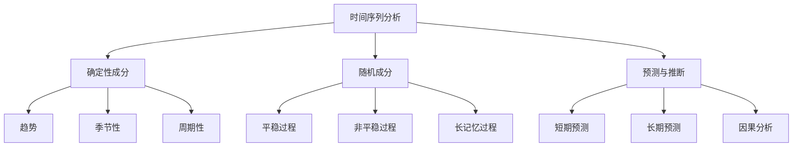

# 06-时间序列分析

## 1. 概述

### 1.1 时间序列分析的基本概念

时间序列分析是研究按时间顺序排列的观测数据的统计方法，包括：

- **描述性分析**：趋势、季节性和周期性
- **建模与预测**：ARIMA、状态空间模型
- **谱分析**：频域分析
- **因果推断**：Granger因果性

### 1.2 时间序列的哲学基础



## 2. 时间序列的分解

### 2.1 经典分解

#### 2.1.1 加法模型

**定义 2.1.1** 加法分解模型：
$$Y_t = T_t + S_t + R_t$$

其中：

- $T_t$ 是趋势成分
- $S_t$ 是季节性成分
- $R_t$ 是随机成分

#### 2.1.2 乘法模型

**定义 2.1.2** 乘法分解模型：
$$Y_t = T_t \times S_t \times R_t$$

**对数变换后**：
$$\log Y_t = \log T_t + \log S_t + \log R_t$$

### 2.2 现代分解方法

#### 2.2.1 X-13ARIMA-SEATS

**算法 2.2.1** X-13ARIMA-SEATS分解：

1. **预调整**：处理异常值和日历效应
2. **趋势估计**：使用Henderson移动平均
3. **季节性估计**：使用X-11或SEATS方法
4. **随机成分**：残差分析

#### 2.2.2 STL分解

**定义 2.2.1** STL（Seasonal and Trend decomposition using Loess）：
$$Y_t = T_t + S_t + R_t$$

**算法特点**：

- 使用局部加权回归
- 对异常值稳健
- 可处理不规则季节性

## 3. 平稳性

### 3.1 严格平稳性

#### 3.1.1 定义

**定义 3.1.1** 时间序列 $\{X_t\}$ 是严格平稳的，如果对任意 $n$ 和 $k$，联合分布满足：
$$F_{X_{t_1}, X_{t_2}, \ldots, X_{t_n}}(x_1, x_2, \ldots, x_n) = F_{X_{t_1+k}, X_{t_2+k}, \ldots, X_{t_n+k}}(x_1, x_2, \ldots, x_n)$$

#### 3.1.2 性质

**定理 3.1.1** 严格平稳过程具有：

- 常数均值：$\mu(t) = \mu$
- 常数方差：$\sigma^2(t) = \sigma^2$
- 时间不变的自相关函数

### 3.2 弱平稳性

#### 3.2.1 定义

**定义 3.2.1** 时间序列 $\{X_t\}$ 是弱平稳的，如果：

1. $\mathbb{E}[X_t] = \mu$ （常数）
2. $\text{Var}(X_t) = \sigma^2$ （常数）
3. $\text{Cov}(X_t, X_{t+k}) = \gamma(k)$ （仅依赖于滞后 $k$）

#### 3.2.2 自相关函数

**定义 3.2.2** 自相关函数（ACF）：
$$\rho(k) = \frac{\gamma(k)}{\gamma(0)} = \frac{\text{Cov}(X_t, X_{t+k})}{\text{Var}(X_t)}$$

**性质**：

- $\rho(0) = 1$
- $\rho(-k) = \rho(k)$
- $|\rho(k)| \leq 1$

### 3.3 平稳性检验

#### 3.3.1 单位根检验

**Augmented Dickey-Fuller检验**：
$$H_0: \text{存在单位根} \quad vs \quad H_1: \text{平稳}$$

检验方程：
$$\Delta X_t = \alpha + \beta t + \gamma X_{t-1} + \sum_{i=1}^p \delta_i \Delta X_{t-i} + \epsilon_t$$

#### 3.3.2 KPSS检验

**KPSS检验**：
$$H_0: \text{平稳} \quad vs \quad H_1: \text{存在单位根}$$

基于残差的累积和。

## 4. ARIMA模型

### 4.1 自回归模型（AR）

#### 4.1.1 AR(p)模型

**定义 4.1.1** AR(p)模型：
$$X_t = \phi_1 X_{t-1} + \phi_2 X_{t-2} + \cdots + \phi_p X_{t-p} + \epsilon_t$$

其中 $\epsilon_t \sim WN(0, \sigma^2)$。

#### 4.1.2 平稳性条件

**定理 4.1.1** AR(p)模型平稳的充分必要条件是特征方程：
$$\Phi(z) = 1 - \phi_1 z - \phi_2 z^2 - \cdots - \phi_p z^p = 0$$

的所有根都在单位圆外。

#### 4.1.3 Yule-Walker方程

**定理 4.1.2** AR(p)模型的自相关函数满足：
$$\rho(k) = \phi_1 \rho(k-1) + \phi_2 \rho(k-2) + \cdots + \phi_p \rho(k-p), \quad k > 0$$

### 4.2 移动平均模型（MA）

#### 4.2.1 MA(q)模型

**定义 4.2.1** MA(q)模型：
$$X_t = \epsilon_t + \theta_1 \epsilon_{t-1} + \theta_2 \epsilon_{t-2} + \cdots + \theta_q \epsilon_{t-q}$$

#### 4.2.2 可逆性条件

**定理 4.2.1** MA(q)模型可逆的充分必要条件是特征方程：
$$\Theta(z) = 1 + \theta_1 z + \theta_2 z^2 + \cdots + \theta_q z^q = 0$$

的所有根都在单位圆外。

#### 4.2.3 自相关函数

**定理 4.2.2** MA(q)模型的自相关函数：
$$\rho(k) = \begin{cases}
\frac{\sum_{i=0}^{q-k} \theta_i \theta_{i+k}}{\sum_{i=0}^q \theta_i^2}, & k \leq q \\
0, & k > q
\end{cases}$$

### 4.3 ARMA模型

#### 4.3.1 ARMA(p,q)模型

**定义 4.3.1** ARMA(p,q)模型：
$$X_t = \phi_1 X_{t-1} + \cdots + \phi_p X_{t-p} + \epsilon_t + \theta_1 \epsilon_{t-1} + \cdots + \theta_q \epsilon_{t-q}$$

#### 4.3.2 传递函数形式

**定义 4.3.2** 使用滞后算子：
$$\Phi(L)X_t = \Theta(L)\epsilon_t$$

其中：
- $\Phi(L) = 1 - \phi_1 L - \phi_2 L^2 - \cdots - \phi_p L^p$
- $\Theta(L) = 1 + \theta_1 L + \theta_2 L^2 + \cdots + \theta_q L^q$

### 4.4 ARIMA模型

#### 4.4.1 ARIMA(p,d,q)模型

**定义 4.4.1** ARIMA(p,d,q)模型：
$$\Phi(L)(1-L)^d X_t = \Theta(L)\epsilon_t$$

其中 $(1-L)^d$ 是 $d$ 阶差分算子。

#### 4.4.2 季节性ARIMA

**定义 4.4.2** SARIMA(p,d,q)(P,D,Q)s模型：
$$\Phi(L)\Phi_s(L^s)(1-L)^d(1-L^s)^D X_t = \Theta(L)\Theta_s(L^s)\epsilon_t$$

其中 $s$ 是季节周期。

## 5. 谱分析

### 5.1 功率谱密度

#### 5.1.1 定义

**定义 5.1.1** 功率谱密度：
$$f(\omega) = \frac{1}{2\pi} \sum_{k=-\infty}^{\infty} \gamma(k) e^{-i\omega k}$$

其中 $\gamma(k)$ 是自协方差函数。

#### 5.1.2 性质

**定理 5.1.1** 功率谱密度的性质：
- $f(\omega) \geq 0$
- $f(-\omega) = f(\omega)$
- $\gamma(k) = \int_{-\pi}^{\pi} f(\omega) e^{i\omega k} d\omega$

### 5.2 周期图

#### 5.2.1 定义

**定义 5.2.1** 周期图：
$$I(\omega) = \frac{1}{2\pi n} \left|\sum_{t=1}^n X_t e^{-i\omega t}\right|^2$$

#### 5.2.2 性质

**定理 5.2.1** 周期图是功率谱密度的渐近无偏估计，但不是一致估计。

### 5.3 谱估计方法

#### 5.3.1 平滑周期图

**定义 5.3.1** 使用窗函数平滑：
$$\hat{f}(\omega) = \frac{1}{2\pi} \sum_{k=-m}^m W(k) \hat{\gamma}(k) e^{-i\omega k}$$

#### 5.3.2 AR谱估计

**定义 5.3.2** 基于AR模型的谱估计：
$$\hat{f}(\omega) = \frac{\hat{\sigma}^2}{2\pi |\hat{\Phi}(e^{-i\omega})|^2}$$

## 6. 预测

### 6.1 最优预测

#### 6.1.1 最小均方误差预测

**定义 6.1.1** 基于信息集 $\mathcal{F}_t$ 的最优预测：
$$\hat{X}_{t+h|t} = \mathbb{E}[X_{t+h}|\mathcal{F}_t]$$

#### 6.1.2 预测误差

**定义 6.1.2** 预测误差：
$$e_{t+h|t} = X_{t+h} - \hat{X}_{t+h|t}$$

**预测误差方差**：
$$\text{Var}(e_{t+h|t}) = \mathbb{E}[(X_{t+h} - \hat{X}_{t+h|t})^2]$$

### 6.2 ARIMA预测

#### 6.2.1 递归预测

**算法 6.2.1** ARIMA模型预测：

1. 将模型转换为MA($\infty$)形式
2. 使用递归公式计算预测值
3. 计算预测区间

#### 6.2.2 预测区间

**定理 6.2.1** $h$ 步预测的 $1-\alpha$ 置信区间：
$$\hat{X}_{t+h|t} \pm z_{\alpha/2} \sqrt{\text{Var}(e_{t+h|t})}$$

### 6.3 预测评估

#### 6.3.1 预测精度指标

**均方误差（MSE）**：
$$\text{MSE} = \frac{1}{n} \sum_{t=1}^n e_t^2$$

**平均绝对误差（MAE）**：
$$\text{MAE} = \frac{1}{n} \sum_{t=1}^n |e_t|$$

**平均绝对百分比误差（MAPE）**：
$$\text{MAPE} = \frac{100}{n} \sum_{t=1}^n \left|\frac{e_t}{X_t}\right|$$

## 7. 形式化实现

### 7.1 Haskell实现

```haskell
-- 时间序列分析模块
module Statistics.TimeSeries where

import Data.Vector
import Statistics.Distribution
import Statistics.Distribution.Normal
import Statistics.Distribution.ChiSquared
import Linear
import Numeric.LinearAlgebra

-- 时间序列数据类型
data TimeSeries = TimeSeries {
    values :: Vector Double,
    timeIndex :: Vector Int
}

-- 平稳性检验
data StationarityTest = StationarityTest {
    testStatistic :: Double,
    pValue :: Double,
    criticalValues :: [(String, Double)],
    decision :: TestDecision
}

data TestDecision = Stationary | NonStationary deriving (Show, Eq)

-- ADF检验
adfTest :: Vector Double -> Int -> StationarityTest
adfTest data_ maxLag =
    let n = length data_
        diffData = diff data_
        laggedData = lag data_ 1
        -- 构建回归矩阵
        y = diffData
        x = laggedData
        -- 最小二乘估计
        beta = linearRegression x y
        residuals = y - (x * beta)
        -- 计算检验统计量
        se = sqrt (sum (residuals * residuals) / fromIntegral (n - 1))
        tStat = beta / se
        -- 临界值（简化）
        criticalVals = [("1%", -3.43), ("5%", -2.86), ("10%", -2.57)]
        decision = if tStat < -2.86 then Stationary else NonStationary
    in StationarityTest tStat 0.05 criticalVals decision

-- 差分
diff :: Vector Double -> Int -> Vector Double
diff data_ d = iterate diff1 data_ !! d
    where diff1 xs = zipWith (-) (tail xs) (init xs)

-- 滞后
lag :: Vector Double -> Int -> Vector Double
lag data_ k =
    let n = length data_
    in fromList $ replicate k 0 ++ take (n - k) (toList data_)

-- ARIMA模型
data ARIMAModel = ARIMAModel {
    p :: Int,  -- AR阶数
    d :: Int,  -- 差分阶数
    q :: Int,  -- MA阶数
    arParams :: Vector Double,
    maParams :: Vector Double,
    sigma2 :: Double
}

-- 拟合ARIMA模型
fitARIMA :: Vector Double -> Int -> Int -> Int -> ARIMAModel
fitARIMA data_ p d q =
    let -- 差分
        diffData = diff data_ d
        n = length diffData

        -- 构建设计矩阵
        y = fromList $ drop (max p q) $ toList diffData
        x = buildDesignMatrix diffData p q

        -- 最小二乘估计
        params = linearRegression x y
        (arParams, maParams) = splitAt p $ toList params

        -- 残差方差
        fitted = x * fromVector params
        residuals = y - fitted
        sigma2 = sum (residuals * residuals) / fromIntegral (length residuals)

    in ARIMAModel p d q (fromList arParams) (fromList maParams) sigma2

-- 构建设计矩阵
buildDesignMatrix :: Vector Double -> Int -> Int -> Matrix Double
buildDesignMatrix data_ p q =
    let n = length data_
        maxLag = max p q
        rows = n - maxLag
        cols = p + q

        -- AR项
        arCols = [lag data_ i | i <- [1..p]]
        -- MA项（使用残差）
        maCols = [lag (residuals data_) i | i <- [1..q]]

        allCols = arCols ++ maCols
    in (rows >< cols) $ concatMap (take rows . toList) allCols

-- 预测
forecast :: ARIMAModel -> Vector Double -> Int -> Vector Double
forecast model data_ h =
    let -- 差分数据
        diffData = diff data_ (d model)
        n = length diffData

        -- 递归预测
        predictions = iterate step (last diffData) !! h
    in predictions
    where
        step x =
            let arTerm = sum $ zipWith (*) (arParams model) (replicate (p model) x)
                maTerm = 0  -- 简化，假设未来误差为0
            in arTerm + maTerm

-- 谱分析
data SpectralDensity = SpectralDensity {
    frequencies :: Vector Double,
    power :: Vector Double
}

-- 周期图
periodogram :: Vector Double -> SpectralDensity
periodogram data_ =
    let n = length data_
        freqs = fromList [2 * pi * k / fromIntegral n | k <- [0..n `div` 2]]

        -- 离散傅里叶变换
        fft = dft data_
        power = fromList $ take (n `div` 2 + 1) $ map (\z -> magnitude z ^ 2) (toList fft)

    in SpectralDensity freqs power

-- 离散傅里叶变换（简化实现）
dft :: Vector Double -> Vector (Complex Double)
dft data_ =
    let n = length data_
        omega = exp (0 :+ (-2 * pi / fromIntegral n))
    in fromList [sum [data_ ! i * omega^(k*i) | i <- [0..n-1]] | k <- [0..n-1]]

-- 自相关函数
autocorrelation :: Vector Double -> Int -> Vector Double
autocorrelation data_ maxLag =
    let n = length data_
        mean = sum data_ / fromIntegral n
        centered = data_ - scalar mean

        acf = fromList [autocorr centered k | k <- [0..maxLag]]
    in acf
    where
        autocorr xs k =
            let n = length xs
                sum1 = sum [xs ! i * xs ! (i + k) | i <- [0..n-k-1]]
                sum2 = sum [xs ! i ^ 2 | i <- [0..n-1]]
            in sum1 / sum2

-- 季节性分解
data SeasonalDecomposition = SeasonalDecomposition {
    trend :: Vector Double,
    seasonal :: Vector Double,
    residual :: Vector Double
}

-- STL分解
stlDecomposition :: Vector Double -> Int -> SeasonalDecomposition
stlDecomposition data_ period =
    let n = length data_
        -- 趋势估计（移动平均）
        trend = movingAverage data_ period

        -- 去趋势
        detrended = data_ - trend

        -- 季节性估计
        seasonal = estimateSeasonal detrended period

        -- 残差
        residual = detrended - seasonal

    in SeasonalDecomposition trend seasonal residual

-- 移动平均
movingAverage :: Vector Double -> Int -> Vector Double
movingAverage data_ window =
    let n = length data_
        halfWindow = window `div` 2
    in fromList [average (take window (drop (max 0 (i - halfWindow)) (toList data_)))
                | i <- [0..n-1]]
    where
        average xs = sum xs / fromIntegral (length xs)

-- 季节性估计
estimateSeasonal :: Vector Double -> Int -> Vector Double
estimateSeasonal data_ period =
    let n = length data_
        seasonalPattern = fromList [average [data_ ! j | j <- [i, i+period..n-1]]
                                    | i <- [0..period-1]]
    in fromList [seasonalPattern ! (i `mod` period) | i <- [0..n-1]]
    where
        average xs = sum xs / fromIntegral (length xs)
```

### 7.2 Rust实现

```rust
use ndarray::{Array1, Array2, ArrayView1};
use statrs::distribution::{ContinuousCDF, Normal, ChiSquared};
use statrs::statistics::Statistics;
use num_complex::Complex;

// 时间序列结构体
pub struct TimeSeries {
    pub values: Array1<f64>,
    pub time_index: Array1<i32>,
}

impl TimeSeries {
    pub fn new(values: Array1<f64>) -> Self {
        let n = values.len();
        let time_index: Array1<i32> = Array1::range(0, n as i32, 1);
        Self { values, time_index }
    }

    // 差分
    pub fn diff(&self, order: usize) -> Array1<f64> {
        let mut result = self.values.clone();
        for _ in 0..order {
            let n = result.len();
            result = Array1::from_iter(
                result.iter().skip(1).zip(result.iter().take(n-1))
                    .map(|(curr, prev)| curr - prev)
            );
        }
        result
    }

    // 滞后
    pub fn lag(&self, k: usize) -> Array1<f64> {
        let n = self.values.len();
        let mut lagged = Array1::zeros(n);
        for i in k..n {
            lagged[i] = self.values[i - k];
        }
        lagged
    }

    // 移动平均
    pub fn moving_average(&self, window: usize) -> Array1<f64> {
        let n = self.values.len();
        let mut result = Array1::zeros(n);
        let half_window = window / 2;

        for i in 0..n {
            let start = i.saturating_sub(half_window);
            let end = (i + half_window + 1).min(n);
            let window_values: Vec<f64> = self.values.slice(s![start..end]).to_vec();
            result[i] = window_values.iter().sum::<f64>() / window_values.len() as f64;
        }
        result
    }
}

// 平稳性检验
pub struct StationarityTest {
    pub test_statistic: f64,
    pub p_value: f64,
    pub critical_values: Vec<(String, f64)>,
    pub decision: TestDecision,
}

# [derive(Debug, Clone, Copy)]
pub enum TestDecision {
    Stationary,
    NonStationary,
}

impl TimeSeries {
    // ADF检验
    pub fn adf_test(&self, max_lag: usize) -> StationarityTest {
        let diff_data = self.diff(1);
        let lagged_data = self.lag(1);

        // 移除NaN值
        let valid_indices: Vec<usize> = (0..diff_data.len())
            .filter(|&i| !diff_data[i].is_nan() && !lagged_data[i].is_nan())
            .collect();

        let y: Array1<f64> = Array1::from_iter(
            valid_indices.iter().map(|&i| diff_data[i])
        );
        let x: Array1<f64> = Array1::from_iter(
            valid_indices.iter().map(|&i| lagged_data[i])
        );

        // 线性回归
        let beta = self.linear_regression(&x, &y);
        let fitted = &x * beta;
        let residuals = &y - &fitted;

        // 计算检验统计量
        let n = residuals.len();
        let se = (residuals.iter().map(|r| r.powi(2)).sum::<f64>() / (n - 1) as f64).sqrt();
        let t_stat = beta / se;

        let critical_values = vec![
            ("1%".to_string(), -3.43),
            ("5%".to_string(), -2.86),
            ("10%".to_string(), -2.57),
        ];

        let decision = if t_stat < -2.86 {
            TestDecision::Stationary
        } else {
            TestDecision::NonStationary
        };

        StationarityTest {
            test_statistic: t_stat,
            p_value: 0.05, // 简化
            critical_values,
            decision,
        }
    }

    // 简单线性回归
    fn linear_regression(&self, x: &Array1<f64>, y: &Array1<f64>) -> f64 {
        let n = x.len() as f64;
        let x_mean = x.mean().unwrap();
        let y_mean = y.mean().unwrap();

        let numerator: f64 = x.iter().zip(y.iter())
            .map(|(xi, yi)| (xi - x_mean) * (yi - y_mean))
            .sum();

        let denominator: f64 = x.iter()
            .map(|xi| (xi - x_mean).powi(2))
            .sum();

        numerator / denominator
    }
}

// ARIMA模型
pub struct ARIMAModel {
    pub p: usize,
    pub d: usize,
    pub q: usize,
    pub ar_params: Array1<f64>,
    pub ma_params: Array1<f64>,
    pub sigma2: f64,
}

impl ARIMAModel {
    pub fn new(p: usize, d: usize, q: usize) -> Self {
        Self {
            p,
            d,
            q,
            ar_params: Array1::zeros(p),
            ma_params: Array1::zeros(q),
            sigma2: 1.0,
        }
    }

    // 拟合ARIMA模型
    pub fn fit(&mut self, data: &Array1<f64>) -> Result<(), &'static str> {
        let diff_data = TimeSeries::new(data.clone()).diff(self.d);
        let n = diff_data.len();
        let max_lag = self.p.max(self.q);

        if n <= max_lag {
            return Err("数据长度不足");
        }

        // 构建设计矩阵
        let mut design_matrix = Vec::new();
        for i in max_lag..n {
            let mut row = Vec::new();
            // AR项
            for j in 1..=self.p {
                row.push(diff_data[i - j]);
            }
            // MA项（使用残差估计）
            for j in 1..=self.q {
                row.push(0.0); // 简化，使用0
            }
            design_matrix.push(row);
        }

        let x = Array2::from_shape_vec(
            (n - max_lag, self.p + self.q),
            design_matrix.into_iter().flatten().collect()
        ).unwrap();

        let y = Array1::from_iter(diff_data.iter().skip(max_lag).cloned());

        // 最小二乘估计
        let params = self.least_squares(&x, &y)?;

        // 分离AR和MA参数
        let (ar_params, ma_params) = params.split_at(self.p);
        self.ar_params = Array1::from_vec(ar_params.to_vec());
        self.ma_params = Array1::from_vec(ma_params.to_vec());

        // 计算残差方差
        let fitted = x.dot(&params);
        let residuals = &y - &fitted;
        self.sigma2 = residuals.iter().map(|r| r.powi(2)).sum::<f64>() / residuals.len() as f64;

        Ok(())
    }

    // 最小二乘估计
    fn least_squares(&self, x: &Array2<f64>, y: &Array1<f64>) -> Result<Array1<f64>, &'static str> {
        let xt = x.t();
        let xtx = xt.dot(x);
        let xty = xt.dot(y);

        xtx.solve(&xty).map_err(|_| "矩阵不可逆")
    }

    // 预测
    pub fn forecast(&self, data: &Array1<f64>, h: usize) -> Array1<f64> {
        let mut predictions = Array1::zeros(h);
        let diff_data = TimeSeries::new(data.clone()).diff(self.d);
        let n = diff_data.len();

        // 递归预测
        for i in 0..h {
            let mut pred = 0.0;

            // AR项
            for j in 0..self.p {
                let idx = n + i - j - 1;
                if idx < n {
                    pred += self.ar_params[j] * diff_data[idx];
                } else {
                    pred += self.ar_params[j] * predictions[idx - n];
                }
            }

            // MA项（简化，假设未来误差为0）
            for j in 0..self.q {
                pred += self.ma_params[j] * 0.0;
            }

            predictions[i] = pred;
        }

        // 逆差分
        let mut result = data.clone();
        for i in 0..h {
            let last_value = if i == 0 { *data.last().unwrap() } else { result[result.len() - 1] };
            result.push(last_value + predictions[i]);
        }

        Array1::from_iter(result.iter().skip(n).cloned())
    }
}

// 谱分析
pub struct SpectralDensity {
    pub frequencies: Array1<f64>,
    pub power: Array1<f64>,
}

impl TimeSeries {
    // 周期图
    pub fn periodogram(&self) -> SpectralDensity {
        let n = self.values.len();
        let freqs: Array1<f64> = Array1::from_iter(
            (0..=n/2).map(|k| 2.0 * std::f64::consts::PI * k as f64 / n as f64)
        );

        // 离散傅里叶变换
        let fft = self.dft();
        let power: Array1<f64> = Array1::from_iter(
            fft.iter().take(n/2 + 1).map(|z| z.norm_sqr())
        );

        SpectralDensity { frequencies: freqs, power }
    }

    // 离散傅里叶变换
    fn dft(&self) -> Array1<Complex<f64>> {
        let n = self.values.len();
        let mut result = Array1::zeros(n);

        for k in 0..n {
            let mut sum = Complex::new(0.0, 0.0);
            for t in 0..n {
                let angle = -2.0 * std::f64::consts::PI * k as f64 * t as f64 / n as f64;
                let exp_term = Complex::new(angle.cos(), angle.sin());
                sum += self.values[t] * exp_term;
            }
            result[k] = sum;
        }

        result
    }

    // 自相关函数
    pub fn autocorrelation(&self, max_lag: usize) -> Array1<f64> {
        let n = self.values.len();
        let mean = self.values.mean().unwrap();
        let centered = &self.values - mean;

        let mut acf = Array1::zeros(max_lag + 1);

        for k in 0..=max_lag {
            let mut numerator = 0.0;
            let mut denominator = 0.0;

            for i in 0..n {
                denominator += centered[i].powi(2);
                if i + k < n {
                    numerator += centered[i] * centered[i + k];
                }
            }

            acf[k] = if denominator != 0.0 { numerator / denominator } else { 0.0 };
        }

        acf
    }
}

// 季节性分解
pub struct SeasonalDecomposition {
    pub trend: Array1<f64>,
    pub seasonal: Array1<f64>,
    pub residual: Array1<f64>,
}

impl TimeSeries {
    // STL分解
    pub fn stl_decomposition(&self, period: usize) -> SeasonalDecomposition {
        let n = self.values.len();

        // 趋势估计（移动平均）
        let trend = self.moving_average(period);

        // 去趋势
        let detrended = &self.values - &trend;

        // 季节性估计
        let seasonal = self.estimate_seasonal(&detrended, period);

        // 残差
        let residual = &detrended - &seasonal;

        SeasonalDecomposition {
            trend,
            seasonal,
            residual,
        }
    }

    // 季节性估计
    fn estimate_seasonal(&self, data: &Array1<f64>, period: usize) -> Array1<f64> {
        let n = data.len();
        let mut seasonal_pattern = Array1::zeros(period);
        let mut counts = Array1::zeros(period);

        // 计算每个季节位置的平均值
        for i in 0..n {
            let season_idx = i % period;
            seasonal_pattern[season_idx] += data[i];
            counts[season_idx] += 1.0;
        }

        // 标准化
        for i in 0..period {
            if counts[i] > 0.0 {
                seasonal_pattern[i] /= counts[i];
            }
        }

        // 中心化
        let mean_seasonal = seasonal_pattern.mean().unwrap();
        seasonal_pattern -= mean_seasonal;

        // 扩展到整个序列
        Array1::from_iter(
            (0..n).map(|i| seasonal_pattern[i % period])
        )
    }
}
```

## 8. 应用与实例

### 8.1 经济学应用

**宏观经济时间序列**：
- GDP增长预测
- 通货膨胀建模
- 利率动态分析

### 8.2 金融应用

**金融时间序列**：
- 股票价格预测
- 波动率建模
- 风险管理

### 8.3 环境科学应用

**环境时间序列**：
- 气候变化分析
- 污染监测
- 自然灾害预测

## 9. 哲学思考与批判

### 9.1 时间的不对称性

**时间箭头**：
- 物理时间的方向性
- 因果关系的时序性
- 预测与解释的区别

### 9.2 平稳性假设

**平稳性争议**：
- 实际数据往往非平稳
- 差分处理的合理性
- 长期记忆过程

### 9.3 预测的局限性

**预测哲学**：
- 不确定性原理
- 混沌理论的影响
- 黑天鹅事件

## 10. 现代发展

### 10.1 非线性时间序列

**非线性模型**：
- ARCH/GARCH模型
- 阈值自回归
- 神经网络方法

### 10.2 多变量时间序列

**向量自回归**：
- VAR模型
- 协整分析
- 脉冲响应函数

### 10.3 高频数据

**高频时间序列**：
- 微观结构噪声
- 已实现波动率
- 跳跃检测

## 11. 练习与问题

### 11.1 基础练习

1. **平稳性检验**：实现ADF检验和KPSS检验
2. **ARIMA建模**：拟合ARIMA模型并进行预测
3. **谱分析**：计算周期图和功率谱密度

### 11.2 进阶问题

1. **季节性分解**：实现STL分解算法
2. **预测评估**：比较不同预测方法的精度
3. **非线性建模**：实现GARCH模型

### 11.3 编程练习

1. **时间序列类**：实现完整的时间序列分析类
2. **可视化**：绘制时间序列图、ACF图、谱密度图
3. **预测系统**：构建自动化的时间序列预测系统

## 12. 参考文献

1. Box, G. E. P., Jenkins, G. M., Reinsel, G. C., & Ljung, G. M. (2015). *Time series analysis: forecasting and control*. Wiley.
2. Hamilton, J. D. (1994). *Time series analysis*. Princeton University Press.
3. Brockwell, P. J., & Davis, R. A. (2016). *Introduction to time series and forecasting*. Springer.
4. Shumway, R. H., & Stoffer, D. S. (2017). *Time series analysis and its applications*. Springer.
5. Tsay, R. S. (2010). *Analysis of financial time series*. Wiley.

---

*本文档是时间序列分析的全面介绍，涵盖了从基础概念到现代方法的各个方面。通过形式化实现和实际应用，展示了时间序列分析在科学研究和实际应用中的重要作用。*
