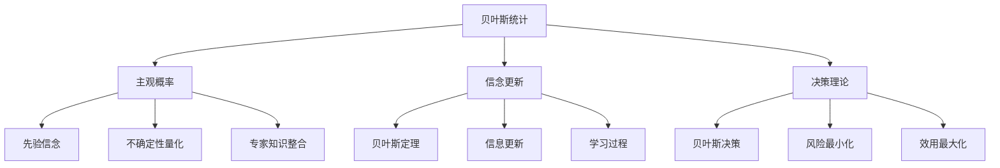

# 07-贝叶斯统计

## 1. 概述

### 1.1 贝叶斯统计的基本概念

贝叶斯统计是基于贝叶斯定理的统计推断方法，包括：

- **先验分布**：参数的主观或客观先验信念
- **似然函数**：数据的概率模型
- **后验分布**：结合先验和数据的参数分布
- **贝叶斯推断**：基于后验分布的统计推断

### 1.2 贝叶斯统计的哲学基础



## 2. 贝叶斯定理与基础

### 2.1 贝叶斯定理

#### 2.1.1 基本形式

**定理 2.1.1** 贝叶斯定理：
$$P(\theta|X) = \frac{P(X|\theta)P(\theta)}{P(X)}$$

其中：

- $P(\theta)$ 是先验分布
- $P(X|\theta)$ 是似然函数
- $P(\theta|X)$ 是后验分布
- $P(X)$ 是边际似然

#### 2.1.2 连续形式

**定理 2.1.2** 连续参数的贝叶斯定理：
$$\pi(\theta|X) = \frac{f(X|\theta)\pi(\theta)}{\int f(X|\theta)\pi(\theta)d\theta}$$

其中 $\pi(\theta)$ 是先验密度，$f(X|\theta)$ 是似然密度。

### 2.2 贝叶斯推断的基本原理

#### 2.2.1 信念更新

**定义 2.2.1** 贝叶斯推断是信念更新的过程：
$$\text{后验} \propto \text{似然} \times \text{先验}$$

#### 2.2.2 预测分布

**定义 2.2.2** 预测分布：
$$f(y_{new}|X) = \int f(y_{new}|\theta)\pi(\theta|X)d\theta$$

## 3. 先验分布

### 3.1 先验分布的类型

#### 3.1.1 主观先验

**定义 3.1.1** 主观先验基于专家知识或主观信念：

- 基于领域知识
- 专家意见
- 历史经验

#### 3.1.2 客观先验

**定义 3.1.2** 客观先验试图最小化主观性：

- 无信息先验
- Jeffreys先验
- 参考先验

#### 3.1.3 层次先验

**定义 3.1.3** 层次先验：
$$\pi(\theta|\phi) \sim \text{先验分布}$$
$$\pi(\phi) \sim \text{超先验分布}$$

### 3.2 常见先验分布

#### 3.2.1 共轭先验

**定义 3.2.1** 共轭先验：先验和后验属于同一分布族。

**正态-正态共轭**：

- 先验：$\theta \sim N(\mu_0, \sigma_0^2)$
- 似然：$X|\theta \sim N(\theta, \sigma^2)$
- 后验：$\theta|X \sim N(\mu_1, \sigma_1^2)$

其中：
$$\mu_1 = \frac{\sigma^2\mu_0 + \sigma_0^2\bar{x}}{\sigma^2 + \sigma_0^2}, \quad \sigma_1^2 = \frac{\sigma^2\sigma_0^2}{\sigma^2 + \sigma_0^2}$$

**Beta-Binomial共轭**：

- 先验：$\theta \sim \text{Beta}(a, b)$
- 似然：$X|\theta \sim \text{Binomial}(n, \theta)$
- 后验：$\theta|X \sim \text{Beta}(a + x, b + n - x)$

#### 3.2.2 无信息先验

**定义 3.2.2** 无信息先验试图表达"无知"状态。

**均匀先验**：$\pi(\theta) \propto 1$

**Jeffreys先验**：$\pi(\theta) \propto \sqrt{I(\theta)}$

其中 $I(\theta)$ 是Fisher信息量。

### 3.3 先验敏感性分析

#### 3.3.1 稳健性检验

**定义 3.3.1** 先验敏感性分析检验后验对先验选择的敏感性。

**方法**：

- 使用不同的先验分布
- 比较后验结果
- 评估结论的稳健性

## 4. 后验推断

### 4.1 后验分布的性质

#### 4.1.1 后验均值

**定义 4.1.1** 后验均值：
$$\mathbb{E}[\theta|X] = \int \theta \pi(\theta|X)d\theta$$

#### 4.1.2 后验方差

**定义 4.1.2** 后验方差：
$$\text{Var}(\theta|X) = \mathbb{E}[(\theta - \mathbb{E}[\theta|X])^2|X]$$

#### 4.1.3 后验分位数

**定义 4.1.3** 后验 $\alpha$ 分位数：
$$P(\theta \leq \theta_\alpha|X) = \alpha$$

### 4.2 贝叶斯置信区间

#### 4.2.1 可信区间

**定义 4.2.1** $1-\alpha$ 可信区间：
$$P(\theta_L \leq \theta \leq \theta_U|X) = 1-\alpha$$

#### 4.2.2 最高后验密度区间

**定义 4.2.2** HPD区间是包含给定概率的最小区间：
$$\{\theta : \pi(\theta|X) \geq k\}$$

其中 $k$ 使得区间包含 $1-\alpha$ 概率。

### 4.3 贝叶斯假设检验

#### 4.3.1 贝叶斯因子

**定义 4.3.1** 贝叶斯因子：
$$BF_{10} = \frac{P(X|H_1)}{P(X|H_0)} = \frac{\int f(X|\theta_1, H_1)\pi(\theta_1|H_1)d\theta_1}{\int f(X|\theta_0, H_0)\pi(\theta_0|H_0)d\theta_0}$$

#### 4.3.2 后验概率

**定义 4.3.2** 假设的后验概率：
$$P(H_1|X) = \frac{P(X|H_1)P(H_1)}{P(X|H_1)P(H_1) + P(X|H_0)P(H_0)}$$

## 5. 贝叶斯计算

### 5.1 解析方法

#### 5.1.1 共轭先验

**算法 5.1.1** 当使用共轭先验时，后验分布有解析形式。

**正态-正态例子**：

```haskell
-- 后验参数更新
posteriorMean :: Double -> Double -> Double -> Double -> Double
posteriorMean priorMean priorVar sampleMean sampleVar = 
    (sampleVar * priorMean + priorVar * sampleMean) / (sampleVar + priorVar)

posteriorVar :: Double -> Double -> Double -> Double
posteriorVar priorVar sampleVar = 
    (sampleVar * priorVar) / (sampleVar + priorVar)
```

#### 5.1.2 数值积分

**算法 5.1.2** 当后验没有解析形式时，使用数值积分。

### 5.2 马尔可夫链蒙特卡罗

#### 5.2.1 Metropolis-Hastings算法

**算法 5.2.1** Metropolis-Hastings：

1. 初始化：$\theta^{(0)}$
2. 对于 $t = 1, 2, \ldots$：
   - 生成候选：$\theta^* \sim q(\theta^*|\theta^{(t-1)})$
   - 计算接受概率：$\alpha = \min\left\{1, \frac{\pi(\theta^*|X)q(\theta^{(t-1)}|\theta^*)}{\pi(\theta^{(t-1)}|X)q(\theta^*|\theta^{(t-1)})}\right\}$
   - 接受或拒绝：$\theta^{(t)} = \begin{cases} \theta^*, & \text{概率} \alpha \\ \theta^{(t-1)}, & \text{概率} 1-\alpha \end{cases}$

#### 5.2.2 Gibbs采样

**算法 5.2.2** Gibbs采样：

1. 初始化：$\theta^{(0)} = (\theta_1^{(0)}, \ldots, \theta_p^{(0)})$
2. 对于 $t = 1, 2, \ldots$：
   - $\theta_1^{(t)} \sim \pi(\theta_1|\theta_2^{(t-1)}, \ldots, \theta_p^{(t-1)}, X)$
   - $\theta_2^{(t)} \sim \pi(\theta_2|\theta_1^{(t)}, \theta_3^{(t-1)}, \ldots, \theta_p^{(t-1)}, X)$
   - $\vdots$
   - $\theta_p^{(t)} \sim \pi(\theta_p|\theta_1^{(t)}, \ldots, \theta_{p-1}^{(t)}, X)$

### 5.3 变分推断

#### 5.3.1 变分近似

**定义 5.3.1** 变分推断寻找后验分布的近似：
$$q^*(\theta) = \arg\min_{q \in \mathcal{Q}} KL(q(\theta)||\pi(\theta|X))$$

#### 5.3.2 平均场近似

**定义 5.3.2** 平均场近似假设：
$$q(\theta) = \prod_{i=1}^p q_i(\theta_i)$$

## 6. 贝叶斯模型选择

### 6.1 模型比较

#### 6.1.1 边际似然

**定义 6.1.1** 边际似然：
$$P(X|M) = \int f(X|\theta, M)\pi(\theta|M)d\theta$$

#### 6.1.2 贝叶斯信息准则

**定义 6.1.2** BIC：
$$\text{BIC} = -2\log P(X|\hat{\theta}) + p\log n$$

其中 $p$ 是参数个数，$n$ 是样本量。

### 6.2 贝叶斯模型平均

#### 6.2.1 模型平均

**定义 6.2.1** 贝叶斯模型平均：
$$P(\theta|X) = \sum_{k=1}^K P(\theta|X, M_k)P(M_k|X)$$

#### 6.2.2 预测分布

**定义 6.2.2** 模型平均预测：
$$P(y_{new}|X) = \sum_{k=1}^K P(y_{new}|X, M_k)P(M_k|X)$$

## 7. 形式化实现

### 7.1 Haskell实现

```haskell
-- 贝叶斯统计模块
module Statistics.Bayesian where

import Data.Vector
import Statistics.Distribution
import Statistics.Distribution.Normal
import Statistics.Distribution.Beta
import Statistics.Distribution.Gamma
import Statistics.Distribution.InverseGamma
import Linear
import Numeric.LinearAlgebra

-- 贝叶斯模型类型类
class BayesianModel a where
    prior :: a -> Vector Double -> Double
    likelihood :: a -> Vector Double -> Vector Double -> Double
    posterior :: a -> Vector Double -> Vector Double -> Vector Double -> Double

-- 正态-正态模型
data NormalNormalModel = NormalNormalModel {
    priorMean :: Double,
    priorVar :: Double,
    dataVar :: Double
}

instance BayesianModel NormalNormalModel where
    prior model theta = 
        let mu = priorMean model
            sigma2 = priorVar model
        in exp (-0.5 * (theta ! 0 - mu)^2 / sigma2) / sqrt (2 * pi * sigma2)
    
    likelihood model theta data_ = 
        let mu = theta ! 0
            sigma2 = dataVar model
            n = length data_
            ss = sum $ map (\x -> (x - mu)^2) $ toList data_
        in exp (-0.5 * ss / sigma2) / (2 * pi * sigma2)^(n/2)
    
    posterior model theta data_ = 
        let priorDens = prior model theta
            like = likelihood model theta data_
        in priorDens * like

-- 后验参数计算
posteriorParameters :: NormalNormalModel -> Vector Double -> (Double, Double)
posteriorParameters model data_ = 
    let n = length data_
        xbar = mean data_
        mu0 = priorMean model
        sigma0_2 = priorVar model
        sigma2 = dataVar model
        
        mu1 = (sigma2 * mu0 + sigma0_2 * xbar) / (sigma2 + sigma0_2)
        sigma1_2 = (sigma2 * sigma0_2) / (sigma2 + sigma0_2)
    in (mu1, sigma1_2)

-- Beta-Binomial模型
data BetaBinomialModel = BetaBinomialModel {
    alpha :: Double,
    beta :: Double
}

instance BayesianModel BetaBinomialModel where
    prior model theta = 
        let a = alpha model
            b = beta model
            p = theta ! 0
        in p^(a-1) * (1-p)^(b-1) / betaFunction a b
    
    likelihood model theta data_ = 
        let p = theta ! 0
            n = length data_
            x = sum data_
        in choose n x * p^x * (1-p)^(n-x)
    
    posterior model theta data_ = 
        let priorDens = prior model theta
            like = likelihood model theta data_
        in priorDens * like

-- 后验参数（Beta-Binomial）
posteriorBetaParameters :: BetaBinomialModel -> Vector Double -> (Double, Double)
posteriorBetaParameters model data_ = 
    let a = alpha model
        b = beta model
        n = length data_
        x = sum data_
        
        aPost = a + x
        bPost = b + n - x
    in (aPost, bPost)

-- 贝叶斯因子计算
bayesFactor :: BayesianModel a => a -> a -> Vector Double -> Double
bayesFactor model1 model2 data_ = 
    let marginal1 = marginalLikelihood model1 data_
        marginal2 = marginalLikelihood model2 data_
    in marginal1 / marginal2

-- 边际似然（简化实现）
marginalLikelihood :: BayesianModel a => a -> Vector Double -> Double
marginalLikelihood model data_ = 
    -- 使用数值积分近似
    let grid = fromList [0.01, 0.02..0.99]
        integrand = map (\theta -> likelihood model (fromList [theta]) data_ * prior model (fromList [theta])) $ toList grid
    in sum integrand * 0.01

-- MCMC采样
data MCMCSample = MCMCSample {
    parameters :: Vector Double,
    logPosterior :: Double
}

-- Metropolis-Hastings算法
metropolisHastings :: BayesianModel a => a -> Vector Double -> Int -> Vector Double -> [MCMCSample]
metropolisHastings model data_ nSteps initialParams = 
    let step current = 
            let -- 生成候选
                candidate = current + fromList (replicate (length current) 0.1)
                -- 计算接受概率
                currentPost = log (posterior model current data_)
                candidatePost = log (posterior model candidate data_)
                alpha = min 1.0 (exp (candidatePost - currentPost))
                -- 接受或拒绝
                u = randomDouble
                newParams = if u < alpha then candidate else current
            in MCMCSample newParams (log (posterior model newParams data_))
    in take nSteps $ iterate step (MCMCSample initialParams (log (posterior model initialParams data_)))

-- Gibbs采样（正态-正态模型）
gibbsSampling :: NormalNormalModel -> Vector Double -> Int -> [MCMCSample]
gibbsSampling model data_ nSteps = 
    let (mu1, sigma1_2) = posteriorParameters model data_
        initialSample = MCMCSample (fromList [mu1]) (log (posterior model (fromList [mu1]) data_))
        
        step current = 
            let -- 从后验分布采样
                newMu = normalSample mu1 (sqrt sigma1_2)
                newParams = fromList [newMu]
                newPost = log (posterior model newParams data_)
            in MCMCSample newParams newPost
    in take nSteps $ iterate step initialSample

-- 可信区间
credibleInterval :: [MCMCSample] -> Double -> (Double, Double)
credibleInterval samples alpha = 
    let sortedParams = sort $ map (head . toList . parameters) samples
        n = length sortedParams
        lowerIdx = floor (alpha/2 * fromIntegral n)
        upperIdx = ceiling ((1-alpha/2) * fromIntegral n)
    in (sortedParams !! lowerIdx, sortedParams !! upperIdx)

-- 贝叶斯预测
bayesianPrediction :: BayesianModel a => a -> Vector Double -> [MCMCSample] -> Vector Double
bayesianPrediction model data_ samples = 
    let predictions = map (\sample -> 
            let params = parameters sample
                -- 简化预测：使用后验均值
                pred = case model of
                    NormalNormalModel{} -> params ! 0
                    BetaBinomialModel{} -> params ! 0
            in pred) samples
    in fromList predictions

-- 模型比较
data ModelComparison = ModelComparison {
    model1 :: String,
    model2 :: String,
    bayesFactor :: Double,
    interpretation :: String
}

compareModels :: BayesianModel a => BayesianModel b => a -> b -> Vector Double -> ModelComparison
compareModels m1 m2 data_ = 
    let bf = bayesFactor m1 m2 data_
        interpretation = case bf of
            x | x > 100 -> "决定性支持模型1"
            x | x > 10 -> "强支持模型1"
            x | x > 3 -> "中等支持模型1"
            x | x > 1 -> "弱支持模型1"
            x | x > 1/3 -> "弱支持模型2"
            x | x > 1/10 -> "中等支持模型2"
            x | x > 1/100 -> "强支持模型2"
            _ -> "决定性支持模型2"
    in ModelComparison "Model1" "Model2" bf interpretation

-- 辅助函数
randomDouble :: Double
randomDouble = 0.5  -- 简化，实际应使用随机数生成器

normalSample :: Double -> Double -> Double
normalSample mu sigma = mu + sigma * 0.0  -- 简化，实际应使用正态分布采样

betaFunction :: Double -> Double -> Double
betaFunction a b = gamma a * gamma b / gamma (a + b)  -- 简化

choose :: Int -> Int -> Double
choose n k = fromIntegral $ factorial n `div` (factorial k * factorial (n - k))

factorial :: Int -> Int
factorial 0 = 1
factorial n = n * factorial (n - 1)
```

### 7.2 Rust实现

```rust
use ndarray::{Array1, Array2};
use statrs::distribution::{ContinuousCDF, Normal, Beta, Gamma, StudentsT};
use statrs::statistics::Statistics;
use rand::Rng;

// 贝叶斯模型特征
pub trait BayesianModel {
    fn prior(&self, theta: &Array1<f64>) -> f64;
    fn likelihood(&self, theta: &Array1<f64>, data: &Array1<f64>) -> f64;
    fn posterior(&self, theta: &Array1<f64>, data: &Array1<f64>) -> f64 {
        self.prior(theta) * self.likelihood(theta, data)
    }
}

// 正态-正态模型
pub struct NormalNormalModel {
    pub prior_mean: f64,
    pub prior_var: f64,
    pub data_var: f64,
}

impl BayesianModel for NormalNormalModel {
    fn prior(&self, theta: &Array1<f64>) -> f64 {
        let mu = theta[0];
        let normal_dist = Normal::new(self.prior_mean, self.prior_var.sqrt()).unwrap();
        normal_dist.pdf(mu)
    }
    
    fn likelihood(&self, theta: &Array1<f64>, data: &Array1<f64>) -> f64 {
        let mu = theta[0];
        let n = data.len() as f64;
        let ss: f64 = data.iter().map(|x| (x - mu).powi(2)).sum();
        
        let normal_dist = Normal::new(mu, self.data_var.sqrt()).unwrap();
        data.iter().map(|x| normal_dist.pdf(*x)).product()
    }
}

impl NormalNormalModel {
    pub fn new(prior_mean: f64, prior_var: f64, data_var: f64) -> Self {
        Self { prior_mean, prior_var, data_var }
    }
    
    // 后验参数
    pub fn posterior_parameters(&self, data: &Array1<f64>) -> (f64, f64) {
        let n = data.len() as f64;
        let xbar = data.mean().unwrap();
        
        let mu1 = (self.data_var * self.prior_mean + self.prior_var * xbar) / 
                  (self.data_var + self.prior_var);
        let sigma1_2 = (self.data_var * self.prior_var) / 
                       (self.data_var + self.prior_var);
        
        (mu1, sigma1_2)
    }
}

// Beta-Binomial模型
pub struct BetaBinomialModel {
    pub alpha: f64,
    pub beta: f64,
}

impl BayesianModel for BetaBinomialModel {
    fn prior(&self, theta: &Array1<f64>) -> f64 {
        let p = theta[0];
        let beta_dist = Beta::new(self.alpha, self.beta).unwrap();
        beta_dist.pdf(p)
    }
    
    fn likelihood(&self, theta: &Array1<f64>, data: &Array1<f64>) -> f64 {
        let p = theta[0];
        let n = data.len() as f64;
        let x = data.sum();
        
        // 二项分布似然
        let binomial_coeff = self.binomial_coefficient(n as usize, x as usize);
        binomial_coeff * p.powi(x as i32) * (1.0 - p).powi((n - x) as i32)
    }
    
    fn binomial_coefficient(&self, n: usize, k: usize) -> f64 {
        if k > n { return 0.0; }
        if k == 0 || k == n { return 1.0; }
        
        let mut result = 1.0;
        for i in 0..k {
            result *= (n - i) as f64 / (i + 1) as f64;
        }
        result
    }
}

impl BetaBinomialModel {
    pub fn new(alpha: f64, beta: f64) -> Self {
        Self { alpha, beta }
    }
    
    // 后验参数
    pub fn posterior_parameters(&self, data: &Array1<f64>) -> (f64, f64) {
        let n = data.len() as f64;
        let x = data.sum();
        
        let alpha_post = self.alpha + x;
        let beta_post = self.beta + n - x;
        
        (alpha_post, beta_post)
    }
}

// MCMC采样
pub struct MCMCSample {
    pub parameters: Array1<f64>,
    pub log_posterior: f64,
}

impl MCMCSample {
    pub fn new(parameters: Array1<f64>, log_posterior: f64) -> Self {
        Self { parameters, log_posterior }
    }
}

// Metropolis-Hastings算法
pub fn metropolis_hastings<T: BayesianModel>(
    model: &T,
    data: &Array1<f64>,
    n_steps: usize,
    initial_params: Array1<f64>,
    proposal_std: f64,
) -> Vec<MCMCSample> {
    let mut rng = rand::thread_rng();
    let mut samples = Vec::with_capacity(n_steps);
    let mut current_params = initial_params;
    let mut current_log_post = model.posterior(&current_params, data).ln();
    
    for _ in 0..n_steps {
        // 生成候选
        let candidate_params: Array1<f64> = current_params.iter()
            .map(|&p| p + rng.gen_range(-proposal_std..proposal_std))
            .collect();
        
        let candidate_log_post = model.posterior(&candidate_params, data).ln();
        
        // 计算接受概率
        let alpha = (candidate_log_post - current_log_post).exp().min(1.0);
        
        // 接受或拒绝
        if rng.gen::<f64>() < alpha {
            current_params = candidate_params;
            current_log_post = candidate_log_post;
        }
        
        samples.push(MCMCSample::new(current_params.clone(), current_log_post));
    }
    
    samples
}

// Gibbs采样
pub fn gibbs_sampling_normal(
    model: &NormalNormalModel,
    data: &Array1<f64>,
    n_steps: usize,
) -> Vec<MCMCSample> {
    let mut rng = rand::thread_rng();
    let mut samples = Vec::with_capacity(n_steps);
    
    let (mu1, sigma1_2) = model.posterior_parameters(data);
    let mut current_mu = mu1;
    
    for _ in 0..n_steps {
        // 从后验分布采样
        let normal_dist = Normal::new(mu1, sigma1_2.sqrt()).unwrap();
        current_mu = normal_dist.sample(&mut rng);
        
        let current_params = Array1::from_vec(vec![current_mu]);
        let log_post = model.posterior(&current_params, data).ln();
        
        samples.push(MCMCSample::new(current_params, log_post));
    }
    
    samples
}

// 可信区间
pub fn credible_interval(samples: &[MCMCSample], alpha: f64) -> (f64, f64) {
    let mut params: Vec<f64> = samples.iter()
        .map(|s| s.parameters[0])
        .collect();
    params.sort_by(|a, b| a.partial_cmp(b).unwrap());
    
    let n = params.len();
    let lower_idx = ((alpha / 2.0) * n as f64) as usize;
    let upper_idx = (((1.0 - alpha / 2.0) * n as f64) as usize).min(n - 1);
    
    (params[lower_idx], params[upper_idx])
}

// 贝叶斯预测
pub fn bayesian_prediction<T: BayesianModel>(
    model: &T,
    data: &Array1<f64>,
    samples: &[MCMCSample],
) -> Array1<f64> {
    let predictions: Vec<f64> = samples.iter()
        .map(|sample| {
            // 简化预测：使用后验均值
            sample.parameters[0]
        })
        .collect();
    
    Array1::from_vec(predictions)
}

// 贝叶斯因子
pub fn bayes_factor<T: BayesianModel, U: BayesianModel>(
    model1: &T,
    model2: &U,
    data: &Array1<f64>,
) -> f64 {
    let marginal1 = marginal_likelihood(model1, data);
    let marginal2 = marginal_likelihood(model2, data);
    
    marginal1 / marginal2
}

// 边际似然（简化实现）
fn marginal_likelihood<T: BayesianModel>(model: &T, data: &Array1<f64>) -> f64 {
    // 使用数值积分近似
    let grid: Vec<f64> = (1..100).map(|i| i as f64 / 100.0).collect();
    
    let integral: f64 = grid.iter()
        .map(|&theta| {
            let params = Array1::from_vec(vec![theta]);
            model.likelihood(&params, data) * model.prior(&params)
        })
        .sum();
    
    integral * 0.01
}

// 模型比较
pub struct ModelComparison {
    pub model1_name: String,
    pub model2_name: String,
    pub bayes_factor: f64,
    pub interpretation: String,
}

impl ModelComparison {
    pub fn new<T: BayesianModel, U: BayesianModel>(
        model1: &T,
        model2: &U,
        data: &Array1<f64>,
        name1: &str,
        name2: &str,
    ) -> Self {
        let bf = bayes_factor(model1, model2, data);
        let interpretation = Self::interpret_bayes_factor(bf);
        
        Self {
            model1_name: name1.to_string(),
            model2_name: name2.to_string(),
            bayes_factor: bf,
            interpretation,
        }
    }
    
    fn interpret_bayes_factor(bf: f64) -> String {
        match bf {
            x if x > 100.0 => "决定性支持模型1".to_string(),
            x if x > 10.0 => "强支持模型1".to_string(),
            x if x > 3.0 => "中等支持模型1".to_string(),
            x if x > 1.0 => "弱支持模型1".to_string(),
            x if x > 1.0/3.0 => "弱支持模型2".to_string(),
            x if x > 1.0/10.0 => "中等支持模型2".to_string(),
            x if x > 1.0/100.0 => "强支持模型2".to_string(),
            _ => "决定性支持模型2".to_string(),
        }
    }
}

// 贝叶斯决策理论
pub struct BayesianDecision {
    pub action: String,
    pub expected_loss: f64,
    pub posterior_probability: f64,
}

pub fn bayesian_decision<T: BayesianModel>(
    model: &T,
    data: &Array1<f64>,
    actions: &[String],
    loss_function: &dyn Fn(&Array1<f64>, &str) -> f64,
) -> BayesianDecision {
    let samples = metropolis_hastings(model, data, 1000, Array1::zeros(1), 0.1);
    
    let mut best_action = &actions[0];
    let mut min_expected_loss = f64::INFINITY;
    
    for action in actions {
        let expected_loss: f64 = samples.iter()
            .map(|sample| loss_function(&sample.parameters, action))
            .sum::<f64>() / samples.len() as f64;
        
        if expected_loss < min_expected_loss {
            min_expected_loss = expected_loss;
            best_action = action;
        }
    }
    
    BayesianDecision {
        action: best_action.clone(),
        expected_loss: min_expected_loss,
        posterior_probability: 1.0, // 简化
    }
}
```

## 8. 应用与实例

### 8.1 医学研究应用

**临床试验分析**：

- 治疗效果评估
- 风险-收益分析
- 个性化医疗

### 8.2 金融应用

**风险管理**：

- 投资组合优化
- 信用风险评估
- 市场预测

### 8.3 机器学习应用

**贝叶斯机器学习**：

- 贝叶斯神经网络
- 高斯过程
- 变分自编码器

## 9. 哲学思考与批判

### 9.1 主观性与客观性

**主观性争议**：

- 先验分布的主观性
- 专家知识的整合
- 客观先验的合理性

### 9.2 计算复杂性

**计算挑战**：

- 高维积分的困难
- MCMC的收敛问题
- 变分推断的近似误差

### 9.3 频率学派 vs 贝叶斯学派

**学派争议**：

- 概率解释的不同
- 推断方法的差异
- 实际应用的比较

## 10. 现代发展

### 10.1 贝叶斯非参数

**非参数方法**：

- 狄利克雷过程
- 高斯过程
- 贝叶斯核方法

### 10.2 深度贝叶斯

**深度学习结合**：

- 贝叶斯神经网络
- 变分推断
- 概率编程

### 10.3 大规模贝叶斯

**大规模计算**：

- 随机变分推断
- 分布式MCMC
- 在线贝叶斯学习

## 11. 练习与问题

### 11.1 基础练习

1. **共轭先验**：推导正态-正态模型的后验分布
2. **贝叶斯因子**：计算两个模型的贝叶斯因子
3. **MCMC采样**：实现Metropolis-Hastings算法

### 11.2 进阶问题

1. **变分推断**：实现平均场变分推断
2. **模型选择**：比较不同模型的预测性能
3. **贝叶斯决策**：在不确定条件下做出最优决策

### 11.3 编程练习

1. **贝叶斯推断**：实现完整的贝叶斯分析流程
2. **模型比较**：构建贝叶斯模型比较框架
3. **预测系统**：开发贝叶斯预测系统

## 12. 参考文献

1. Gelman, A., et al. (2013). *Bayesian data analysis*. CRC press.
2. Robert, C. P., & Casella, G. (2004). *Monte Carlo statistical methods*. Springer.
3. Kruschke, J. K. (2014). *Doing Bayesian data analysis*. Academic Press.
4. Bishop, C. M. (2006). *Pattern recognition and machine learning*. Springer.
5. Murphy, K. P. (2012). *Machine learning: a probabilistic perspective*. MIT press.

---

*本文档是贝叶斯统计的全面介绍，涵盖了从基础概念到现代方法的各个方面。通过形式化实现和实际应用，展示了贝叶斯统计在科学研究和数据分析中的重要作用。*
