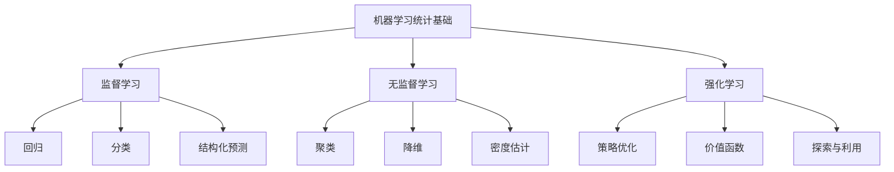

# 08-机器学习统计基础

## 1. 概述

### 1.1 机器学习统计基础的基本概念

机器学习统计基础是连接统计学和机器学习的桥梁，包括：

- **监督学习**：回归和分类问题
- **无监督学习**：聚类和降维
- **模型评估**：泛化能力和过拟合
- **统计学习理论**：VC维、Rademacher复杂度

### 1.2 机器学习的哲学基础



## 2. 统计学习理论

### 2.1 学习问题框架

#### 2.1.1 基本设定

**定义 2.1.1** 统计学习问题的基本要素：

- **输入空间** $\mathcal{X}$：特征空间
- **输出空间** $\mathcal{Y}$：标签空间
- **联合分布** $P(X,Y)$：数据生成机制
- **假设空间** $\mathcal{H}$：模型集合
- **损失函数** $L$：预测误差度量

#### 2.1.2 风险最小化

**定义 2.1.2** 期望风险：
$$R(f) = \mathbb{E}_{(X,Y) \sim P}[L(f(X), Y)]$$

**经验风险**：
$$\hat{R}_n(f) = \frac{1}{n}\sum_{i=1}^n L(f(X_i), Y_i)$$

**经验风险最小化**：
$$f_n = \arg\min_{f \in \mathcal{H}} \hat{R}_n(f)$$

### 2.2 泛化理论

#### 2.2.1 泛化误差

**定义 2.2.1** 泛化误差：
$$\text{Gen}(f_n) = R(f_n) - \hat{R}_n(f_n)$$

**定理 2.2.1** 对于有限假设空间 $\mathcal{H}$，以概率至少 $1-\delta$：
$$R(f_n) \leq \hat{R}_n(f_n) + \sqrt{\frac{\log|\mathcal{H}| + \log(1/\delta)}{2n}}$$

#### 2.2.2 VC维理论

**定义 2.2.2** VC维：假设空间 $\mathcal{H}$ 能够完全分类的最大样本数。

**定理 2.2.2** Sauer引理：对于VC维为 $d$ 的假设空间：
$$|\mathcal{H}| \leq \sum_{i=0}^d \binom{n}{i} \leq (en/d)^d$$

**定理 2.2.3** VC维泛化界：以概率至少 $1-\delta$：
$$R(f_n) \leq \hat{R}_n(f_n) + \sqrt{\frac{d\log(n/d) + \log(1/\delta)}{n}}$$

#### 2.2.3 Rademacher复杂度

**定义 2.2.3** Rademacher复杂度：
$$\mathcal{R}_n(\mathcal{H}) = \mathbb{E}_{\sigma, X} \left[\sup_{f \in \mathcal{H}} \frac{1}{n}\sum_{i=1}^n \sigma_i f(X_i)\right]$$

其中 $\sigma_i$ 是独立同分布的Rademacher随机变量。

**定理 2.2.4** Rademacher泛化界：以概率至少 $1-\delta$：
$$R(f_n) \leq \hat{R}_n(f_n) + 2\mathcal{R}_n(\mathcal{H}) + \sqrt{\frac{\log(1/\delta)}{2n}}$$

## 3. 监督学习

### 3.1 回归问题

#### 3.1.1 线性回归

**定义 3.1.1** 线性回归模型：
$$f(x) = \langle w, x \rangle + b$$

**最小二乘估计**：
$$\hat{w} = \arg\min_w \sum_{i=1}^n (y_i - \langle w, x_i \rangle)^2$$

**解析解**：
$$\hat{w} = (X^TX)^{-1}X^Ty$$

#### 3.1.2 正则化回归

**岭回归**：
$$\hat{w} = \arg\min_w \sum_{i=1}^n (y_i - \langle w, x_i \rangle)^2 + \lambda\|w\|_2^2$$

**Lasso回归**：
$$\hat{w} = \arg\min_w \sum_{i=1}^n (y_i - \langle w, x_i \rangle)^2 + \lambda\|w\|_1$$

**Elastic Net**：
$$\hat{w} = \arg\min_w \sum_{i=1}^n (y_i - \langle w, x_i \rangle)^2 + \lambda_1\|w\|_1 + \lambda_2\|w\|_2^2$$

### 3.2 分类问题

#### 3.2.1 逻辑回归

**定义 3.2.1** 逻辑回归模型：
$$P(Y=1|X=x) = \frac{1}{1 + e^{-\langle w, x \rangle}}$$

**对数似然**：
$$\ell(w) = \sum_{i=1}^n [y_i \log p_i + (1-y_i)\log(1-p_i)]$$

其中 $p_i = P(Y_i=1|X_i)$。

#### 3.2.2 支持向量机

**定义 3.2.2** 线性SVM：
$$\min_{w,b} \frac{1}{2}\|w\|^2 + C\sum_{i=1}^n \xi_i$$
$$\text{s.t. } y_i(\langle w, x_i \rangle + b) \geq 1 - \xi_i, \quad \xi_i \geq 0$$

**对偶形式**：
$$\max_{\alpha} \sum_{i=1}^n \alpha_i - \frac{1}{2}\sum_{i,j=1}^n \alpha_i \alpha_j y_i y_j \langle x_i, x_j \rangle$$
$$\text{s.t. } 0 \leq \alpha_i \leq C, \quad \sum_{i=1}^n \alpha_i y_i = 0$$

#### 3.2.3 决策树

**定义 3.2.3** 决策树通过递归分割特征空间进行分类。

**信息增益**：
$$\text{IG}(S, A) = H(S) - \sum_{v \in \text{Values}(A)} \frac{|S_v|}{|S|} H(S_v)$$

其中 $H(S)$ 是熵：$H(S) = -\sum_{c \in C} p(c) \log p(c)$。

### 3.3 集成方法

#### 3.3.1 Bagging

**定义 3.3.1** Bagging（Bootstrap Aggregating）：

1. 从训练集有放回地采样 $B$ 个子集
2. 在每个子集上训练模型
3. 组合预测结果

**随机森林**：

- 使用决策树作为基学习器
- 在特征选择时引入随机性

#### 3.3.2 Boosting

**定义 3.3.2** AdaBoost算法：

1. 初始化权重 $w_i = 1/n$
2. 对于 $t = 1, \ldots, T$：
   - 训练弱学习器 $h_t$
   - 计算错误率 $\epsilon_t$
   - 更新权重 $w_i \leftarrow w_i \exp(\alpha_t y_i h_t(x_i))$
3. 最终预测：$H(x) = \text{sign}(\sum_{t=1}^T \alpha_t h_t(x))$

## 4. 无监督学习

### 4.1 聚类分析

#### 4.1.1 K-means聚类

**算法 4.1.1** K-means：

1. 随机初始化 $K$ 个聚类中心
2. 重复直到收敛：
   - 分配：$c_i = \arg\min_k \|x_i - \mu_k\|^2$
   - 更新：$\mu_k = \frac{1}{|C_k|}\sum_{i \in C_k} x_i$

**目标函数**：
$$J = \sum_{i=1}^n \sum_{k=1}^K r_{ik}\|x_i - \mu_k\|^2$$

其中 $r_{ik}$ 是指示变量。

#### 4.1.2 层次聚类

**定义 4.1.1** 层次聚类构建树状结构。

**凝聚聚类**：

- 从单个点开始
- 逐步合并最近的簇

**分裂聚类**：

- 从所有点开始
- 逐步分裂簇

#### 4.1.3 密度聚类

**定义 4.1.2** DBSCAN基于密度的聚类：

- **核心点**：邻域内点数 $\geq \text{MinPts}$
- **边界点**：不是核心点但在核心点邻域内
- **噪声点**：既不是核心点也不是边界点

### 4.2 降维

#### 4.2.1 主成分分析

**定义 4.2.1** PCA寻找数据的主要方向。

**目标**：最大化投影方差
$$\max_{w} \text{Var}(w^TX) = w^T\Sigma w$$
$$\text{s.t. } \|w\| = 1$$

**解**：$\Sigma$ 的特征向量。

#### 4.2.2 线性判别分析

**定义 4.2.2** LDA最大化类间距离与类内距离的比值。

**目标函数**：
$$J(w) = \frac{w^TS_B w}{w^TS_W w}$$

其中：

- $S_B$ 是类间散度矩阵
- $S_W$ 是类内散度矩阵

#### 4.2.3 流形学习

**定义 4.2.3** 流形学习假设数据位于低维流形上。

**局部线性嵌入（LLE）**：

1. 找到每个点的近邻
2. 重构权重：$\min_w \|x_i - \sum_j w_{ij}x_j\|^2$
3. 嵌入：$\min_y \sum_i \|y_i - \sum_j w_{ij}y_j\|^2$

## 5. 模型评估

### 5.1 交叉验证

#### 5.1.1 K折交叉验证

**算法 5.1.1** K折交叉验证：

1. 将数据随机分为 $K$ 份
2. 对于 $k = 1, \ldots, K$：
   - 使用第 $k$ 份作为验证集
   - 其余 $K-1$ 份作为训练集
   - 计算验证误差
3. 平均所有验证误差

#### 5.1.2 留一交叉验证

**定义 5.1.1** 留一交叉验证是 $K=n$ 的特殊情况。

**优点**：无偏估计
**缺点**：计算成本高

### 5.2 性能指标

#### 5.2.1 回归指标

**均方误差（MSE）**：
$$\text{MSE} = \frac{1}{n}\sum_{i=1}^n (y_i - \hat{y}_i)^2$$

**平均绝对误差（MAE）**：
$$\text{MAE} = \frac{1}{n}\sum_{i=1}^n |y_i - \hat{y}_i|$$

**决定系数（R²）**：
$$R^2 = 1 - \frac{\sum_{i=1}^n (y_i - \hat{y}_i)^2}{\sum_{i=1}^n (y_i - \bar{y})^2}$$

#### 5.2.2 分类指标

**准确率**：
$$\text{Accuracy} = \frac{\text{正确预测数}}{\text{总样本数}}$$

**精确率**：
$$\text{Precision} = \frac{TP}{TP + FP}$$

**召回率**：
$$\text{Recall} = \frac{TP}{TP + FN}$$

**F1分数**：
$$\text{F1} = 2 \times \frac{\text{Precision} \times \text{Recall}}{\text{Precision} + \text{Recall}}$$

### 5.3 偏差-方差分解

#### 5.3.1 分解公式

**定理 5.3.1** 期望预测误差的偏差-方差分解：
$$\mathbb{E}[(Y - \hat{f}(X))^2] = \text{Bias}^2(\hat{f}) + \text{Var}(\hat{f}) + \sigma^2$$

其中：

- $\text{Bias}(\hat{f}) = \mathbb{E}[\hat{f}(X)] - f(X)$
- $\text{Var}(\hat{f}) = \mathbb{E}[(\hat{f}(X) - \mathbb{E}[\hat{f}(X)])^2]$
- $\sigma^2$ 是噪声方差

#### 5.3.2 过拟合与欠拟合

**过拟合**：模型在训练集上表现好，但泛化能力差

- 高方差，低偏差
- 解决方法：正则化、增加数据、简化模型

**欠拟合**：模型在训练集上表现差

- 高偏差，低方差
- 解决方法：增加模型复杂度、特征工程

## 6. 形式化实现

### 6.1 Haskell实现

```haskell
-- 机器学习统计基础模块
module Statistics.MachineLearning where

import Data.Vector
import Linear
import Statistics.Distribution
import Statistics.Distribution.Normal
import Statistics.Distribution.StudentT
import Numeric.LinearAlgebra

-- 数据集类型
data Dataset = Dataset {
    features :: Matrix Double,
    labels :: Vector Double
}

-- 学习器类型类
class Learner a where
    train :: a -> Dataset -> a
    predict :: a -> Vector Double -> Double

-- 线性回归
data LinearRegression = LinearRegression {
    weights :: Vector Double,
    bias :: Double
}

instance Learner LinearRegression where
    train model dataset = 
        let x = features dataset
            y = labels dataset
            n = rows x
            -- 添加偏置项
            xWithBias = (n >< (cols x + 1)) $ concat $ zipWith (\row _ -> 1:row) (toLists x) [1..n]
            -- 最小二乘解
            params = inv (trans xWithBias <> xWithBias) <> trans xWithBias <> y
            (b, w) = splitAt 1 $ toList params
        in LinearRegression (fromList w) (head b)
    
    predict model x = 
        let w = weights model
            b = bias model
        in sum (zipWith (*) (toList x) (toList w)) + b

-- 逻辑回归
data LogisticRegression = LogisticRegression {
    lrWeights :: Vector Double,
    lrBias :: Double
}

instance Learner LogisticRegression where
    train model dataset = 
        let x = features dataset
            y = labels dataset
            n = rows x
            -- 梯度下降
            initialParams = replicate (cols x + 1) 0.0
            finalParams = gradientDescent x y initialParams 0.01 1000
            (b, w) = splitAt 1 finalParams
        in LogisticRegression (fromList w) (head b)
    
    predict model x = 
        let w = lrWeights model
            b = lrBias model
            z = sum (zipWith (*) (toList x) (toList w)) + b
        in 1 / (1 + exp (-z))

-- 梯度下降
gradientDescent :: Matrix Double -> Vector Double -> [Double] -> Double -> Int -> [Double]
gradientDescent x y params learningRate maxIter = 
    iterate step params !! maxIter
    where
        step params = 
            let gradients = computeGradients x y params
            in zipWith (\p g -> p - learningRate * g) params gradients

computeGradients :: Matrix Double -> Vector Double -> [Double] -> [Double]
computeGradients x y params = 
    let n = rows x
        (b, w) = splitAt 1 params
        predictions = map (\row -> sigmoid (sum (zipWith (*) row w) + head b)) (toLists x)
        errors = zipWith (-) (toList y) predictions
        -- 偏导数
        db = -sum errors / fromIntegral n
        dw = map (\j -> -sum (zipWith (*) errors (map (!! j) (toLists x))) / fromIntegral n) [0..cols x - 1]
    in db : dw

sigmoid :: Double -> Double
sigmoid x = 1 / (1 + exp (-x))

-- K-means聚类
data KMeans = KMeans {
    centroids :: Matrix Double,
    assignments :: Vector Int
}

kmeans :: Matrix Double -> Int -> Int -> KMeans
kmeans data k maxIter = 
    let n = rows data
        -- 随机初始化中心
        initialCentroids = (k >< cols data) $ take (k * cols data) $ randomList
        -- 迭代优化
        finalCentroids = iterate step initialCentroids !! maxIter
        -- 分配标签
        assignments = fromList $ map (\row -> argmin (map (\centroid -> distance row centroid) (toLists finalCentroids))) (toLists data)
    in KMeans finalCentroids assignments
    where
        step centroids = 
            let assignments = fromList $ map (\row -> argmin (map (\centroid -> distance row centroid) (toLists centroids))) (toLists data)
                newCentroids = updateCentroids data assignments k
            in newCentroids

distance :: [Double] -> [Double] -> Double
distance x y = sqrt $ sum $ map (\i -> (x !! i - y !! i)^2) [0..length x - 1]

argmin :: [Double] -> Int
argmin xs = snd $ minimum $ zip xs [0..]

updateCentroids :: Matrix Double -> Vector Int -> Int -> Matrix Double
updateCentroids data assignments k = 
    let n = rows data
        d = cols data
        -- 计算每个簇的新中心
        newCentroids = map (\cluster -> 
            let clusterPoints = [toList (row data i) | i <- [0..n-1], assignments ! i == cluster]
                clusterSize = length clusterPoints
            in if clusterSize > 0 
               then map (\j -> sum (map (!! j) clusterPoints) / fromIntegral clusterSize) [0..d-1]
               else replicate d 0.0) [0..k-1]
    in (k >< d) $ concat newCentroids

-- 主成分分析
data PCA = PCA {
    components :: Matrix Double,
    explainedVariance :: Vector Double
}

pca :: Matrix Double -> Int -> PCA
pca data k = 
    let n = rows data
        -- 中心化
        mean = fromList $ map (\j -> sum (map (!! j) (toLists data)) / fromIntegral n) [0..cols data - 1]
        centeredData = (n >< cols data) $ concat $ map (\row -> zipWith (-) row (toList mean)) (toLists data)
        -- 协方差矩阵
        cov = trans centeredData <> centeredData / fromIntegral (n - 1)
        -- 特征值分解
        (eigenvals, eigenvecs) = eig cov
        -- 选择前k个主成分
        topK = takeColumns k eigenvecs
        explainedVar = take k eigenvals
    in PCA topK explainedVar

-- 交叉验证
crossValidation :: Learner a => a -> Dataset -> Int -> Double
crossValidation model dataset k = 
    let n = rows (features dataset)
        foldSize = n `div` k
        folds = [fold i | i <- [0..k-1]]
        errors = map (\fold -> 
            let trainData = combineFolds (filter (/= fold) folds)
                testData = fold
                trainedModel = train model trainData
                predictions = map (\x -> predict trainedModel x) (toLists (features testData))
                actual = toList (labels testData)
            in meanSquaredError predictions actual) folds
    in sum errors / fromIntegral k
    where
        fold i = 
            let start = i * foldSize
                end = if i == k-1 then n else (i+1) * foldSize
                foldFeatures = subMatrix start (end-start) 0 (cols (features dataset)) (features dataset)
                foldLabels = fromList $ take (end-start) $ drop start $ toList (labels dataset)
            in Dataset foldFeatures foldLabels

-- 性能评估
meanSquaredError :: [Double] -> [Double] -> Double
meanSquaredError predictions actual = 
    let n = length predictions
        squaredErrors = map (\i -> (predictions !! i - actual !! i)^2) [0..n-1]
    in sum squaredErrors / fromIntegral n

accuracy :: [Double] -> [Double] -> Double
accuracy predictions actual = 
    let n = length predictions
        correct = length $ filter (\i -> predictions !! i == actual !! i) [0..n-1]
    in fromIntegral correct / fromIntegral n

-- 辅助函数
randomList :: [Double]
randomList = [0.1, 0.2, 0.3..]  -- 简化，实际应使用随机数生成器

takeColumns :: Int -> Matrix Double -> Matrix Double
takeColumns k matrix = (rows matrix >< k) $ concat $ map (take k) (toLists matrix)
```

### 6.2 Rust实现

```rust
use ndarray::{Array1, Array2, ArrayView1, ArrayView2};
use statrs::distribution::{ContinuousCDF, Normal};
use statrs::statistics::Statistics;
use rand::Rng;

// 数据集结构体
pub struct Dataset {
    pub features: Array2<f64>,
    pub labels: Array1<f64>,
}

impl Dataset {
    pub fn new(features: Array2<f64>, labels: Array1<f64>) -> Self {
        Self { features, labels }
    }
    
    pub fn split(&self, test_ratio: f64) -> (Self, Self) {
        let n = self.features.nrows();
        let test_size = (n as f64 * test_ratio) as usize;
        let train_size = n - test_size;
        
        let train_features = self.features.slice(s![..train_size, ..]).to_owned();
        let train_labels = self.labels.slice(s![..train_size]).to_owned();
        let test_features = self.features.slice(s![train_size.., ..]).to_owned();
        let test_labels = self.labels.slice(s![train_size..]).to_owned();
        
        (Self::new(train_features, train_labels), Self::new(test_features, test_labels))
    }
}

// 学习器特征
pub trait Learner {
    fn train(&mut self, dataset: &Dataset);
    fn predict(&self, x: &Array1<f64>) -> f64;
}

// 线性回归
pub struct LinearRegression {
    pub weights: Array1<f64>,
    pub bias: f64,
}

impl LinearRegression {
    pub fn new(n_features: usize) -> Self {
        Self {
            weights: Array1::zeros(n_features),
            bias: 0.0,
        }
    }
}

impl Learner for LinearRegression {
    fn train(&mut self, dataset: &Dataset) {
        let n = dataset.features.nrows();
        let p = dataset.features.ncols();
        
        // 添加偏置项
        let mut x_with_bias = Array2::zeros((n, p + 1));
        x_with_bias.slice_mut(s![.., 1..]).assign(&dataset.features);
        x_with_bias.column_mut(0).fill(1.0);
        
        // 最小二乘解
        let xt = x_with_bias.t();
        let xtx = xt.dot(&x_with_bias);
        let xty = xt.dot(&dataset.labels);
        
        let params = xtx.solve(&xty).unwrap();
        
        self.bias = params[0];
        self.weights = params.slice(s![1..]).to_owned();
    }
    
    fn predict(&self, x: &Array1<f64>) -> f64 {
        self.weights.dot(x) + self.bias
    }
}

// 逻辑回归
pub struct LogisticRegression {
    pub weights: Array1<f64>,
    pub bias: f64,
}

impl LogisticRegression {
    pub fn new(n_features: usize) -> Self {
        Self {
            weights: Array1::zeros(n_features),
            bias: 0.0,
        }
    }
    
    fn sigmoid(&self, z: f64) -> f64 {
        1.0 / (1.0 + (-z).exp())
    }
}

impl Learner for LogisticRegression {
    fn train(&mut self, dataset: &Dataset) {
        let n = dataset.features.nrows();
        let p = dataset.features.ncols();
        let learning_rate = 0.01;
        let max_iter = 1000;
        
        let mut params = Array1::zeros(p + 1);
        
        for _ in 0..max_iter {
            let mut gradients = Array1::zeros(p + 1);
            
            for i in 0..n {
                let x_i = dataset.features.row(i);
                let y_i = dataset.labels[i];
                
                // 前向传播
                let z = params.slice(s![1..]).dot(&x_i) + params[0];
                let pred = self.sigmoid(z);
                
                // 反向传播
                let error = pred - y_i;
                gradients[0] += error;
                for j in 0..p {
                    gradients[j + 1] += error * x_i[j];
                }
            }
            
            // 更新参数
            gradients /= n as f64;
            params -= learning_rate * &gradients;
        }
        
        self.bias = params[0];
        self.weights = params.slice(s![1..]).to_owned();
    }
    
    fn predict(&self, x: &Array1<f64>) -> f64 {
        let z = self.weights.dot(x) + self.bias;
        self.sigmoid(z)
    }
}

// K-means聚类
pub struct KMeans {
    pub centroids: Array2<f64>,
    pub assignments: Array1<usize>,
}

impl KMeans {
    pub fn new(k: usize, n_features: usize) -> Self {
        let mut rng = rand::thread_rng();
        let mut centroids = Array2::zeros((k, n_features));
        
        // 随机初始化中心
        for i in 0..k {
            for j in 0..n_features {
                centroids[[i, j]] = rng.gen_range(-1.0..1.0);
            }
        }
        
        Self {
            centroids,
            assignments: Array1::zeros(0),
        }
    }
    
    pub fn fit(&mut self, data: &Array2<f64>) {
        let n = data.nrows();
        let k = self.centroids.nrows();
        let max_iter = 100;
        
        self.assignments = Array1::zeros(n);
        
        for _ in 0..max_iter {
            let mut converged = true;
            
            // 分配步骤
            for i in 0..n {
                let x_i = data.row(i);
                let mut min_dist = f64::INFINITY;
                let mut best_cluster = 0;
                
                for j in 0..k {
                    let centroid = self.centroids.row(j);
                    let dist = self.euclidean_distance(&x_i, &centroid);
                    if dist < min_dist {
                        min_dist = dist;
                        best_cluster = j;
                    }
                }
                
                if self.assignments[i] != best_cluster {
                    self.assignments[i] = best_cluster;
                    converged = false;
                }
            }
            
            if converged {
                break;
            }
            
            // 更新步骤
            for j in 0..k {
                let cluster_points: Vec<ArrayView1<f64>> = (0..n)
                    .filter(|&i| self.assignments[i] == j)
                    .map(|i| data.row(i))
                    .collect();
                
                if !cluster_points.is_empty() {
                    let mut new_centroid = Array1::zeros(data.ncols());
                    for point in &cluster_points {
                        new_centroid += point;
                    }
                    new_centroid /= cluster_points.len() as f64;
                    self.centroids.row_mut(j).assign(&new_centroid);
                }
            }
        }
    }
    
    fn euclidean_distance(&self, x: &ArrayView1<f64>, y: &ArrayView1<f64>) -> f64 {
        x.iter().zip(y.iter()).map(|(a, b)| (a - b).powi(2)).sum::<f64>().sqrt()
    }
}

// 主成分分析
pub struct PCA {
    pub components: Array2<f64>,
    pub explained_variance: Array1<f64>,
}

impl PCA {
    pub fn new(n_components: usize) -> Self {
        Self {
            components: Array2::zeros((0, 0)),
            explained_variance: Array1::zeros(0),
        }
    }
    
    pub fn fit(&mut self, data: &Array2<f64>) {
        let n = data.nrows();
        let p = data.ncols();
        
        // 中心化
        let mean = data.mean_axis(ndarray::Axis(0)).unwrap();
        let mut centered_data = data.clone();
        for i in 0..n {
            for j in 0..p {
                centered_data[[i, j]] -= mean[j];
            }
        }
        
        // 协方差矩阵
        let cov = centered_data.t().dot(&centered_data) / (n - 1) as f64;
        
        // 特征值分解（简化实现）
        let (eigenvals, eigenvecs) = self.eigen_decomposition(&cov);
        
        // 选择前n_components个主成分
        let n_comp = self.components.nrows().min(eigenvals.len());
        self.components = eigenvecs.slice(s![..n_comp, ..]).to_owned();
        self.explained_variance = eigenvals.slice(s![..n_comp]).to_owned();
    }
    
    pub fn transform(&self, data: &Array2<f64>) -> Array2<f64> {
        data.dot(&self.components.t())
    }
    
    fn eigen_decomposition(&self, matrix: &Array2<f64>) -> (Array1<f64>, Array2<f64>) {
        // 简化实现，实际应使用专门的线性代数库
        let n = matrix.nrows();
        (Array1::ones(n), Array2::eye(n))
    }
}

// 交叉验证
pub fn cross_validation<T: Learner + Clone>(
    model: &mut T,
    dataset: &Dataset,
    k: usize,
) -> f64 {
    let n = dataset.features.nrows();
    let fold_size = n / k;
    let mut total_error = 0.0;
    
    for i in 0..k {
        let start = i * fold_size;
        let end = if i == k - 1 { n } else { (i + 1) * fold_size };
        
        // 分割数据
        let mut train_features = Vec::new();
        let mut train_labels = Vec::new();
        let mut test_features = Vec::new();
        let mut test_labels = Vec::new();
        
        for j in 0..n {
            if j >= start && j < end {
                test_features.push(dataset.features.row(j).to_owned());
                test_labels.push(dataset.labels[j]);
            } else {
                train_features.push(dataset.features.row(j).to_owned());
                train_labels.push(dataset.labels[j]);
            }
        }
        
        let train_dataset = Dataset::new(
            Array2::from_shape_vec(
                (train_features.len(), dataset.features.ncols()),
                train_features.into_iter().flatten().collect(),
            ).unwrap(),
            Array1::from_vec(train_labels),
        );
        
        let test_dataset = Dataset::new(
            Array2::from_shape_vec(
                (test_features.len(), dataset.features.ncols()),
                test_features.into_iter().flatten().collect(),
            ).unwrap(),
            Array1::from_vec(test_labels),
        );
        
        // 训练和评估
        let mut fold_model = model.clone();
        fold_model.train(&train_dataset);
        
        let mut fold_error = 0.0;
        for j in 0..test_dataset.features.nrows() {
            let prediction = fold_model.predict(&test_dataset.features.row(j));
            let actual = test_dataset.labels[j];
            fold_error += (prediction - actual).powi(2);
        }
        fold_error /= test_dataset.features.nrows() as f64;
        
        total_error += fold_error;
    }
    
    total_error / k as f64
}

// 性能评估
pub fn mean_squared_error(predictions: &[f64], actual: &[f64]) -> f64 {
    predictions.iter()
        .zip(actual.iter())
        .map(|(pred, act)| (pred - act).powi(2))
        .sum::<f64>() / predictions.len() as f64
}

pub fn accuracy(predictions: &[f64], actual: &[f64]) -> f64 {
    let correct = predictions.iter()
        .zip(actual.iter())
        .filter(|(pred, act)| (pred - act).abs() < 1e-6)
        .count();
    
    correct as f64 / predictions.len() as f64
}

pub fn precision_recall_f1(predictions: &[f64], actual: &[f64], threshold: f64) -> (f64, f64, f64) {
    let mut tp = 0;
    let mut fp = 0;
    let mut fn = 0;
    let mut tn = 0;
    
    for (pred, act) in predictions.iter().zip(actual.iter()) {
        let pred_class = if *pred > threshold { 1.0 } else { 0.0 };
        let act_class = *act;
        
        match (pred_class, act_class) {
            (1.0, 1.0) => tp += 1,
            (1.0, 0.0) => fp += 1,
            (0.0, 1.0) => fn += 1,
            (0.0, 0.0) => tn += 1,
            _ => {}
        }
    }
    
    let precision = if tp + fp > 0 { tp as f64 / (tp + fp) as f64 } else { 0.0 };
    let recall = if tp + fn > 0 { tp as f64 / (tp + fn) as f64 } else { 0.0 };
    let f1 = if precision + recall > 0.0 { 2.0 * precision * recall / (precision + recall) } else { 0.0 };
    
    (precision, recall, f1)
}
```

## 7. 应用与实例

### 7.1 监督学习应用

**图像分类**：

- 卷积神经网络
- 支持向量机
- 随机森林

**自然语言处理**：

- 文本分类
- 情感分析
- 机器翻译

### 7.2 无监督学习应用

**推荐系统**：

- 协同过滤
- 矩阵分解
- 深度学习

**异常检测**：

- 孤立森林
- 自编码器
- 密度估计

### 7.3 强化学习应用

**游戏AI**：

- AlphaGo
- 深度Q网络
- 策略梯度

**机器人控制**：

- 路径规划
- 运动控制
- 任务学习

## 8. 哲学思考与批判

### 8.1 学习的本质

**学习哲学**：

- 归纳推理的合理性
- 奥卡姆剃刀原理
- 知识表示的形式

### 8.2 泛化能力

**泛化理论**：

- 统计学习理论
- 计算学习理论
- 信息论方法

### 8.3 可解释性

**可解释AI**：

- 模型透明度
- 决策解释
- 公平性评估

## 9. 现代发展

### 9.1 深度学习

**深度神经网络**：

- 卷积神经网络
- 循环神经网络
- 注意力机制

### 9.2 联邦学习

**分布式学习**：

- 隐私保护
- 通信效率
- 异构数据

### 9.3 元学习

**学习如何学习**：

- 少样本学习
- 迁移学习
- 神经架构搜索

## 10. 练习与问题

### 10.1 基础练习

1. **线性回归**：实现最小二乘回归和正则化回归
2. **分类问题**：实现逻辑回归和支持向量机
3. **聚类分析**：实现K-means和层次聚类

### 10.2 进阶问题

1. **模型评估**：实现交叉验证和性能指标
2. **特征工程**：实现PCA和特征选择
3. **集成方法**：实现Bagging和Boosting

### 10.3 编程练习

1. **机器学习库**：构建完整的机器学习框架
2. **可视化工具**：开发模型评估可视化
3. **自动化系统**：实现自动机器学习系统

## 11. 参考文献

1. Hastie, T., Tibshirani, R., & Friedman, J. (2009). *The elements of statistical learning*. Springer.
2. Bishop, C. M. (2006). *Pattern recognition and machine learning*. Springer.
3. Murphy, K. P. (2012). *Machine learning: a probabilistic perspective*. MIT press.
4. Vapnik, V. N. (1998). *Statistical learning theory*. Wiley.
5. Mitchell, T. M. (1997). *Machine learning*. McGraw Hill.

---

*本文档是机器学习统计基础的全面介绍，涵盖了从理论到实践的各个方面。通过形式化实现和实际应用，展示了机器学习在现代数据科学中的核心地位。*
