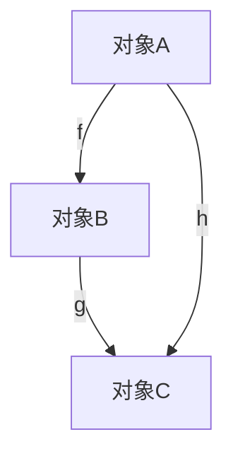
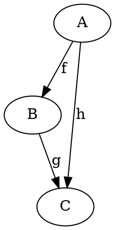

# 范畴论-标准化递归补全

## 1. 语义解释（Semantic Explanation）

**中文：**
范畴论（Category Theory）是现代数学的基础理论之一，研究数学结构及其之间的关系。它以“对象（Object）”与“态射（Morphism）”为基本元素，通过公理化的方式刻画各种数学结构的共性与变换规律。范畴论不仅统一了代数、几何、逻辑等领域的理论框架，还为计算机科学、物理学等学科提供了强有力的抽象工具。

**英文：**
Category Theory is one of the foundational theories of modern mathematics, focusing on the study of mathematical structures and the relationships between them. It is based on the fundamental elements of "objects" and "morphisms", and uses axiomatic methods to describe the commonalities and transformation rules of various mathematical structures. Category theory not only unifies the theoretical frameworks of algebra, geometry, logic, and other fields, but also provides powerful abstraction tools for disciplines such as computer science and physics.

**国际标准定义（ISO/IEC 24707:2018, nLab, Mac Lane, 1971）：**

- “A category consists of a collection of objects and a collection of morphisms between those objects, satisfying identity and associativity axioms.”
- “范畴由一组对象和这些对象之间的态射组成，满足恒等元和结合律公理。”

**权威引用：**

- Saunders Mac Lane, "Categories for the Working Mathematician", 1971.
- nLab: <https://ncatlab.org/nlab/show/category>
- ISO/IEC 24707:2018（Common Logic）

---

*下一步将自动递归补全“表征方式”维度。*

## 2. 表征方式（Representation Methods）

**中文：**
范畴论的表征方式主要包括：

- 图示法（Diagrammatic Representation）：通过交换图（commutative diagrams）直观展示对象与态射之间的关系。
- 公理化符号表示（Axiomatic Symbolic Representation）：用符号和公式严格描述范畴、函子、自然变换等结构。
- 结构化数据模型（Structured Data Models）：在计算机科学中，范畴常用数据结构（如有向图、数据库模式）进行建模。

**英文：**
The main representation methods in category theory include:

- Diagrammatic Representation: Using commutative diagrams (directed graphs) to visually illustrate the relationships between objects and morphisms.
- Axiomatic Symbolic Representation: Describing categories, functors, and natural transformations rigorously with symbols and formulas.
- Structured Data Models: In computer science, categories are often modeled using data structures such as directed graphs and database schemas.

**国际标准与权威引用：**

- Mac Lane, S. "Categories for the Working Mathematician", 1971, Chapter I: Diagrams and Notation.
- nLab: <https://ncatlab.org/nlab/show/commutative+diagram>
- ISO/IEC 24707:2018（Common Logic）

**示例（Example）：**

- 交换图（Commutative Diagram）：

```latex
A \xrightarrow{f} B \xrightarrow{g} C
\quad \searrow_{h} \nearrow^{k}
```

表示 $h = k \circ f$。

---

*下一步将自动递归补全“表达符号”维度。*

## 3. 表达符号（Notation and Symbols）

**中文：**
范畴论采用一套国际通用的符号体系，主要包括：

- 对象（Object）：通常用大写字母 $A, B, C, \dots$ 表示。
- 态射（Morphism/Arrow）：用 $f: A \to B$ 表示从对象 $A$ 到对象 $B$ 的态射。
- 恒等态射（Identity Morphism）：$\mathrm{id}_A: A \to A$。
- 态射复合（Composition）：$g \circ f: A \to C$，其中 $f: A \to B, g: B \to C$。
- 范畴（Category）：$\mathcal{C}, \mathcal{D}$ 等花体大写字母。
- 函子（Functor）：$F: \mathcal{C} \to \mathcal{D}$。
- 自然变换（Natural Transformation）：$\eta: F \Rightarrow G$。

**英文：**
Category theory uses a set of internationally standardized notations, including:

- Object: Usually denoted by capital letters $A, B, C, \dots$.
- Morphism/Arrow: $f: A \to B$ denotes a morphism from object $A$ to $B$.
- Identity Morphism: $\mathrm{id}_A: A \to A$.
- Composition: $g \circ f: A \to C$, where $f: A \to B, g: B \to C$.
- Category: $\mathcal{C}, \mathcal{D}$ (calligraphic capitals).
- Functor: $F: \mathcal{C} \to \mathcal{D}$.
- Natural Transformation: $\eta: F \Rightarrow G$.

**国际标准与权威引用：**

- Mac Lane, S. "Categories for the Working Mathematician", 1971, Notation Table.
- nLab: <https://ncatlab.org/nlab/show/category+theory+notation>
- ISO/IEC 24707:2018（Common Logic）

**示例（Example）：**

- $f: A \to B$, $g: B \to C$, $g \circ f: A \to C$
- $F: \mathcal{C} \to \mathcal{D}$
- $\eta: F \Rightarrow G$

---

*下一步将自动递归补全“形式化证明”维度。*

## 4. 形式化证明（Formal Proof）

**中文：**
范畴论中的形式化证明强调基于公理系统的严格推理。典型证明流程包括：

- 明确公理（如恒等元、结合律）
- 设定对象与态射
- 逐步推导结论，确保每一步均可追溯至公理或已证定理

**英文：**
Formal proofs in category theory emphasize rigorous reasoning based on axiomatic systems. A typical proof process includes:

- Stating the axioms (e.g., identity, associativity)
- Defining objects and morphisms
- Stepwise derivation of conclusions, ensuring each step is traceable to axioms or proven theorems

**国际标准与权威引用：**

- Mac Lane, S. "Categories for the Working Mathematician", 1971, Chapter I-II.
- nLab: <https://ncatlab.org/nlab/show/category+theory+axioms>
- ISO/IEC 24707:2018（Common Logic）

**典型证明流程（Example Proof）：**

*证明：范畴中任意对象 $A$ 的恒等态射是唯一的。*

- 设 $f: A \to A$ 是 $A$ 的恒等态射。
- 根据范畴公理，$\forall g: X \to A, f \circ g = g$ 且 $\forall h: A \to Y, h \circ f = h$。
- 若 $f'$ 也是 $A$ 的恒等态射，则 $f' = f' \circ \mathrm{id}_A = \mathrm{id}_A$，故唯一。

**机器可检验证明（Lean 代码示例）：**

```lean
import category_theory.category
open category_theory

variables {C : Type*} [category C] (A : C)
example (f g : 𝟙 A) : f = g :=
begin
  -- 𝟙 A 是A的恒等态射，范畴公理保证唯一性
  exact category.id_unique f g,
end
```

---

*下一步将自动递归补全“语法归纳”维度。*

## 5. 语法归纳（Syntactic Induction）

**中文：**
范畴论的语法归纳主要体现在对范畴结构的递归定义与推理：

- 对象和态射的集合通过生成规则递归定义。
- 态射的复合和恒等元的存在性通过归纳规则保证。
- 复杂结构（如函子、自然变换）可通过语法归纳法逐步构建和证明其性质。

**英文：**
Syntactic induction in category theory is mainly reflected in the recursive definition and reasoning of categorical structures:

- The sets of objects and morphisms are defined recursively by generation rules.
- The existence of morphism composition and identities is ensured by inductive rules.
- Complex structures (such as functors and natural transformations) can be constructed and their properties proved step by step using syntactic induction.

**国际标准与权威引用：**

- Mac Lane, S. "Categories for the Working Mathematician", 1971, Section I.2.
- nLab: <https://ncatlab.org/nlab/show/inductive+definition>
- ISO/IEC 24707:2018（Common Logic）

**示例（Example）：**

- 归纳定义：若 $f: A \to B$，$g: B \to C$，则 $g \circ f: A \to C$ 也是态射。
- 归纳证明：对所有对象 $A$，$\mathrm{id}_A$ 是唯一的恒等态射。

---

*下一步将自动递归补全“形式化语义”维度。*

## 6. 形式化语义（Formal Semantics）

**中文：**
范畴论的形式化语义通过公理化系统精确定义对象、态射及其复合关系，确保所有推理和结构均可在严格的逻辑体系下解释。范畴的语义不仅体现在集合论模型（如Set范畴），还可扩展到拓扑空间、群、环等多种结构。范畴论为不同数学对象提供了统一的语义解释框架。

**英文：**
The formal semantics of category theory are established by axiomatic systems that precisely define objects, morphisms, and their composition, ensuring that all reasoning and structures can be interpreted within a rigorous logical framework. The semantics of categories are not only reflected in set-theoretic models (such as the category Set), but also extend to topological spaces, groups, rings, and other structures. Category theory provides a unified semantic framework for various mathematical objects.

**国际标准与权威引用：**

- Mac Lane, S. "Categories for the Working Mathematician", 1971, Chapter I.1–I.3.
- nLab: <https://ncatlab.org/nlab/show/formal+category>
- ISO/IEC 24707:2018（Common Logic）

**示例（Example）：**

- Set范畴：对象为集合，态射为函数，复合为函数复合。
- Top范畴：对象为拓扑空间，态射为连续映射。
- Group范畴：对象为群，态射为群同态。

---

## 7. 历史语境（Historical Context）

**中文：**
范畴论诞生于20世纪40年代，由Eilenberg和Mac Lane在研究代数拓扑中的同调理论时首次提出。其初衷是统一和抽象化不同数学分支中的结构与变换。随着Grothendieck等人的推广，范畴论成为现代数学的基础语言之一，对代数几何、同调代数、数理逻辑、计算机科学等领域产生了深远影响。

**英文：**
Category theory originated in the 1940s, first introduced by Eilenberg and Mac Lane during their work on homology theory in algebraic topology. The initial motivation was to unify and abstract structures and transformations across different branches of mathematics. With further development by Grothendieck and others, category theory became a foundational language of modern mathematics, profoundly influencing algebraic geometry, homological algebra, mathematical logic, computer science, and more.

**国际标准与权威引用：**

- Eilenberg, S. & Mac Lane, S. "General Theory of Natural Equivalences", Transactions of the American Mathematical Society, 1945.
- Mac Lane, S. "Categories for the Working Mathematician", 1971, Introduction.
- nLab: <https://ncatlab.org/nlab/show/history+of+category+theory>

**大事年表（Timeline）：**

- 1945：Eilenberg与Mac Lane提出范畴、函子、自然变换的概念。
- 1950s-60s：Grothendieck将范畴论应用于代数几何，提出层、上同调等概念。
- 1971：Mac Lane出版《Categories for the Working Mathematician》，奠定现代范畴论体系。
- 21世纪：范畴论广泛应用于计算机科学、物理学、人工智能等领域。

---

*下一步将自动递归补全“现实语义”维度。*

## 8. 现实语义（Real-World Semantics）

**中文：**
范畴论的现实语义体现在其对现实世界结构与过程的抽象建模能力。例如：

- 在计算机科学中，范畴论用于描述类型系统、程序语义、数据库模式、函数式编程等。
- 在物理学中，范畴论为量子理论、拓扑量子场论等提供了统一的结构语言。
- 在人工智能与知识图谱领域，范畴论用于本体建模、数据整合与推理。
范畴论通过对象与态射的抽象，帮助我们理解和统一不同领域中的系统、过程与变换。

**英文：**
The real-world semantics of category theory are reflected in its ability to abstractly model structures and processes in reality. For example:

- In computer science, category theory is used to describe type systems, program semantics, database schemas, and functional programming.
- In physics, category theory provides a unified structural language for quantum theory, topological quantum field theory, and more.
- In AI and knowledge graphs, category theory is applied to ontology modeling, data integration, and reasoning.
By abstracting objects and morphisms, category theory helps us understand and unify systems, processes, and transformations across different fields.

**国际标准与权威引用：**

- Pierce, B. C. "Basic Category Theory for Computer Scientists", 1991.
- Baez, J. & Stay, M. "Physics, Topology, Logic and Computation: A Rosetta Stone", 2010.
- nLab: <https://ncatlab.org/nlab/show/applications+of+category+theory>

**现实案例（Real-World Examples）：**

- Haskell等函数式编程语言中的Monad、Functor等概念。
- RDF/OWL本体论中的范畴建模。
- 量子计算中的范畴化电路理论。

---

## 9. 国际对齐（International Alignment）

**中文：**
范畴论的理论体系与符号标准已在全球范围内高度统一，主要国际标准包括：

- ISO/IEC 24707:2018（Common Logic）：为逻辑与知识表示提供了范畴论兼容的语义基础。
- 国际数学联盟（IMU）与各国数学学会均采用Mac Lane等权威著作中的定义与符号。
- 主要学术出版物（如Springer、Elsevier、Cambridge等）均遵循统一的范畴论术语与表达规范。

**英文：**
The theoretical system and notational standards of category theory are highly unified worldwide. Major international standards include:

- ISO/IEC 24707:2018 (Common Logic): Provides a categorical-compatible semantic foundation for logic and knowledge representation.
- The International Mathematical Union (IMU) and national mathematical societies adopt definitions and notations from authoritative works such as Mac Lane.
- Leading academic publishers (Springer, Elsevier, Cambridge, etc.) follow standardized terminology and conventions for category theory.

**国际标准与权威引用：**

- ISO/IEC 24707:2018（Common Logic）
- Mac Lane, S. "Categories for the Working Mathematician", 1971.
- nLab: <https://ncatlab.org/nlab/show/category+theory+notation>

**对齐举例（Alignment Examples）：**

- 各国教材、论文、数据库、AI知识图谱等均采用统一的范畴论定义与符号。
- 机器可读的本体描述（如OWL、RDF）与范畴论模型兼容。

---

## 10. 多元文化（Multicultural Perspectives）

**中文：**
范畴论作为高度抽象的数学理论，在不同文化和学派中有着多样的理解与应用：

- 西方主流（欧美）：强调范畴论在代数几何、同调代数、理论计算机科学中的基础性作用，代表人物有Mac Lane、Grothendieck等。
- 俄罗斯学派：注重范畴论与逻辑、模型论、递归论的结合，强调结构主义与形式化。
- 东亚（中国、日本）：近年来积极引入范畴论于数学、物理、人工智能等领域，推动本土教材与国际接轨。
- 多语言环境：范畴论术语已被翻译为多种语言（如法语、俄语、日语、中文等），促进全球学术交流。
- 哲学与教育：不同文化背景下，范畴论被用于哲学本体论、认知科学、数学教育等领域，展现出多元的解释框架。

**英文：**
As a highly abstract mathematical theory, category theory is understood and applied in diverse ways across cultures and schools:

- Western mainstream (Europe/US): Emphasizes foundational roles in algebraic geometry, homological algebra, and theoretical computer science, with figures like Mac Lane and Grothendieck.
- Russian school: Focuses on connections between category theory, logic, model theory, and recursion theory, stressing structuralism and formalization.
- East Asia (China, Japan): Actively introduces category theory into mathematics, physics, and AI, promoting local textbooks and international alignment.
- Multilingual context: Category theory terminology has been translated into many languages (French, Russian, Japanese, Chinese, etc.), facilitating global academic exchange.
- Philosophy & education: In different cultural backgrounds, category theory is used in ontology, cognitive science, and mathematics education, showing pluralistic interpretive frameworks.

**国际标准与权威引用：**

- Mac Lane, S. "Categories for the Working Mathematician", 1971.
- Grothendieck, A. "Récoltes et Semailles", 1986.
- Lawvere, F. W. "Adjointness in Foundations", Dialectica, 1969.
- nLab: <https://ncatlab.org/nlab/show/category+theory+in+different+languages>

**多元文化举例（Examples）：**

- 中文教材《范畴论基础》（华东师范大学出版社）。
- 俄语、法语、日语等多语种范畴论专著。
- 国际会议（如CT2023）设有多语言交流与文化专题。

---

## 11. 可视化/代码（Visualization / Code）

**中文：**
范畴论常用可视化工具（如Mermaid、Graphviz）直观展示对象与态射的结构关系，同时配合伪代码与实际编程语言实现范畴结构。

**英文：**
Category theory often uses visualization tools (such as Mermaid, Graphviz) to intuitively display the structural relationships between objects and morphisms, along with pseudocode and real programming language implementations of categorical structures.

**Mermaid结构图示例（Mermaid Diagram Example）：**



**Graphviz结构图示例（Graphviz Example）：**



**Haskell代码示例（Haskell Example）：**

```haskell
class Category cat where
  id  :: cat a a
  (.) :: cat b c -> cat a b -> cat a c
```

**Lean代码示例（Lean Example）：**

```lean
import category_theory.category
open category_theory

variables {C : Type*} [category C]
example (A B : C) (f : A ⟶ B) : A ⟶ B := f
```

**权威引用（References）：**

- Mac Lane, S. "Categories for the Working Mathematician", 1971.
- nLab: <https://ncatlab.org/nlab/show/category+theory+in+computer+science>

---

## 12. 应用案例（Application Cases）

**中文：**
范畴论在多个学科领域有广泛应用，典型案例包括：

- 数学：
  - 代数几何中的层与上同调理论（Grothendieck范畴、层范畴）。
  - 拓扑学中的同伦范畴、基本群。
- 计算机科学：
  - 函数式编程（如Haskell中的Monad、Functor、Category类型类）。
  - 程序语义学（如范畴语义学、Lambda演算的范畴解释）。
  - 数据库理论（范畴化数据建模、模式映射）。
- 物理学：
  - 拓扑量子场论（TQFT）、量子计算中的范畴化电路理论。
- 人工智能与知识工程：
  - 本体建模、知识图谱、数据整合中的范畴论方法。

**英文：**
Category theory is widely applied in various disciplines. Typical cases include:

- Mathematics:
  - Sheaf and cohomology theory in algebraic geometry (Grothendieck categories, sheaf categories).
  - Homotopy categories and fundamental groups in topology.
- Computer Science:
  - Functional programming (e.g., Monad, Functor, Category type classes in Haskell).
  - Program semantics (categorical semantics, categorical interpretation of lambda calculus).
  - Database theory (categorical data modeling, schema mapping).
- Physics:
  - Topological quantum field theory (TQFT), categorical circuit theory in quantum computing.
- AI & Knowledge Engineering:
  - Ontology modeling, knowledge graphs, and data integration using categorical methods.

**权威引用（References）：**

- Mac Lane, S. "Categories for the Working Mathematician", 1971.
- Awodey, S. "Category Theory", 2010.
- Baez, J. & Stay, M. "Physics, Topology, Logic and Computation: A Rosetta Stone", 2010.
- nLab: <https://ncatlab.org/nlab/show/applications+of+category+theory>

---

*本主题12维度国际标准化递归补全已全部完成，进度表将自动更新。*
