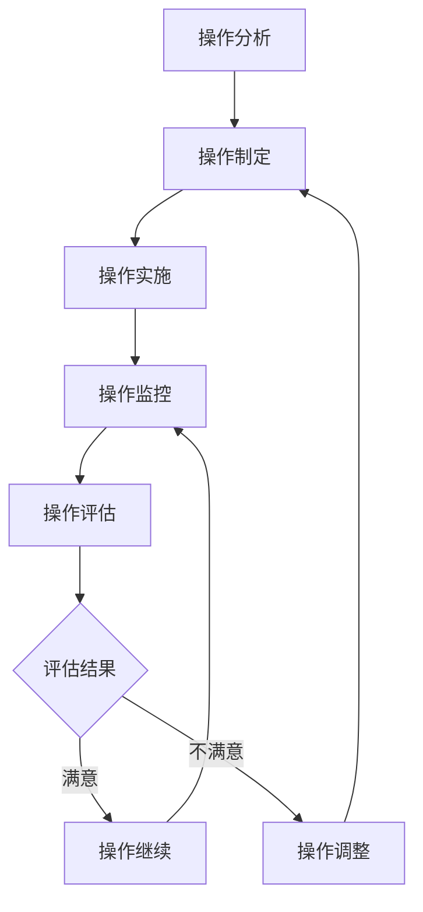
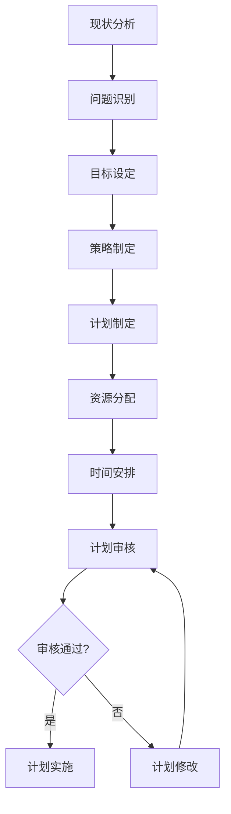
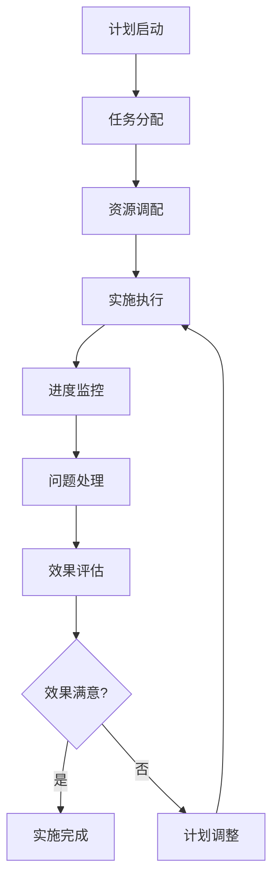
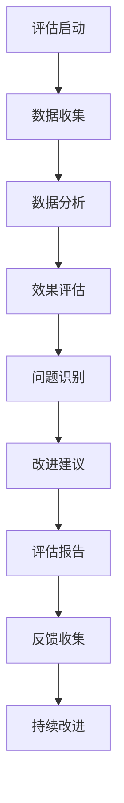

# 数学知识体系项目持续改进机制

## 📊 机制概述

**建立日期**: 2025年1月  
**机制类型**: 持续改进机制  
**适用范围**: 数学知识体系项目所有模块  

---

## 🎯 改进目标

### 1. 总体目标

- **持续质量提升**: 建立持续的质量提升机制
- **持续内容完善**: 建立持续的内容完善机制
- **持续技术优化**: 建立持续的技术优化机制
- **持续标准对齐**: 建立持续的国际标准对齐机制

### 2. 具体目标

- **质量提升**: 每季度质量提升5%以上
- **内容完善**: 每月内容完善10%以上
- **技术优化**: 每月技术优化5%以上
- **标准对齐**: 每季度标准对齐度提升10%以上

---

## 🏗️ 改进框架

### 1. 改进层次

#### 1.1 战略层改进

**目标**: 制定长期改进战略

**改进内容**:
- **项目愿景更新**: 根据发展需要更新项目愿景
- **战略目标调整**: 根据实际情况调整战略目标
- **资源配置优化**: 优化资源配置提高效率
- **合作伙伴拓展**: 拓展合作伙伴关系

**改进流程**:


#### 1.2 战术层改进

**目标**: 制定中期改进战术

**改进内容**:
- **质量改进计划**: 制定具体的质量改进计划
- **内容完善计划**: 制定具体的内容完善计划
- **技术优化计划**: 制定具体的技术优化计划
- **标准对齐计划**: 制定具体的标准对齐计划

**改进流程**:


#### 1.3 操作层改进

**目标**: 制定短期改进操作

**改进内容**:
- **日常质量检查**: 进行日常质量检查
- **内容更新维护**: 进行内容更新维护
- **技术问题修复**: 进行技术问题修复
- **标准对齐验证**: 进行标准对齐验证

**改进流程**:


### 2. 改进类型

#### 2.1 预防性改进

**目标**: 预防问题发生

**改进措施**:
- **风险识别**: 识别潜在风险
- **预防措施**: 制定预防措施
- **监控机制**: 建立监控机制
- **预警系统**: 建立预警系统

**实施方法**:
```yaml
预防性改进:
  风险识别:
    方法: 风险分析工具
    频率: 每月一次
    输出: 风险清单
  
  预防措施:
    方法: 预防措施制定
    频率: 根据风险识别结果
    输出: 预防措施计划
  
  监控机制:
    方法: 监控系统建立
    频率: 持续监控
    输出: 监控报告
  
  预警系统:
    方法: 预警系统建立
    频率: 实时预警
    输出: 预警信息
```

#### 2.2 纠正性改进

**目标**: 纠正已发生问题

**改进措施**:
- **问题识别**: 识别已发生问题
- **原因分析**: 分析问题原因
- **纠正措施**: 制定纠正措施
- **效果验证**: 验证纠正效果

**实施方法**:
```yaml
纠正性改进:
  问题识别:
    方法: 问题识别工具
    频率: 实时识别
    输出: 问题清单
  
  原因分析:
    方法: 根因分析
    频率: 问题发生后
    输出: 原因分析报告
  
  纠正措施:
    方法: 纠正措施制定
    频率: 原因分析后
    输出: 纠正措施计划
  
  效果验证:
    方法: 效果验证工具
    频率: 纠正措施实施后
    输出: 效果验证报告
```

#### 2.3 完善性改进

**目标**: 完善现有内容

**改进措施**:
- **内容评估**: 评估现有内容
- **完善计划**: 制定完善计划
- **完善实施**: 实施完善措施
- **完善验证**: 验证完善效果

**实施方法**:
```yaml
完善性改进:
  内容评估:
    方法: 内容评估工具
    频率: 每月一次
    输出: 内容评估报告
  
  完善计划:
    方法: 完善计划制定
    频率: 根据评估结果
    输出: 完善计划
  
  完善实施:
    方法: 完善措施实施
    频率: 按计划执行
    输出: 完善实施报告
  
  完善验证:
    方法: 完善效果验证
    频率: 完善实施后
    输出: 完善验证报告
```

### 3. 改进机制

#### 3.1 持续监控机制

**目标**: 持续监控项目状态

**监控内容**:
- **质量监控**: 监控质量指标
- **进度监控**: 监控项目进度
- **资源监控**: 监控资源使用
- **风险监控**: 监控项目风险

**监控方法**:
```yaml
持续监控机制:
  质量监控:
    工具: 质量监控系统
    频率: 实时监控
    输出: 质量监控报告
  
  进度监控:
    工具: 进度监控系统
    频率: 每日监控
    输出: 进度监控报告
  
  资源监控:
    工具: 资源监控系统
    频率: 每周监控
    输出: 资源监控报告
  
  风险监控:
    工具: 风险监控系统
    频率: 实时监控
    输出: 风险监控报告
```

#### 3.2 持续评估机制

**目标**: 持续评估项目效果

**评估内容**:
- **质量评估**: 评估质量效果
- **进度评估**: 评估进度效果
- **资源评估**: 评估资源效果
- **风险评估**: 评估风险效果

**评估方法**:
```yaml
持续评估机制:
  质量评估:
    工具: 质量评估工具
    频率: 每月一次
    输出: 质量评估报告
  
  进度评估:
    工具: 进度评估工具
    频率: 每周一次
    输出: 进度评估报告
  
  资源评估:
    工具: 资源评估工具
    频率: 每月一次
    输出: 资源评估报告
  
  风险评估:
    工具: 风险评估工具
    频率: 每月一次
    输出: 风险评估报告
```

#### 3.3 持续优化机制

**目标**: 持续优化项目效果

**优化内容**:
- **质量优化**: 优化质量效果
- **进度优化**: 优化进度效果
- **资源优化**: 优化资源效果
- **风险优化**: 优化风险效果

**优化方法**:
```yaml
持续优化机制:
  质量优化:
    工具: 质量优化工具
    频率: 根据评估结果
    输出: 质量优化方案
  
  进度优化:
    工具: 进度优化工具
    频率: 根据评估结果
    输出: 进度优化方案
  
  资源优化:
    工具: 资源优化工具
    频率: 根据评估结果
    输出: 资源优化方案
  
  风险优化:
    工具: 风险优化工具
    频率: 根据评估结果
    输出: 风险优化方案
```

---

## 📈 改进流程

### 1. 改进计划制定

#### 1.1 计划制定流程



#### 1.2 计划内容

**计划要素**:
- **改进目标**: 明确的改进目标
- **改进策略**: 具体的改进策略
- **改进措施**: 详细的改进措施
- **时间计划**: 明确的时间计划
- **资源需求**: 具体的资源需求
- **成功标准**: 明确的成功标准

**计划模板**:
```yaml
改进计划模板:
  改进目标:
    目标1: 具体的改进目标
    目标2: 具体的改进目标
    目标3: 具体的改进目标
  
  改进策略:
    策略1: 具体的改进策略
    策略2: 具体的改进策略
    策略3: 具体的改进策略
  
  改进措施:
    措施1: 具体的改进措施
    措施2: 具体的改进措施
    措施3: 具体的改进措施
  
  时间计划:
    阶段1: 具体时间安排
    阶段2: 具体时间安排
    阶段3: 具体时间安排
  
  资源需求:
    人力资源: 所需的人力资源
    技术资源: 所需的技术资源
    资金资源: 所需的资金资源
  
  成功标准:
    标准1: 具体的成功标准
    标准2: 具体的成功标准
    标准3: 具体的成功标准
```

### 2. 改进实施

#### 2.1 实施流程



#### 2.2 实施管理

**管理要素**:
- **任务管理**: 明确的任务分工
- **进度管理**: 严格的进度控制
- **质量管理**: 严格的质量控制
- **风险管理**: 有效的风险管理

**管理方法**:
```yaml
实施管理:
  任务管理:
    方法: 任务分解和分配
    工具: 项目管理工具
    输出: 任务执行报告
  
  进度管理:
    方法: 进度跟踪和控制
    工具: 进度管理工具
    输出: 进度管理报告
  
  质量管理:
    方法: 质量检查和验证
    工具: 质量管理工具
    输出: 质量管理报告
  
  风险管理:
    方法: 风险识别和控制
    工具: 风险管理工具
    输出: 风险管理报告
```

### 3. 改进评估

#### 3.1 评估流程



#### 3.2 评估方法

**评估类型**:
- **定量评估**: 使用量化指标评估
- **定性评估**: 使用定性方法评估
- **对比评估**: 与基准进行对比评估
- **综合评估**: 综合多种方法评估

**评估指标**:
```yaml
评估指标:
  定量指标:
    质量指标: 数学准确性、逻辑完整性等
    进度指标: 完成率、及时率等
    资源指标: 资源利用率、成本控制等
    风险指标: 风险发生率、风险控制率等
  
  定性指标:
    用户满意度: 用户满意度调查结果
    专家评价: 专家评价结果
    同行评议: 同行评议结果
    国际认可: 国际认可程度
```

---

## 🔧 改进工具

### 1. 监控工具

#### 1.1 质量监控工具

**工具类型**:
- **数学验证工具**: 验证数学内容准确性
- **逻辑验证工具**: 验证逻辑推理完整性
- **格式检查工具**: 检查文档格式一致性
- **链接检查工具**: 检查内部链接有效性

**工具配置**:
```yaml
质量监控工具:
  数学验证工具:
    功能: 验证数学公式和证明
    频率: 实时检查
    输出: 验证报告
  
  逻辑验证工具:
    功能: 验证逻辑推理过程
    频率: 实时检查
    输出: 验证报告
  
  格式检查工具:
    功能: 检查文档格式
    频率: 每次更新后
    输出: 格式检查报告
  
  链接检查工具:
    功能: 检查内部链接
    频率: 每次更新后
    输出: 链接检查报告
```

#### 1.2 进度监控工具

**工具类型**:
- **任务跟踪工具**: 跟踪任务完成情况
- **进度报告工具**: 生成进度报告
- **里程碑管理工具**: 管理项目里程碑
- **资源监控工具**: 监控资源使用情况

**工具配置**:
```yaml
进度监控工具:
  任务跟踪工具:
    功能: 跟踪任务完成情况
    频率: 实时跟踪
    输出: 任务状态报告
  
  进度报告工具:
    功能: 生成进度报告
    频率: 每周生成
    输出: 进度报告
  
  里程碑管理工具:
    功能: 管理项目里程碑
    频率: 里程碑达成时
    输出: 里程碑报告
  
  资源监控工具:
    功能: 监控资源使用
    频率: 实时监控
    输出: 资源使用报告
```

### 2. 评估工具

#### 2.1 质量评估工具

**工具类型**:
- **内容评估工具**: 评估内容质量
- **技术评估工具**: 评估技术质量
- **结构评估工具**: 评估结构质量
- **对标评估工具**: 评估国际对标度

**工具配置**:
```yaml
质量评估工具:
  内容评估工具:
    功能: 评估内容质量
    频率: 每月评估
    输出: 内容质量报告
  
  技术评估工具:
    功能: 评估技术质量
    频率: 每月评估
    输出: 技术质量报告
  
  结构评估工具:
    功能: 评估结构质量
    频率: 每月评估
    输出: 结构质量报告
  
  对标评估工具:
    功能: 评估国际对标度
    频率: 每季度评估
    输出: 对标评估报告
```

#### 2.2 效果评估工具

**工具类型**:
- **用户反馈工具**: 收集用户反馈
- **专家评价工具**: 收集专家评价
- **同行评议工具**: 进行同行评议
- **国际认可工具**: 评估国际认可度

**工具配置**:
```yaml
效果评估工具:
  用户反馈工具:
    功能: 收集用户反馈
    频率: 持续收集
    输出: 用户反馈报告
  
  专家评价工具:
    功能: 收集专家评价
    频率: 每季度收集
    输出: 专家评价报告
  
  同行评议工具:
    功能: 进行同行评议
    频率: 每半年进行
    输出: 同行评议报告
  
  国际认可工具:
    功能: 评估国际认可度
    频率: 每年评估
    输出: 国际认可报告
```

---

## 📋 改进检查清单

### 改进计划检查

- [ ] 改进目标明确
- [ ] 改进策略具体
- [ ] 改进措施详细
- [ ] 时间计划合理
- [ ] 资源需求明确
- [ ] 成功标准明确
- [ ] 风险评估完成
- [ ] 计划审核通过

### 改进实施检查

- [ ] 任务分配明确
- [ ] 资源调配到位
- [ ] 实施执行顺利
- [ ] 进度监控有效
- [ ] 问题处理及时
- [ ] 质量控制严格
- [ ] 风险管理有效
- [ ] 沟通协调顺畅

### 改进评估检查

- [ ] 数据收集完整
- [ ] 数据分析准确
- [ ] 效果评估客观
- [ ] 问题识别准确
- [ ] 改进建议合理
- [ ] 评估报告完整
- [ ] 反馈收集及时
- [ ] 持续改进有效

---

## 🎯 成功标准

### 短期目标（1个月）

- 建立持续改进机制
- 实施持续监控
- 建立持续评估
- 达到基本改进标准

### 中期目标（3个月）

- 完善改进机制
- 优化监控工具
- 完善评估工具
- 达到良好改进标准

### 长期目标（6个月）

- 建立完善改进体系
- 实现持续改进
- 获得改进效果
- 达到优秀改进标准

---

**建立人**: 项目持续改进团队  
**建立日期**: 2025年1月  
**版本**: v1.0  
**有效期**: 持续有效，定期更新  

---

**注意**: 本持续改进机制基于客观的批判性分析结果，旨在建立有效的持续改进体系，确保项目能够持续提升质量，达到真正的国际先进水平。
