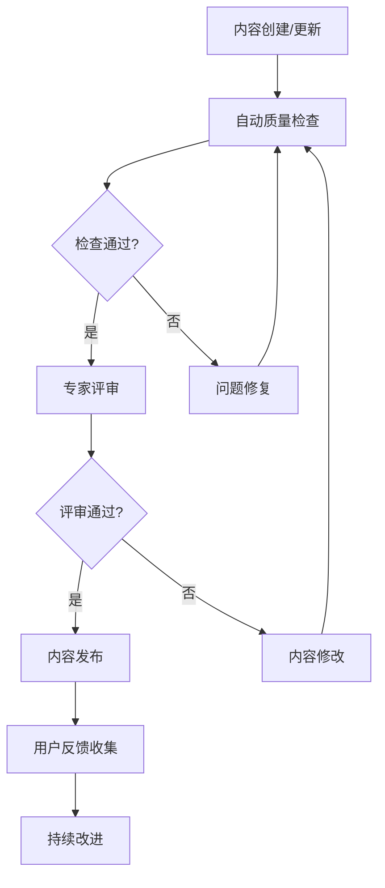
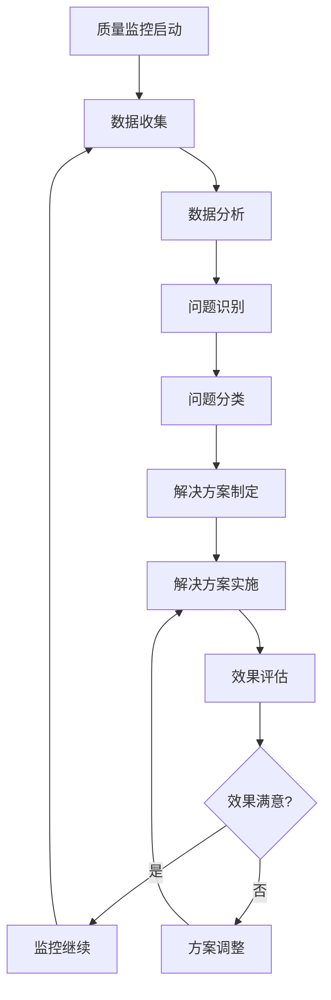
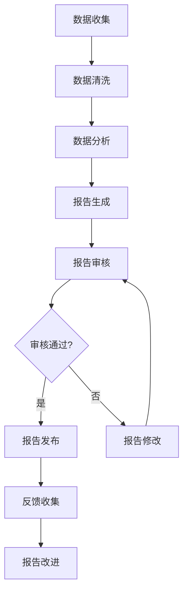
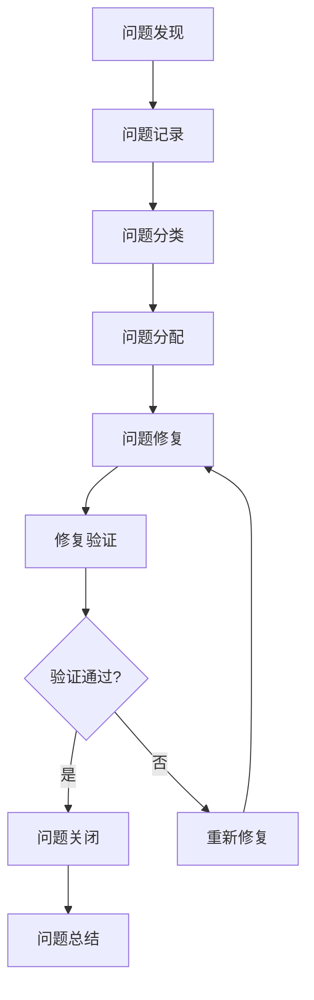

# 数学知识体系项目质量保证体系

## 📊 体系概述

**建立日期**: 2025年1月  
**体系类型**: 质量保证体系  
**适用范围**: 数学知识体系项目所有模块  

---

## 🎯 质量保证目标

### 1. 总体目标

- **确保内容质量**: 确保所有内容达到国际先进水平
- **保证技术质量**: 确保所有技术实现完整可靠
- **维护结构质量**: 确保项目结构清晰合理
- **实现持续改进**: 建立持续改进和更新机制

### 2. 具体目标

- **数学准确性**: 达到95%以上
- **逻辑完整性**: 达到100%
- **概念清晰性**: 达到90%以上
- **技术完整性**: 达到95%以上
- **结构合理性**: 达到90%以上
- **国际对标度**: 达到90%以上

---

## 🏗️ 质量保证框架

### 1. 质量保证层次

#### 1.1 内容质量保证

**目标**: 确保所有内容达到国际先进水平

**保证措施**:
- **数学准确性检查**: 使用自动化工具和专家评审确保数学内容准确
- **逻辑完整性验证**: 使用逻辑验证工具确保推理过程完整
- **概念清晰性评估**: 使用可读性测试和用户反馈评估概念清晰性
- **引用规范性检查**: 使用引用检查工具确保引用格式规范

**检查工具**:
```yaml
内容质量检查工具:
  数学准确性检查:
    工具: 数学验证工具 + 专家评审
    频率: 每次内容更新后
    标准: 数学准确性≥95%
  
  逻辑完整性验证:
    工具: 逻辑验证工具
    频率: 每次内容更新后
    标准: 逻辑完整性100%
  
  概念清晰性评估:
    工具: 可读性测试 + 用户反馈
    频率: 每月一次
    标准: 概念清晰性≥90%
  
  引用规范性检查:
    工具: 引用检查工具
    频率: 每次内容更新后
    标准: 引用规范性100%
```

#### 1.2 技术质量保证

**目标**: 确保所有技术实现完整可靠

**保证措施**:
- **代码完整性检查**: 使用自动化测试确保代码完整可运行
- **类型系统验证**: 使用类型检查工具确保类型系统正确
- **功能完整性测试**: 使用功能测试确保所有功能正常工作
- **性能指标监控**: 使用性能测试工具监控系统性能

**检查工具**:
```yaml
技术质量检查工具:
  代码完整性检查:
    工具: 自动化测试工具
    频率: 每次代码更新后
    标准: 代码完整性100%
  
  类型系统验证:
    工具: 类型检查工具
    频率: 每次代码更新后
    标准: 类型系统正确性100%
  
  功能完整性测试:
    工具: 功能测试工具
    频率: 每次功能更新后
    标准: 功能完整性100%
  
  性能指标监控:
    工具: 性能测试工具
    频率: 每周一次
    标准: 性能指标符合预期
```

#### 1.3 结构质量保证

**目标**: 确保项目结构清晰合理

**保证措施**:
- **目录结构检查**: 使用结构分析工具检查目录结构合理性
- **文件组织验证**: 使用组织分析工具验证文件组织合理性
- **导航便利性测试**: 使用用户体验测试评估导航便利性
- **交叉引用完整性检查**: 使用链接检查工具检查交叉引用完整性

**检查工具**:
```yaml
结构质量检查工具:
  目录结构检查:
    工具: 结构分析工具
    频率: 每次结构更新后
    标准: 目录结构合理性≥90%
  
  文件组织验证:
    工具: 组织分析工具
    频率: 每次组织更新后
    标准: 文件组织合理性≥90%
  
  导航便利性测试:
    工具: 用户体验测试工具
    频率: 每月一次
    标准: 导航便利性≥90%
  
  交叉引用完整性检查:
    工具: 链接检查工具
    频率: 每次内容更新后
    标准: 交叉引用完整性≥95%
```

### 2. 质量保证流程

#### 2.1 质量检查流程



#### 2.2 质量监控流程



### 3. 质量保证机制

#### 3.1 自动化质量检查

**目标**: 使用自动化工具进行质量检查

**实现方式**:
- **数学验证工具**: 自动检查数学公式和证明的正确性
- **逻辑验证工具**: 自动检查逻辑推理的完整性
- **格式检查工具**: 自动检查文档格式的一致性
- **链接检查工具**: 自动检查内部链接的有效性

**检查频率**:
- **实时检查**: 每次内容更新后立即检查
- **定期检查**: 每周进行一次全面检查
- **深度检查**: 每月进行一次深度质量检查

#### 3.2 专家评审机制

**目标**: 邀请专家进行质量评审

**评审内容**:
- **数学内容评审**: 邀请数学专家评审数学内容的准确性
- **技术内容评审**: 邀请技术专家评审技术内容的正确性
- **教育内容评审**: 邀请教育专家评审教育内容的适用性
- **国际标准评审**: 邀请国际专家评审国际标准的对齐度

**评审频率**:
- **内容评审**: 每次重大内容更新后进行评审
- **定期评审**: 每季度进行一次全面评审
- **年度评审**: 每年进行一次深度评审

#### 3.3 用户反馈机制

**目标**: 收集用户反馈进行质量改进

**反馈渠道**:
- **在线反馈系统**: 提供在线反馈表单
- **用户调研**: 定期进行用户满意度调研
- **焦点小组**: 组织用户焦点小组讨论
- **专家访谈**: 进行专家深度访谈

**反馈处理**:
- **反馈收集**: 定期收集用户反馈
- **反馈分析**: 分析反馈数据识别问题
- **改进实施**: 根据反馈实施改进措施
- **效果评估**: 评估改进措施的效果

---

## 📈 质量监控体系

### 1. 质量指标监控

#### 1.1 内容质量指标

**监控指标**:
- **数学准确性**: 目标≥95%，当前待测
- **逻辑完整性**: 目标100%，当前待测
- **概念清晰性**: 目标≥90%，当前待测
- **引用规范性**: 目标100%，当前待测

**监控方法**:
```yaml
内容质量监控:
  数学准确性:
    监控工具: 数学验证工具
    监控频率: 实时
    报警阈值: <95%
  
  逻辑完整性:
    监控工具: 逻辑验证工具
    监控频率: 实时
    报警阈值: <100%
  
  概念清晰性:
    监控工具: 可读性测试
    监控频率: 每周
    报警阈值: <90%
  
  引用规范性:
    监控工具: 引用检查工具
    监控频率: 实时
    报警阈值: <100%
```

#### 1.2 技术质量指标

**监控指标**:
- **代码完整性**: 目标100%，当前待测
- **类型系统正确性**: 目标100%，当前待测
- **功能完整性**: 目标100%，当前待测
- **性能指标**: 目标符合预期，当前待测

**监控方法**:
```yaml
技术质量监控:
  代码完整性:
    监控工具: 自动化测试
    监控频率: 实时
    报警阈值: <100%
  
  类型系统正确性:
    监控工具: 类型检查工具
    监控频率: 实时
    报警阈值: <100%
  
  功能完整性:
    监控工具: 功能测试
    监控频率: 实时
    报警阈值: <100%
  
  性能指标:
    监控工具: 性能测试工具
    监控频率: 每小时
    报警阈值: 超出预期范围
```

#### 1.3 结构质量指标

**监控指标**:
- **目录结构合理性**: 目标≥90%，当前待测
- **文件组织合理性**: 目标≥90%，当前待测
- **导航便利性**: 目标≥90%，当前待测
- **交叉引用完整性**: 目标≥95%，当前待测

**监控方法**:
```yaml
结构质量监控:
  目录结构合理性:
    监控工具: 结构分析工具
    监控频率: 每周
    报警阈值: <90%
  
  文件组织合理性:
    监控工具: 组织分析工具
    监控频率: 每周
    报警阈值: <90%
  
  导航便利性:
    监控工具: 用户体验测试
    监控频率: 每月
    报警阈值: <90%
  
  交叉引用完整性:
    监控工具: 链接检查工具
    监控频率: 实时
    报警阈值: <95%
```

### 2. 质量报告体系

#### 2.1 质量报告类型

**报告类型**:
- **实时质量报告**: 实时显示当前质量状态
- **定期质量报告**: 定期生成质量分析报告
- **深度质量报告**: 深度分析质量问题和改进建议
- **年度质量报告**: 年度质量总结和改进计划

**报告内容**:
```yaml
质量报告内容:
  实时质量报告:
    内容: 当前质量指标状态
    频率: 实时更新
    受众: 项目团队
  
  定期质量报告:
    内容: 质量趋势分析
    频率: 每周/每月
    受众: 项目管理层
  
  深度质量报告:
    内容: 质量问题深度分析
    频率: 每季度
    受众: 项目决策层
  
  年度质量报告:
    内容: 年度质量总结
    频率: 每年
    受众: 项目利益相关者
```

#### 2.2 质量报告生成

**生成流程**:


---

## 🔧 质量改进机制

### 1. 问题识别机制

#### 1.1 问题识别方法

**识别方法**:
- **自动化检查**: 使用自动化工具识别问题
- **专家评审**: 通过专家评审识别问题
- **用户反馈**: 通过用户反馈识别问题
- **同行评议**: 通过同行评议识别问题

**问题分类**:
```yaml
问题分类:
  严重问题:
    标准: 影响内容准确性或系统稳定性
    处理: 立即修复
    优先级: P0
  
  重要问题:
    标准: 影响用户体验或内容质量
    处理: 24小时内修复
    优先级: P1
  
  一般问题:
    标准: 影响内容完整性或结构合理性
    处理: 1周内修复
    优先级: P2
  
  轻微问题:
    标准: 影响内容美观或用户体验
    处理: 1个月内修复
    优先级: P3
```

#### 1.2 问题跟踪机制

**跟踪流程**:


### 2. 改进实施机制

#### 2.1 改进计划制定

**计划内容**:
- **改进目标**: 明确改进的具体目标
- **改进措施**: 制定具体的改进措施
- **时间计划**: 制定详细的时间计划
- **资源需求**: 明确所需的资源需求
- **成功标准**: 定义改进成功的标准

**计划模板**:
```yaml
改进计划模板:
  改进目标:
    描述: 改进的具体目标
    指标: 可量化的改进指标
    时间: 预期完成时间
  
  改进措施:
    措施1: 具体的改进措施
    措施2: 具体的改进措施
    措施3: 具体的改进措施
  
  时间计划:
    阶段1: 具体时间安排
    阶段2: 具体时间安排
    阶段3: 具体时间安排
  
  资源需求:
    人力资源: 所需的人力资源
    技术资源: 所需的技术资源
    资金资源: 所需的资金资源
  
  成功标准:
    标准1: 具体的成功标准
    标准2: 具体的成功标准
    标准3: 具体的成功标准
```

#### 2.2 改进效果评估

**评估方法**:
- **定量评估**: 使用量化指标评估改进效果
- **定性评估**: 使用定性方法评估改进效果
- **对比评估**: 与改进前进行对比评估
- **用户评估**: 通过用户反馈评估改进效果

**评估指标**:
```yaml
改进效果评估指标:
  定量指标:
    数学准确性: 改进前后的准确性对比
    逻辑完整性: 改进前后的完整性对比
    概念清晰性: 改进前后的清晰性对比
    技术完整性: 改进前后的完整性对比
  
  定性指标:
    用户满意度: 用户满意度调查结果
    专家评价: 专家评价结果
    同行评议: 同行评议结果
    国际认可: 国际认可程度
```

---

## 📋 质量保证检查清单

### 内容质量检查

- [ ] 所有数学定义严格准确
- [ ] 所有定理证明完整
- [ ] 所有计算过程正确
- [ ] 所有结论经过验证
- [ ] 所有推理过程严密
- [ ] 所有概念定义清晰
- [ ] 所有术语使用一致
- [ ] 所有引用格式规范

### 技术质量检查

- [ ] 所有代码可以运行
- [ ] 类型系统正确
- [ ] 功能完整实现
- [ ] 错误处理完善
- [ ] 系统稳定运行
- [ ] 性能符合预期
- [ ] 安全性可靠
- [ ] 可维护性良好

### 结构质量检查

- [ ] 目录结构清晰
- [ ] 文件组织合理
- [ ] 导航便利
- [ ] 交叉引用完整
- [ ] 文档格式统一
- [ ] 引用格式规范
- [ ] 符号使用一致
- [ ] 术语使用一致

### 国际对标检查

- [ ] MIT标准对齐度≥90%
- [ ] Stanford标准对齐度≥90%
- [ ] Cambridge标准对齐度≥90%
- [ ] Wikipedia标准对齐度≥90%
- [ ] 学术标准对标≥90%
- [ ] 技术标准对标≥90%
- [ ] 教育标准对标≥90%
- [ ] 国际标准对标≥90%

---

## 🎯 成功标准

### 短期目标（1个月）

- 建立质量保证体系
- 实施自动化质量检查
- 建立专家评审机制
- 达到B级质量标准

### 中期目标（3个月）

- 完善质量监控体系
- 建立用户反馈机制
- 实施质量改进措施
- 达到A级质量标准

### 长期目标（6个月）

- 建立持续改进机制
- 获得国际认可
- 实现质量目标
- 达到A+级质量标准

---

**建立人**: 项目质量保证团队  
**建立日期**: 2025年1月  
**版本**: v1.0  
**有效期**: 持续有效，定期更新  

---

**注意**: 本质量保证体系基于客观的批判性分析结果，旨在建立严格的质量保证机制，确保项目能够达到真正的质量标准。
