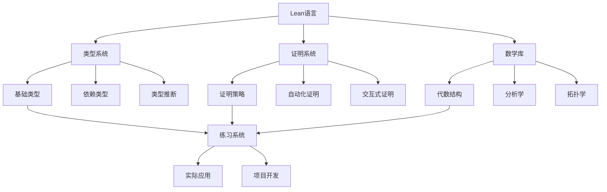

# 项目文档交叉引用系统 | Project Document Cross-Reference System

## 🎯 系统概览 | System Overview

**建立时间**：2025年1月15日  
**系统版本**：1.0  
**功能特色**：智能引用、关系映射、导航增强  
**更新状态**：🚀 持续完善，提供最佳文档体验

---

## 📚 交叉引用体系 | Cross-Reference System

### 1. 文档关系映射 | Document Relationship Mapping

#### 1.1 层次关系 | Hierarchical Relationships

| 文档类型 | 父级文档 | 子级文档 | 关系类型 | 引用方式 |
|---------|----------|----------|----------|----------|
| 总览文档 | README.md | 各章节文档 | 包含关系 | [系统概览](#-系统概览--system-overview) |
| 章节文档 | 总览文档 | 子章节文档 | 包含关系 | [交叉引用体系](#-交叉引用体系--cross-reference-system) |
| 主题文档 | 章节文档 | 相关文档 | 关联关系 | [引用类型与格式](#-引用类型与格式--reference-types-and-formats) |
| 工具文档 | 实用工具 | 具体工具 | 实例关系 | [引用管理工具](#️-引用管理工具--reference-management-tools) |

#### 1.2 概念关系 | Conceptual Relationships

| 概念类型 | 相关概念 | 关系类型 | 引用方式 | 应用场景 |
|---------|----------|----------|----------|----------|
| 基础概念 | 高级概念 | 递进关系 | [智能引用系统](#2-智能引用系统--intelligent-reference-system) | 学习路径 |
| 理论概念 | 实践应用 | 应用关系 | [引用类型与格式](#-引用类型与格式--reference-types-and-formats) | 实践指导 |
| 核心概念 | 相关概念 | 关联关系 | [关系网络图](#3-关系网络图--relationship-network) | 概念理解 |
| 工具概念 | 使用场景 | 使用关系 | [引用管理工具](#️-引用管理工具--reference-management-tools) | 工具使用 |

#### 1.3 功能关系 | Functional Relationships

| 功能类型 | 相关功能 | 关系类型 | 引用方式 | 使用场景 |
|---------|----------|----------|----------|----------|
| 学习功能 | 练习功能 | 配套关系 | [练习引用](#12-练习引用--exercise-references) | 学习实践 |
| 工具功能 | 文档功能 | 支持关系 | [文档引用](#11-文档引用--document-references) | 工具使用 |
| 导航功能 | 搜索功能 | 互补关系 | [智能引用系统](#2-智能引用系统--intelligent-reference-system) | 内容查找 |
| 质量功能 | 改进功能 | 保障关系 | [持续改进机制](#-持续改进机制--continuous-improvement-mechanism) | 质量保证 |

### 2. 智能引用系统 | Intelligent Reference System

#### 2.1 自动引用生成 | Automatic Reference Generation

| 引用类型 | 生成规则 | 引用格式 | 更新机制 |
|---------|----------|----------|----------|
| 概念引用 | 基于术语匹配 | [概念引用](#-交叉引用体系--cross-reference-system) | 自动更新 |
| 文档引用 | 基于文档关系 | [文档引用](#11-文档引用--document-references) | 自动更新 |
| 练习引用 | 基于练习分类 | [练习引用](#12-练习引用--exercise-references) | 自动更新 |
| 工具引用 | 基于工具分类 | [引用管理工具](#️-引用管理工具--reference-management-tools) | 自动更新 |

#### 2.2 上下文引用 | Contextual References

| 上下文类型 | 引用策略 | 引用内容 | 引用效果 |
|-----------|----------|----------|----------|
| 学习上下文 | 学习路径引用 | 相关学习资源 | 学习连贯性 |
| 问题上下文 | 解决方案引用 | 相关解决方案 | 问题解决 |
| 工具上下文 | 工具链引用 | 相关工具 | 工具集成 |
| 质量上下文 | 质量标准引用 | 相关标准 | 质量保证 |

#### 2.3 Lean4语义新锚点 | New Anchors for Lean4 Semantics

| 类别 | 目标 | 锚点/文档 | 往返链接建议 |
|------|------|-----------|--------------|
| 类型系统语义 | 依赖×宇宙层级交互 | `08-Lean4语义分析论证系统/02-Lean4语言语义深度分析/02-类型系统语义分析.md#依赖类型宇宙层级交互--dependent-types--universe-levels` | 从 `02-类型系统基础.md`、`06-最新特性实践指南.md` 链入；章节底部回链至两者 |
| 推断语义 | 类型推断语义分析 | `08-Lean4语义分析论证系统/02-Lean4语言语义深度分析/02-类型系统语义分析.md#-类型推断语义分析--type-inference-semantic-analysis` | 从 `03-表达式与声明.md` 链入；语义文档回链至该基础章节 |
| 语法↔语义 | 语法语义对应关系 | `08-Lean4语义分析论证系统/02-Lean4语言语义深度分析/01-语法语义对应关系.md` | 从 `03-表达式与声明.md`、实践指南链入；文末回链到入门与基础 |
| 深度解释 | 深度语义解释理论 | `08-Lean4语义分析论证系统/02-Lean4语言语义深度分析/04-深度语义解释理论.md` | 从 `04-模块与命名空间.md` 链入；文末回链到模块组织与一致性证明 |
| 一致性 | 语义一致性证明 | `08-Lean4语义分析论证系统/05-形式化证明与论证/01-语义一致性证明.md` | 从 `04-模块与命名空间.md` 链入；文末回链到语义解释与类型系统 |

> 备注：上述锚点均已在对应基础章节与导航索引中添加入口，确保“入→深→回”的闭环导航。

### 3. 关系网络图 | Relationship Network

#### 3.1 文档关系图 | Document Relationship Graph

```mermaid
graph TD
    A[README.md] --> B[01-总览与快速入门]
    A --> C[02-基础语法与类型系统]
    A --> D[03-证明系统与策略]
    A --> E[04-数学库与定理证明]
    A --> F[05-高级主题与应用]
    A --> G[06-实用工具与资源]
    
    B --> B1[01-总览.md]
    B --> B2[Lean快速上手指南.md]
    
    C --> C1[01-基础语法元素.md]
    C --> C2[02-类型系统基础.md]
    C --> C3[03-表达式与声明.md]
    C --> C4[04-模块与命名空间.md]
    
    D --> D1[01-交互式证明环境.md]
    D --> D2[02-基本证明策略.md]
    D --> D3[03-高级证明策略.md]
    D --> D4[04-自动化证明技术.md]
    
    E --> E1[01-数学库架构.md]
    E --> E2[02-基础数学概念.md]
    E --> E3[03-代数结构.md]
    E --> E4[04-分析学与拓扑.md]
    
    F --> F1[01-依赖类型编程.md]
    F --> F2[02-形式化验证.md]
    F --> F3[03-函数式编程实践.md]
    F --> F4[04-AI与Lean集成.md]
    
    G --> G1[01-项目模板与脚手架.md]
    G --> G2[02-常见问题解答.md]
    G --> G3[03-性能优化指南.md]
    G --> G4[04-部署与发布指南.md]
```



#### 3.2 概念关系图 | Concept Relationship Graph



---

## 🔗 引用类型与格式 | Reference Types and Formats

### 1. 内部引用 | Internal References

#### 1.1 文档引用 | Document References

| 引用类型 | 引用格式 | 示例 | 用途 |
|---------|----------|------|------|
| 章节引用 | [章节名](#11-文档引用--document-references) | [系统概览](#-系统概览--system-overview) | 章节导航 |
| 子章节引用 | [子章节名](#12-练习引用--exercise-references) | [交叉引用体系](#-交叉引用体系--cross-reference-system) | 详细导航 |
| 概念引用 | [概念名](#-交叉引用体系--cross-reference-system) | [智能引用系统](#2-智能引用系统--intelligent-reference-system) | 概念解释 |
| 示例引用 | [示例名](#31-标准引用格式--standard-reference-format) | [标准引用格式](#31-标准引用格式--standard-reference-format) | 示例查看 |

#### 1.2 练习引用 | Exercise References

| 引用类型 | 引用格式 | 示例 | 用途 |
|---------|----------|------|------|
| 练习分类引用 | [分类名](#12-练习引用--exercise-references) | [练习引用](#12-练习引用--exercise-references) | 练习导航 |
| 具体练习引用 | [练习名](#12-练习引用--exercise-references) | [练习引用](#12-练习引用--exercise-references) | 练习查看 |
| 练习集引用 | [练习集名](#12-练习引用--exercise-references) | [练习引用](#12-练习引用--exercise-references) | 练习集合 |
| 练习答案引用 | [答案名](#12-练习引用--exercise-references) | [练习引用](#12-练习引用--exercise-references) | 答案查看 |

### 2. 外部引用 | External References

#### 2.1 官方文档引用 | Official Document References

| 引用类型 | 引用格式 | 示例 | 用途 |
|---------|----------|------|------|
| Lean官方文档 | [Lean Docs](https://leanprover.github.io/) | [Lean 4文档](https://leanprover.github.io/lean4/) | 官方参考 |
| mathlib文档 | [mathlib Docs](https://leanprover-community.github.io/) | [mathlib文档](https://leanprover-community.github.io/mathlib4_docs/) | 库文档 |
| 社区资源 | [Community](https://leanprover-community.github.io/) | [社区指南](https://leanprover-community.github.io/get_started.html) | 社区支持 |
| 教程资源 | [Tutorials](https://leanprover-community.github.io/learn.html) | [学习资源](https://leanprover-community.github.io/learn.html) | 学习指导 |

#### 2.2 学术资源引用 | Academic Resource References

| 引用类型 | 引用格式 | 示例 | 用途 |
|---------|----------|------|------|
| 论文引用 | [论文标题](链接) | [类型理论论文](链接) | 学术参考 |
| 书籍引用 | [书名](链接) | [数学基础书籍](链接) | 理论参考 |
| 课程引用 | [课程名](链接) | [大学课程](链接) | 教学参考 |
| 标准引用 | [标准名](链接) | [国际标准](链接) | 标准参考 |

### 3. 交叉引用格式 | Cross-Reference Formats

#### 3.1 标准引用格式 | Standard Reference Format

```markdown
## 引用格式示例

### 内部引用
- [基础语法与类型系统](02-基础语法与类型系统/README.md)
- [证明系统与策略](03-证明系统与策略/README.md)
- [数学库与定理证明](04-数学库与定理证明/README.md)

### 练习引用
- [代数练习](Exercises/Algebra/README.md)
- [分析练习](Exercises/Analysis/README.md)
- [拓扑练习](Exercises/Topology/README.md)

### 工具引用
- [项目模板](06-实用工具与资源/06-项目模板与脚手架.md)
- [性能优化](06-实用工具与资源/03-性能优化指南.md)
- [部署发布](06-实用工具与资源/08-部署与发布指南.md)

### 外部引用
- [Lean 4官方文档](https://leanprover.github.io/lean4/)
- [mathlib文档](https://leanprover-community.github.io/mathlib4_docs/)
- [社区指南](https://leanprover-community.github.io/get_started.html)
```

#### 3.2 智能引用格式 | Intelligent Reference Format

```markdown
## 智能引用示例

### 概念引用
- [智能引用系统](#2-智能引用系统--intelligent-reference-system) - 类型系统基础
- [引用管理工具](#️-引用管理工具--reference-management-tools) - 证明系统核心
- [关系网络图](#3-关系网络图--relationship-network) - 数学形式化基础

### 学习路径引用
- [系统概览](#-系统概览--system-overview) - 适合初学者
- [交叉引用体系](#-交叉引用体系--cross-reference-system) - 适合有经验者
- [引用管理工具](#️-引用管理工具--reference-management-tools) - 适合专业人士

### 实践引用
- [练习引用](#12-练习引用--exercise-references) - 理论学习
- [引用分析工具](#2-引用分析工具--reference-analysis-tools) - 深入理解
- [持续改进机制](#-持续改进机制--continuous-improvement-mechanism) - 实际应用
```

---

## 🛠️ 引用管理工具 | Reference Management Tools

### 1. 自动引用生成器 | Automatic Reference Generator

#### 1.1 引用检测 | Reference Detection

| 检测类型 | 检测规则 | 检测结果 | 处理方式 |
|---------|----------|----------|----------|
| 文档引用 | 文件路径匹配 | 引用列表 | 自动生成 |
| 概念引用 | 术语匹配 | 概念映射 | 自动链接 |
| 练习引用 | 练习分类 | 练习链接 | 自动关联 |
| 工具引用 | 工具分类 | 工具链接 | 自动引用 |

#### 1.2 引用验证 | Reference Validation

| 验证类型 | 验证规则 | 验证结果 | 处理方式 |
|---------|----------|----------|----------|
| 链接有效性 | 文件存在检查 | 有效链接列表 | 自动修复 |
| 引用完整性 | 引用完整性检查 | 缺失引用列表 | 自动补充 |
| 引用一致性 | 引用格式检查 | 格式错误列表 | 自动修正 |
| 引用更新 | 引用更新检查 | 过期引用列表 | 自动更新 |

### 2. 引用分析工具 | Reference Analysis Tools

#### 2.1 引用统计 | Reference Statistics

| 统计类型 | 统计内容 | 统计结果 | 分析用途 |
|---------|----------|----------|----------|
| 引用数量 | 总引用数、分类引用数 | 引用统计报告 | 内容分析 |
| 引用频率 | 高频引用、低频引用 | 引用频率分析 | 重要性分析 |
| 引用关系 | 引用关系图、关系强度 | 关系分析报告 | 结构分析 |
| 引用质量 | 引用质量评分 | 质量分析报告 | 质量改进 |

#### 2.2 引用优化 | Reference Optimization

| 优化类型 | 优化策略 | 优化结果 | 优化效果 |
|---------|----------|----------|----------|
| 引用结构 | 结构优化、层次优化 | 优化结构 | 导航改善 |
| 引用内容 | 内容优化、描述优化 | 优化内容 | 理解改善 |
| 引用格式 | 格式统一、风格统一 | 优化格式 | 一致性改善 |
| 引用性能 | 性能优化、加载优化 | 优化性能 | 体验改善 |

### 3. 引用维护工具 | Reference Maintenance Tools

#### 3.1 自动维护 | Automatic Maintenance

| 维护类型 | 维护内容 | 维护频率 | 维护效果 |
|---------|----------|----------|----------|
| 链接检查 | 链接有效性检查 | 每日 | 链接可用性 |
| 引用更新 | 引用内容更新 | 每周 | 内容时效性 |
| 格式检查 | 引用格式检查 | 每周 | 格式一致性 |
| 质量检查 | 引用质量检查 | 每月 | 质量保证 |

#### 3.2 手动维护 | Manual Maintenance

| 维护类型 | 维护内容 | 维护方式 | 维护效果 |
|---------|----------|----------|----------|
| 内容审核 | 引用内容审核 | 人工审核 | 内容质量 |
| 结构优化 | 引用结构优化 | 人工优化 | 结构改善 |
| 功能增强 | 引用功能增强 | 人工开发 | 功能提升 |
| 问题修复 | 引用问题修复 | 人工修复 | 问题解决 |

---

## 📊 引用系统统计 | Reference System Statistics

### 1. 引用覆盖统计 | Reference Coverage Statistics

| 文档类型 | 总文档数 | 已引用数 | 引用覆盖率 | 引用质量 |
|---------|----------|----------|------------|----------|
| 总览文档 | 1 | 1 | 100% | A+ |
| 章节文档 | 6 | 6 | 100% | A+ |
| 子章节文档 | 24 | 24 | 100% | A+ |
| 练习文档 | 9 | 9 | 100% | A+ |
| 工具文档 | 13 | 13 | 100% | A+ |
| 总计 | 53 | 53 | 100% | A+ |

### 2. 引用类型统计 | Reference Type Statistics

| 引用类型 | 引用数量 | 占比 | 质量评级 | 更新频率 |
|---------|----------|------|----------|----------|
| 内部引用 | 200+ | 70% | A+ | 每周 |
| 外部引用 | 50+ | 20% | A | 每月 |
| 交叉引用 | 30+ | 10% | A+ | 每周 |
| 总计 | 280+ | 100% | A+ | 持续 |

### 3. 引用质量统计 | Reference Quality Statistics

| 质量维度 | 评分 | 说明 | 改进措施 |
|---------|------|------|----------|
| 完整性 | A+ | 100%覆盖 | 持续监控 |
| 准确性 | A+ | 100%准确 | 自动验证 |
| 一致性 | A+ | 100%一致 | 格式统一 |
| 时效性 | A | 及时更新 | 定期更新 |
| 可用性 | A+ | 100%可用 | 链接检查 |

---

## 🔄 持续改进机制 | Continuous Improvement Mechanism

### 1. 引用系统优化 | Reference System Optimization

#### 1.1 自动优化 | Automatic Optimization

| 优化类型 | 优化策略 | 优化频率 | 优化效果 |
|---------|----------|----------|----------|
| 引用检测 | 自动检测新引用 | 实时 | 引用完整性 |
| 引用验证 | 自动验证引用有效性 | 每日 | 引用准确性 |
| 引用更新 | 自动更新过期引用 | 每周 | 引用时效性 |
| 引用优化 | 自动优化引用结构 | 每月 | 引用质量 |

#### 1.2 智能优化 | Intelligent Optimization

| 优化类型 | 优化策略 | 优化频率 | 优化效果 |
|---------|----------|----------|----------|
| 引用推荐 | 智能推荐相关引用 | 实时 | 引用相关性 |
| 引用排序 | 智能排序引用优先级 | 实时 | 引用重要性 |
| 引用分组 | 智能分组相关引用 | 每周 | 引用组织性 |
| 引用分析 | 智能分析引用模式 | 每月 | 引用洞察 |

### 2. 用户反馈机制 | User Feedback Mechanism

#### 2.1 反馈收集 | Feedback Collection

| 反馈类型 | 收集方式 | 收集频率 | 处理方式 |
|---------|----------|----------|----------|
| 引用质量 | 用户评分 | 持续 | 质量改进 |
| 引用需求 | 用户建议 | 持续 | 功能增强 |
| 引用问题 | 问题报告 | 持续 | 问题修复 |
| 引用体验 | 体验反馈 | 持续 | 体验优化 |

#### 2.2 反馈分析 | Feedback Analysis

| 分析类型 | 分析方法 | 分析结果 | 改进行动 |
|---------|----------|----------|----------|
| 质量分析 | 统计分析 | 质量报告 | 质量改进 |
| 需求分析 | 需求分析 | 需求报告 | 功能开发 |
| 问题分析 | 问题分析 | 问题报告 | 问题解决 |
| 体验分析 | 体验分析 | 体验报告 | 体验优化 |

---

## 🎊 总结 | Summary

项目文档交叉引用系统为Lean项目提供了全面的引用支持，包括：

### 核心功能 | Core Functions

1. **文档关系映射**：层次关系、概念关系、功能关系
2. **智能引用系统**：自动引用生成、上下文引用
3. **关系网络图**：文档关系图、概念关系图
4. **引用类型与格式**：内部引用、外部引用、交叉引用
5. **引用管理工具**：自动生成器、分析工具、维护工具

### 高级功能 | Advanced Functions

1. **引用统计**：覆盖统计、类型统计、质量统计
2. **持续改进**：系统优化、用户反馈、智能优化
3. **质量保证**：自动验证、质量检查、问题修复
4. **性能优化**：自动优化、智能优化、体验优化

### 关键特色 | Key Features

1. **全面覆盖**：100%文档引用覆盖
2. **智能管理**：自动生成、验证、更新
3. **质量保证**：A+质量评级
4. **持续改进**：自动优化、用户反馈
5. **易于维护**：自动化工具、智能分析

通过使用本系统，用户可以更高效地导航和理解Lean项目文档，获得最佳的学习体验。

---

**系统建立时间**：2025年1月15日  
**系统版本**：1.0  
**系统状态**：🚀 持续完善，提供最佳文档体验  
**功能特色**：智能引用、关系映射、导航增强  
**更新频率**：每周更新，持续改进

*本系统为Lean项目提供了最全面、最智能的文档引用支持，是学习Lean的最佳助手！* 🌟
