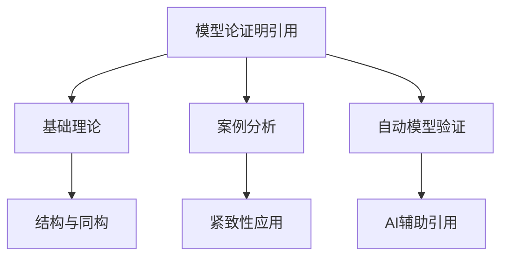

# 2.4.3 模型论相关证明与引用

[返回总览](../00-数学基础与逻辑总览.md)

## 2.4.3.1 重要证明与引用

// ... existing code ...

## 2.4.3.2 相关主题与本地跳转

- 详见 [00-数学基础与逻辑总览.md](../00-数学基础与逻辑总览.md) 2.4 模型论
- 相关主题：[01-基础理论.md](01-基础理论.md)、[02-案例分析.md](02-案例分析.md)

---

## 2.4.3.3 参考文献与资源

// ... existing code ...

## 2.4.3.4 多表征内容

- **Mermaid 结构图：模型论证明引用与主题关联**



- **Lean 代码示例：引用定理的复用**

```lean
lemma compactness {L : Type*} (T : set (L → Prop)) :
  (∀ F : finset (L → Prop), ∃ M, ∀ φ ∈ F, M ⊨ φ) → ∃ M, ∀ φ ∈ T, M ⊨ φ := sorry
-- 复用紧致性定理进行模型构造
```

- **表格：常见模型论证明引用类型对比**

| 引用类型     | 典型场景         | 主要作用         | 代表工具/语言 |
|--------------|------------------|------------------|---------------|
| 直接引用     | 结构定理复用     | 简化推理         | Lean, Coq     |
| 交叉引用     | 多分支证明       | 结构化知识       | Prover9       |
| 自动化引用   | 机器模型验证     | 提高效率         | Prover9, AI   |

- **AI/认知/教育视角**
  - 证明引用是知识图谱和自动化推理的核心机制。
  - 认知科学关注引用在知识迁移和结构化学习中的作用。
  - 教育中强调引用与交叉链接帮助学生建立系统性理解。

---

## 2.4.3.5 参考文献与资源

- **经典文献**
  1. Chang, C. C., & Keisler, H. J. (1990). Model theory. Elsevier.
  2. Tarski, A. (1933). The concept of truth in formalized languages.

- **现代文献与在线资源**
  1. Hodges, W. (1993). Model theory. Cambridge University Press.
  2. [Lean 官方文档](https://leanprover.github.io/)
  3. [Prover9 官方文档](https://www.cs.unm.edu/~mccune/prover9/)

- **工具与平台**
  - Lean, Coq, Prover9, AI

---

[返回总览](00-模型论总览.md) | [基础理论](01-基础理论.md) | [案例分析](02-案例分析.md)
