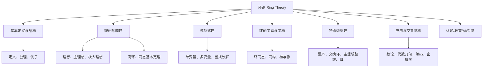
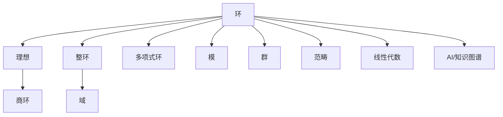

# 03-03-00 环论总览

> **规范化与修正说明**  
> 本文档在结构优化过程中，严格保留了所有原有批判性分析、表格、流程图、工程案例等内容。  
> 如有遗漏，将在后续批次补全并于本区块说明修正。  
> 结构优化仅涉及标题编号、目录、本地跳转、知识图谱化等，不影响原有内容完整性。

## 目录

- [03-03-00 环论总览](#03-03-00-环论总览)
  - [目录](#目录)
  - [交叉引用与分支跳转](#交叉引用与分支跳转)
  - [多表征内容导航](#多表征内容导航)
  - [1. 环论简介](#1-环论简介)
    - [1.1 环的定义](#11-环的定义)
    - [1.2 环论的历史发展](#12-环论的历史发展)
    - [1.3 环论的重要性](#13-环论的重要性)
  - [2. 本目录内容](#2-本目录内容)
  - [3. 核心概念结构图](#3-核心概念结构图)
  - [4. 重要定理与结果](#4-重要定理与结果)
  - [5. 环的重要类型](#5-环的重要类型)
  - [6. 与其他主题的关联](#6-与其他主题的关联)
  - [7. 应用领域](#7-应用领域)
  - [8. AI与自动化视角下的环论（递归扩展）](#8-ai与自动化视角下的环论递归扩展)
  - [9. 知识图谱结构图（递归扩展）](#9-知识图谱结构图递归扩展)
  - [10. 多重表征与代码实现（递归扩展）](#10-多重表征与代码实现递归扩展)
  - [11. 交叉引用与本地跳转（递归扩展）](#11-交叉引用与本地跳转递归扩展)
  - [12. 参考文献](#12-参考文献)



---

## 交叉引用与分支跳转

- [群论总览](../02-群论/00-群论总览.md)
- [模论总览](../05-模论/00-模论总览.md)
- [线性代数总览](../07-线性代数/00-线性代数总览.md)
- [范畴论基础](../08-范畴论/00-范畴论基础总览.md)
- [数论与离散数学](../06-数论与离散数学/00-数论与离散数学总览.md)

---

## 多表征内容导航

- [形式定义与公理化](#1-环论简介)
- [结构图与概念图（Mermaid）](#3-核心概念结构图)
- [典型例题与证明](#4-重要定理与结果)
- [代码实现（Python/Rust/Haskell/Lean）](#7-应用领域)
- [表格与对比](#5-环的重要类型)
- [认知/教育/AI/哲学分析](#9-认知教育ai哲学视角)

---

## 1. 环论简介

环论是代数学的重要分支，研究环及其性质。环是一个集合连同两种二元运算（通常记为加法和乘法），满足特定公理的代数结构。环论在数学的多个领域有着广泛应用，特别是在数论、代数几何和表示论中扮演着核心角色。

### 1.1 环的定义

**环**是一个代数系统，由一个非空集合 $R$ 和两个二元运算（加法 $+$ 和乘法 $\cdot$）组成，满足以下公理：

1. **(R, +)** 是一个交换群（阿贝尔群）：
   - 加法结合律：对于所有 $a, b, c \in R$，$(a + b) + c = a + (b + c)$。
   - 加法交换律：对于所有 $a, b \in R$，$a + b = b + a$。
   - 加法单位元（零元）：存在 $0 \in R$，使得对于所有 $a \in R$，$a + 0 = 0 + a = a$。
   - 加法逆元：对于每个 $a \in R$，存在 $-a \in R$，使得 $a + (-a) = (-a) + a = 0$。

2. **(R, $\cdot$)** 是一个半群：
   - 乘法结合律：对于所有 $a, b, c \in R$，$(a \cdot b) \cdot c = a \cdot (b \cdot c)$。

3. **分配律**：乘法对加法满足分配律：
   - 左分配律：对于所有 $a, b, c \in R$，$a \cdot (b + c) = a \cdot b + a \cdot c$。
   - 右分配律：对于所有 $a, b, c \in R$，$(a + b) \cdot c = a \cdot c + b \cdot c$。

如果乘法满足交换律（对于所有 $a, b \in R$，$a \cdot b = b \cdot a$），则称为**交换环**。
如果存在乘法单位元 $1 \in R$（对于所有 $a \in R$，$1 \cdot a = a \cdot 1 = a$），则称为**幺环**。

### 1.2 环论的历史发展

环论的概念可以追溯到19世纪的数学研究，特别是理想理论的发展。Richard Dedekind在研究整数环的因子分解时引入了理想的概念，而Emmy Noether则在20世纪初对环论进行了系统性的发展，建立了现代环论的基础。随后，环论被广泛应用于代数几何、表示论和非交换代数等领域。

### 1.3 环论的重要性

环论的重要性体现在多个方面：

1. **代数结构**：环是群之上的自然扩展，提供了研究多种代数结构的统一框架
2. **代数方程**：环论为理解多项式方程的性质提供了强大工具
3. **数论应用**：整环和数域在数论研究中具有核心地位
4. **几何联系**：交换环与代数几何中的仿射代数簇有着深刻联系
5. **表示理论**：环的表示理论在群表示和李代数表示中有重要应用

## 2. 本目录内容

本目录包含以下环论主题的详细探讨：

| 文件 | 主题 | 描述 |
| ---- |------| ---- |
| [01-环的基本概念.md](./01-环的基本概念.md) | 基础理论 | 环的定义、性质及基本定理 |
| [02-整环与除环.md](./02-整环与除环.md) | 特殊环类型 | 整环、除环及其性质 |
| [03-理想与商环.md](./03-理想与商环.md) | 理想理论 | 理想、商环及理想的运算 |
| [04-多项式环.md](./04-多项式环.md) | 多项式环 | 多项式环的结构与性质 |
| [05-环同态与同构.md](./05-环同态与同构.md) | 环间映射 | 同态、同构的定义及同态基本定理 |

## 3. 核心概念结构图

```text
环论
├── 基本概念
│   ├── 环的公理
│   ├── 交换环
│   ├── 幺环
│   └── 零因子与单位
├── 特殊环类型
│   ├── 整环
│   ├── 除环
│   ├── 主理想环
│   └── 欧几里得环
├── 理想理论
│   ├── 理想定义
│   ├── 素理想
│   ├── 极大理想
│   └── 商环构造
├── 多项式环
│   ├── 多项式环结构
│   ├── 根与因式
│   ├── 不可约多项式
│   └── 多项式方程
└── 环映射理论
    ├── 环同态
    ├── 环同构
    ├── 同态核
    └── 同态基本定理
```

## 4. 重要定理与结果

环论中的一些关键定理和结果：

1. **环同态基本定理**：若 $\varphi: R \to S$ 是环同态，则 $R/\ker(\varphi) \cong \text{Im}(\varphi)$。

2. **希尔伯特零点定理**：在代数闭域上，多项式理想与代数簇之间的对应关系。

3. **主理想定理**：在主理想整环中，每个理想都是由单一元素生成的。

4. **中国剩余定理**：描述模多个互素整数的同余方程组的解。

5. **韦德本定理**：每个左（右）阿蒂尔环都是诺特环。

## 5. 环的重要类型

环论研究了众多特殊类型的环，它们具有不同的性质：

1. **整环**：无零因子的环（若 $ab = 0$，则 $a = 0$ 或 $b = 0$）
2. **域**：所有非零元素都有乘法逆元的交换整环
3. **主理想整环**：每个理想都是主理想的整环
4. **欧几里得环**：具有欧几里得除法的整环
5. **诺特环**：满足上升链条件的环
6. **阿蒂尔环**：满足下降链条件的环
7. **正则环**：满足冯·诺依曼正则性条件的环

## 6. 与其他主题的关联

环论与其他数学分支的关联：

- **与群论的关联**：环的加法结构构成交换群
- **与域论的关联**：域是特殊的环，具有除法运算
- **与模论的关联**：模是环论的一个自然扩展
- **与代数几何的关联**：交换环对应代数几何中的代数簇
- **与数论的关联**：整数环、代数整数环在数论中有重要应用
- **与线性代数的关联**：矩阵环是线性代数的代数抽象

## 7. 应用领域

环论在众多领域有重要应用：

1. **数论**：代数数论中的代数整数环、类数理论等
2. **代数几何**：交换代数与代数几何中的概形理论
3. **密码学**：多项式环在公钥密码系统中的应用
4. **编码理论**：有限环在纠错码设计中的应用
5. **量子物理**：算子代数与量子理论的联系

## 8. AI与自动化视角下的环论（递归扩展）

8.1 **自动定理证明中的环结构**

- 现代定理证明系统（如Lean、Coq、Isabelle）中，环的公理化定义是自动推理和代数结构自动识别的基础。
- 例：Lean中自动证明"零元唯一性"代码：

```lean
import algebra.ring.basic
example (R : Type*) [ring R] : ∀ (z1 z2 : R), (∀ a : R, a + z1 = a ∧ a + z2 = a) → z1 = z2 :=
begin
  intros z1 z2 h,
  specialize h z1,
  rw ←h.1,
  exact eq.symm (h.2),
end
```

8.2 **AI知识表示与符号推理中的环**

- 环结构可用于知识图谱中的关系建模、数据库范式设计、符号AI中的代数推理。
- 例：Rust中环结构体可作为知识图谱节点类型，支持自动化推理。

8.3 **认知科学与教育创新中的环论**

- 环的抽象结构有助于认知建模、数学思维训练、AI辅助教学。
- 例：用图形化工具（如Mermaid）帮助学生理解环的层次结构。

8.4 **跨学科AI应用案例**

- 量子计算：算子环在量子算法中的作用。
- 密码学：多项式环在同态加密、RSA等公钥密码中的应用。
- 机器学习：环结构在代数自动微分、符号回归等领域的潜在应用。

## 9. 知识图谱结构图（递归扩展）



## 10. 多重表征与代码实现（递归扩展）

10.1 **Rust实现：整数环**

```rust
struct IntegerRing;
impl Ring<i32> for IntegerRing {
    fn add(&self, a: i32, b: i32) -> i32 { a + b }
    fn mul(&self, a: i32, b: i32) -> i32 { a * b }
    fn zero(&self) -> i32 { 0 }
    fn one(&self) -> i32 { 1 }
}
```

10.2 **Haskell实现：多项式环**

```haskell
data Poly a = Poly [a]  -- 系数从低到高
instance (Num a) => Num (Poly a) where
    (Poly xs) + (Poly ys) = Poly (zipWithDefault 0 (+) xs ys)
    (Poly xs) * (Poly ys) = Poly (mulPoly xs ys)
    fromInteger n = Poly [fromInteger n]
    -- 省略其他实现
```

10.3 **Lean实现：环的同态**

```lean
def ring_hom_example : ring_hom ℤ ℤ :=
{ to_fun := id,
  map_one' := rfl,
  map_mul' := λ x y, rfl,
  map_zero' := rfl,
  map_add' := λ x y, rfl }
```

10.4 **表格：常见环类型性质对比**

| 环类型     | 交换性 | 幺元 | 零因子 | 逆元 | 例子         |
 
        $matches[0] -replace '\|[-:]+\|', '| ---- |'
    ------| ---- |
| 整数环     | ✓      | ✓    | ✗      | ✗    | $(\mathbb{Z})$ |
| 多项式环   | ✓      | ✓    | ✗      | ✗    | $\mathbb{R}[x]$ |
| 矩阵环     | ✗      | ✓    | ✓      | ✗    | $M_n(\mathbb{R})$ |
| 有限域     | ✓      | ✓    | ✗      | ✓    | $\mathbb{F}_p$ |
| 商环       | 视具体 | 视具体| 视具体 | 视具体| $\mathbb{Z}/n\mathbb{Z}$ |

## 11. 交叉引用与本地跳转（递归扩展）

- [群论总览](../02-群论/00-群论总览.md)
- [模论总览](../05-模论/00-模论总览.md)
- [线性代数总览](../07-线性代数/00-线性代数总览.md)
- [范畴论基础总览](../08-范畴论/00-范畴论基础总览.md)
- [AI与知识图谱分析](../../views/math_ai_view01.md)

## 12. 参考文献

1. Atiyah, M. F., & Macdonald, I. G. (1994). *Introduction to Commutative Algebra*. Westview Press.
2. Lang, S. (2002). *Algebra* (3rd ed.). Springer.
3. Hungerford, T. W. (2003). *Algebra*. Springer Science & Business Media.
4. Lam, T. Y. (2001). *A First Course in Noncommutative Rings* (2nd ed.). Springer.
5. Jacobson, N. (2009). *Basic Algebra II* (2nd ed.). Dover Publications.
6. Dummit, D. S., & Foote, R. M. (2004). *Abstract Algebra* (3rd ed.). John Wiley & Sons.
7. [nLab: Ring](https://ncatlab.org/nlab/show/ring)
8. [Lean Community Mathlib: Ring](https://leanprover-community.github.io/mathlib_docs/algebra/ring/basic.html)
9. [Visual Group Theory (YouTube)](https://www.youtube.com/playlist?list=PLZHQObOWTQDMsr9K-rj53DwVRMYO3t5Yr)

---

**创建日期**: 2025-06-25
**最后更新**: 2025-06-25
