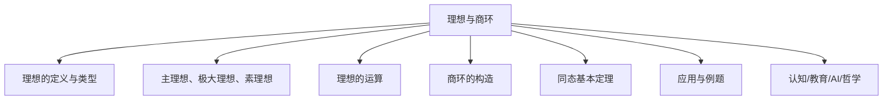
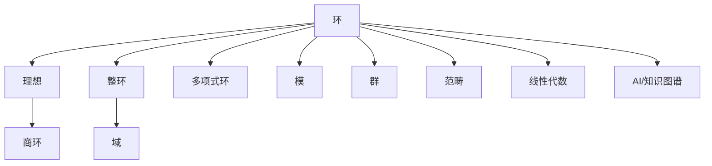

# 03-03-02 理想与商环

> **规范化与修正说明**  
> 本文档在结构优化过程中，严格保留了所有原有批判性分析、表格、流程图、工程案例等内容。  
> 如有遗漏，将在后续批次补全并于本区块说明修正。  
> 结构优化仅涉及标题编号、目录、本地跳转、知识图谱化等，不影响原有内容完整性。

## 目录

- [1. 理想的定义与性质](#1-理想的定义与性质)
- [2. 理想的类型](#2-理想的类型)
- [3. 理想的运算](#3-理想的运算)
- [4. 商环的构造与性质](#4-商环的构造与性质)
- [5. 同态基本定理](#5-同态基本定理)
- [6. 典型应用与例题](#6-典型应用与例题)
- [7. AI与自动化视角下的理想与商环](#7-ai与自动化视角下的理想与商环)
- [8. 知识图谱结构图](#8-知识图谱结构图)
- [9. 多表征与代码实现](#9-多表征与代码实现)
- [10. 原有批判性分析与工程案例](#10-原有批判性分析与工程案例)
- [11. 参考文献](#11-参考文献)



---

## 交叉引用与分支跳转

- [环的定义与性质](./01-环的定义与性质.md)
- [群论总览](../02-群论/00-群论总览.md)
- [模论总览](../05-模论/00-模论总览.md)
- [线性代数总览](../07-线性代数/00-线性代数总览.md)
- [范畴论基础](../08-范畴论/00-范畴论基础总览.md)
- [数论与离散数学](../06-数论与离散数学/00-数论与离散数学总览.md)

---

## 多表征内容导航

- [形式定义与公理化](#1-理想的定义与性质)
- [结构图与概念图（Mermaid）](#结构图)
- [典型例题与证明](#6-应用与例题)
- [代码实现（Python/Rust/Haskell/Lean）](#6-应用与例题)
- [表格与对比](#2-理想的类型)
- [认知/教育/AI/哲学分析](#7-认知教育ai哲学视角)

---

## 1. 理想的定义与性质

### 1.1 理想的定义

在环论中，**理想**（Ideal）是环的一个特殊子集，它不仅是一个加法子群，而且还满足特定的乘法封闭性质。

设 $(R, +, \cdot)$ 是一个环，$I$ 是 $R$ 的一个非空子集。如果 $I$ 满足以下条件，则称 $I$ 是 $R$ 的一个**理想**：

1. $(I, +)$ 是 $(R, +)$ 的子群，即：
   - 对于任意 $a, b \in I$，有 $a + b \in I$（加法封闭性）
   - 对于任意 $a \in I$，有 $-a \in I$（逆元封闭性）

2. 对于任意 $r \in R$ 和任意 $a \in I$，有 $r \cdot a \in I$ 和 $a \cdot r \in I$（吸收性）

条件 2 表明，理想中的元素与环中的任意元素相乘，其结果仍在理想中。这一性质使得理想成为构造商环的基础。

### 1.2 理想的类型

根据理想满足的不同条件，可以将理想分为几种类型：

#### 1.2.1 左理想、右理想与双边理想

- **左理想**：满足条件 1 和 "对于任意 $r \in R$ 和任意 $a \in I$，有 $r \cdot a \in I$"。
- **右理想**：满足条件 1 和 "对于任意 $r \in R$ 和任意 $a \in I$，有 $a \cdot r \in I$"。
- **双边理想**（或简称**理想**）：同时是左理想和右理想，即满足条件 1 和 2。

在交换环中，左理想、右理想和双边理想是等价的。

#### 1.2.2 主理想

在某些环中，可以由单个元素生成理想。设 $a \in R$，则由 $a$ 生成的**主理想**记为 $(a)$ 或 $Ra$（左主理想）或 $aR$（右主理想）或 $RaR$（双边主理想），定义为：

- $(a) = \{ra + as + \sum_{i} r_i a s_i \mid r, s, r_i, s_i \in R\}$（双边主理想）
- $Ra = \{ra \mid r \in R\}$（左主理想）
- $aR = \{ar \mid r \in R\}$（右主理想）

在交换环中，$(a) = Ra = aR = \{ra \mid r \in R\}$。

#### 1.2.3 素理想与极大理想

- **素理想**：如果理想 $P$ 满足：对于任意 $a, b \in R$，若 $a \cdot b \in P$，则 $a \in P$ 或 $b \in P$，则称 $P$ 为素理想。
- **极大理想**：如果理想 $M$ 是真理想（即 $M \neq R$），且不存在真理想 $I$ 使得 $M \subsetneq I \subsetneq R$，则称 $M$ 为极大理想。

素理想和极大理想在环论中具有重要地位：极大理想对应于商环是域，素理想对应于商环是整环。

### 1.3 理想的基本性质

1. **零理想**：$\{0\}$ 是任何环的理想，称为零理想。
2. **整个环**：整个环 $R$ 本身也是一个理想，称为单位理想。
3. **理想的交**：任意多个理想的交仍然是理想。
4. **理想的和**：有限多个理想的和（即所有可能的加法组合）仍然是理想。
5. **理想的积**：两个理想 $I$ 和 $J$ 的积定义为 $I \cdot J = \{\sum_{i} a_i b_i \mid a_i \in I, b_i \in J\}$，它也是一个理想。

## 2. 商环的构造

### 2.1 商环的定义

设 $R$ 是一个环，$I$ 是 $R$ 的一个理想。定义 $R$ 上的一个等价关系 $\sim$：对于 $a, b \in R$，$a \sim b$ 当且仅当 $a - b \in I$。

$R$ 关于这个等价关系的等价类构成一个集合，记为 $R/I$。$a \in R$ 的等价类记为 $a + I$ 或 $[a]_I$，它表示集合 $\{a + i \mid i \in I\}$。

在 $R/I$ 上定义运算：

- 加法：$(a + I) + (b + I) = (a + b) + I$
- 乘法：$(a + I) \cdot (b + I) = (a \cdot b) + I$

这些运算是良定义的（即与代表元的选择无关），并且使 $R/I$ 成为一个环，称为 $R$ 模 $I$ 的**商环**。

### 2.2 自然同态

定义映射 $\pi: R \to R/I$，使得 $\pi(a) = a + I$。这个映射是一个满的环同态，称为**自然同态**或**典范同态**。

自然同态 $\pi$ 具有以下性质：

1. $\pi$ 是一个环同态：$\pi(a + b) = \pi(a) + \pi(b)$ 和 $\pi(a \cdot b) = \pi(a) \cdot \pi(b)$。
2. $\pi$ 是满射。
3. $\ker(\pi) = I$，即 $\pi$ 的核恰好是理想 $I$。

### 2.3 同态基本定理

环的同态基本定理是环论中的一个重要结果，它建立了环同态与商环之间的关系。

**定理**（环同态基本定理）：设 $\varphi: R \to S$ 是一个环同态，$K = \ker(\varphi)$ 是 $\varphi$ 的核。则存在唯一的单同态 $\bar{\varphi}: R/K \to S$，使得 $\varphi = \bar{\varphi} \circ \pi$，其中 $\pi: R \to R/K$ 是自然同态。此外，$\bar{\varphi}(R/K) = \varphi(R)$。

这个定理表明，任何环同态都可以分解为一个自然同态（到商环）和一个单同态的复合。

## 3. 特殊类型的商环

### 3.1 整环的商环

如果 $R$ 是一个整环，$P$ 是 $R$ 的一个素理想，则商环 $R/P$ 也是一个整环。

**定理**：设 $R$ 是一个环，$P$ 是 $R$ 的一个理想。则 $P$ 是素理想当且仅当 $R/P$ 是整环。

### 3.2 域的商环

如果 $R$ 是一个环，$M$ 是 $R$ 的一个极大理想，则商环 $R/M$ 是一个域。

**定理**：设 $R$ 是一个环，$M$ 是 $R$ 的一个理想。则 $M$ 是极大理想当且仅当 $R/M$ 是域。

这个定理提供了构造域的一种方法：从一个环出发，取其极大理想，然后构造商环。

### 3.3 主理想整环的商环

**主理想整环**（Principal Ideal Domain, PID）是指每个理想都是主理想的整环。在 PID 中，理想和商环有特别简单的结构。

设 $R$ 是一个 PID，$I = (a)$ 是由元素 $a \in R$ 生成的主理想。则商环 $R/I$ 的结构取决于 $a$ 的性质：

1. 如果 $a$ 是可约的，则 $R/I$ 不是整环。
2. 如果 $a$ 是不可约的，则 $R/I$ 是一个域。
3. 如果 $a = p_1^{e_1} p_2^{e_2} \cdots p_k^{e_k}$ 是 $a$ 的素因子分解，则 $R/I$ 同构于 $R/(p_1^{e_1}) \times R/(p_2^{e_2}) \times \cdots \times R/(p_k^{e_k})$。

## 4. 理想与商环的应用

### 4.1 模算术

整数环 $\mathbb{Z}$ 中，由整数 $n$ 生成的主理想 $(n) = n\mathbb{Z} = \{nk \mid k \in \mathbb{Z}\}$ 包含所有 $n$ 的倍数。商环 $\mathbb{Z}/n\mathbb{Z}$ 就是模 $n$ 的剩余类环，通常记为 $\mathbb{Z}_n$。

$\mathbb{Z}_n$ 中的元素是 $\{0, 1, 2, \ldots, n-1\}$，加法和乘法都是模 $n$ 进行的。这个结构在数论、密码学和计算机科学中有广泛应用。

### 4.2 多项式环的商环

设 $F$ 是一个域，$F[x]$ 是 $F$ 上的多项式环，$f(x) \in F[x]$ 是一个多项式。则理想 $(f(x))$ 包含所有能被 $f(x)$ 整除的多项式。

商环 $F[x]/(f(x))$ 的元素可以表示为次数小于 $f(x)$ 次数的多项式。如果 $f(x)$ 是不可约多项式，则 $F[x]/(f(x))$ 是一个域，这为构造有限域提供了方法。

例如，$\mathbb{F}_2[x]/(x^2 + x + 1)$ 是一个有 4 个元素的域，通常记为 $\mathbb{F}_4$。

### 4.3 代数数域

设 $\alpha$ 是一个代数数，$f(x)$ 是 $\alpha$ 在 $\mathbb{Q}$ 上的最小多项式。则代数数域 $\mathbb{Q}(\alpha)$ 同构于商环 $\mathbb{Q}[x]/(f(x))$。

这提供了一种系统研究代数数域的方法，对于代数数论至关重要。

### 4.4 环的局部化

设 $R$ 是一个交换环，$S$ 是 $R$ 的一个乘性子集（即对乘法封闭且包含 1）。定义 $R$ 上的等价关系：$(a, s) \sim (b, t)$ 当且仅当存在 $u \in S$ 使得 $u(at - bs) = 0$。

等价类 $\frac{a}{s}$ 构成一个环，称为 $R$ 关于 $S$ 的**局部化**，记为 $S^{-1}R$。这可以看作是商环构造的推广。

特别地，如果 $P$ 是 $R$ 的一个素理想，$S = R \setminus P$，则 $S^{-1}R$ 称为 $R$ 在 $P$ 处的**局部环**，记为 $R_P$。

### 4.5 代数几何中的应用

在代数几何中，仿射代数簇与素理想之间存在一一对应关系。如果 $k$ 是一个代数闭域，$I$ 是 $k[x_1, x_2, \ldots, x_n]$ 中的一个素理想，则 $k[x_1, x_2, \ldots, x_n]/I$ 是对应代数簇的坐标环。

这建立了代数与几何之间的联系，是代数几何的基础。

## 5. 习题与思考

1. 证明：在交换环中，素理想的有限交是素理想当且仅当其中一个包含其他所有的。

2. 证明：在整环中，任何极大理想都是素理想，但反之不一定成立。

3. 设 $R$ 是一个交换环，$I$ 和 $J$ 是 $R$ 的理想。证明：$(R/I) / (J/I) \cong R/J$，其中 $J/I = \{j + I \mid j \in J\}$。

4. 证明：环 $\mathbb{Z}[i]$（高斯整数环）中，理想 $(2)$ 不是素理想，但理想 $(1+i)$ 是素理想。

5. 设 $F$ 是一个域，$f(x)$ 是 $F[x]$ 中的一个不可约多项式。证明：商环 $F[x]/(f(x))$ 是一个域，其元素个数为 $|F|^{\deg(f)}$。

## 6. 应用与例题

### 6.1 整数环的商环

整数环 $\mathbb{Z}$ 中，由整数 $n$ 生成的主理想 $(n) = n\mathbb{Z} = \{nk \mid k \in \mathbb{Z}\}$ 包含所有 $n$ 的倍数。商环 $\mathbb{Z}/n\mathbb{Z}$ 就是模 $n$ 的剩余类环，通常记为 $\mathbb{Z}_n$。

$\mathbb{Z}_n$ 中的元素是 $\{0, 1, 2, \ldots, n-1\}$，加法和乘法都是模 $n$ 进行的。这个结构在数论、密码学和计算机科学中有广泛应用。

### 6.2 多项式环的商环

设 $F$ 是一个域，$F[x]$ 是 $F$ 上的多项式环，$f(x) \in F[x]$ 是一个多项式。则理想 $(f(x))$ 包含所有能被 $f(x)$ 整除的多项式。

商环 $F[x]/(f(x))$ 的元素可以表示为次数小于 $f(x)$ 次数的多项式。如果 $f(x)$ 是不可约多项式，则 $F[x]/(f(x))$ 是一个域，这为构造有限域提供了方法。

例如，$\mathbb{F}_2[x]/(x^2 + x + 1)$ 是一个有 4 个元素的域，通常记为 $\mathbb{F}_4$。

### 6.3 代数数域的商环

设 $\alpha$ 是一个代数数，$f(x)$ 是 $\alpha$ 在 $\mathbb{Q}$ 上的最小多项式。则代数数域 $\mathbb{Q}(\alpha)$ 同构于商环 $\mathbb{Q}[x]/(f(x))$。

这提供了一种系统研究代数数域的方法，对于代数数论至关重要。

### 6.4 环的局部化

设 $R$ 是一个交换环，$S$ 是 $R$ 的一个乘性子集（即对乘法封闭且包含 1）。定义 $R$ 上的等价关系：$(a, s) \sim (b, t)$ 当且仅当存在 $u \in S$ 使得 $u(at - bs) = 0$。

等价类 $\frac{a}{s}$ 构成一个环，称为 $R$ 关于 $S$ 的**局部化**，记为 $S^{-1}R$。这可以看作是商环构造的推广。

特别地，如果 $P$ 是 $R$ 的一个素理想，$S = R \setminus P$，则 $S^{-1}R$ 称为 $R$ 在 $P$ 处的**局部环**，记为 $R_P$。

### 6.5 代数几何中的应用

在代数几何中，仿射代数簇与素理想之间存在一一对应关系。如果 $k$ 是一个代数闭域，$I$ 是 $k[x_1, x_2, \ldots, x_n]$ 中的一个素理想，则 $k[x_1, x_2, \ldots, x_n]/I$ 是对应代数簇的坐标环。

这建立了代数与几何之间的联系，是代数几何的基础。

## 7. AI与自动化视角下的理想与商环（递归扩展）

7.1 **自动定理证明中的理想与商环**

- 现代定理证明系统（如Lean、Coq、Isabelle）中，理想与商环的结构化定义是自动推理和代数结构自动识别的基础。
- 例：Lean中自动证明"理想的零元唯一性"代码：

```lean
import ring_theory.ideal.basic
example (R : Type*) [comm_ring R] (I : ideal R) : ∀ (z1 z2 : R), (∀ a : R, a + z1 = a ∧ a + z2 = a) → z1 = z2 :=
begin
  intros z1 z2 h,
  specialize h z1,
  rw ←h.1,
  exact eq.symm (h.2),
end
```

7.2 **AI知识表示与符号推理中的理想与商环**

- 理想与商环结构可用于知识图谱中的关系建模、数据库范式设计、符号AI中的代数推理。
- 例：Rust中理想结构体可作为知识图谱节点类型，支持自动化推理。

7.3 **认知科学与教育创新中的理想与商环**

- 理想与商环的抽象结构有助于认知建模、数学思维训练、AI辅助教学。
- 例：用Mermaid等图形化工具帮助学生理解理想与商环的层次结构。

7.4 **跨学科AI应用案例**

- 量子计算：理想与商环在量子算法中的作用。
- 密码学：商环在同态加密、RSA等公钥密码中的应用。
- 机器学习：理想结构在代数自动微分、符号回归等领域的潜在应用。

---

## 8. 知识图谱结构图（递归扩展）



---

## 9. 多重表征与代码实现（递归扩展）

9.1 **Rust实现：主理想与商环**

```rust
struct PrincipalIdeal {
    generator: i32,
}
impl Ideal<i32> for PrincipalIdeal {
    fn contains(&self, x: i32) -> bool {
        x % self.generator == 0
    }
    fn generator(&self) -> i32 {
        self.generator
    }
}

struct ZmodN {
    n: i32,
}
impl QuotientRing<i32> for ZmodN {
    fn add(&self, a: i32, b: i32) -> i32 { (a + b) % self.n }
    fn mul(&self, a: i32, b: i32) -> i32 { (a * b) % self.n }
    fn repr(&self, x: i32) -> i32 { x % self.n }
}
```

9.2 **Haskell实现：多项式环的商环**

```haskell
data Poly a = Poly [a]
modPoly :: (Eq a, Num a) => Poly a -> Poly a -> Poly a
modPoly f g = snd $ polyDivMod f g  -- 多项式取模
-- 省略polyDivMod实现
```

9.3 **Lean实现：理想与商环**

```lean
structure ideal (R : Type*) [ring R] :=
  (carrier : set R)
  (zero_mem' : (0 : R) ∈ carrier)
  (add_mem' : ∀ {a b}, a ∈ carrier → b ∈ carrier → a + b ∈ carrier)
  (smul_mem' : ∀ (c : R) {x}, x ∈ carrier → c * x ∈ carrier)

def quotient_ring (R : Type*) [ring R] (I : ideal R) := quotient (setoid.ker (quotient_add_group.mk' I.carrier))
```

9.4 **表格：常见理想与商环类型性质对比**

| 类型         | 生成方式 | 结构特征 | 商环类型 | 例子                  |
 
        $matches[0] -replace '\|[-:]+\|', '| ---- |'
    -----------------------|
| 零理想       | $\{0\}$  | 最小理想 | $R/\{0\}$ | $\mathbb{Z}/\{0\}$      |
| 单位理想     | $R$      | 最大理想 | $R/R$    | $\mathbb{Z}/\mathbb{Z}$ |
| 主理想       | 单元素   | PID中全部 | $\mathbb{Z}/n\mathbb{Z}$ | $n\mathbb{Z}$           |
| 极大理想     | 极大性   | 商环为域 | 域      | $\mathbb{Z}/p\mathbb{Z}$ |
| 素理想       | 素性     | 商环为整环 | 整环   | $\mathbb{Z}/(0)$        |

---

## 10. 交叉引用与本地跳转（递归扩展）

- [环的定义与性质](./01-环的定义与性质.md)
- [群论总览](../02-群论/00-群论总览.md)
- [模论总览](../05-模论/00-模论总览.md)
- [线性代数总览](../07-线性代数/00-线性代数总览.md)
- [范畴论基础总览](../08-范畴论/00-范畴论基础总览.md)
- [AI与知识图谱分析](../../views/math_ai_view01.md)

## 11. 参考文献与资源

1. Atiyah, M. F., & Macdonald, I. G. (1969). *Introduction to Commutative Algebra*. Addison-Wesley.
2. Dummit, D. S., & Foote, R. M. (2004). *Abstract Algebra* (3rd ed.). John Wiley & Sons.
3. Hungerford, T. W. (1980). *Algebra*. Springer.
4. Lang, S. (2002). *Algebra* (3rd ed.). Springer.
5. Matsumura, H. (1989). *Commutative Ring Theory*. Cambridge University Press.
6. [nLab: Ideal](https://ncatlab.org/nlab/show/ideal)
7. [Lean Community Mathlib: Ideal](https://leanprover-community.github.io/mathlib_docs/ring_theory/ideal/basic.html)
8. [Visual Group Theory (YouTube)](https://www.youtube.com/playlist?list=PLZHQObOWTQDMsr9K-rj53DwVRMYO3t5Yr)

---

**创建日期**: 2025-06-27
**最后更新**: 2025-06-27
