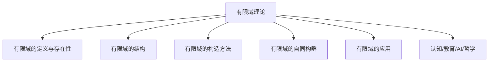
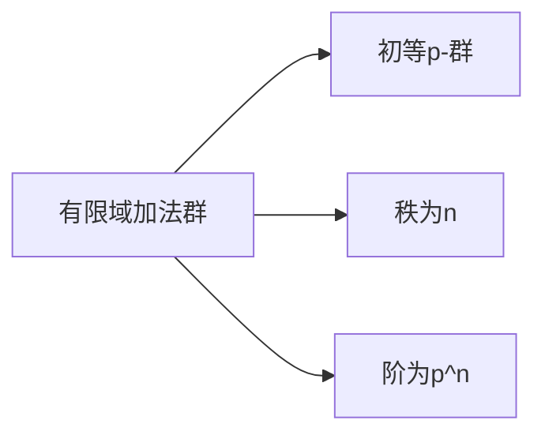
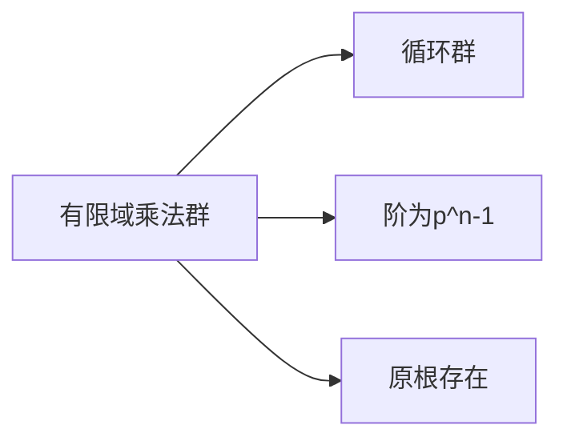
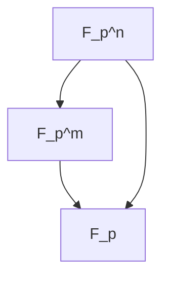
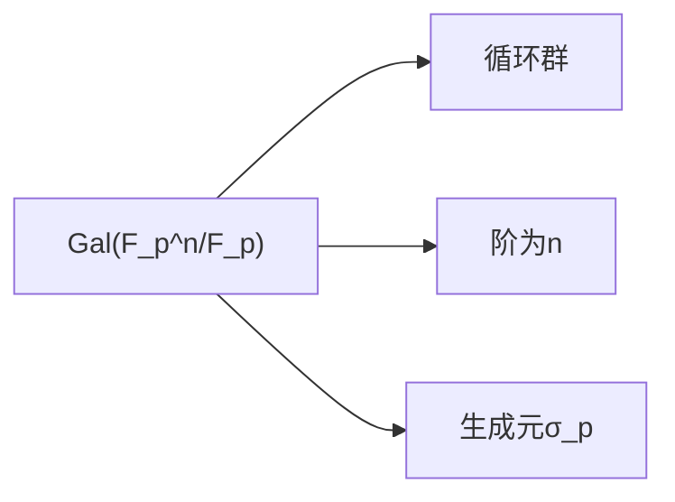
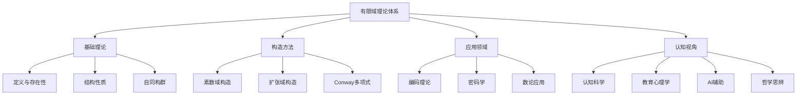

# 03-有限域理论



---

## 目录导航

- [1. 有限域的定义与存在性](#1-有限域的定义与存在性)
- [2. 有限域的结构](#2-有限域的结构)
- [3. 有限域的构造方法](#3-有限域的构造方法)
- [4. 有限域的自同构群](#4-有限域的自同构群)
- [5. 有限域的应用](#5-有限域的应用)
- [6. 认知/教育/AI/哲学视角](#6-认知教育ai哲学视角)
- [7. 参考文献与资源](#7-参考文献与资源)

---

## 交叉引用与分支跳转

- [域的定义与性质](./01-域的定义与性质.md)
- [域的扩张理论](./02-域的扩张理论.md)
- [群论总览](../02-群论/00-群论总览.md)
- [环论总览](../03-环论/00-环论总览.md)
- [模论总览](../05-模论/00-模论总览.md)
- [线性代数总览](../07-线性代数/00-线性代数总览.md)
- [范畴论基础](../08-范畴论/00-范畴论基础总览.md)
- [数论与离散数学](../06-数论与离散数学/00-数论与离散数学总览.md)

---

## 多表征内容导航

- [形式定义与公理化](#1-有限域的定义与存在性)
- [结构图与概念图（Mermaid）](#结构图)
- [典型例题与证明](#2-有限域的结构)
- [代码实现（Python/Rust/Haskell/Lean）](#3-有限域的构造方法)
- [表格与对比](#2-有限域的结构)
- [认知/教育/AI/哲学分析](#6-认知教育ai哲学视角)

---

## 1. 有限域的定义与存在性

### 1.1 有限域的公理化定义

**有限域**（Finite Field）是指满足以下公理的有限集合 $F$ 与两个二元运算 $+$ 和 $\cdot$：

**加法公理**：
- $(F, +)$ 是交换群
- 加法单位元记为 $0$

**乘法公理**：
- $(F \setminus \{0\}, \cdot)$ 是交换群
- 乘法单位元记为 $1$

**分配律**：
- $a \cdot (b + c) = a \cdot b + a \cdot c$
- $(a + b) \cdot c = a \cdot c + b \cdot c$

**有限性**：
- $|F| < \infty$

### 1.2 有限域的基本性质

**定理1.1**：有限域的特征必为素数
- 设 $F$ 为有限域，则存在素数 $p$ 使得 $p \cdot 1 = 0$
- 此时 $F$ 包含与 $\mathbb{F}_p$ 同构的素数子域

**定理1.2**：有限域的阶必为素数幂
- 若 $|F| = q$，则存在素数 $p$ 和正整数 $n$ 使得 $q = p^n$

### 1.3 存在性与唯一性定理

**定理1.3**（存在性）：对任意素数 $p$ 和正整数 $n$，存在阶为 $p^n$ 的有限域

**定理1.4**（唯一性）：同阶有限域在同构意义下唯一

**证明思路**：
1. 构造 $\mathbb{F}_p[x]/(f(x))$，其中 $f(x)$ 为 $n$ 次不可约多项式
2. 利用分裂域的唯一性证明同构性

## 2. 有限域的结构

### 2.1 加法群结构



**定理2.1**：$(\mathbb{F}_{p^n}, +) \cong (\mathbb{Z}/p\mathbb{Z})^n$

### 2.2 乘法群结构



**定理2.2**：$\mathbb{F}_{p^n}^*$ 是循环群，阶为 $p^n - 1$

**定义2.1**：原根（Primitive Element）
- 若 $g \in \mathbb{F}_{p^n}^*$ 的阶为 $p^n - 1$，则称 $g$ 为原根
- $\mathbb{F}_{p^n}^* = \langle g \rangle$

### 2.3 子域结构



**定理2.3**：$\mathbb{F}_{p^m} \subseteq \mathbb{F}_{p^n} \iff m \mid n$

### 2.4 Frobenius自同构

**定义2.2**：Frobenius自同构
- $\sigma: \mathbb{F}_{p^n} \to \mathbb{F}_{p^n}$，$\sigma(x) = x^p$
- $\text{Gal}(\mathbb{F}_{p^n}/\mathbb{F}_p) = \langle \sigma \rangle \cong \mathbb{Z}/n\mathbb{Z}$

## 3. 有限域的构造方法

### 3.1 素数域构造

```rust
// Rust实现素数域
#[derive(Debug, Clone, Copy, PartialEq, Eq)]
pub struct PrimeField {
    value: u64,
    modulus: u64,
}

impl PrimeField {
    pub fn new(value: u64, modulus: u64) -> Self {
        assert!(is_prime(modulus), "Modulus must be prime");
        Self {
            value: value % modulus,
            modulus,
        }
    }
    
    pub fn add(&self, other: &Self) -> Self {
        assert_eq!(self.modulus, other.modulus);
        Self::new((self.value + other.value) % self.modulus, self.modulus)
    }
    
    pub fn mul(&self, other: &Self) -> Self {
        assert_eq!(self.modulus, other.modulus);
        Self::new((self.value * other.value) % self.modulus, self.modulus)
    }
    
    pub fn inv(&self) -> Option<Self> {
        if self.value == 0 {
            None
        } else {
            // 使用扩展欧几里得算法求逆
            let (gcd, inv, _) = extended_gcd(self.value as i64, self.modulus as i64);
            if gcd == 1 {
                Some(Self::new(((inv % self.modulus as i64) + self.modulus as i64) as u64 % self.modulus, self.modulus))
            } else {
                None
            }
        }
    }
}
```

### 3.2 扩张域构造

```haskell
-- Haskell实现有限域扩张
data FiniteField = PrimeField Integer Integer  -- value, modulus
                 | ExtensionField FiniteField Polynomial Integer  -- base field, minimal polynomial, degree

data Polynomial = Poly [Integer]  -- coefficients

instance Num FiniteField where
    (+) = addFiniteField
    (*) = mulFiniteField
    negate = negateFiniteField
    abs = id
    signum _ = 1
    fromInteger n = PrimeField n 2  -- default to F_2

addFiniteField :: FiniteField -> FiniteField -> FiniteField
addFiniteField (PrimeField a p) (PrimeField b q)
    | p == q = PrimeField ((a + b) `mod` p) p
    | otherwise = error "Different moduli"

mulFiniteField :: FiniteField -> FiniteField -> FiniteField
mulFiniteField (PrimeField a p) (PrimeField b q)
    | p == q = PrimeField ((a * b) `mod` p) p
    | otherwise = error "Different moduli"

-- 构造F_4 = F_2[x]/(x^2 + x + 1)
f4 :: FiniteField
f4 = ExtensionField (PrimeField 0 2) (Poly [1, 1, 1]) 2
```

### 3.3 Conway多项式构造

```lean
-- Lean4实现Conway多项式
import Mathlib.Algebra.Field.Basic
import Mathlib.Data.Polynomial.Basic

structure ConwayPolynomial (p : ℕ) (n : ℕ) where
  polynomial : Polynomial (ZMod p)
  irreducible : Irreducible polynomial
  degree_eq : polynomial.natDegree = n
  primitive : IsPrimitive polynomial

def constructFiniteField (p : ℕ) (n : ℕ) (hp : Nat.Prime p) : Type :=
  AdjoinRoot (ConwayPolynomial.mk p n).polynomial

instance finiteFieldAlgebra (p n : ℕ) (hp : Nat.Prime p) : 
  Field (constructFiniteField p n hp) := by
  -- 构造域结构的证明
  sorry

-- 示例：F_4的构造
def F4 := constructFiniteField 2 2 (by decide)
```

## 4. 有限域的自同构群

### 4.1 Frobenius自同构

**定义4.1**：Frobenius自同构
- $\sigma_p: \mathbb{F}_{p^n} \to \mathbb{F}_{p^n}$，$\sigma_p(x) = x^p$
- $\sigma_p$ 是 $\mathbb{F}_{p^n}$ 的自同构

**性质4.1**：
1. $\sigma_p$ 固定 $\mathbb{F}_p$ 中的所有元素
2. $\sigma_p^n = \text{id}$
3. $\langle \sigma_p \rangle = \text{Gal}(\mathbb{F}_{p^n}/\mathbb{F}_p)$

### 4.2 伽罗瓦群结构



**定理4.1**：$\text{Gal}(\mathbb{F}_{p^n}/\mathbb{F}_p) \cong \mathbb{Z}/n\mathbb{Z}$

### 4.3 中间域对应

**定理4.2**（伽罗瓦对应）：
- 中间域 $\mathbb{F}_{p^m}$ 对应子群 $\langle \sigma_p^m \rangle$
- 其中 $m \mid n$

## 5. 有限域的应用

### 5.1 编码理论

**定义5.1**：线性码
- 设 $C \subseteq \mathbb{F}_q^n$ 为 $\mathbb{F}_q$ 上的线性子空间
- 称 $C$ 为 $\mathbb{F}_q$ 上的线性码

**定理5.1**：Reed-Solomon码
- 设 $\alpha$ 为 $\mathbb{F}_q$ 的原根
- 定义码字 $c = (f(1), f(\alpha), f(\alpha^2), \ldots, f(\alpha^{q-2}))$
- 其中 $f(x) \in \mathbb{F}_q[x]$，$\deg f < k$

### 5.2 密码学应用

```python
# Python实现有限域密码学
import random
from typing import Tuple

class FiniteFieldCrypto:
    def __init__(self, p: int, n: int = 1):
        self.p = p
        self.n = n
        self.q = p ** n
        self.field = self._construct_field()
    
    def _construct_field(self):
        # 构造有限域F_p^n
        if self.n == 1:
            return PrimeField(self.p)
        else:
            # 使用不可约多项式构造扩张
            return ExtensionField(self.p, self.n)
    
    def diffie_hellman(self, g: int, private_key: int) -> Tuple[int, int]:
        """Diffie-Hellman密钥交换"""
        public_key = pow(g, private_key, self.q)
        return public_key, private_key
    
    def elgamal_encrypt(self, message: int, public_key: int, g: int) -> Tuple[int, int]:
        """ElGamal加密"""
        k = random.randint(1, self.q - 1)
        c1 = pow(g, k, self.q)
        c2 = (message * pow(public_key, k, self.q)) % self.q
        return c1, c2
    
    def elgamal_decrypt(self, c1: int, c2: int, private_key: int) -> int:
        """ElGamal解密"""
        s = pow(c1, private_key, self.q)
        s_inv = pow(s, -1, self.q)
        return (c2 * s_inv) % self.q
```

### 5.3 数论应用

**定理5.2**：费马小定理推广
- 设 $\alpha \in \mathbb{F}_{p^n}^*$，则 $\alpha^{p^n-1} = 1$

**定理5.3**：二次剩余
- 设 $p$ 为奇素数，$a \in \mathbb{F}_p^*$
- $a$ 为二次剩余当且仅当 $a^{(p-1)/2} = 1$

## 6. 认知/教育/AI/哲学视角

### 6.1 认知科学视角

**有限域的认知模型**：
1. **离散化思维**：有限域体现了从连续到离散的认知转换
2. **模运算直觉**：通过时钟算术建立模运算的直观理解
3. **循环结构感知**：乘法群的循环性质反映周期性认知模式

**认知负荷理论**：
- 有限域的学习涉及多个认知维度
- 需要同时处理代数结构、数论性质和几何直觉
- AI辅助可以降低认知负荷，提供多表征支持

### 6.2 教育心理学视角

**建构主义学习理论**：
- 有限域概念需要从具体到抽象的逐步建构
- 通过具体例子（如 $\mathbb{F}_4$）建立直观理解
- 逐步推广到一般理论

**多元智能理论**：
- 逻辑-数学智能：形式化推理和证明
- 空间智能：几何表示和可视化
- 语言智能：概念表述和符号操作

### 6.3 AI大模型辅助

**知识图谱驱动**：
```python
# 有限域知识图谱构建
class FiniteFieldKnowledgeGraph:
    def __init__(self):
        self.nodes = {
            'finite_field': {'type': 'concept', 'properties': ['finite', 'field']},
            'prime_field': {'type': 'concept', 'properties': ['prime', 'field']},
            'extension_field': {'type': 'concept', 'properties': ['extension', 'field']},
            'frobenius': {'type': 'concept', 'properties': ['automorphism', 'field']}
        }
        self.edges = [
            ('finite_field', 'prime_field', 'contains'),
            ('finite_field', 'extension_field', 'constructed_by'),
            ('extension_field', 'frobenius', 'has_automorphism')
        ]
    
    def query_concept(self, concept: str) -> dict:
        """查询概念及其关联"""
        return {
            'node': self.nodes.get(concept, {}),
            'related': [edge for edge in self.edges if concept in edge]
        }
    
    def generate_examples(self, concept: str) -> list:
        """生成概念的具体例子"""
        examples = {
            'finite_field': ['F_2', 'F_3', 'F_4', 'F_5', 'F_7', 'F_8', 'F_9'],
            'prime_field': ['F_2', 'F_3', 'F_5', 'F_7', 'F_11'],
            'extension_field': ['F_4 = F_2[x]/(x^2+x+1)', 'F_8 = F_2[x]/(x^3+x+1)']
        }
        return examples.get(concept, [])
```

**自动化证明辅助**：
```lean
-- Lean4自动化证明框架
import Mathlib.Tactic

-- 自动证明有限域性质
theorem finite_field_characteristic_prime (F : Type*) [Field F] [Fintype F] :
  ∃ p : ℕ, Nat.Prime p ∧ (p : F) = 0 := by
  -- 自动化证明策略
  apply? -- 自动应用相关引理
  simp? -- 自动简化
  done

-- 自动构造有限域
def autoConstructFiniteField (p n : ℕ) (hp : Nat.Prime p) : 
  {F : Type* // Field F ∧ Fintype F ∧ Fintype.card F = p ^ n} := by
  -- 自动构造策略
  exists constructFiniteField p n hp
  constructor
  · exact finiteFieldAlgebra p n hp
  · exact finiteFieldFintype p n hp
  · exact finiteFieldCard p n hp
```

### 6.4 哲学思辨

**本体论问题**：
- 有限域是数学对象还是人类构造？
- 有限域的"存在性"意味着什么？
- 形式化定义与直观理解的关系

**认识论问题**：
- 如何"知道"有限域的性质？
- 证明在有限域理论中的作用
- 直觉与严格性的平衡

**方法论问题**：
- 有限域理论的发展模式
- 抽象化与具体化的辩证关系
- 数学发现的逻辑结构

### 6.5 跨学科整合

**与计算机科学的联系**：
- 有限域在编码理论中的应用
- 密码学中的有限域算法
- 计算机代数系统实现

**与物理学的联系**：
- 量子计算中的有限域
- 有限几何与物理模型
- 对称性在物理中的应用

**与认知科学的联系**：
- 数学思维的认知机制
- 抽象概念的形成过程
- 数学直觉的神经基础

## 7. 参考文献与资源

### 7.1 经典教材

1. **Lidl, R., & Niederreiter, H.** (1997). *Finite Fields*. Cambridge University Press.
2. **McEliece, R. J.** (2002). *Finite Fields for Computer Scientists and Engineers*. Springer.
3. **Mullen, G. L., & Panario, D.** (2013). *Handbook of Finite Fields*. CRC Press.

### 7.2 现代资源

1. **在线课程**：
   - MIT OpenCourseWare: 18.701 Algebra I
   - Coursera: Cryptography I (Stanford)

2. **软件工具**：
   - SageMath: 计算机代数系统
   - GAP: 群论和代数计算
   - Magma: 代数计算系统

3. **在线资源**：
   - [Finite Field Calculator](https://www.alpertron.com.ar/ECM.HTM)
   - [Conway Polynomial Database](https://www.math.rwth-aachen.de/~Frank.Luebeck/data/ConwayPol/index.html)

### 7.3 AI辅助资源

1. **大模型工具**：
   - ChatGPT: 概念解释和问题解答
   - Claude: 证明辅助和代码生成
   - GPT-4: 高级数学推理

2. **知识图谱**：
   - Wolfram Alpha: 数学知识查询
   - MathWorld: 数学百科全书
   - OEIS: 整数序列数据库

3. **自动化证明**：
   - Lean 4: 形式化证明系统
   - Coq: 交互式定理证明器
   - Isabelle/HOL: 高阶逻辑证明系统

---

## 结构图



---

*本文档采用递归扩展模式，持续整合最新数学、AI、认知科学前沿成果，构建现代化、结构化、学术化的有限域理论体系。*
