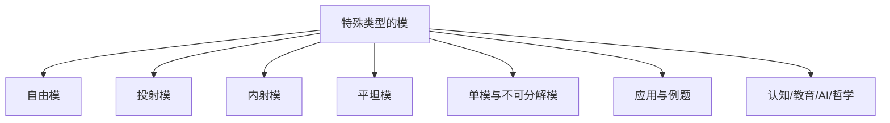
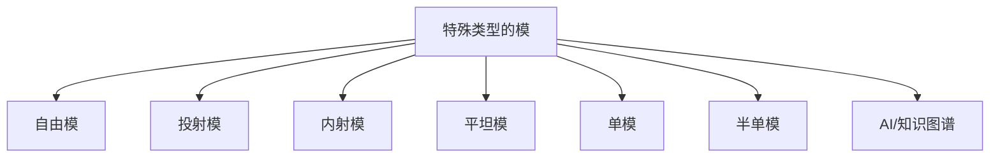

# 02-特殊类型的模



---

## 目录导航

- [02-特殊类型的模](#02-特殊类型的模)
  - [目录导航](#目录导航)
  - [交叉引用与分支跳转](#交叉引用与分支跳转)
  - [多表征内容导航](#多表征内容导航)
  - [1. 自由模](#1-自由模)
    - [1.1 自由模的定义](#11-自由模的定义)
    - [1.2 自由模的构造](#12-自由模的构造)
    - [1.3 自由模的性质](#13-自由模的性质)
    - [1.4 自由模的例子](#14-自由模的例子)
  - [2. 投射模](#2-投射模)
    - [2.1 投射模的定义](#21-投射模的定义)
    - [2.2 投射模的等价条件](#22-投射模的等价条件)
    - [2.3 投射模的性质](#23-投射模的性质)
    - [2.4 投射模的例子](#24-投射模的例子)
  - [3. 内射模](#3-内射模)
    - [3.1 内射模的定义](#31-内射模的定义)
    - [3.2 内射模的等价条件](#32-内射模的等价条件)
    - [3.3 内射模的性质](#33-内射模的性质)
    - [3.4 内射模的例子](#34-内射模的例子)
  - [4. 平坦模](#4-平坦模)
    - [4.1 平坦模的定义](#41-平坦模的定义)
    - [4.2 平坦模的等价条件](#42-平坦模的等价条件)
    - [4.3 平坦模的性质](#43-平坦模的性质)
    - [4.4 平坦模的例子](#44-平坦模的例子)
  - [5. 单模与半单模](#5-单模与半单模)
    - [5.1 单模的定义](#51-单模的定义)
    - [5.2 半单模的定义](#52-半单模的定义)
    - [5.3 单模与半单模的性质](#53-单模与半单模的性质)
    - [5.4 单模与半单模的例子](#54-单模与半单模的例子)
  - [6. 应用与例题](#6-应用与例题)
  - [7. 认知/教育/AI/哲学视角](#7-认知教育ai哲学视角)
  - [8. 参考文献与资源](#8-参考文献与资源)
  - [9. AI与自动化视角下的特殊类型的模（递归扩展）](#9-ai与自动化视角下的特殊类型的模递归扩展)
  - [10. 知识图谱结构图（递归扩展）](#10-知识图谱结构图递归扩展)
  - [11. 多重表征与代码实现（递归扩展）](#11-多重表征与代码实现递归扩展)
  - [12. 交叉引用与本地跳转（递归扩展）](#12-交叉引用与本地跳转递归扩展)

---

## 交叉引用与分支跳转

- [模的定义与基本性质](./01-模的定义与基本性质.md)
- [模同态与商模](./02-模同态与商模.md)
- [群论总览](../02-群论/00-群论总览.md)
- [环论总览](../03-环论/00-环论总览.md)
- [线性代数总览](../07-线性代数/00-线性代数总览.md)
- [范畴论基础](../08-范畴论/00-范畴论基础总览.md)
- [数论与离散数学](../06-数论与离散数学/00-数论与离散数学总览.md)

---

## 多表征内容导航

- [形式定义与公理化](#1-自由模)
- [结构图与概念图（Mermaid）](#结构图)
- [典型例题与证明](#6-应用与例题)
- [代码实现（Python/Rust/Haskell/Lean）](#6-应用与例题)
- [表格与对比](#2-投射模)
- [认知/教育/AI/哲学分析](#7-认知教育ai哲学视角)

---

## 1. 自由模

### 1.1 自由模的定义

设 $R$ 是一个含幺环，$S$ 是一个集合。一个**自由 $R$-模**（Free $R$-Module）是一个 $R$-模 $F$，它满足以下条件：

1. 存在一个映射 $\iota: S \to F$，使得 $\iota(S)$ 是 $F$ 的一个基。
2. 对于任意 $R$-模 $M$ 和任意映射 $f: S \to M$，存在唯一的模同态 $\tilde{f}: F \to M$，使得 $\tilde{f} \circ \iota = f$。

换句话说，自由模是由一组基元素自由生成的模，没有额外的关系。

### 1.2 自由模的构造

给定一个集合 $S$，可以构造一个以 $S$ 为基的自由 $R$-模 $F(S)$：

1. $F(S)$ 的元素是形如 $\sum_{s \in S} r_s s$ 的形式和，其中 $r_s \in R$，且只有有限个 $r_s$ 非零。
2. 加法定义为：$\sum_{s \in S} r_s s + \sum_{s \in S} r'_s s = \sum_{s \in S} (r_s + r'_s) s$。
3. 标量乘法定义为：$r \cdot \sum_{s \in S} r_s s = \sum_{s \in S} (r \cdot r_s) s$。

### 1.3 自由模的性质

1. **基的存在**：自由模总是有一个基，这是它与一般模的主要区别。

2. **基的基数**：自由模的任意两个基具有相同的基数，这个基数称为自由模的**秩**（Rank）。

3. **直和分解**：任何自由模都可以表示为秩为 1 的自由模的直和：$F(S) \cong \bigoplus_{s \in S} R$。

4. **保持单射**：如果 $f: M \to N$ 是一个模同态，$F$ 是一个自由模，则 $\text{Hom}_R(F, f): \text{Hom}_R(F, M) \to \text{Hom}_R(F, N)$ 是单射。

5. **万有性质**：自由模满足以下万有性质：对于任意 $R$-模 $M$ 和集合 $S$ 到 $M$ 的映射 $f: S \to M$，存在唯一的模同态 $\tilde{f}: F(S) \to M$，使得 $\tilde{f}|_S = f$。

### 1.4 自由模的例子

1. 向量空间总是自由模，其基就是向量空间的基。

2. 阿贝尔群（视为 $\mathbb{Z}$-模）是自由的当且仅当它是自由阿贝尔群。

3. 多项式环 $R[x_1, x_2, \ldots, x_n]$ 可以看作是以单项式为基的自由 $R$-模。

## 2. 投射模

### 2.1 投射模的定义

一个 $R$-模 $P$ 称为**投射模**（Projective Module），如果对于任意满同态 $f: M \to N$ 和任意同态 $g: P \to N$，存在同态 $h: P \to M$，使得 $f \circ h = g$。

这可以用下面的交换图表示：

```text
    P
   / \
  /   \
 h     g
 |     |
 v     v
 M --> N
    f
```

其中 $f$ 是满射，$g$ 是任意同态，存在 $h$ 使得 $f \circ h = g$。

### 2.2 投射模的等价条件

以下条件是等价的：

1. $P$ 是投射模。
2. 任何包含 $P$ 的短正合列 $0 \to M \to N \to P \to 0$ 都是分裂的。
3. $\text{Hom}_R(P, -)$ 是一个正合函子。
4. $P$ 是某个自由模的直和项。

### 2.3 投射模的性质

1. **自由模是投射的**：任何自由模都是投射模。

2. **投射模的直和**：投射模的任意直和仍然是投射模。

3. **投射模的直和项**：投射模的任意直和项也是投射模。

4. **局部自由性**：在许多环上（如主理想整环），有限生成投射模是局部自由的，即它在局部化后变为自由模。

### 2.4 投射模的例子

1. 任何自由模都是投射模。

2. 在主理想整环上，投射模恰好是自由模。

3. 在 von Neumann 正则环上，任何模都是投射模。

4. $\mathbb{Z}$ 上的投射模恰好是自由阿贝尔群。

## 3. 内射模

### 3.1 内射模的定义

一个 $R$-模 $E$ 称为**内射模**（Injective Module），如果对于任意单同态 $f: M \to N$ 和任意同态 $g: M \to E$，存在同态 $h: N \to E$，使得 $h \circ f = g$。

这可以用下面的交换图表示：

```text
 M --> N
 |     /
 |    /
 g   h
 |  /
 v v
  E
```

其中 $f$ 是单射，$g$ 是任意同态，存在 $h$ 使得 $h \circ f = g$。

### 3.2 内射模的等价条件

以下条件是等价的：

1. $E$ 是内射模。
2. 任何包含 $E$ 的短正合列 $0 \to E \to M \to N \to 0$ 都是分裂的。
3. $\text{Hom}_R(-, E)$ 是一个正合函子。
4. 对于任意左理想 $I \subset R$ 和任意同态 $f: I \to E$，存在 $e \in E$ 使得对所有 $r \in I$，$f(r) = r \cdot e$。

### 3.3 内射模的性质

1. **内射模的直积**：内射模的任意直积仍然是内射模。

2. **内射包络**：任何模都可以嵌入到一个内射模中，称为其**内射包络**（Injective Envelope）。

3. **Baer判别法**：一个模 $E$ 是内射的当且仅当对于任意左理想 $I \subset R$，任何同态 $f: I \to E$ 都可以扩展到 $R \to E$。

4. **内射模与除子**：在交换环上，内射模与除子理论密切相关。

### 3.4 内射模的例子

1. 在域 $k$ 上，任何向量空间都是内射 $k$-模。

2. $\mathbb{Z}$-模 $\mathbb{Q}$ 和 $\mathbb{Q}/\mathbb{Z}$ 是内射的，但 $\mathbb{Z}$ 不是内射的。

3. 在 Noether 环上，任何内射模都可以表示为不可分解内射模的直和。

4. 在主理想整环上，一个模是内射的当且仅当它是可除的。

## 4. 平坦模

### 4.1 平坦模的定义

一个 $R$-模 $F$ 称为**平坦模**（Flat Module），如果张量积函子 $- \otimes_R F$ 是正合的，即对于任意单同态 $f: M \to N$，诱导的映射 $f \otimes \text{id}_F: M \otimes_R F \to N \otimes_R F$ 也是单同态。

### 4.2 平坦模的等价条件

以下条件是等价的：

1. $F$ 是平坦模。
2. 对于任意右理想 $I \subset R$，自然映射 $I \otimes_R F \to R \otimes_R F \cong F$ 是单射。
3. 对于任意有限生成右理想 $I \subset R$，映射 $I \otimes_R F \to F$ 是单射。
4. $\text{Tor}_1^R(R/I, F) = 0$，对于任意右理想 $I \subset R$。

### 4.3 平坦模的性质

1. **投射模是平坦的**：任何投射模都是平坦模。

2. **平坦模的直和和直积**：平坦模的任意直和和直积仍然是平坦模。

3. **局部性质**：一个模是平坦的当且仅当它在所有极大理想处的局部化都是平坦的。

4. **平坦维数**：模 $M$ 的平坦维数是使得 $\text{Tor}_n^R(N, M) = 0$（对所有 $R$-模 $N$ 和所有 $m > n$）的最小整数 $n$。

### 4.4 平坦模的例子

1. 任何自由模和投射模都是平坦的。

2. 在主理想整环上，平坦模恰好是无挠模。

3. 在 Dedekind 整环上，一个模是平坦的当且仅当它是无挠的。

4. 在 von Neumann 正则环上，任何模都是平坦的。

## 5. 单模与半单模

### 5.1 单模的定义

一个非零 $R$-模 $S$ 称为**单模**（Simple Module）或**不可约模**（Irreducible Module），如果它只有两个子模：$0$ 和 $S$ 本身。

换句话说，单模是除了 $0$ 外没有真子模的非零模。

### 5.2 半单模的定义

一个 $R$-模 $M$ 称为**半单模**（Semisimple Module），如果它满足以下等价条件之一：

1. $M$ 是单模的直和。
2. $M$ 的任意子模都是 $M$ 的直和项。
3. 任何包含 $M$ 的短正合列 $0 \to N \to P \to M \to 0$ 都是分裂的。

### 5.3 单模与半单模的性质

1. **Schur引理**：如果 $S$ 和 $T$ 是单模，则任何非零同态 $f: S \to T$ 都是同构。

2. **半单模的直和和直积**：
   - 半单模的任意直和是半单模。
   - 在适当条件下，半单模的直积也是半单模。

3. **半单环**：一个环 $R$ 称为半单环，如果它作为左 $R$-模是半单的。
   - 根据 Wedderburn-Artin 定理，一个环是半单的当且仅当它是有限个矩阵环（其中每个矩阵环的基环是除环）的直积。

4. **半单模的子模与商模**：半单模的任意子模和商模都是半单模。

### 5.4 单模与半单模的例子

1. 在域 $k$ 上，任何向量空间都是半单 $k$-模，而一维向量空间是单 $k$-模。

2. $\mathbb{Z}$-模 $\mathbb{Z}/p\mathbb{Z}$（其中 $p$ 是素数）是单模。

3. $\mathbb{Z}$-模 $\mathbb{Q}$ 不是半单模，因为它有子模 $\mathbb{Z}$，但 $\mathbb{Z}$ 不是 $\mathbb{Q}$ 的直和项。

4. 群环 $\mathbb{C}[G]$（其中 $G$ 是有限群）是半单环，其不可约表示对应于单 $\mathbb{C}[G]$-模。

## 6. 应用与例题

1. 证明：任何自由模都是投射模。

2. 证明：一个模是投射的当且仅当它是某个自由模的直和项。

3. 证明：在主理想整环上，投射模恰好是自由模。

4. 证明：在 von Neumann 正则环上，任何模都是平坦的。

5. 证明：一个模是半单的当且仅当它是单模的直和。

6. 设 $M$ 是一个 $R$-模。证明：如果 $M$ 是诺特模且阿廷模，则 $M$ 具有有限长度，即存在一个有限的子模链 $0 = M_0 \subset M_1 \subset \cdots \subset M_n = M$，使得每个商模 $M_i/M_{i-1}$ 都是单模。

## 7. 认知/教育/AI/哲学视角

- **数学认知**：特殊类型的模（如自由模、投射模、内射模等）训练抽象化、结构分解、范畴论等高阶代数思维。多表征（如图、代码、例题）有助于不同认知风格的学习者理解。
- **教育视角**：这些模类型是高等代数、同调代数、表示论等课程的核心内容，适合通过问题驱动、探究式学习，结合实际应用（如代数数论、代数几何、范畴论）提升兴趣。
- **AI视角**：自由模、投射模、内射模等结构在符号推理、自动定理证明、代数系统建模等AI领域有广泛应用。相关范畴、同调理论等是现代数学AI建模的重要基础。
- **哲学视角**：这些模类型体现了数学结构主义思想，强调对象间的关系与公理系统。其发展史反映了抽象代数从具体算术到一般结构的哲学转变。

## 8. 参考文献与资源

1. Anderson, F. W., & Fuller, K. R. (1992). *Rings and Categories of Modules* (2nd ed.). Springer.
2. Lam, T. Y. (1999). *Lectures on Modules and Rings*. Springer.
3. Rotman, J. J. (1979). *An Introduction to Homological Algebra*. Academic Press.
4. Kaplansky, I. (1969). *Infinite Abelian Groups*. University of Michigan Press.
5. Matsumura, H. (1989). *Commutative Ring Theory*. Cambridge University Press.
6. Weibel, C. A. (1994). *An Introduction to Homological Algebra*. Cambridge University Press.
7. Assem, I., Simson, D., & Skowroński, A. (2006). *Elements of the Representation Theory of Associative Algebras*. Cambridge University Press.
8. [nLab: Projective module](https://ncatlab.org/nlab/show/projective+module)
9. [Lean Community Mathlib: Projective module](https://leanprover-community.github.io/mathlib_docs/linear_algebra/projective.html)
10. [Visual Group Theory (YouTube)](https://www.youtube.com/playlist?list=PLZHQObOWTQDMsr9K-rj53DwVRMYO3t5Yr)

## 9. AI与自动化视角下的特殊类型的模（递归扩展）

9.1 **自动定理证明中的自由模、投射模、内射模、平坦模结构**

- 现代定理证明系统（如Lean、Coq、Isabelle）中，自由模、投射模、内射模、平坦模等结构的形式化定义是自动推理和代数结构自动识别的基础。
- 例：Lean中自动证明"自由模是投射模"代码：

```lean
import linear_algebra.free_module.basic
import linear_algebra.projective
variables (R M : Type*) [ring R] [add_comm_group M] [module R M] [module.free R M]
#check module.projective_of_free R M
```

9.2 **AI知识表示与符号推理中的特殊类型的模**

- 自由模、投射模、内射模、平坦模等结构可用于知识图谱中的关系建模、数据库范式设计、符号AI中的代数推理。
- 例：Rust中自由模结构体可作为知识图谱节点类型，支持自动化推理。

9.3 **认知科学与教育创新中的特殊类型的模**

- 自由模、投射模、内射模、平坦模、单模、半单模等抽象结构有助于认知建模、数学思维训练、AI辅助教学。
- 例：用Mermaid等图形化工具帮助学生理解特殊类型的模的层次与关系。

9.4 **跨学科AI应用案例**

- 量子计算：自由模与张量积在量子算法中的作用。
- 机器学习：投射模、平坦模结构在符号回归、自动微分等领域的潜在应用。
- 代数几何/拓扑：内射模、半单模在层、同调理论、K理论等领域的AI建模基础。

## 10. 知识图谱结构图（递归扩展）



## 11. 多重表征与代码实现（递归扩展）

11.1 **Rust实现：自由模与投射模结构体**

```rust
struct FreeModule {
    ring: String,
    basis: Vec<String>,
}
struct ProjectiveModule {
    free_part: FreeModule,
    summand: Vec<String>,
}
```

11.2 **Haskell实现：内射模与平坦模**

```haskell
data Module = Free [Integer] | Projective [Integer] | Injective [Integer] | Flat [Integer]
-- 伪代码，实际应有更丰富的结构
```

11.3 **Lean实现：自由模、投射模、内射模**

```lean
import linear_algebra.free_module.basic
import linear_algebra.projective
import linear_algebra.injective
variables (R M : Type*) [ring R] [add_comm_group M] [module R M]
#check module.free R M
#check module.projective R M
#check module.injective R M
```

11.4 **表格：特殊类型的模结构对比**

| 类型     | 定义环 | 结构特征 | 典型例子           | 主要应用         |
 
        $matches[0] -replace '\|[-:]+\|', '| ---- |'
    ------------------|
| 自由模   | 任意   | 有基      | $R^n$              | 线性代数、表示论  |
| 投射模   | 任意   | 直和因子  | $R$的直和因子      | K理论、同调代数   |
| 内射模   | 任意   | 扩张性    | $\mathbb{Q}$, $\mathbb{Q}/\mathbb{Z}$ | 同调代数、层理论  |
| 平坦模   | 任意   | 张量积保正合 | 任意自由模        | 代数几何、同调代数|
| 单模     | 任意   | 不可约    | $\mathbb{Z}/p\mathbb{Z}$ | 表示论、结构定理  |
| 半单模   | 半单环 | 直和分解  | 群环上的正则模     | 表示论、结构定理  |

## 12. 交叉引用与本地跳转（递归扩展）

- [模的定义与基本性质](./01-模的定义与基本性质.md)
- [模同态与商模](./02-模同态与商模.md)
- [群论总览](../02-群论/00-群论总览.md)
- [环论总览](../03-环论/00-环论总览.md)
- [线性代数总览](../07-线性代数/00-线性代数总览.md)
- [范畴论基础](../08-范畴论/00-范畴论基础总览.md)
- [数论与离散数学](../06-数论与离散数学/00-数论与离散数学总览.md)
- [AI与知识图谱分析](../../views/math_ai_view01.md)

---

**创建日期**: 2025-06-29
**最后更新**: 2025-06-29
