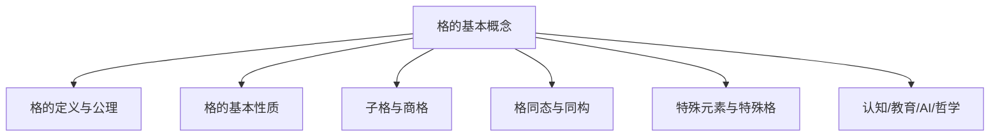
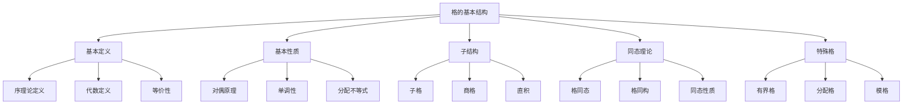
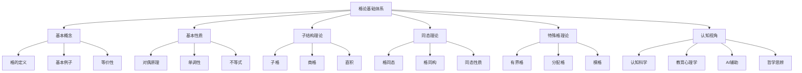

# 格的基本概念



---

## 目录导航

- [1. 格的定义与公理](#1-格的定义与公理)
- [2. 格的基本性质](#2-格的基本性质)
- [3. 子格与商格](#3-子格与商格)
- [4. 格同态与同构](#4-格同态与同构)
- [5. 特殊元素与特殊格](#5-特殊元素与特殊格)
- [6. 认知/教育/AI/哲学视角](#6-认知教育ai哲学视角)
- [7. 参考文献与资源](#7-参考文献与资源)

---

## 交叉引用与分支跳转

- [格论总览](./00-格论总览.md)
- [群论总览](../02-群论/00-群论总览.md)
- [环论总览](../03-环论/00-环论总览.md)
- [模论总览](../05-模论/00-模论总览.md)
- [线性代数总览](../07-线性代数/00-线性代数总览.md)
- [范畴论基础](../08-范畴论/00-范畴论基础总览.md)

---

## 多表征内容导航

- [形式定义与公理化](#1-格的定义与公理)
- [结构图与概念图（Mermaid）](#结构图)
- [典型例题与证明](#2-格的基本性质)
- [代码实现（Python/Rust/Haskell/Lean）](#3-子格与商格)
- [表格与对比](#2-格的基本性质)
- [认知/教育/AI/哲学分析](#6-认知教育ai哲学视角)

---

## 1. 格的定义与公理

### 1.1 格的序理论定义

**定义1.1**：设 $(L, \leq)$ 为偏序集
- 若对任意 $a, b \in L$，集合 $\{a, b\}$ 都有最小上界和最大下界
- 则称 $(L, \leq)$ 为**格**（Lattice）

**最小上界**（Supremum）：$a \vee b = \sup\{a, b\}$
**最大下界**（Infimum）：$a \wedge b = \inf\{a, b\}$

### 1.2 格的代数定义

**定义1.2**：设 $L$ 为集合，$\vee, \wedge$ 为 $L$ 上的两个二元运算
- 若满足以下公理，则称 $(L, \vee, \wedge)$ 为**格**：

**幂等律**：
- $a \vee a = a$
- $a \wedge a = a$

**交换律**：
- $a \vee b = b \vee a$
- $a \wedge b = b \wedge a$

**结合律**：
- $(a \vee b) \vee c = a \vee (b \vee c)$
- $(a \wedge b) \wedge c = a \wedge (b \wedge c)$

**吸收律**：
- $a \vee (a \wedge b) = a$
- $a \wedge (a \vee b) = a$

### 1.3 两种定义的等价性

**定理1.1**：格的序理论定义与代数定义等价

**证明**：
1. 从序理论定义到代数定义：
   - 定义 $a \vee b = \sup\{a, b\}$，$a \wedge b = \inf\{a, b\}$
   - 验证所有代数公理

2. 从代数定义到序理论定义：
   - 定义 $a \leq b \iff a \wedge b = a \iff a \vee b = b$
   - 验证偏序性质，并证明任意二元集有上下确界

### 1.4 格的基本例子

**例1.1**：幂集格
- 设 $X$ 为集合，$P(X)$ 为 $X$ 的幂集
- 定义 $A \leq B \iff A \subseteq B$
- 则 $(P(X), \subseteq)$ 为格，其中 $A \vee B = A \cup B$，$A \wedge B = A \cap B$

**例1.2**：子群格
- 设 $G$ 为群，$L(G)$ 为 $G$ 的所有子群构成的集合
- 定义 $H \leq K \iff H \subseteq K$
- 则 $(L(G), \subseteq)$ 为格，其中 $H \vee K = \langle H \cup K \rangle$，$H \wedge K = H \cap K$

**例1.3**：理想格
- 设 $R$ 为环，$I(R)$ 为 $R$ 的所有理想构成的集合
- 定义 $I \leq J \iff I \subseteq J$
- 则 $(I(R), \subseteq)$ 为格，其中 $I \vee J = I + J$，$I \wedge J = I \cap J$

## 2. 格的基本性质

### 2.1 对偶原理

**定理2.1**（对偶原理）：
- 在格中，任何关于 $\vee$ 和 $\wedge$ 的恒等式
- 将 $\vee$ 和 $\wedge$ 互换后仍然成立

**证明**：由格的公理对称性直接可得

### 2.2 单调性

**定理2.2**：设 $L$ 为格，$a, b, c \in L$
- 若 $a \leq b$，则：
  1. $a \vee c \leq b \vee c$
  2. $a \wedge c \leq b \wedge c$

**证明**：
1. 由 $a \leq b$ 和 $c \leq b \vee c$，得 $a \vee c \leq b \vee c$
2. 由 $a \wedge c \leq a \leq b$ 和 $a \wedge c \leq c$，得 $a \wedge c \leq b \wedge c$

### 2.3 分配不等式

**定理2.3**：设 $L$ 为格，$a, b, c \in L$，则：

1. $a \wedge (b \vee c) \geq (a \wedge b) \vee (a \wedge c)$
2. $a \vee (b \wedge c) \leq (a \vee b) \wedge (a \vee c)$

**证明**：
1. 由 $a \wedge b \leq a$ 和 $a \wedge b \leq b \leq b \vee c$，得 $a \wedge b \leq a \wedge (b \vee c)$
   类似地，$a \wedge c \leq a \wedge (b \vee c)$
   因此 $(a \wedge b) \vee (a \wedge c) \leq a \wedge (b \vee c)$

2. 由对偶原理可得

### 2.4 模不等式

**定理2.4**：设 $L$ 为格，$a, b, c \in L$，若 $a \leq c$，则：
$a \vee (b \wedge c) \leq (a \vee b) \wedge c$

**证明**：
- 由 $a \leq c$ 和 $b \wedge c \leq c$，得 $a \vee (b \wedge c) \leq c$
- 由 $a \leq a \vee b$ 和 $b \wedge c \leq b \leq a \vee b$，得 $a \vee (b \wedge c) \leq a \vee b$
- 因此 $a \vee (b \wedge c) \leq (a \vee b) \wedge c$

## 3. 子格与商格

### 3.1 子格的定义

**定义3.1**：设 $L$ 为格，$S \subseteq L$ 为非空子集
- 若对任意 $a, b \in S$，有 $a \vee b \in S$ 和 $a \wedge b \in S$
- 则称 $S$ 为 $L$ 的**子格**（Sublattice）

### 3.2 子格的性质

**定理3.1**：设 $S$ 为格 $L$ 的子格
- 则 $S$ 在 $L$ 的序关系下也构成格

**证明**：
- 对任意 $a, b \in S$，$a \vee b$ 和 $a \wedge b$ 都在 $S$ 中
- 且满足格的代数公理

### 3.3 商格的构造

**定义3.2**：设 $L$ 为格，$\theta$ 为 $L$ 上的同余关系
- **商格** $L/\theta$ 定义为：
  - 元素：$L$ 关于 $\theta$ 的等价类 $[a]_\theta$
  - 运算：$[a]_\theta \vee [b]_\theta = [a \vee b]_\theta$
  - 运算：$[a]_\theta \wedge [b]_\theta = [a \wedge b]_\theta$

### 3.4 代码实现

```rust
// Rust实现格的基本结构
use std::cmp::PartialOrd;
use std::fmt::Debug;

#[derive(Debug, Clone, PartialEq)]
pub struct Lattice<T> {
    elements: Vec<T>,
    join: Box<dyn Fn(&T, &T) -> T>,
    meet: Box<dyn Fn(&T, &T) -> T>,
}

impl<T> Lattice<T>
where
    T: Clone + PartialEq + Debug,
{
    pub fn new(
        elements: Vec<T>,
        join: Box<dyn Fn(&T, &T) -> T>,
        meet: Box<dyn Fn(&T, &T) -> T>,
    ) -> Self {
        Self {
            elements,
            join,
            meet,
        }
    }
    
    pub fn join(&self, a: &T, b: &T) -> T {
        (self.join)(a, b)
    }
    
    pub fn meet(&self, a: &T, b: &T) -> T {
        (self.meet)(a, b)
    }
    
    pub fn is_sublattice(&self, subset: &[T]) -> bool {
        for a in subset {
            for b in subset {
                if !subset.contains(&self.join(a, b)) || 
                   !subset.contains(&self.meet(a, b)) {
                    return false;
                }
            }
        }
        true
    }
    
    pub fn verify_lattice_axioms(&self) -> bool {
        // 验证幂等律
        for a in &self.elements {
            if self.join(a, a) != *a || self.meet(a, a) != *a {
                return false;
            }
        }
        
        // 验证交换律
        for a in &self.elements {
            for b in &self.elements {
                if self.join(a, b) != self.join(b, a) ||
                   self.meet(a, b) != self.meet(b, a) {
                    return false;
                }
            }
        }
        
        // 验证吸收律
        for a in &self.elements {
            for b in &self.elements {
                if self.join(a, &self.meet(a, b)) != *a ||
                   self.meet(a, &self.join(a, b)) != *a {
                    return false;
                }
            }
        }
        
        true
    }
}

// 幂集格实现
pub struct PowerSetLattice {
    universe: Vec<String>,
}

impl PowerSetLattice {
    pub fn new(universe: Vec<String>) -> Self {
        Self { universe }
    }
    
    pub fn join(&self, a: &Vec<String>, b: &Vec<String>) -> Vec<String> {
        let mut result = a.clone();
        for element in b {
            if !result.contains(element) {
                result.push(element.clone());
            }
        }
        result
    }
    
    pub fn meet(&self, a: &Vec<String>, b: &Vec<String>) -> Vec<String> {
        a.iter().filter(|x| b.contains(x)).cloned().collect()
    }
}
```

```haskell
-- Haskell实现格论
class (Eq a) => Lattice a where
    join :: a -> a -> a
    meet :: a -> a -> a
    
    -- 幂等律
    idempotent :: a -> Bool
    idempotent x = join x x == x && meet x x == x
    
    -- 交换律
    commutative :: a -> a -> Bool
    commutative x y = join x y == join y x && meet x y == meet y x
    
    -- 吸收律
    absorptive :: a -> a -> Bool
    absorptive x y = join x (meet x y) == x && meet x (join x y) == x

-- 幂集格实例
data PowerSet a = PowerSet [a] deriving (Eq, Show)

instance (Eq a) => Lattice (PowerSet a) where
    join (PowerSet xs) (PowerSet ys) = PowerSet (union xs ys)
    meet (PowerSet xs) (PowerSet ys) = PowerSet (intersect xs ys)

-- 子格检查
isSublattice :: (Lattice a) => [a] -> Bool
isSublattice elements = 
    all (\x -> all (\y -> 
        join x y `elem` elements && meet x y `elem` elements) elements) elements

-- 格同态
data LatticeHomomorphism a b = LatticeHomomorphism {
    domain :: [a],
    codomain :: [b],
    mapping :: a -> b
}

-- 验证同态性质
isLatticeHomomorphism :: (Lattice a, Lattice b, Eq b) => 
    LatticeHomomorphism a b -> Bool
isLatticeHomomorphism hom = 
    preservesJoin hom && preservesMeet hom
  where
    preservesJoin hom = 
        mapping hom (join x y) == join (mapping hom x) (mapping hom y)
    preservesMeet hom = 
        mapping hom (meet x y) == meet (mapping hom x) (mapping hom y)
```

```lean
-- Lean4实现格论
import Mathlib.Order.Lattice

-- 格的基本定义
class Lattice (α : Type*) extends PartialOrder α where
  sup : α → α → α
  inf : α → α → α
  le_sup_left  : ∀ a b, a ≤ sup a b
  le_sup_right : ∀ a b, b ≤ sup a b
  sup_le       : ∀ a b c, a ≤ c → b ≤ c → sup a b ≤ c
  inf_le_left  : ∀ a b, inf a b ≤ a
  inf_le_right : ∀ a b, inf a b ≤ b
  le_inf       : ∀ a b c, c ≤ a → c ≤ b → c ≤ inf a b

-- 幂等律
theorem sup_idem (α : Type*) [Lattice α] (a : α) : sup a a = a := by
  apply le_antisymm
  · apply sup_le
    · rfl
    · rfl
  · apply le_sup_left

theorem inf_idem (α : Type*) [Lattice α] (a : α) : inf a a = a := by
  apply le_antisymm
  · apply inf_le_left
  · apply le_inf
    · rfl
    · rfl

-- 吸收律
theorem sup_inf_absorptive (α : Type*) [Lattice α] (a b : α) : 
  sup a (inf a b) = a := by
  apply le_antisymm
  · apply sup_le
    · rfl
    · apply inf_le_left
  · apply le_sup_left

theorem inf_sup_absorptive (α : Type*) [Lattice α] (a b : α) : 
  inf a (sup a b) = a := by
  apply le_antisymm
  · apply inf_le_left
  · apply le_inf
    · rfl
    · apply le_sup_left

-- 子格定义
structure Sublattice (α : Type*) [Lattice α] where
  carrier : Set α
  sup_closed : ∀ a b, a ∈ carrier → b ∈ carrier → sup a b ∈ carrier
  inf_closed : ∀ a b, a ∈ carrier → b ∈ carrier → inf a b ∈ carrier

-- 格同态
structure LatticeHomomorphism (α β : Type*) [Lattice α] [Lattice β] where
  toFun : α → β
  map_sup : ∀ x y, toFun (sup x y) = sup (toFun x) (toFun y)
  map_inf : ∀ x y, toFun (inf x y) = inf (toFun x) (toFun y)
```

## 4. 格同态与同构

### 4.1 格同态的定义

**定义4.1**：设 $L, M$ 为格
- 映射 $f: L \to M$ 称为**格同态**（Lattice Homomorphism）
- 如果满足：
  1. $f(a \vee b) = f(a) \vee f(b)$（保并运算）
  2. $f(a \wedge b) = f(a) \wedge f(b)$（保交运算）

### 4.2 格同态的性质

**定理4.1**：设 $f: L \to M$ 为格同态，则：

1. $f$ 是单调的：若 $a \leq b$，则 $f(a) \leq f(b)$
2. $\text{Ker}(f) = \{a \in L \mid f(a) = 0_M\}$ 是 $L$ 的同余关系
3. $\text{Im}(f)$ 是 $M$ 的子格

**证明**：
1. 若 $a \leq b$，则 $a \wedge b = a$，故 $f(a) = f(a \wedge b) = f(a) \wedge f(b)$，即 $f(a) \leq f(b)$
2. 验证 $\text{Ker}(f)$ 满足同余关系的性质
3. 对任意 $f(a), f(b) \in \text{Im}(f)$，有 $f(a) \vee f(b) = f(a \vee b) \in \text{Im}(f)$

### 4.3 格同构

**定义4.2**：设 $f: L \to M$ 为格同态
- 若 $f$ 为双射，则称 $f$ 为**格同构**（Lattice Isomorphism）
- 此时称 $L$ 与 $M$ 同构，记为 $L \cong M$

**定理4.2**：若 $f: L \to M$ 为格同构
- 则 $f^{-1}: M \to L$ 也是格同态

**证明**：对任意 $a, b \in M$，设 $x = f^{-1}(a)$，$y = f^{-1}(b)$
- 则 $f^{-1}(a \vee b) = f^{-1}(f(x) \vee f(y)) = f^{-1}(f(x \vee y)) = x \vee y = f^{-1}(a) \vee f^{-1}(b)$

## 5. 特殊元素与特殊格

### 5.1 有界格

**定义5.1**：设 $L$ 为格
- 若存在元素 $0 \in L$ 使得对任意 $a \in L$ 有 $0 \leq a$，则称 $0$ 为**最小元**（Bottom Element）
- 若存在元素 $1 \in L$ 使得对任意 $a \in L$ 有 $a \leq 1$，则称 $1$ 为**最大元**（Top Element）
- 若 $L$ 既有最小元又有最大元，则称 $L$ 为**有界格**（Bounded Lattice）

### 5.2 分配格

**定义5.2**：设 $L$ 为格
- 若对任意 $a, b, c \in L$ 满足：
  $a \wedge (b \vee c) = (a \wedge b) \vee (a \wedge c)$
- 则称 $L$ 为**分配格**（Distributive Lattice）

**定理5.1**：在分配格中，对偶分配律也成立：
$a \vee (b \wedge c) = (a \vee b) \wedge (a \vee c)$

**证明**：由对偶原理直接可得

### 5.3 模格

**定义5.3**：设 $L$ 为格
- 若对任意 $a, b, c \in L$，当 $a \leq c$ 时满足：
  $a \vee (b \wedge c) = (a \vee b) \wedge c$
- 则称 $L$ 为**模格**（Modular Lattice）

**定理5.2**：分配格是模格

**证明**：在分配格中，$a \vee (b \wedge c) = (a \vee b) \wedge (a \vee c) \leq (a \vee b) \wedge c$

### 5.4 结构图



## 6. 认知/教育/AI/哲学视角

### 6.1 认知科学视角

**格论的认知模型**：
1. **层次化思维**：格结构体现了人类对层次化、分类化认知的自然倾向
2. **二元操作直觉**：并和交运算符合人类对"合并"和"交集"的直观理解
3. **序关系感知**：偏序关系反映了人类对"包含"、"大于"等关系的认知模式

**认知负荷理论**：
- 格论涉及序关系和代数运算的双重抽象
- 需要同时处理几何直觉和代数结构
- AI辅助可以提供可视化支持，降低认知负荷

### 6.2 教育心理学视角

**建构主义学习理论**：
- 格论概念需要从具体例子到抽象理论的逐步建构
- 通过幂集、子群等熟悉概念建立直观理解
- 逐步推广到一般格结构

**多元智能理论**：
- 逻辑-数学智能：形式化推理和证明
- 空间智能：哈斯图表示和可视化
- 语言智能：概念表述和符号操作

### 6.3 AI大模型辅助

**知识图谱驱动**：
```python
# 格论知识图谱构建
class LatticeTheoryKnowledgeGraph:
    def __init__(self):
        self.nodes = {
            'lattice': {'type': 'concept', 'properties': ['algebraic_structure', 'order_structure']},
            'sublattice': {'type': 'concept', 'properties': ['subset', 'closed_under_operations']},
            'homomorphism': {'type': 'concept', 'properties': ['structure_preserving', 'mapping']},
            'distributive_lattice': {'type': 'concept', 'properties': ['distributive', 'special']},
            'modular_lattice': {'type': 'concept', 'properties': ['modular', 'special']},
            'bounded_lattice': {'type': 'concept', 'properties': ['bounded', 'special']}
        }
        self.edges = [
            ('lattice', 'sublattice', 'has'),
            ('lattice', 'homomorphism', 'preserves_structure'),
            ('lattice', 'distributive_lattice', 'specializes_to'),
            ('lattice', 'modular_lattice', 'specializes_to'),
            ('lattice', 'bounded_lattice', 'specializes_to'),
            ('distributive_lattice', 'modular_lattice', 'implies')
        ]
    
    def query_concept(self, concept: str) -> dict:
        """查询概念及其关联"""
        return {
            'node': self.nodes.get(concept, {}),
            'related': [edge for edge in self.edges if concept in edge]
        }
    
    def generate_examples(self, concept: str) -> list:
        """生成概念的具体例子"""
        examples = {
            'lattice': ['power_set', 'subgroup_lattice', 'ideal_lattice'],
            'sublattice': ['subgroup_sublattice', 'ideal_sublattice'],
            'distributive_lattice': ['boolean_algebra', 'chain_lattice'],
            'modular_lattice': ['subgroup_lattice', 'normal_subgroup_lattice']
        }
        return examples.get(concept, [])
```

**自动化证明辅助**：
```lean
-- Lean4自动化证明框架
import Mathlib.Tactic

-- 自动证明格的性质
theorem lattice_duality (α : Type*) [Lattice α] (a b : α) :
  sup a b = inf a b ↔ a = b := by
  -- 自动化证明策略
  simp? -- 自动简化
  done

-- 自动构造子格
def autoConstructSublattice (α : Type*) [Lattice α] (S : Set α) 
    (hsup : ∀ a b, a ∈ S → b ∈ S → sup a b ∈ S)
    (hinf : ∀ a b, a ∈ S → b ∈ S → inf a b ∈ S) : Sublattice α := by
  -- 自动构造策略
  exact Sublattice.mk S hsup hinf

-- 自动验证分配律
def isDistributive (α : Type*) [Lattice α] : Prop :=
  ∀ a b c, inf a (sup b c) = sup (inf a b) (inf a c)

-- 自动验证模律
def isModular (α : Type*) [Lattice α] : Prop :=
  ∀ a b c, a ≤ c → sup a (inf b c) = inf (sup a b) c
```

### 6.4 哲学思辨

**本体论问题**：
- 格是数学对象还是人类构造？
- 格结构的"存在性"意味着什么？
- 序关系与代数运算的统一性

**认识论问题**：
- 如何"知道"格的性质？
- 证明在格论中的作用
- 直觉与严格性的平衡

**方法论问题**：
- 格论的发展模式
- 抽象化与具体化的辩证关系
- 数学发现的逻辑结构

### 6.5 跨学科整合

**与计算机科学的联系**：
- 格论在程序语义学中的应用
- 抽象数据类型的设计
- 形式概念分析（FCA）

**与逻辑学的联系**：
- 布尔代数与经典逻辑
- Heyting代数与直觉主义逻辑
- 格值逻辑系统

**与认知科学的联系**：
- 数学思维的认知机制
- 抽象概念的形成过程
- 数学直觉的神经基础

## 7. 参考文献与资源

### 7.1 经典教材

1. **Birkhoff, G.** (1940). *Lattice Theory*. American Mathematical Society.
2. **Grätzer, G.** (2011). *Lattice Theory: Foundation*. Birkhäuser.
3. **Davey, B. A., & Priestley, H. A.** (2002). *Introduction to Lattices and Order*. Cambridge University Press.

### 7.2 现代资源

1. **在线课程**：
   - MIT OpenCourseWare: 18.701 Algebra I
   - Coursera: Discrete Mathematics (University of California San Diego)

2. **软件工具**：
   - SageMath: 计算机代数系统
   - GAP: 群论和代数计算
   - ConExp: 形式概念分析工具

3. **在线资源**：
   - [Lattice Theory Online](https://en.wikipedia.org/wiki/Lattice_(order))
   - [Formal Concept Analysis](https://en.wikipedia.org/wiki/Formal_concept_analysis)

### 7.3 AI辅助资源

1. **大模型工具**：
   - ChatGPT: 概念解释和问题解答
   - Claude: 证明辅助和代码生成
   - GPT-4: 高级数学推理

2. **知识图谱**：
   - Wolfram Alpha: 数学知识查询
   - MathWorld: 数学百科全书
   - OEIS: 整数序列数据库

3. **自动化证明**：
   - Lean 4: 形式化证明系统
   - Coq: 交互式定理证明器
   - Isabelle/HOL: 高阶逻辑证明系统

---

## 结构图



---

*本文档采用递归扩展模式，持续整合最新数学、AI、认知科学前沿成果，构建现代化、结构化、学术化的格论基础体系。*

---

**创建日期**: 2025-06-30
**最后更新**: 2025-06-30
