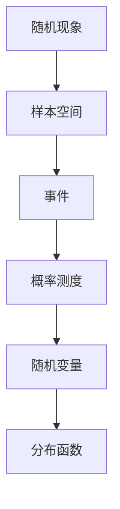
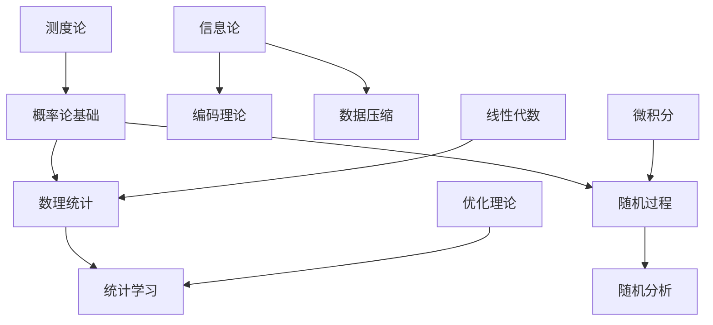

# 概率统计与随机过程总览

## 目录

- [概率统计与随机过程总览](#概率统计与随机过程总览)
  - [目录](#目录)
  - [1. 概率论的历史发展](#1-概率论的历史发展)
    - [1.1 古典概率论](#11-古典概率论)
    - [1.2 现代概率论](#12-现代概率论)
    - [1.3 当代发展](#13-当代发展)
  - [2. 概率论的基本思想](#2-概率论的基本思想)
    - [2.1 随机性](#21-随机性)
    - [2.2 概率测度](#22-概率测度)
    - [2.3 统计推断](#23-统计推断)
    - [2.4 随机过程](#24-随机过程)
  - [3. 现代概率统计的特点](#3-现代概率统计的特点)
    - [3.1 公理化基础](#31-公理化基础)
    - [3.2 测度论方法](#32-测度论方法)
    - [3.3 应用广泛性](#33-应用广泛性)
    - [3.4 理论深刻性](#34-理论深刻性)
  - [4. 核心理论概述](#4-核心理论概述)
    - [4.1 概率论基础](#41-概率论基础)
    - [4.2 数理统计](#42-数理统计)
    - [4.3 随机过程](#43-随机过程)
    - [4.4 信息论](#44-信息论)
    - [4.5 统计学习理论](#45-统计学习理论)
  - [5. 理论间的关系](#5-理论间的关系)
    - [5.1 层次关系](#51-层次关系)
    - [5.2 依赖关系](#52-依赖关系)
    - [5.3 交叉融合](#53-交叉融合)
  - [6. 应用领域](#6-应用领域)
    - [6.1 自然科学](#61-自然科学)
    - [6.2 社会科学](#62-社会科学)
    - [6.3 工程技术](#63-工程技术)
    - [6.4 人工智能](#64-人工智能)
  - [7. 现代发展方向](#7-现代发展方向)
    - [7.1 高维统计](#71-高维统计)
    - [7.2 贝叶斯统计](#72-贝叶斯统计)
    - [7.3 机器学习](#73-机器学习)
    - [7.4 随机分析](#74-随机分析)
  - [8. 参考文献](#8-参考文献)
    - [8.1 经典教材](#81-经典教材)
    - [8.2 高级教材](#82-高级教材)
    - [8.3 应用教材](#83-应用教材)
    - [8.4 专业文献](#84-专业文献)

---

## 1. 概率论的历史发展

### 1.1 古典概率论

概率论的起源可以追溯到17世纪的赌博问题。帕斯卡和费马在1654年通过书信讨论了赌博中的概率问题，这被认为是概率论的正式开端。

**早期发展**：

- **帕斯卡-费马通信**：解决了点数分配问题
- **惠更斯**：出版了第一本概率论专著《论赌博中的计算》
- **雅各布·伯努利**：提出了大数定律
- **棣莫弗**：发现了正态分布

**古典概率定义**：
古典概率定义为有利事件数与总事件数的比值：
$$P(A) = \frac{|A|}{|\Omega|}$$

### 1.2 现代概率论

19世纪末到20世纪初，概率论经历了公理化革命：

**科尔莫戈罗夫公理化**（1933年）：

- 建立了概率论的测度论基础
- 定义了概率空间 $(\Omega, \mathcal{F}, P)$
- 建立了条件概率和独立性理论

**重要发展**：

- **马尔可夫链**：马尔可夫在1906年引入
- **随机过程理论**：维纳、列维等人的贡献
- **鞅论**：杜布在20世纪中叶发展

### 1.3 当代发展

20世纪后半叶以来，概率论和统计学进入了快速发展期：

**理论发展**：

- **随机分析**：伊藤积分、随机微分方程
- **大偏差理论**：研究罕见事件的概率
- **随机几何**：随机图、随机几何对象

**应用发展**：

- **金融数学**：期权定价、风险管理
- **生物统计**：基因组学、流行病学
- **机器学习**：统计学习理论、深度学习

## 2. 概率论的基本思想

### 2.1 随机性

随机性是概率论的核心概念：

**随机现象的特征**：

- **不可预测性**：单个结果无法准确预测
- **统计规律性**：大量重复试验呈现规律
- **概率稳定性**：相对频率趋于稳定值

**随机性的数学描述**：

### 2.2 概率测度

概率测度是概率论的数学基础：

**概率空间**：$(\Omega, \mathcal{F}, P)$

- $\Omega$：样本空间，所有可能结果的集合
- $\mathcal{F}$：事件域，满足σ-代数性质
- $P$：概率测度，满足概率公理

**概率公理**：

1. **非负性**：$P(A) \geq 0$ 对所有 $A \in \mathcal{F}$
2. **规范性**：$P(\Omega) = 1$
3. **可列可加性**：对互不相容事件 $A_1, A_2, \ldots$，
   $$P\left(\bigcup_{i=1}^{\infty} A_i\right) = \sum_{i=1}^{\infty} P(A_i)$$

### 2.3 统计推断

统计推断是从数据中获取信息的过程：

**推断的基本问题**：

- **参数估计**：估计未知参数的值
- **假设检验**：检验关于参数的假设
- **预测**：基于已有数据预测未来

**推断的方法**：

- **频率学派**：基于重复试验的极限性质
- **贝叶斯学派**：基于先验知识和数据的结合

### 2.4 随机过程

随机过程是随时间演化的随机现象：

**随机过程的类型**：

- **离散时间过程**：马尔可夫链、随机游走
- **连续时间过程**：布朗运动、泊松过程
- **空间过程**：随机场、点过程

**重要性质**：

- **马尔可夫性**：未来只依赖于现在
- **平稳性**：统计性质不随时间变化
- **遍历性**：时间平均等于空间平均

## 3. 现代概率统计的特点

### 3.1 公理化基础

现代概率论建立在严格的公理化基础上：

**测度论基础**：

- 概率作为测度的特殊形式
- 积分理论在概率中的应用
- 收敛理论的重要性

**抽象化程度**：

- 从具体问题到抽象理论
- 从有限到无限
- 从离散到连续

### 3.2 测度论方法

测度论为概率论提供了强大的工具：

**积分理论**：

- 勒贝格积分在期望计算中的应用
- 随机变量的积分表示
- 条件期望的测度论定义

**收敛理论**：

- 几乎必然收敛
- 依概率收敛
- 依分布收敛

### 3.3 应用广泛性

概率统计在现代科学中应用极其广泛：

**自然科学**：

- **物理学**：量子力学、统计物理
- **生物学**：遗传学、生态学
- **化学**：反应动力学、分子动力学

**社会科学**：

- **经济学**：金融数学、计量经济学
- **心理学**：心理测量、行为统计
- **社会学**：社会网络分析、人口统计

**工程技术**：

- **通信工程**：信息论、信号处理
- **控制工程**：随机控制、滤波理论
- **计算机科学**：算法分析、机器学习

### 3.4 理论深刻性

现代概率统计在理论深度上达到了很高水平：

**深刻定理**：

- **中心极限定理**：独立随机变量和的极限分布
- **大数定律**：随机变量平均值的收敛性
- **鞅收敛定理**：鞅的收敛性质

**理论创新**：

- **随机分析**：伊藤积分、随机微分方程
- **随机几何**：随机图论、随机几何对象
- **高维统计**：高维数据的统计理论

## 4. 核心理论概述

### 4.1 概率论基础

概率论基础包括以下核心内容：

**随机变量**：

- **离散随机变量**：取有限或可数多个值
- **连续随机变量**：取值在连续区间上
- **混合随机变量**：既有离散又有连续部分

**分布函数**：

- **累积分布函数**：$F(x) = P(X \leq x)$
- **概率密度函数**：$f(x) = F'(x)$（连续情况）
- **概率质量函数**：$p(x) = P(X = x)$（离散情况）

**数字特征**：

- **期望**：$E[X] = \int x dF(x)$
- **方差**：$\text{Var}(X) = E[(X - E[X])^2]$
- **矩**：$E[X^k]$（k阶矩）

**重要分布**：

- **正态分布**：$N(\mu, \sigma^2)$
- **泊松分布**：$\text{Poisson}(\lambda)$
- **指数分布**：$\text{Exp}(\lambda)$
- **伽马分布**：$\text{Gamma}(\alpha, \beta)$

### 4.2 数理统计

数理统计研究从数据中获取信息的方法：

**描述性统计**：

- **集中趋势**：均值、中位数、众数
- **离散程度**：方差、标准差、四分位数
- **分布形状**：偏度、峰度

**推断统计**：

- **点估计**：最大似然估计、矩估计
- **区间估计**：置信区间、预测区间
- **假设检验**：显著性检验、似然比检验

**回归分析**：

- **线性回归**：$Y = \beta_0 + \beta_1 X + \epsilon$
- **多元回归**：多个自变量的回归
- **非线性回归**：非线性函数关系

**方差分析**：

- **单因素方差分析**：比较多个总体均值
- **多因素方差分析**：考虑多个因素
- **协方差分析**：考虑协变量的影响

### 4.3 随机过程

随机过程研究随时间演化的随机现象：

**马尔可夫链**：

- **离散时间马尔可夫链**：状态转移概率
- **连续时间马尔可夫链**：转移速率
- **马尔可夫性质**：未来只依赖于现在

**泊松过程**：

- **计数过程**：事件发生的次数
- **间隔时间**：指数分布
- **应用**：排队论、可靠性理论

**布朗运动**：

- **维纳过程**：连续时间随机游走
- **性质**：独立增量、正态增量
- **应用**：金融数学、物理扩散

**随机微分方程**：

- **伊藤积分**：随机积分的定义
- **随机微分方程**：包含随机项的微分方程
- **应用**：期权定价、随机控制

### 4.4 信息论

信息论研究信息的量化、传输和处理：

**信息度量**：

- **信息熵**：$H(X) = -\sum p(x) \log p(x)$
- **条件熵**：$H(X|Y) = -\sum p(x,y) \log p(x|y)$
- **互信息**：$I(X;Y) = H(X) - H(X|Y)$

**信道理论**：

- **信道容量**：最大传输速率
- **香农定理**：无噪声编码定理
- **错误纠正码**：纠错编码理论

**数据压缩**：

- **无损压缩**：霍夫曼编码、算术编码
- **有损压缩**：率失真理论
- **应用**：图像压缩、音频压缩

### 4.5 统计学习理论

统计学习理论为机器学习提供理论基础：

**学习问题**：

- **监督学习**：分类、回归
- **无监督学习**：聚类、降维
- **强化学习**：策略优化

**泛化理论**：

- **VC维**：模型复杂度的度量
- **Rademacher复杂度**：经验风险的上界
- **结构风险最小化**：平衡拟合和复杂度

**正则化**：

- **L1正则化**：Lasso回归
- **L2正则化**：Ridge回归
- **弹性网络**：L1和L2的组合

## 5. 理论间的关系

### 5.1 层次关系

概率统计理论存在清晰的层次关系：

**基础层次**：

- **测度论**：提供数学基础
- **概率论基础**：建立基本概念
- **数理统计**：应用概率论进行推断

**高级层次**：

- **随机过程**：研究时间演化
- **统计学习**：机器学习理论
- **随机分析**：连续时间过程

### 5.2 依赖关系

不同理论之间存在依赖关系：

**概率论 → 数理统计**：

- 统计推断基于概率论
- 估计理论需要概率分布
- 假设检验基于概率计算

**概率论 → 随机过程**：

- 随机过程是概率论的推广
- 马尔可夫性质基于条件概率
- 随机微分方程需要随机积分

**数理统计 → 统计学习**：

- 机器学习是统计推断的扩展
- 泛化理论基于统计理论
- 正则化方法来自统计推断

### 5.3 交叉融合

现代概率统计呈现出交叉融合的特点：

**概率论与分析的融合**：

- 随机分析：概率论与微积分的结合
- 随机偏微分方程：概率论与偏微分方程
- 随机几何：概率论与几何学的结合

**统计学与计算机科学的融合**：

- 机器学习：统计学与算法的结合
- 数据挖掘：统计学与数据库技术
- 大数据分析：统计学与分布式计算

**信息论与通信工程的融合**：

- 编码理论：信息论与代数学
- 信号处理：信息论与傅里叶分析
- 网络理论：信息论与图论

## 6. 应用领域

### 6.1 自然科学

**物理学**：

- **量子力学**：波函数的概率解释
- **统计物理**：热力学系统的统计描述
- **粒子物理**：粒子碰撞的随机性

**生物学**：

- **遗传学**：基因频率的随机变化
- **生态学**：种群动态的随机模型
- **神经科学**：神经元活动的随机性

**化学**：

- **反应动力学**：化学反应速率的随机性
- **分子动力学**：分子运动的随机模拟
- **化学平衡**：平衡状态的统计描述

### 6.2 社会科学

**经济学**：

- **金融数学**：资产价格的随机模型
- **计量经济学**：经济数据的统计分析
- **博弈论**：策略选择的概率分析

**心理学**：

- **心理测量**：测试分数的统计分析
- **行为统计**：行为模式的随机性
- **认知科学**：认知过程的随机模型

**社会学**：

- **社会网络分析**：网络结构的随机性
- **人口统计**：人口变化的随机模型
- **社会调查**：调查数据的统计分析

### 6.3 工程技术

**通信工程**：

- **信息论**：信息传输的容量分析
- **信号处理**：随机信号的统计分析
- **编码理论**：错误纠正码的设计

**控制工程**：

- **随机控制**：含噪声的控制系统
- **滤波理论**：状态估计的随机方法
- **自适应控制**：参数估计的统计方法

**计算机科学**：

- **算法分析**：算法复杂度的随机分析
- **机器学习**：模式识别的统计方法
- **数据挖掘**：大规模数据的统计分析

### 6.4 人工智能

**机器学习**：

- **监督学习**：分类和回归的统计方法
- **无监督学习**：聚类和降维的统计方法
- **强化学习**：策略优化的随机方法

**深度学习**：

- **神经网络**：权重更新的随机梯度
- **卷积网络**：图像处理的统计方法
- **循环网络**：序列建模的随机方法

**自然语言处理**：

- **语言模型**：文本生成的统计方法
- **机器翻译**：翻译质量的统计评估
- **信息检索**：相关性排序的统计方法

## 7. 现代发展方向

### 7.1 高维统计

高维统计处理维数远大于样本量的数据：

**挑战**：

- **维数灾难**：高维空间的稀疏性
- **多重比较**：大量假设检验的问题
- **计算复杂性**：高维优化的困难

**方法**：

- **稀疏性**：Lasso、弹性网络
- **降维**：主成分分析、因子分析
- **正则化**：各种正则化方法

**应用**：

- **基因组学**：基因表达数据分析
- **神经影像**：脑功能连接分析
- **金融**：高维资产组合优化

### 7.2 贝叶斯统计

贝叶斯统计基于贝叶斯定理进行统计推断：

**特点**：

- **先验知识**：利用先验信息
- **后验分布**：参数的不确定性描述
- **模型平均**：多个模型的组合

**方法**：

- **马尔可夫链蒙特卡罗**：后验分布的采样
- **变分推断**：后验分布的近似
- **贝叶斯网络**：概率图模型

**应用**：

- **机器学习**：贝叶斯神经网络
- **医学诊断**：疾病概率的贝叶斯更新
- **金融风险**：风险模型的贝叶斯估计

### 7.3 机器学习

机器学习是统计学与计算机科学的结合：

**监督学习**：

- **深度学习**：多层神经网络的训练
- **支持向量机**：最大间隔分类器
- **随机森林**：集成学习方法

**无监督学习**：

- **聚类分析**：数据分组方法
- **降维技术**：主成分分析、t-SNE
- **异常检测**：异常模式的识别

**强化学习**：

- **Q学习**：值函数的学习
- **策略梯度**：策略的直接优化
- **深度强化学习**：神经网络与强化学习的结合

### 7.4 随机分析

随机分析研究连续时间随机过程：

**随机微分方程**：

- **伊藤积分**：随机积分的定义
- **随机微分方程**：包含随机项的微分方程
- **随机偏微分方程**：空间和时间都随机的方程

**随机控制**：

- **最优控制**：随机环境下的控制策略
- **滤波理论**：状态估计的随机方法
- **随机博弈**：多智能体的随机决策

**应用**：

- **金融数学**：期权定价、风险管理
- **物理**：随机动力学系统
- **生物**：随机生物过程

## 8. 参考文献

### 8.1 经典教材

1. **Feller, W.**. *An Introduction to Probability Theory and Its Applications*. Wiley, 1968
2. **Billingsley, P.**. *Probability and Measure*. Wiley, 1995
3. **Durrett, R.**. *Probability: Theory and Examples*. Cambridge University Press, 2010
4. **Casella, G., Berger, R.L.**. *Statistical Inference*. Duxbury Press, 2002
5. **Ross, S.M.**. *Stochastic Processes*. Wiley, 1996

### 8.2 高级教材

1. **Shiryaev, A.N.**. *Probability*. Springer, 1996
2. **Williams, D.**. *Probability with Martingales*. Cambridge University Press, 1991
3. **Karatzas, I., Shreve, S.E.**. *Brownian Motion and Stochastic Calculus*. Springer, 1991
4. **Cover, T.M., Thomas, J.A.**. *Elements of Information Theory*. Wiley, 2006
5. **Vapnik, V.N.**. *Statistical Learning Theory*. Wiley, 1998

### 8.3 应用教材

1. **Hastie, T., Tibshirani, R., Friedman, J.**. *The Elements of Statistical Learning*. Springer, 2009
2. **Bishop, C.M.**. *Pattern Recognition and Machine Learning*. Springer, 2006
3. **Murphy, K.P.**. *Machine Learning: A Probabilistic Perspective*. MIT Press, 2012
4. **Goodfellow, I., Bengio, Y., Courville, A.**. *Deep Learning*. MIT Press, 2016
5. **Sutton, R.S., Barto, A.G.**. *Reinforcement Learning: An Introduction*. MIT Press, 2018

### 8.4 专业文献

1. **Kolmogorov, A.N.**. *Foundations of the Theory of Probability*. Chelsea, 1956
2. **Shannon, C.E.**. *A Mathematical Theory of Communication*. Bell System Technical Journal, 1948
3. **Black, F., Scholes, M.**. *The Pricing of Options and Corporate Liabilities*. Journal of Political Economy, 1973
4. **Pearl, J.**. *Probabilistic Reasoning in Intelligent Systems*. Morgan Kaufmann, 1988
5. **Jordan, M.I.**. *Learning in Graphical Models*. MIT Press, 1999

---

> **注**：本文档为概率统计与随机过程的总览，为后续详细的主题文档提供框架和背景。每个主题将在相应的文档中深入展开。
