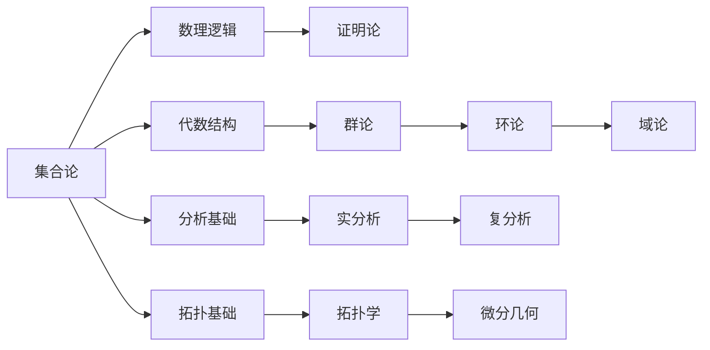
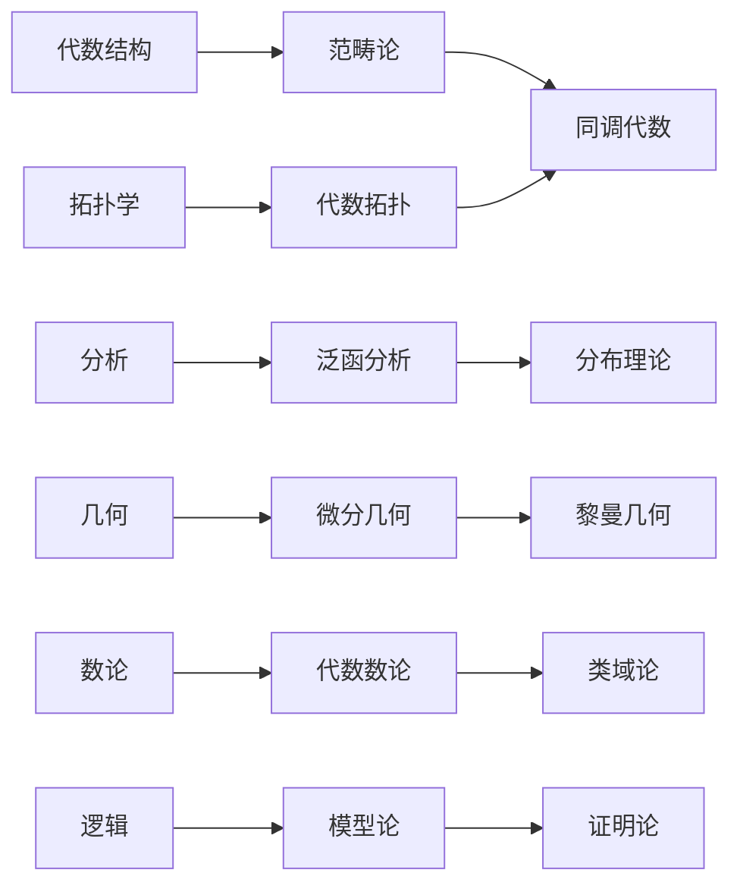
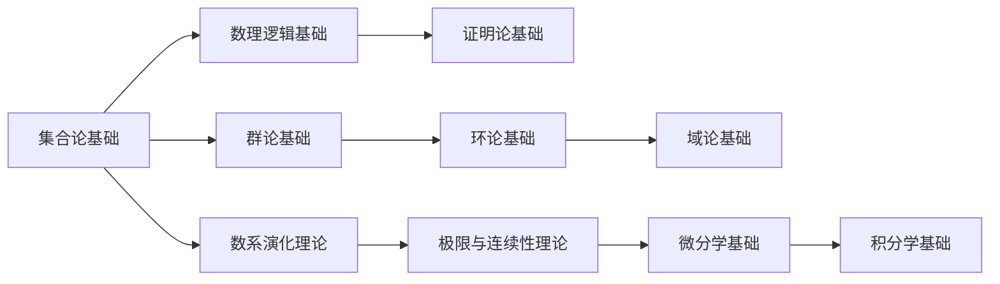
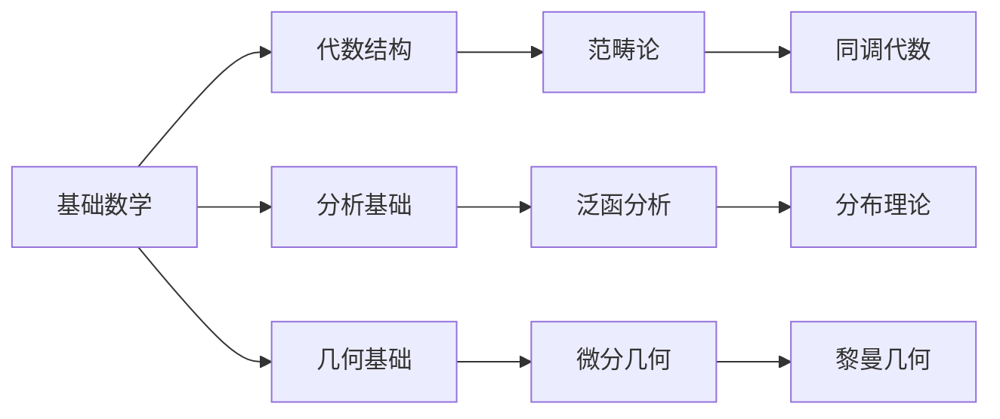

# 数学知识体系知识图谱索引

**最后更新**: 2024-06-25
**当前状态**: 初始版本

## 1. 知识图谱概述

本文档提供了数学知识体系的整体索引和关联关系，帮助读者理解不同数学分支之间的联系，以及概念之间的依赖关系。知识图谱以主题为中心，展示了概念之间的层次结构和交叉关联。

## 2. 核心数学分支关系图

```mermaid
graph TD
    A[数学知识体系] --> B[哲学与元数学基础]
    A --> C[数学基础与逻辑]
    A --> D[代数结构与理论]
    A --> E[微积分与分析]
    A --> F[几何与拓扑]
    A --> G[数论与离散数学]
    A --> H[概率统计与随机过程]
    A --> I[跨学科应用与联系]
    A --> J[元数学与形式化]
    
    B --> B1[数学哲学]
    B --> B2[数学认识论]
    B --> B3[数学本体论]
    
    C --> C1[集合论]
    C --> C2[数理逻辑]
    C --> C3[模型论]
    C --> C4[证明论]
    
    D --> D1[群论]
    D --> D2[环论]
    D --> D3[域论]
    D --> D4[模论]
    D --> D5[线性代数]
    D --> D6[范畴论]
    
    E --> E1[实分析]
    E --> E2[复分析]
    E --> E3[泛函分析]
    E --> E4[微分方程]
    
    F --> F1[欧几里得几何]
    F --> F2[非欧几何]
    F --> F3[微分几何]
    F --> F4[拓扑学]
    F --> F5[代数几何]
    
    G --> G1[初等数论]
    G --> G2[代数数论]
    G --> G3[解析数论]
    G --> G4[图论]
    G --> G5[组合数学]
    
    H --> H1[概率论]
    H --> H2[数理统计]
    H --> H3[随机过程]
    
    I --> I1[数学物理]
    I --> I2[计算数学]
    I --> I3[金融数学]
    I --> I4[生物数学]
    
    J --> J1[形式化数学]
    J --> J2[证明辅助系统]
    J --> J3[类型论]
```

## 3. 概念依赖关系

### 3.1 基础概念依赖

### 3.2 高级概念依赖

## 4. 主题索引

### 4.1 哲学与元数学基础

- [数学哲学基础](../01-哲学与元数学基础/01-数学哲学基础.md)
- [数学认识论](../01-哲学与元数学基础/02-数学认识论.md)
- [数学本体论](../01-哲学与元数学基础/03-数学本体论.md)
- [数学方法论](../01-哲学与元数学基础/04-数学方法论.md)

### 4.2 数学基础与逻辑

- [集合论基础](../02-数学基础与逻辑/01-集合论/01-朴素集合论.md)
- [数理逻辑基础](../02-数学基础与逻辑/02-数理逻辑/01-命题逻辑.md)
- [模型论基础](../02-数学基础与逻辑/03-模型论基础.md)
- [递归论基础](../02-数学基础与逻辑/04-递归论基础.md)
- [证明论基础](../02-数学基础与逻辑/05-证明论基础.md)

### 4.3 代数结构与理论

- [群论](../03-代数结构与理论/01-群论/00-群论总览.md)
- [环论](../03-代数结构与理论/02-环论/00-环论总览.md)
- [域论](../03-代数结构与理论/03-域论/00-域论总览.md)
- [模论](../03-代数结构与理论/04-模论/00-模论总览.md)
- [线性代数](../03-代数结构与理论/05-线性代数/00-线性代数总览.md)
- [范畴论](../03-代数结构与理论/07-范畴论/00-范畴论总览.md)

### 4.4 微积分与分析

- [数系演化理论](../04-微积分与分析/01-数系演化理论.md)
- [极限与连续性理论](../04-微积分与分析/02-极限与连续性理论.md)
- [微分学基础](../04-微积分与分析/03-微分学基础.md)
- [积分学基础](../04-微积分与分析/04-积分学基础.md)
- [级数理论](../04-微积分与分析/05-级数理论.md)
- [多元微积分](../04-微积分与分析/06-多元微积分.md)
- [非标准分析](../04-微积分与分析/07-非标准分析.md)

### 4.5 几何与拓扑

- [欧几里得几何基础](../05-几何与拓扑/01-欧几里得几何基础.md)
- [非欧几何基础](../05-几何与拓扑/02-非欧几何基础.md)
- [解析几何基础](../05-几何与拓扑/03-解析几何基础.md)
- [微分几何基础](../05-几何与拓扑/04-微分几何基础.md)
- [拓扑学基础](../05-几何与拓扑/05-拓扑学基础.md)
- [代数拓扑基础](../05-几何与拓扑/06-代数拓扑基础.md)

## 5. 核心概念关联矩阵

| 概念 | 集合论 | 逻辑 | 代数 | 分析 | 几何 | 拓扑 | 数论 | 概率统计 |
| ---- | ---- | ---- | ---- | ---- | ---- | ---- | ---- | ---- |
| 集合论 | ★★★★★ | ★★★★☆ | ★★★★☆ | ★★★★☆ | ★★★☆☆ | ★★★★☆ | ★★★☆☆ | ★★★☆☆ |
| 逻辑 | ★★★★☆ | ★★★★★ | ★★★☆☆ | ★★★☆☆ | ★★☆☆☆ | ★★★☆☆ | ★★★☆☆ | ★★☆☆☆ |
| 代数 | ★★★★☆ | ★★★☆☆ | ★★★★★ | ★★★★☆ | ★★★★☆ | ★★★★☆ | ★★★★★ | ★★★☆☆ |
| 分析 | ★★★★☆ | ★★★☆☆ | ★★★★☆ | ★★★★★ | ★★★★★ | ★★★★☆ | ★★★★☆ | ★★★★☆ |
| 几何 | ★★★☆☆ | ★★☆☆☆ | ★★★★☆ | ★★★★★ | ★★★★★ | ★★★★★ | ★★★☆☆ | ★★☆☆☆ |
| 拓扑 | ★★★★☆ | ★★★☆☆ | ★★★★☆ | ★★★★☆ | ★★★★★ | ★★★★★ | ★★★☆☆ | ★★★☆☆ |
| 数论 | ★★★☆☆ | ★★★☆☆ | ★★★★★ | ★★★★☆ | ★★★☆☆ | ★★★☆☆ | ★★★★★ | ★★★☆☆ |
| 概率统计 | ★★★☆☆ | ★★☆☆☆ | ★★★☆☆ | ★★★★☆ | ★★☆☆☆ | ★★★☆☆ | ★★★☆☆ | ★★★★★ |

## 6. 关键定理与结果索引

### 6.1 基础数学

- **哥德尔不完备性定理**: [证明论基础](../02-数学基础与逻辑/05-证明论基础.md#哥德尔不完备性定理)
- **ZFC公理系统**: [集合论基础](../02-数学基础与逻辑/01-集合论/02-公理化集合论.md#zfc公理系统)
- **完备性定理**: [数理逻辑基础](../02-数学基础与逻辑/02-数理逻辑/02-一阶逻辑.md#完备性定理)

### 6.2 代数学

- **拉格朗日定理**: [群论](../03-代数结构与理论/01-群论/00-群论总览.md#拉格朗日定理)
- **伽罗瓦理论**: [域论](../03-代数结构与理论/03-域论/03-伽罗瓦理论.md)
- **基本同态定理**: [群论](../03-代数结构与理论/01-群论/04-群同态与同构.md#基本同态定理)

### 6.3 分析学

- **中值定理**: [微分学基础](../04-微积分与分析/03-微分学基础.md#中值定理)
- **微积分基本定理**: [积分学基础](../04-微积分与分析/04-积分学基础.md#微积分基本定理)
- **柯西-施瓦茨不等式**: [实分析](../04-微积分与分析/01-实数理论.md#柯西-施瓦茨不等式)

### 6.4 几何与拓扑

- **欧几里得平行公理**: [欧几里得几何基础](../05-几何与拓扑/01-欧几里得几何基础.md#平行公理)
- **高斯-博内特定理**: [微分几何基础](../05-几何与拓扑/04-微分几何基础.md#高斯-博内特定理)
- **庞加莱猜想**: [拓扑学基础](../05-几何与拓扑/05-拓扑学基础.md#庞加莱猜想)

## 7. 学习路径建议

### 7.1 基础数学学习路径

### 7.2 高级数学学习路径

## 8. 未来扩展计划

- [ ] 添加更多跨学科联系
- [ ] 增强概念之间的关联度量
- [ ] 添加交互式知识图谱可视化
- [ ] 建立完整的概念依赖树
- [ ] 整合外部学术资源链接

---

**文档版本**: v1.0
**负责人**: AI助手
**下一次更新**: 2024-06-27 