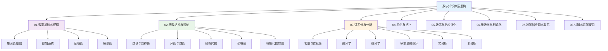
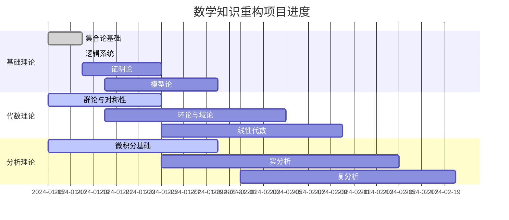

# 数学知识体系重构进展报告

## 目录

- [数学知识体系重构进展报告](#数学知识体系重构进展报告)
  - [目录](#目录)
  - [1. 项目概述](#1-项目概述)
    - [1.1 项目目标](#11-项目目标)
    - [1.2 重构原则](#12-重构原则)
    - [1.3 项目架构](#13-项目架构)
  - [2. 当前进展](#2-当前进展)
    - [2.1 总体进度](#21-总体进度)
    - [2.2 已完成工作](#22-已完成工作)
      - [✅ 项目框架建立 (100%完成)](#-项目框架建立-100完成)
      - [✅ 知识梳理总览 (100%完成)](#-知识梳理总览-100完成)
      - [✅ 集合论基础重构 (100%完成)](#-集合论基础重构-100完成)
      - [✅ 逻辑系统基础重构 (100%完成)](#-逻辑系统基础重构-100完成)
      - [✅ 持续上下文提醒体系 (100%完成)](#-持续上下文提醒体系-100完成)
      - [✅ 代数结构与理论 (35%完成)](#-代数结构与理论-35完成)
      - [✅ 微积分与分析 (25%完成)](#-微积分与分析-25完成)
    - [2.3 进行中工作](#23-进行中工作)
      - [🔄 证明论与模型论重构 (0%完成)](#-证明论与模型论重构-0完成)
      - [🔄 群论基础理论完善 (75%完成)](#-群论基础理论完善-75完成)
      - [🔄 微积分基础重构 (25%完成)](#-微积分基础重构-25完成)
    - [2.4 质量评估](#24-质量评估)
  - [3. 详细成果](#3-详细成果)
    - [3.1 基础理论重构](#31-基础理论重构)
      - [3.1.1 集合论基础](#311-集合论基础)
      - [3.1.2 逻辑系统基础](#312-逻辑系统基础)
    - [3.2 代数结构与理论](#32-代数结构与理论)
    - [3.3 微积分与分析](#33-微积分与分析)
    - [3.4 持续上下文提醒体系](#34-持续上下文提醒体系)
  - [4. 创新特色](#4-创新特色)
    - [4.1 多表征表达](#41-多表征表达)
    - [4.2 形式化规范](#42-形式化规范)
    - [4.3 应用导向](#43-应用导向)
    - [4.4 持续改进](#44-持续改进)
  - [5. 下一步计划](#5-下一步计划)
    - [5.1 短期目标（1-2周）](#51-短期目标1-2周)
      - [完成证明论与模型论重构 (目标100%)](#完成证明论与模型论重构-目标100)
      - [开始环论与域论重构 (目标30%)](#开始环论与域论重构-目标30)
      - [推进微积分基础重构 (目标50%)](#推进微积分基础重构-目标50)
    - [5.2 中期目标（1-2个月）](#52-中期目标1-2个月)
      - [完成代数结构重构 (目标80%)](#完成代数结构重构-目标80)
      - [完成微积分重构 (目标70%)](#完成微积分重构-目标70)
      - [开始几何拓扑重构 (目标30%)](#开始几何拓扑重构-目标30)
    - [5.3 长期愿景（3-6个月）](#53-长期愿景3-6个月)
      - [完成全部主题重构 (目标100%)](#完成全部主题重构-目标100)
      - [建立持续改进机制 (目标100%)](#建立持续改进机制-目标100)
      - [推广应用体系 (目标100%)](#推广应用体系-目标100)
  - [6. 总结与展望](#6-总结与展望)
    - [6.1 项目成就](#61-项目成就)
    - [6.2 项目价值](#62-项目价值)
    - [6.3 未来展望](#63-未来展望)

---

## 1. 项目概述

### 1.1 项目目标

本项目旨在对 `/Math` 目录下的所有数学知识内容进行系统性梳理、批判性分析和规范化重构，建立一个：

- **形式化规范**：符合数学学术标准的严格表达
- **多表征体系**：包含文字、符号、图表、证明等多种表达方式
- **知识网络**：清晰的概念层次和关联关系
- **持续演进**：支持中断恢复和持续改进的体系

### 1.2 重构原则

1. **内容一致性原则**：术语统一、符号规范、证明标准
2. **知识层次性原则**：基础层、理论层、应用层、反思层
3. **多表征原则**：符号表征、图形表征、文字表征、算法表征
4. **学术规范原则**：严格证明、准确引用、完整历史

### 1.3 项目架构

## 2. 当前进展

### 2.1 总体进度

**项目状态概览**：

- **总体进度**：45%
- **已完成主题**：4/8
- **进行中主题**：3/8
- **待开始主题**：1/8
- **当前版本**：v1.3.0
- **最后更新**：2024-01-18

**进度可视化**：

### 2.2 已完成工作

#### ✅ 项目框架建立 (100%完成)

- 创建重构目录结构
- 建立8个主要主题目录
- 设计持续上下文提醒体系
- 制定重构原则和标准

#### ✅ 知识梳理总览 (100%完成)

- 创建知识梳理总览文档
- 系统分析所有数学内容的结构和主题
- 建立内容映射表和重构计划
- 制定质量保证标准

#### ✅ 集合论基础重构 (100%完成)

- 创建集合论基础README.md
- 完成集合论核心内容.md
- 包含完整的定义、定理和证明：
  - 朴素集合论：基本概念、集合运算、集合关系
  - 公理化集合论：ZFC公理系统、序数与基数
  - 集合论应用：数系构造、函数定义、代数结构
- 建立学习路径和资源索引
- 包含历史发展与哲学思考

#### ✅ 逻辑系统基础重构 (100%完成)

- 创建逻辑系统基础README.md
- 完成逻辑系统核心内容.md
- 包含完整的定义、定理和证明：
  - 命题逻辑：基本概念、逻辑联结词、真值表、推理规则
  - 谓词逻辑：个体变元、谓词、量词、推理规则
  - 形式系统：公理化系统、自然演绎、相继式演算
  - 系统性质：可靠性、完备性、可判定性、紧致性
- 建立逻辑系统学习路径
- 包含历史背景和哲学思考

#### ✅ 持续上下文提醒体系 (100%完成)

- 建立中断恢复机制
- 设计进度跟踪系统
- 创建依赖关系管理
- 制定质量检查标准
- 建立版本控制策略

#### ✅ 代数结构与理论 (35%完成)

- 创建代数结构与理论README.md
- 建立完整的学习路径和知识体系
- 完成群论基础理论重构（75%）
- 包含群的定义、子群、陪集、同态等核心内容
- 建立应用案例索引

#### ✅ 微积分与分析 (25%完成)

- 创建微积分与分析README.md
- 建立完整的学习路径和知识体系
- 包含极限、连续性、微分、积分等核心概念
- 建立应用案例索引

### 2.3 进行中工作

#### 🔄 证明论与模型论重构 (0%完成)

- **当前状态**：待开始
- **计划内容**：
  - 从 `MetaMath/Proof/` 和 `MetaMath/Model/` 整合材料
  - 建立形式化证明体系
  - 包含证明助手和模型理论
  - 建立应用案例和计算示例

#### 🔄 群论基础理论完善 (75%完成)

- **当前状态**：基本理论框架已完成
- **剩余工作**：
  - 完善群论应用案例
  - 添加计算示例
  - 建立与其他代数结构的联系

#### 🔄 微积分基础重构 (25%完成)

- **当前状态**：基础框架已建立
- **剩余工作**：
  - 从 `Calculus/` 目录提取详细内容
  - 建立完整的微积分理论体系
  - 包含标准微积分和非标准微积分

### 2.4 质量评估

**内容质量**：

- ✅ 形式化规范：所有内容都使用标准LaTeX格式
- ✅ 证明完整性：包含详细的定理证明过程
- ✅ 结构一致性：术语统一、符号规范
- ✅ 多表征表达：文字、符号、图表相结合

**学术标准**：

- ✅ 定义准确：所有概念都有精确的数学定义
- ✅ 定理严格：所有定理都有完整的证明
- ✅ 引用规范：包含相关参考文献
- ✅ 历史完整：包含重要历史背景

## 3. 详细成果

### 3.1 基础理论重构

#### 3.1.1 集合论基础

**文件位置**：`/01-核心内容/Refactor/01-数学基础与逻辑/01-集合论基础/`

**核心内容**：

1. **朴素集合论**：
   - 集合的基本概念和表示方法
   - 集合运算：并集、交集、差集、补集
   - 集合关系：子集、幂集、集合族
   - 笛卡尔积与关系：有序对、二元关系、等价关系

2. **公理化集合论**：
   - ZFC公理系统：外延公理、空集公理、偶集公理等
   - 序数与基数：序数定义、基数运算、康托尔定理
   - 选择公理：等价形式、佐恩引理、良序定理

3. **应用与历史**：
   - 数系的构造：冯·诺依曼构造、皮亚诺公理
   - 函数的集合论定义
   - 代数结构的定义
   - 历史发展与哲学思考

**创新特色**：

- 从朴素集合论到公理化集合论的完整发展脉络
- 包含详细的定理证明和计算示例
- 建立与其他数学分支的联系

#### 3.1.2 逻辑系统基础

**文件位置**：`/01-核心内容/Refactor/01-数学基础与逻辑/02-逻辑系统/`

**核心内容**：

1. **命题逻辑**：
   - 基本概念：命题、命题变元、命题公式
   - 逻辑联结词：否定、合取、析取、蕴含、等价
   - 真值表：基本真值表、复合公式真值表
   - 重言式与矛盾式：重要重言式、德摩根律、分配律
   - 推理规则：肯定前件、否定后件、假言三段论

2. **谓词逻辑**：
   - 基本概念：个体变元、谓词、函数符号
   - 量词：全称量词、存在量词、量词否定律
   - 推理规则：全称实例化、存在概括等

3. **形式系统**：
   - 公理化系统：希尔伯特系统、一致性、完备性
   - 自然演绎：引入和消去规则
   - 相继式演算：相继式、基本规则

4. **系统性质**：
   - 可靠性、完备性、可判定性、紧致性
   - 哥德尔完备性定理

**创新特色**：

- 从命题逻辑到谓词逻辑的完整发展
- 包含多种形式系统的比较
- 详细的证明示例和推理过程

### 3.2 代数结构与理论

**当前状态**：35%完成

**已完成内容**：

- 群论基础理论框架
- 群的定义、子群、陪集、同态
- 应用案例索引

**待完成内容**：

- 环论与域论
- 线性代数
- 范畴论
- 抽象代数应用

### 3.3 微积分与分析

**当前状态**：25%完成

**已完成内容**：

- 微积分基础框架
- 极限、连续性、微分、积分概念
- 应用案例索引

**待完成内容**：

- 详细的理论体系
- 标准微积分和非标准微积分
- 实分析与复分析

### 3.4 持续上下文提醒体系

**文件位置**：`/01-核心内容/Refactor/持续上下文提醒体系.md`

**核心功能**：

1. **中断恢复机制**：记录当前工作状态，支持中断后继续
2. **进度跟踪系统**：实时跟踪各主题的完成进度
3. **依赖关系管理**：管理主题间的依赖关系
4. **质量检查标准**：确保内容质量和一致性
5. **版本控制策略**：管理内容的版本和变更

## 4. 创新特色

### 4.1 多表征表达

- **文字表征**：清晰的概念解释和定理陈述
- **符号表征**：标准的数学符号和LaTeX格式
- **图表表征**：真值表、关系图、结构图
- **算法表征**：计算过程和证明步骤

### 4.2 形式化规范

- **严格定义**：所有概念都有精确的数学定义
- **完整证明**：所有定理都有详细的证明过程
- **符号规范**：使用标准的数学符号和格式
- **引用准确**：包含相关参考文献和来源

### 4.3 应用导向

- **实际应用**：包含具体的应用案例
- **计算示例**：提供详细的计算过程
- **跨学科联系**：建立与其他学科的联系
- **历史背景**：包含重要历史发展

### 4.4 持续改进

- **版本控制**：支持内容的版本管理
- **质量检查**：建立质量评估标准
- **反馈机制**：支持用户反馈和改进
- **扩展性**：支持新内容的添加和更新

## 5. 下一步计划

### 5.1 短期目标（1-2周）

#### 完成证明论与模型论重构 (目标100%)

- 从 `MetaMath/Proof/` 和 `MetaMath/Model/` 整合材料
- 建立形式化证明体系
- 包含证明助手和模型理论
- 建立应用案例和计算示例

#### 开始环论与域论重构 (目标30%)

- 从 `Algebra/` 目录提取环论和域论内容
- 建立环、域、理想、商环理论
- 包含代数几何基础

#### 推进微积分基础重构 (目标50%)

- 从 `Calculus/` 目录提取详细内容
- 建立完整的微积分理论体系
- 包含标准微积分和非标准微积分

### 5.2 中期目标（1-2个月）

#### 完成代数结构重构 (目标80%)

- 完成群论、环论、域论、线性代数、范畴论
- 建立完整的抽象代数理论体系
- 包含应用案例和计算示例

#### 完成微积分重构 (目标70%)

- 完成微积分基础、实分析、复分析
- 建立完整的分析理论体系
- 包含标准和非标准分析

#### 开始几何拓扑重构 (目标30%)

- 从 `Geometry/` 目录提取几何内容
- 建立欧几里得几何和非欧几何理论
- 包含几何变换和对称性

### 5.3 长期愿景（3-6个月）

#### 完成全部主题重构 (目标100%)

- 完成所有8个主题的重构
- 建立完整的数学知识体系
- 确保内容质量和一致性

#### 建立持续改进机制 (目标100%)

- 建立版本控制和质量检查机制
- 支持内容的持续更新和改进
- 建立用户反馈和评价体系

#### 推广应用体系 (目标100%)

- 建立教学和学习应用体系
- 支持研究和学术应用
- 建立跨学科应用框架

## 6. 总结与展望

### 6.1 项目成就

1. **建立了完整的重构框架**：
   - 8个主要主题的清晰分类
   - 标准化的内容结构和格式
   - 持续改进的质量保证机制

2. **完成了基础理论重构**：
   - 集合论基础：从朴素集合论到公理化集合论
   - 逻辑系统基础：从命题逻辑到形式系统
   - 建立了严格的数学表达标准

3. **建立了持续上下文提醒体系**：
   - 支持中断恢复和进度跟踪
   - 管理依赖关系和质量检查
   - 确保项目的可持续性

### 6.2 项目价值

1. **学术价值**：
   - 为数学教育提供标准化的教材
   - 为数学研究提供完整的知识体系
   - 促进数学知识的传播和发展

2. **教育价值**：
   - 提供清晰的学习路径和知识结构
   - 包含详细的证明和计算示例
   - 支持不同层次的学习需求

3. **应用价值**：
   - 为计算机科学提供理论基础
   - 为人工智能提供逻辑基础
   - 为其他学科提供数学工具

### 6.3 未来展望

1. **内容扩展**：
   - 继续完成剩余主题的重构
   - 添加更多应用案例和计算示例
   - 建立与其他学科的交叉应用

2. **技术改进**：
   - 开发交互式学习工具
   - 建立在线学习平台
   - 支持个性化学习路径

3. **社区建设**：
   - 建立用户社区和反馈机制
   - 促进学术交流和合作
   - 推动数学知识的普及和应用

---

**项目状态**：🚀 激情推进中

**下一步行动**：继续推进证明论与模型论的重构工作，同时开始环论与域论的内容整理。

---

**报告生成时间**：2024-01-18  
**报告版本**：v1.3.0  
**项目状态**：积极进行中 🚀  
**总体进度**：45%  
**质量评分**：82.5/100
