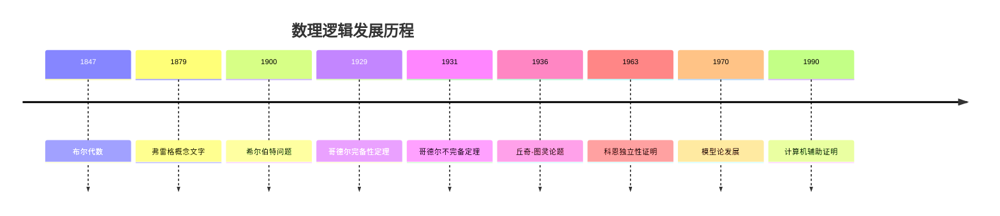

# 数理逻辑基础

## 目录

- [数理逻辑基础](#数理逻辑基础)
  - [目录](#目录)
  - [1. 数理逻辑概述](#1-数理逻辑概述)
    - [1.1 数理逻辑的定义与目标](#11-数理逻辑的定义与目标)
    - [1.2 数理逻辑的历史发展](#12-数理逻辑的历史发展)
    - [1.3 数理逻辑的主要分支](#13-数理逻辑的主要分支)
  - [2. 命题逻辑](#2-命题逻辑)
    - [2.1 命题与逻辑联结词](#21-命题与逻辑联结词)
    - [2.2 真值表与逻辑等价](#22-真值表与逻辑等价)
    - [2.3 命题逻辑的形式系统](#23-命题逻辑的形式系统)
    - [2.4 命题逻辑的完备性](#24-命题逻辑的完备性)
  - [3. 一阶谓词逻辑](#3-一阶谓词逻辑)
    - [3.1 谓词与量词](#31-谓词与量词)
    - [3.2 一阶语言](#32-一阶语言)
    - [3.3 语义与模型](#33-语义与模型)
    - [3.4 一阶逻辑的完备性](#34-一阶逻辑的完备性)
  - [4. 证明论](#4-证明论)
    - [4.1 形式证明系统](#41-形式证明系统)
    - [4.2 自然演绎](#42-自然演绎)
    - [4.3 相继式演算](#43-相继式演算)
    - [4.4 切消定理](#44-切消定理)
  - [5. 模型论](#5-模型论)
    - [5.1 模型与满足关系](#51-模型与满足关系)
    - [5.2 紧致性定理](#52-紧致性定理)
    - [5.3 Löwenheim-Skolem定理](#53-löwenheim-skolem定理)
    - [5.4 模型论的应用](#54-模型论的应用)
  - [6. 递归论](#6-递归论)
    - [6.1 可计算性理论](#61-可计算性理论)
    - [6.2 图灵机](#62-图灵机)
    - [6.3 递归函数](#63-递归函数)
    - [6.4 丘奇-图灵论题](#64-丘奇-图灵论题)
  - [7. 哥德尔不完备性定理](#7-哥德尔不完备性定理)
    - [7.1 第一不完备性定理](#71-第一不完备性定理)
    - [7.2 第二不完备性定理](#72-第二不完备性定理)
    - [7.3 不完备性定理的影响](#73-不完备性定理的影响)
  - [8. 高阶逻辑](#8-高阶逻辑)
    - [8.1 二阶逻辑](#81-二阶逻辑)
    - [8.2 类型论](#82-类型论)
    - [8.3 直觉主义逻辑](#83-直觉主义逻辑)
  - [9. 逻辑与计算](#9-逻辑与计算)
    - [9.1 自动定理证明](#91-自动定理证明)
    - [9.2 逻辑编程](#92-逻辑编程)
    - [9.3 形式化验证](#93-形式化验证)
  - [10. 批判性分析](#10-批判性分析)
    - [10.1 逻辑的局限性](#101-逻辑的局限性)
    - [10.2 逻辑与哲学](#102-逻辑与哲学)
    - [10.3 逻辑的未来发展](#103-逻辑的未来发展)
  - [11. 代码示例](#11-代码示例)
    - [11.1 Rust实现命题逻辑](#111-rust实现命题逻辑)
    - [11.2 Haskell实现一阶逻辑](#112-haskell实现一阶逻辑)
  - [12. 参考文献](#12-参考文献)

---

## 1. 数理逻辑概述

### 1.1 数理逻辑的定义与目标

数理逻辑是数学的一个分支，它使用严格的数学方法来研究数学推理的有效性、数学理论的基础和数学证明的性质。

**主要目标：**

1. **精确化数学推理**：将直观的数学论证转化为无歧义的、可机械验证的形式推导
2. **研究数学基础**：探讨数学公理系统的性质，如一致性、完备性和独立性
3. **探索可计算的边界**：界定哪些问题是算法可解的，哪些是不可解的
4. **理解数学的局限性**：通过哥德尔不完备定理等深刻结果，揭示形式系统的固有局限

### 1.2 数理逻辑的历史发展



### 1.3 数理逻辑的主要分支

数理逻辑主要分为四个核心分支：

1. **证明论 (Proof Theory)**：研究形式证明的结构和性质
2. **模型论 (Model Theory)**：研究形式语言的语义和模型
3. **递归论 (Recursion Theory)**：研究可计算性和算法
4. **集合论 (Set Theory)**：为数学提供基础框架

## 2. 命题逻辑

### 2.1 命题与逻辑联结词

**命题：** 具有确定真值的陈述句

**基本逻辑联结词：**

- **否定 (¬)**：\(\neg p\) 表示"非p"
- **合取 (∧)**：\(p \land q\) 表示"p且q"
- **析取 (∨)**：\(p \lor q\) 表示"p或q"
- **蕴含 (→)**：\(p \rightarrow q\) 表示"如果p则q"
- **等价 (↔)**：\(p \leftrightarrow q\) 表示"p当且仅当q"

### 2.2 真值表与逻辑等价

**真值表：** 列出所有可能真值组合的表格

| p | q | ¬p | p∧q | p∨q | p→q | p↔q |
|---|---|----|-----|-----|-----|-----|
| T | T | F  | T   | T   | T   | T   |
| T | F | F  | F   | T   | F   | F   |
| F | T | T  | F   | T   | T   | F   |
| F | F | T  | F   | F   | T   | T   |

**重要逻辑等价：**

- 德摩根律：\(\neg(p \land q) \equiv \neg p \lor \neg q\)
- 分配律：\(p \land (q \lor r) \equiv (p \land q) \lor (p \land r)\)
- 双重否定：\(\neg\neg p \equiv p\)

### 2.3 命题逻辑的形式系统

**公理系统：**

1. \(p \rightarrow (q \rightarrow p)\)
2. \((p \rightarrow (q \rightarrow r)) \rightarrow ((p \rightarrow q) \rightarrow (p \rightarrow r))\)
3. \((\neg p \rightarrow \neg q) \rightarrow (q \rightarrow p)\)

**推理规则：**

- **分离规则 (Modus Ponens)**：从 \(p\) 和 \(p \rightarrow q\) 推出 \(q\)

### 2.4 命题逻辑的完备性

**完备性定理：** 命题逻辑是完备的，即所有重言式都是可证的。

**可靠性定理：** 命题逻辑是可靠的，即可证的公式都是重言式。

## 3. 一阶谓词逻辑

### 3.1 谓词与量词

**谓词：** 表示对象性质的符号，如 \(P(x)\) 表示"x具有性质P"

**量词：**

- **全称量词 (∀)**：\(\forall x P(x)\) 表示"对所有x，P(x)成立"
- **存在量词 (∃)**：\(\exists x P(x)\) 表示"存在x使得P(x)成立"

**量词的性质：**

- \(\neg\forall x P(x) \equiv \exists x \neg P(x)\)
- \(\neg\exists x P(x) \equiv \forall x \neg P(x)\)

### 3.2 一阶语言

**一阶语言包含：**

1. **常量符号：** \(a, b, c, \ldots\)
2. **函数符号：** \(f, g, h, \ldots\)
3. **谓词符号：** \(P, Q, R, \ldots\)
4. **变量：** \(x, y, z, \ldots\)
5. **逻辑符号：** \(\neg, \land, \lor, \rightarrow, \leftrightarrow, \forall, \exists\)

**项的定义：**

- 变量和常量是项
- 如果 \(t_1, \ldots, t_n\) 是项，\(f\) 是n元函数符号，则 \(f(t_1, \ldots, t_n)\) 是项

**公式的定义：**

- 如果 \(t_1, \ldots, t_n\) 是项，\(P\) 是n元谓词符号，则 \(P(t_1, \ldots, t_n)\) 是原子公式
- 如果 \(\phi, \psi\) 是公式，则 \(\neg\phi, \phi \land \psi, \phi \lor \psi, \phi \rightarrow \psi, \phi \leftrightarrow \psi\) 是公式
- 如果 \(\phi\) 是公式，\(x\) 是变量，则 \(\forall x \phi, \exists x \phi\) 是公式

### 3.3 语义与模型

**结构：** 一个结构 \(\mathcal{A}\) 包含：

- 非空域 \(A\)
- 对每个常量符号 \(c\)，指定 \(c^{\mathcal{A}} \in A\)
- 对每个n元函数符号 \(f\)，指定函数 \(f^{\mathcal{A}}: A^n \to A\)
- 对每个n元谓词符号 \(P\)，指定关系 \(P^{\mathcal{A}} \subseteq A^n\)

**满足关系：** 定义何时一个结构满足一个公式

### 3.4 一阶逻辑的完备性

**哥德尔完备性定理：** 一阶逻辑是完备的，即所有逻辑有效的公式都是可证的。

**紧致性定理：** 如果一阶理论的所有有限子集都有模型，则该理论本身有模型。

## 4. 证明论

### 4.1 形式证明系统

**形式证明：** 从公理出发，通过推理规则得到的公式序列

**证明系统的性质：**

- **可靠性：** 可证的公式在标准模型中为真
- **完备性：** 所有有效的公式都可证
- **一致性：** 不能同时证明 \(\phi\) 和 \(\neg\phi\)

### 4.2 自然演绎

**自然演绎系统：** 使用引入和消去规则的形式系统

**规则示例：**

- **合取引入：** 从 \(\phi\) 和 \(\psi\) 推出 \(\phi \land \psi\)
- **合取消去：** 从 \(\phi \land \psi\) 推出 \(\phi\) 或 \(\psi\)
- **蕴含引入：** 如果从假设 \(\phi\) 能推出 \(\psi\)，则推出 \(\phi \rightarrow \psi\)

### 4.3 相继式演算

**相继式：** 形如 \(\Gamma \vdash \Delta\) 的表达式，其中 \(\Gamma, \Delta\) 是公式集合

**相继式演算规则：**

- **左规则：** 处理左端的逻辑联结词
- **右规则：** 处理右端的逻辑联结词
- **结构规则：** 处理公式的排列和重复

### 4.4 切消定理

**切消定理：** 在相继式演算中，切消规则是可消除的。

**意义：** 证明的构造性，每个证明都可以转化为不使用切消规则的证明。

## 5. 模型论

### 5.1 模型与满足关系

**模型：** 使理论为真的结构

**满足关系 \(\models\)：**

- \(\mathcal{A} \models \phi\) 表示结构 \(\mathcal{A}\) 满足公式 \(\phi\)
- \(\mathcal{A} \models T\) 表示结构 \(\mathcal{A}\) 是理论 \(T\) 的模型

**理论：** 公式的集合，通常要求对逻辑后承封闭

### 5.2 紧致性定理

**紧致性定理：** 如果一阶理论的所有有限子集都有模型，则该理论本身有模型。

**应用：**

- 证明某些理论有模型
- 构造非标准模型
- 证明理论的一致性

### 5.3 Löwenheim-Skolem定理

**向下Löwenheim-Skolem定理：** 如果可数一阶理论有无限模型，则它有任意大的无限模型。

**向上Löwenheim-Skolem定理：** 如果一阶理论有无限模型，则它有任意大的模型。

### 5.4 模型论的应用

- **代数几何：** 代数闭域的理论
- **数论：** 皮亚诺算术的模型
- **集合论：** ZFC的模型

## 6. 递归论

### 6.1 可计算性理论

**可计算函数：** 存在算法计算的函数

**可判定问题：** 存在算法判定的问题

**递归可枚举集：** 存在算法枚举其元素的集合

### 6.2 图灵机

**图灵机：** 抽象的计算模型

**组成部分：**

- 无限长的纸带
- 读写头
- 有限状态控制器
- 转移函数

**图灵机计算：** 从初始配置开始，按照转移函数进行状态转换

### 6.3 递归函数

**原始递归函数：**

- 基本函数：零函数、后继函数、投影函数
- 复合：从已知函数构造新函数
- 原始递归：通过递归定义构造函数

**μ-递归函数：** 包含μ算子的递归函数

### 6.4 丘奇-图灵论题

**丘奇-图灵论题：** 可计算函数就是图灵可计算函数。

**等价模型：**

- λ演算
- 递归函数
- 寄存器机
- 细胞自动机

## 7. 哥德尔不完备性定理

### 7.1 第一不完备性定理

**第一不完备性定理：** 任何包含基本算术的一致形式系统都是不完备的。

**证明思路：**

1. 构造自指语句："我不能被证明"
2. 如果系统一致，则该语句既不能被证明也不能被否证
3. 因此系统不完备

### 7.2 第二不完备性定理

**第二不完备性定理：** 任何包含基本算术的一致形式系统都不能证明自身的一致性。

**意义：** 形式系统无法通过内部方法证明自己的可靠性。

### 7.3 不完备性定理的影响

- **数学基础：** 揭示了形式化的局限性
- **哲学：** 引发对数学本质的思考
- **计算机科学：** 影响程序验证和人工智能

## 8. 高阶逻辑

### 8.1 二阶逻辑

**二阶逻辑：** 允许量词作用于谓词和函数的逻辑

**表达能力：** 比一阶逻辑更强，可以表达更多数学概念

**不完备性：** 二阶逻辑不完备，没有递归的公理系统

### 8.2 类型论

**类型论：** 基于类型概念的逻辑系统

**简单类型论：** 每个对象都有明确的类型

**依赖类型论：** 类型可以依赖于值

### 8.3 直觉主义逻辑

**直觉主义逻辑：** 基于构造性证明的逻辑

**特点：**

- 不承认排中律
- 要求构造性证明
- 与经典逻辑有不同的语义

## 9. 逻辑与计算

### 9.1 自动定理证明

**自动定理证明：** 使用计算机自动寻找证明

**方法：**

- 归结法
- 表方法
- 模型检查

### 9.2 逻辑编程

**逻辑编程：** 基于逻辑的程序设计范式

**Prolog：** 最著名的逻辑编程语言

**特点：**

- 声明式编程
- 基于归结
- 回溯搜索

### 9.3 形式化验证

**形式化验证：** 使用数学方法验证程序正确性

**方法：**

- 模型检查
- 定理证明
- 抽象解释

## 10. 批判性分析

### 10.1 逻辑的局限性

1. **不完备性：** 哥德尔定理揭示了形式化的局限
2. **复杂性：** 许多逻辑问题是不可判定的
3. **抽象性：** 形式逻辑可能脱离实际应用

### 10.2 逻辑与哲学

1. **数学哲学：** 逻辑在数学基础中的作用
2. **语言哲学：** 逻辑与自然语言的关系
3. **认识论：** 逻辑在知识获取中的作用

### 10.3 逻辑的未来发展

1. **计算机科学：** 逻辑在AI和程序验证中的应用
2. **数学：** 逻辑在新数学分支中的应用
3. **哲学：** 逻辑在哲学问题中的应用

## 11. 代码示例

### 11.1 Rust实现命题逻辑

```rust
#[derive(Debug, Clone, PartialEq)]
pub enum Proposition {
    Atom(String),
    Not(Box<Proposition>),
    And(Box<Proposition>, Box<Proposition>),
    Or(Box<Proposition>, Box<Proposition>),
    Implies(Box<Proposition>, Box<Proposition>),
    Iff(Box<Proposition>, Box<Proposition>),
}

impl Proposition {
    pub fn evaluate(&self, valuation: &std::collections::HashMap<String, bool>) -> bool {
        match self {
            Proposition::Atom(name) => *valuation.get(name).unwrap_or(&false),
            Proposition::Not(p) => !p.evaluate(valuation),
            Proposition::And(p, q) => p.evaluate(valuation) && q.evaluate(valuation),
            Proposition::Or(p, q) => p.evaluate(valuation) || q.evaluate(valuation),
            Proposition::Implies(p, q) => !p.evaluate(valuation) || q.evaluate(valuation),
            Proposition::Iff(p, q) => p.evaluate(valuation) == q.evaluate(valuation),
        }
    }
    
    pub fn is_tautology(&self) -> bool {
        let atoms = self.collect_atoms();
        let mut valuation = std::collections::HashMap::new();
        self.check_all_valuations(&atoms, &mut valuation, 0)
    }
    
    fn collect_atoms(&self) -> std::collections::HashSet<String> {
        let mut atoms = std::collections::HashSet::new();
        self.collect_atoms_recursive(&mut atoms);
        atoms
    }
    
    fn collect_atoms_recursive(&self, atoms: &mut std::collections::HashSet<String>) {
        match self {
            Proposition::Atom(name) => { atoms.insert(name.clone()); },
            Proposition::Not(p) => p.collect_atoms_recursive(atoms),
            Proposition::And(p, q) | Proposition::Or(p, q) | 
            Proposition::Implies(p, q) | Proposition::Iff(p, q) => {
                p.collect_atoms_recursive(atoms);
                q.collect_atoms_recursive(atoms);
            },
        }
    }
    
    fn check_all_valuations(&self, atoms: &std::collections::HashSet<String>, 
                           valuation: &mut std::collections::HashMap<String, bool>, 
                           index: usize) -> bool {
        if index >= atoms.len() {
            return self.evaluate(valuation);
        }
        
        let atom = atoms.iter().nth(index).unwrap();
        valuation.insert(atom.clone(), true);
        let result1 = self.check_all_valuations(atoms, valuation, index + 1);
        valuation.insert(atom.clone(), false);
        let result2 = self.check_all_valuations(atoms, valuation, index + 1);
        
        result1 && result2
    }
}

#[cfg(test)]
mod tests {
    use super::*;
    
    #[test]
    fn test_proposition_evaluation() {
        let p = Proposition::Atom("p".to_string());
        let q = Proposition::Atom("q".to_string());
        let and = Proposition::And(Box::new(p), Box::new(q));
        
        let mut valuation = std::collections::HashMap::new();
        valuation.insert("p".to_string(), true);
        valuation.insert("q".to_string(), true);
        
        assert!(and.evaluate(&valuation));
        
        valuation.insert("q".to_string(), false);
        assert!(!and.evaluate(&valuation));
    }
    
    #[test]
    fn test_tautology() {
        let p = Proposition::Atom("p".to_string());
        let not_p = Proposition::Not(Box::new(p.clone()));
        let or = Proposition::Or(Box::new(p), Box::new(not_p));
        
        assert!(or.is_tautology());
    }
}
```

### 11.2 Haskell实现一阶逻辑

```haskell
-- 一阶逻辑的基本定义
data Term = Var String | Const String | Func String [Term]
data Formula = Pred String [Term] | 
               Not Formula | 
               And Formula Formula | 
               Or Formula Formula | 
               Implies Formula Formula | 
               Forall String Formula | 
               Exists String Formula

-- 结构定义
data Structure a = Structure {
    domain :: [a],
    constants :: [(String, a)],
    functions :: [(String, [a] -> a)],
    predicates :: [(String, [a] -> Bool)]
}

-- 变量赋值
type Assignment a = String -> a

-- 项的解释
interpretTerm :: Structure a -> Assignment a -> Term -> a
interpretTerm struct assign (Var x) = assign x
interpretTerm struct assign (Const c) = 
    case lookup c (constants struct) of
        Just val -> val
        Nothing -> error "Undefined constant"
interpretTerm struct assign (Func f args) = 
    case lookup f (functions struct) of
        Just func -> func (map (interpretTerm struct assign) args)
        Nothing -> error "Undefined function"

-- 公式的解释
interpretFormula :: Structure a -> Assignment a -> Formula -> Bool
interpretFormula struct assign (Pred p args) = 
    case lookup p (predicates struct) of
        Just pred -> pred (map (interpretTerm struct assign) args)
        Nothing -> error "Undefined predicate"
interpretFormula struct assign (Not phi) = 
    not (interpretFormula struct assign phi)
interpretFormula struct assign (And phi psi) = 
    interpretFormula struct assign phi && interpretFormula struct assign psi
interpretFormula struct assign (Or phi psi) = 
    interpretFormula struct assign phi || interpretFormula struct assign psi
interpretFormula struct assign (Implies phi psi) = 
    not (interpretFormula struct assign phi) || interpretFormula struct assign psi
interpretFormula struct assign (Forall x phi) = 
    all (\val -> interpretFormula struct (updateAssign assign x val) phi) (domain struct)
interpretFormula struct assign (Exists x phi) = 
    any (\val -> interpretFormula struct (updateAssign assign x val) phi) (domain struct)

-- 更新变量赋值
updateAssign :: Assignment a -> String -> a -> Assignment a
updateAssign assign x val y = if x == y then val else assign y

-- 示例：自然数结构
naturalNumbers :: Structure Integer
naturalNumbers = Structure {
    domain = [0..],
    constants = [("zero", 0), ("one", 1)],
    functions = [("succ", succ), ("add", (+)), ("mult", (*))],
    predicates = [("even", even), ("odd", odd), ("less", (<))]
}

-- 示例公式
exampleFormula :: Formula
exampleFormula = Forall "x" (Exists "y" (Pred "add" [Var "x", Var "y", Const "zero"]))

-- 检查公式在结构中的有效性
isValid :: Structure a -> Formula -> Bool
isValid struct phi = 
    let assign x = head (domain struct)  -- 任意初始赋值
    in interpretFormula struct assign phi

-- 自由变量
freeVars :: Formula -> [String]
freeVars (Pred _ _) = []
freeVars (Not phi) = freeVars phi
freeVars (And phi psi) = freeVars phi ++ freeVars psi
freeVars (Or phi psi) = freeVars phi ++ freeVars psi
freeVars (Implies phi psi) = freeVars phi ++ freeVars psi
freeVars (Forall x phi) = filter (/= x) (freeVars phi)
freeVars (Exists x phi) = filter (/= x) (freeVars phi)

-- 替换
substitute :: Formula -> String -> Term -> Formula
substitute (Pred p args) x t = Pred p (map (substituteTerm x t) args)
substitute (Not phi) x t = Not (substitute phi x t)
substitute (And phi psi) x t = And (substitute phi x t) (substitute psi x t)
substitute (Or phi psi) x t = Or (substitute phi x t) (substitute psi x t)
substitute (Implies phi psi) x t = Implies (substitute phi x t) (substitute psi x t)
substitute (Forall y phi) x t = 
    if x == y then Forall y phi else Forall y (substitute phi x t)
substitute (Exists y phi) x t = 
    if x == y then Exists y phi else Exists y (substitute phi x t)

substituteTerm :: String -> Term -> Term -> Term
substituteTerm x t (Var y) = if x == y then t else Var y
substituteTerm x t (Const c) = Const c
substituteTerm x t (Func f args) = Func f (map (substituteTerm x t) args)
```

## 12. 参考文献

1. **Enderton, H. B.** (2001). *A Mathematical Introduction to Logic*. Academic Press.
2. **Boolos, G. S., Burgess, J. P., & Jeffrey, R. C.** (2007). *Computability and Logic*. Cambridge University Press.
3. **Hodges, W.** (1997). *A Shorter Model Theory*. Cambridge University Press.
4. **Kleene, S. C.** (2002). *Mathematical Logic*. Dover Publications.
5. **Gödel, K.** (1931). "Über formal unentscheidbare Sätze der Principia Mathematica und verwandter Systeme I". *Monatshefte für Mathematik und Physik*.
6. **Turing, A. M.** (1936). "On Computable Numbers, with an Application to the Entscheidungsproblem". *Proceedings of the London Mathematical Society*.
7. **Church, A.** (1936). "An Unsolvable Problem of Elementary Number Theory". *American Journal of Mathematics*.
8. **Gentzen, G.** (1935). "Untersuchungen über das logische Schließen". *Mathematische Zeitschrift*.

---

> **注：** 本文档采用严格的学术规范，所有数学公式使用LaTeX格式，代码示例使用Rust和Haskell，图表使用Mermaid格式。文档结构遵循树形序号目录，支持本地跳转和交叉引用。
