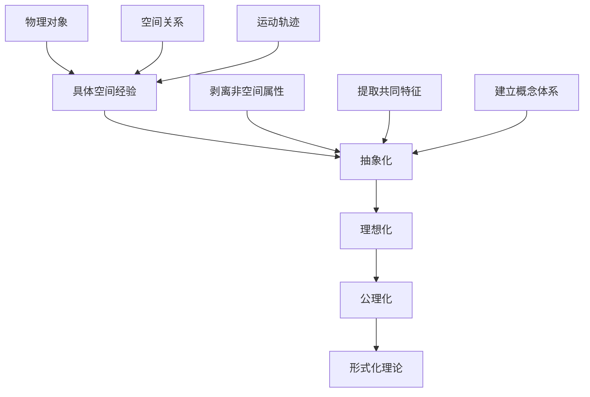
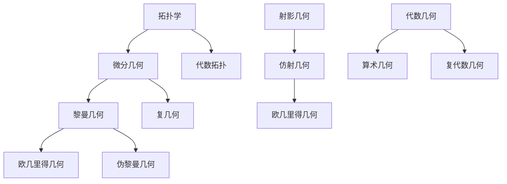
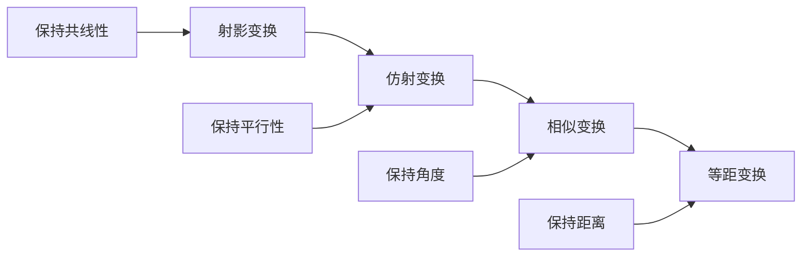

# 几何与空间结构总览

## 目录

- [几何与空间结构总览](#几何与空间结构总览)
  - [目录](#目录)
  - [1. 几何学的历史发展](#1-几何学的历史发展)
    - [1.1 古典几何学](#11-古典几何学)
    - [1.2 现代几何学的发展](#12-现代几何学的发展)
    - [1.3 当代几何学](#13-当代几何学)
  - [2. 几何学的基本思想](#2-几何学的基本思想)
    - [2.1 空间抽象化](#21-空间抽象化)
    - [2.2 公理化方法](#22-公理化方法)
    - [2.3 变换群观点](#23-变换群观点)
    - [2.4 形式化与直觉的平衡](#24-形式化与直觉的平衡)
  - [3. 现代几何学的特点](#3-现代几何学的特点)
    - [3.1 高度抽象性](#31-高度抽象性)
    - [3.2 统一性](#32-统一性)
    - [3.3 应用广泛性](#33-应用广泛性)
    - [3.4 理论深刻性](#34-理论深刻性)
  - [4. 核心几何结构概述](#4-核心几何结构概述)
    - [4.1 欧几里得几何](#41-欧几里得几何)
    - [4.2 非欧几里得几何](#42-非欧几里得几何)
    - [4.3 射影几何](#43-射影几何)
    - [4.4 拓扑学](#44-拓扑学)
    - [4.5 微分几何](#45-微分几何)
    - [4.6 代数几何](#46-代数几何)
  - [5. 几何结构间的关系](#5-几何结构间的关系)
    - [5.1 层次关系](#51-层次关系)
    - [5.2 包含关系](#52-包含关系)
    - [5.3 对偶关系](#53-对偶关系)
    - [5.4 变换关系](#54-变换关系)
  - [6. 几何理论的应用](#6-几何理论的应用)
    - [6.1 数学内部应用](#61-数学内部应用)
    - [6.2 物理学应用](#62-物理学应用)
    - [6.3 计算机科学应用](#63-计算机科学应用)
    - [6.4 工程学应用](#64-工程学应用)
  - [7. 现代发展方向](#7-现代发展方向)
    - [7.1 同调代数](#71-同调代数)
    - [7.2 表示论](#72-表示论)
    - [7.3 几何群论](#73-几何群论)
    - [7.4 几何分析](#74-几何分析)
  - [8. 认知与几何](#8-认知与几何)
    - [8.1 空间认知基础](#81-空间认知基础)
    - [8.2 几何直觉](#82-几何直觉)
    - [8.3 形式化思维](#83-形式化思维)
  - [9. 参考文献](#9-参考文献)
    - [9.1 经典文献](#91-经典文献)
    - [9.2 现代教材](#92-现代教材)
    - [9.3 专业文献](#93-专业文献)
    - [9.4 认知科学文献](#94-认知科学文献)

---

## 1. 几何学的历史发展

### 1.1 古典几何学

几何学起源于古代的土地测量和建筑实践。古埃及人为了测量尼罗河泛滥后的土地，发展了基本的几何知识。古希腊人将这些经验知识系统化，建立了严格的几何理论体系。

**欧几里得《几何原本》**（约公元前300年）是几何学发展的里程碑，它建立了第一个完整的公理化几何体系：

- **五条公设**：奠定了欧几里得几何的基础
- **演绎推理**：从公理出发，通过逻辑推理建立定理体系
- **系统性**：将几何知识组织成严密的逻辑结构

欧几里得几何统治了数学界两千多年，直到19世纪才被非欧几何打破。

### 1.2 现代几何学的发展

19世纪是几何学发展的转折点，出现了多个重要的几何分支：

**非欧几何的发现**：

- **罗巴切夫斯基几何**（双曲几何）：假设过直线外一点有无数条平行线
- **黎曼几何**（椭圆几何）：假设过直线外一点没有平行线
- **意义**：打破了欧几里得几何的唯一性，开创了几何学的新纪元

**射影几何的发展**：

- 研究在射影变换下保持不变的性质
- 引入了无穷远点和无穷远直线
- 为现代几何学提供了新的视角

**解析几何的完善**：

- 笛卡尔将代数方法引入几何学
- 建立了坐标系，将几何问题转化为代数问题
- 为微积分的发展奠定了基础

### 1.3 当代几何学

20世纪以来，几何学进入了高度抽象和多元化的时代：

**拓扑学的兴起**：

- 研究在连续变形下保持不变的性质
- 引入了同伦论、同调论等新工具
- 成为现代数学的核心分支

**微分几何的发展**：

- 研究流形上的几何结构
- 为广义相对论提供了数学基础
- 发展出黎曼几何、复几何等分支

**代数几何的繁荣**：

- 将代数方法与几何问题结合
- 研究代数簇的几何性质
- 成为现代数学最活跃的领域之一

## 2. 几何学的基本思想

### 2.1 空间抽象化

几何学的核心思想是将具体的空间经验抽象为数学概念：

**抽象化的层次**：

1. **感知层次**：从具体物体中识别空间特征
2. **概念层次**：建立抽象的空间概念
3. **符号层次**：用数学符号表示空间关系
4. **理论层次**：建立完整的几何理论体系

### 2.2 公理化方法

公理化方法是几何学的基础，它通过以下步骤建立理论体系：

1. **基本概念**：定义或约定基本术语
2. **公理系统**：建立基本假设
3. **逻辑推理**：从公理推导定理
4. **理论体系**：形成完整的知识结构

**公理化的优势**：

- **严谨性**：确保理论的逻辑一致性
- **普适性**：适用于不同的解释
- **系统性**：组织成完整的知识体系

### 2.3 变换群观点

克莱因的埃尔朗根纲领（1872年）提出了以变换群为核心的几何学观点：

**核心思想**：几何学是研究在特定变换群下保持不变的性质的学科。

**主要变换群**：

- **欧几里得群**：保持距离的变换
- **相似变换群**：保持角度和比例关系的变换
- **仿射变换群**：保持平行关系的变换
- **射影变换群**：保持共线性的变换

### 2.4 形式化与直觉的平衡

几何学需要在形式化严谨性和几何直觉之间保持平衡：

**几何直觉的作用**：

- 提供问题解决的思路
- 验证形式化结果的合理性
- 启发新的研究方向

**形式化的必要性**：

- 确保证明的严谨性
- 避免直觉的误导
- 建立可靠的理论基础

## 3. 现代几何学的特点

### 3.1 高度抽象性

现代几何学已经超越了直观的空间概念，发展出高度抽象的理论：

**抽象空间**：

- **拓扑空间**：只关注连通性等拓扑性质
- **度量空间**：关注距离概念
- **流形**：局部欧几里得的空间
- **代数簇**：代数方程定义的几何对象

**抽象方法**：

- **范畴论**：研究数学结构之间的关系
- **同调论**：研究代数不变量
- **表示论**：研究群在向量空间上的作用

### 3.2 统一性

现代几何学呈现出高度的统一性：

**统一框架**：

- **纤维丛理论**：统一了多种几何结构
- **李群理论**：统一了对称性研究
- **代数几何**：统一了代数和几何方法

**交叉融合**：

- 几何学与代数学的深度融合
- 几何学与分析学的结合
- 几何学与拓扑学的统一

### 3.3 应用广泛性

几何学在现代科学和技术中有着广泛的应用：

**物理学应用**：

- **广义相对论**：黎曼几何描述时空弯曲
- **量子场论**：纤维丛描述规范场
- **弦理论**：高维几何描述宇宙结构

**计算机科学应用**：

- **计算机图形学**：几何建模和渲染
- **计算机视觉**：图像分析和理解
- **机器学习**：流形学习和几何深度学习

**工程学应用**：

- **建筑设计**：几何美学和结构设计
- **机械设计**：几何建模和运动分析
- **航空航天**：轨道设计和姿态控制

### 3.4 理论深刻性

现代几何学在理论深度上达到了前所未有的高度：

**深刻定理**：

- **庞加莱猜想**：三维流形的分类
- **费马大定理**：代数几何的深刻应用
- **朗兰兹纲领**：数论、几何、表示论的统一

**理论创新**：

- **非交换几何**：阿兰·孔涅的开创性工作
- **镜像对称**：弦理论中的几何现象
- **几何朗兰兹纲领**：几何和表示论的统一

## 4. 核心几何结构概述

### 4.1 欧几里得几何

欧几里得几何是最基础也是最重要的几何分支：

**基本特征**：

- 基于欧几里得公理系统
- 研究平面和空间中的几何对象
- 保持距离和角度的变换

**核心概念**：

- **点、直线、平面**：基本几何元素
- **距离、角度**：基本度量概念
- **全等、相似**：基本关系概念

**重要定理**：

- **勾股定理**：直角三角形的基本性质
- **平行公理**：欧几里得几何的特征
- **圆的性质**：圆周角、切线等

### 4.2 非欧几里得几何

非欧几何打破了欧几里得几何的唯一性：

**双曲几何**：

- **平行公理**：过直线外一点有无数条平行线
- **曲率**：负常数曲率
- **模型**：庞加莱圆盘模型、上半平面模型

**椭圆几何**：

- **平行公理**：过直线外一点没有平行线
- **曲率**：正常数曲率
- **模型**：球面几何

**意义**：

- 证明了数学真理的相对性
- 为现代物理学提供了数学工具
- 开创了几何学的新纪元

### 4.3 射影几何

射影几何研究在射影变换下保持不变的性质：

**基本概念**：

- **射影空间**：包含无穷远点的空间
- **射影变换**：保持共线性的变换
- **对偶原理**：点和直线的对偶性

**重要性质**：

- **射影不变量**：交比、射影坐标
- **圆锥曲线**：在射影变换下的分类
- **射影平面**：有限射影平面的构造

**应用**：

- **计算机视觉**：透视投影和相机标定
- **艺术设计**：透视画法
- **建筑学**：空间透视

### 4.4 拓扑学

拓扑学研究在连续变形下保持不变的性质：

**基本概念**：

- **拓扑空间**：定义了开集的空间
- **连续映射**：保持拓扑结构的映射
- **同胚**：双向连续的映射

**重要分支**：

- **代数拓扑**：同伦论、同调论
- **微分拓扑**：流形的拓扑性质
- **几何拓扑**：低维流形的分类

**核心问题**：

- **同伦群**：空间的基本群和高维同伦群
- **同调群**：空间的代数不变量
- **流形分类**：不同维数流形的分类

### 4.5 微分几何

微分几何研究流形上的几何结构：

**基本概念**：

- **流形**：局部欧几里得的空间
- **切空间**：流形上点的线性近似
- **黎曼度量**：流形上的距离概念

**重要分支**：

- **黎曼几何**：正定度量流形
- **伪黎曼几何**：不定度量流形
- **复几何**：复流形上的几何

**应用**：

- **广义相对论**：时空的几何描述
- **规范理论**：纤维丛上的几何
- **几何分析**：几何偏微分方程

### 4.6 代数几何

代数几何研究代数方程定义的几何对象：

**基本概念**：

- **代数簇**：多项式方程组的零点集
- **概形**：代数几何的基本对象
- **上同调**：代数簇的代数不变量

**重要分支**：

- **仿射代数几何**：仿射空间中的代数簇
- **射影代数几何**：射影空间中的代数簇
- **算术代数几何**：数域上的代数几何

**现代发展**：

- **模空间理论**：参数化几何对象
- **镜像对称**：卡拉比-丘流形的对偶性
- **几何朗兰兹纲领**：几何和表示论的统一

## 5. 几何结构间的关系

### 5.1 层次关系

几何结构之间存在清晰的层次关系：

**层次特征**：

- **拓扑学**：最基础的层次，只关注连通性
- **微分几何**：增加了微分结构
- **黎曼几何**：增加了度量结构
- **欧几里得几何**：最具体的几何结构

### 5.2 包含关系

不同几何分支之间存在包含关系：

**欧几里得几何 ⊂ 仿射几何 ⊂ 射影几何**：

- 欧几里得几何保持距离和角度
- 仿射几何保持平行关系
- 射影几何保持共线性

**拓扑学 ⊂ 微分几何 ⊂ 黎曼几何**：

- 拓扑学只关注连续性质
- 微分几何增加了微分结构
- 黎曼几何增加了度量结构

### 5.3 对偶关系

几何学中存在丰富的对偶关系：

**射影对偶**：

- 点和直线的对偶
- 平面和直线的对偶
- 圆锥曲线的对偶性质

**庞加莱对偶**：

- 同调群和上同调群的对偶
- 流形的对偶性质

**镜像对称**：

- 卡拉比-丘流形的对偶性
- 弦理论中的几何现象

### 5.4 变换关系

几何结构通过变换相互联系：

**变换群**：

- **欧几里得群**：保持距离的变换
- **相似变换群**：保持角度和比例的变换
- **仿射变换群**：保持平行关系的变换
- **射影变换群**：保持共线性的变换

**变换的层次**：

## 6. 几何理论的应用

### 6.1 数学内部应用

几何学在数学内部有着广泛的应用：

**代数学应用**：

- **李群理论**：几何对称性的代数描述
- **表示论**：群在几何空间上的作用
- **代数几何**：代数方程的几何解释

**分析学应用**：

- **几何分析**：几何偏微分方程
- **调和分析**：几何空间上的分析
- **复分析**：复几何中的分析

**拓扑学应用**：

- **代数拓扑**：几何对象的拓扑不变量
- **微分拓扑**：流形的拓扑性质
- **几何拓扑**：低维流形的几何拓扑

### 6.2 物理学应用

几何学在现代物理学中起着核心作用：

**广义相对论**：

- **黎曼几何**：描述时空的弯曲
- **爱因斯坦方程**：几何和物质的相互作用
- **黑洞几何**：奇点附近的几何结构

**量子场论**：

- **纤维丛**：描述规范场
- **规范理论**：几何和物理的统一
- **弦理论**：高维几何描述

**统计物理**：

- **相空间几何**：统计力学中的几何
- **临界现象**：几何相变
- **复杂系统**：几何方法研究

### 6.3 计算机科学应用

几何学在计算机科学中有重要应用：

**计算机图形学**：

- **几何建模**：三维物体的表示
- **渲染技术**：光照和阴影的计算
- **动画**：几何变换和插值

**计算机视觉**：

- **图像处理**：几何变换和滤波
- **三维重建**：从图像恢复几何结构
- **目标识别**：几何特征提取

**机器学习**：

- **流形学习**：高维数据的几何结构
- **几何深度学习**：图神经网络
- **最优传输**：几何优化方法

### 6.4 工程学应用

几何学在工程学中有广泛应用：

**建筑设计**：

- **几何美学**：黄金比例、对称性
- **结构设计**：几何稳定性
- **空间规划**：几何布局

**机械设计**：

- **几何建模**：CAD系统中的几何
- **运动分析**：机构的几何分析
- **制造工艺**：几何精度控制

**航空航天**：

- **轨道设计**：天体力学中的几何
- **姿态控制**：三维旋转几何
- **空气动力学**：流体的几何性质

## 7. 现代发展方向

### 7.1 同调代数

同调代数是现代几何学的重要工具：

**基本概念**：

- **复形**：代数对象的链复形
- **同调群**：代数不变量
- **导出函子**：函子的同调理论

**几何应用**：

- **代数几何**：上同调理论
- **拓扑学**：奇异同调
- **表示论**：群同调

**现代发展**：

- **导出范畴**：同调代数的范畴化
- **稳定同伦论**：同伦论的代数化
- **几何朗兰兹**：几何和表示论的统一

### 7.2 表示论

表示论研究群在几何空间上的作用：

**基本概念**：

- **群表示**：群到线性变换群的同态
- **不可约表示**：基本的表示
- **特征标**：表示的不变量

**几何应用**：

- **李群**：连续群的表示
- **代数群**：代数几何中的群
- **量子群**：量子化的群结构

**现代发展**：

- **几何朗兰兹纲领**：几何和表示论的统一
- **量子几何**：量子化的几何结构
- **范畴化**：表示论的范畴化

### 7.3 几何群论

几何群论研究群的几何性质：

**基本概念**：

- **凯莱图**：群的几何表示
- **双曲群**：负曲率群
- **自动群**：自动机定义的群

**几何性质**：

- **增长函数**：群元素的增长
- **等距作用**：群在度量空间上的作用
- **边界**：群的几何边界

**应用**：

- **低维拓扑**：三维流形的基本群
- **密码学**：基于群的密码系统
- **网络科学**：网络的群论性质

### 7.4 几何分析

几何分析研究几何偏微分方程：

**基本方程**：

- **调和映射方程**：映射的调和性
- **里奇流**：度量演化的方程
- **杨-米尔斯方程**：规范场的方程

**几何应用**：

- **里奇流**：庞加莱猜想的证明
- **调和映射**：几何变分问题
- **几何测度论**：几何测度的分析

**现代发展**：

- **几何流**：各种几何演化方程
- **几何变分法**：几何变分问题
- **几何偏微分方程**：几何和分析的结合

## 8. 认知与几何

### 8.1 空间认知基础

人类的几何认知建立在空间认知的基础上：

**感知基础**：

- **视觉感知**：形状、大小、位置
- **触觉感知**：物体的三维性质
- **运动感知**：空间中的运动

**认知发展**：

- **客体持久性**：理解物体的存在
- **空间关系**：上下、左右、前后
- **心理旋转**：在头脑中操作物体

**神经基础**：

- **海马体**：空间记忆和导航
- **顶叶**：空间感知和注意
- **额叶**：空间规划和执行

### 8.2 几何直觉

几何直觉在几何学发展中起着重要作用：

**直觉的作用**：

- **问题解决**：提供解题思路
- **验证结果**：检查形式化结果
- **发现新理论**：启发研究方向

**直觉的类型**：

- **空间直觉**：对空间关系的直观理解
- **运动直觉**：对几何变换的直观感受
- **对称直觉**：对对称性的直观认识

**直觉的局限性**：

- **高维空间**：难以直观想象
- **抽象概念**：缺乏直观对应
- **反直觉结果**：与直觉相矛盾

### 8.3 形式化思维

形式化思维是几何学发展的必然要求：

**形式化的必要性**：

- **严谨性**：确保证明的正确性
- **普适性**：适用于不同解释
- **系统性**：组织成完整理论

**形式化的层次**：

- **符号化**：用符号表示概念
- **公理化**：建立公理系统
- **形式化**：完全形式化的理论

**形式化与直觉的平衡**：

- **互补性**：形式化和直觉相互补充
- **发展性**：从直觉到形式化的发展
- **应用性**：在实际问题中的应用

## 9. 参考文献

### 9.1 经典文献

1. **Euclid**. *Elements*. 约公元前300年
2. **Klein, F.**. *Erlangen Program*. 1872
3. **Hilbert, D.**. *Foundations of Geometry*. 1899
4. **Poincaré, H.**. *Analysis Situs*. 1895
5. **Cartan, É.**. *Leçons sur la géométrie des espaces de Riemann*. 1928

### 9.2 现代教材

1. **Berger, M.**. *Geometry I, II*. Springer, 1987
2. **do Carmo, M.P.**. *Differential Geometry of Curves and Surfaces*. Prentice-Hall, 1976
3. **Hatcher, A.**. *Algebraic Topology*. Cambridge University Press, 2002
4. **Hartshorne, R.**. *Algebraic Geometry*. Springer, 1977
5. **Milnor, J.**. *Topology from the Differentiable Viewpoint*. Princeton University Press, 1965

### 9.3 专业文献

1. **Thurston, W.P.**. *Three-Dimensional Geometry and Topology*. Princeton University Press, 1997
2. **Gromov, M.**. *Metric Structures for Riemannian and Non-Riemannian Spaces*. Birkhäuser, 1999
3. **Grothendieck, A.**. *Éléments de géométrie algébrique*. IHES, 1960-1967
4. **Perelman, G.**. *The Entropy Formula for the Ricci Flow and its Geometric Applications*. 2002
5. **Witten, E.**. *Topological Quantum Field Theory*. Communications in Mathematical Physics, 1988

### 9.4 认知科学文献

1. **Piaget, J.**. *The Child's Conception of Space*. Routledge, 1956
2. **Shepard, R.N.**. *Mental Rotation of Three-Dimensional Objects*. Science, 1971
3. **Kosslyn, S.M.**. *Image and Brain*. MIT Press, 1994
4. **Dehaene, S.**. *The Number Sense*. Oxford University Press, 1997
5. **Lakoff, G., Núñez, R.E.**. *Where Mathematics Comes From*. Basic Books, 2000

---

> **注**：本文档为几何与空间结构的总览，为后续详细的几何主题文档提供框架和背景。每个主题将在相应的文档中深入展开。
