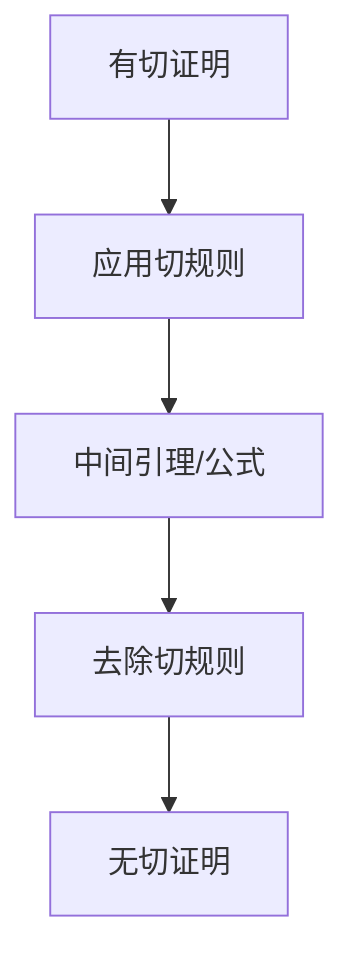

# 3.6.1 证明论

> [返回总览](../00-元数学与形式化基础总览.md)

## 目录

- [3.6.1 证明论](#361-证明论)
  - [目录](#目录)
  - [3.6.1.1 证明论的定义与意义](#3611-证明论的定义与意义)
  - [3.6.1.2 证明系统与推理规则](#3612-证明系统与推理规则)
  - [3.6.1.3 主要定理与方法](#3613-主要定理与方法)
  - [3.6.1.4 现代发展与AI联系](#3614-现代发展与ai联系)
  - [3.6.1.5 相关主题与本地跳转](#3615-相关主题与本地跳转)
  - [3.6.1.6 参考文献与资源](#3616-参考文献与资源)

---

## 3.6.1.1 证明论的定义与意义

| 主题         | 内容简述 |
| ---- | ---- |
| 研究对象     | 形式证明、推理规则、证明结构 |
| 主要目标     | 研究证明的规范性、能力与局限 |
| 代表性问题   | 一致性、完备性、不完备性、可判定性 |
| 典型应用     | 自动证明、规范化、切消定理 |

---

## 3.6.1.2 证明系统与推理规则

| 证明系统     | 核心特征             | 优点                   | 缺点                   | 典型应用         |
| ---- | ---- | ---- | ---- | ---- |
| 自然演绎     | 模拟人类推理，规则直观 | 便于教学，结构清晰      | 形式化程度略低         | 命题/谓词逻辑     |
| 相继式演算   | 结构化、可分析性强     | 适合自动化、切消定理     | 直观性较弱，学习曲线陡  | 证明论、自动证明 |

---

## 3.6.1.3 主要定理与方法

---

## 3.6.1.4 现代发展与AI联系

- 自动定理证明（如Lean、Coq、Isabelle）推动了证明论的实际应用。
- 证明助手和AI系统可辅助发现新证明、验证复杂定理。
- 证明论与类型论、编程语言理论深度融合，促进了形式化验证和软件可靠性。

---

## 3.6.1.5 相关主题与本地跳转

- 详见 [00-元数学与形式化基础总览.md](../00-元数学与形式化基础总览.md) 3.3 证明论
- 相关主题：[01-元数学理论.md](01-元数学理论.md)、[04-形式化系统.md](04-形式化系统.md)

---

## 3.6.1.6 参考文献与资源

- Gentzen, G. (1936). "Die Widerspruchsfreiheit der reinen Zahlentheorie".
- 数学知识体系重构项目 (2024).
