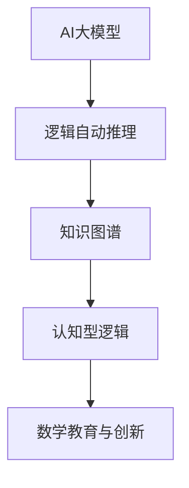

# 00-数理逻辑总览

## 目录

- [00-数理逻辑总览](#00-数理逻辑总览)
  - [目录](#目录)
  - [1. 引言与主题概述](#1-引言与主题概述)
  - [2. 数理逻辑的主要分支](#2-数理逻辑的主要分支)
    - [2.1 模型论](#21-模型论)
    - [2.2 递归论](#22-递归论)
    - [2.3 证明论](#23-证明论)
    - [2.4 元数学与元理论](#24-元数学与元理论)
    - [2.5 哲学与形式化反思](#25-哲学与形式化反思)
  - [3. 主要定理与证明](#3-主要定理与证明)
  - [4. 应用与交叉学科](#4-应用与交叉学科)
    - [4.1 现代AI与自动化逻辑推理](#41-现代ai与自动化逻辑推理)
  - [5. 本地跳转与引用说明](#5-本地跳转与引用说明)

---

## 1. 引言与主题概述

数理逻辑是研究数学推理、证明、计算和结构基础的学科。它通过形式化语言和系统，分析推理的有效性、理论的基础和证明的性质。数理逻辑不仅是现代数学的基础，也是计算机科学、人工智能等领域的理论支柱。

---

## 2. 数理逻辑的主要分支

### 2.1 模型论

- 研究形式语言与数学结构之间的关系，关注模型、满足关系、主要定理（如完备性、紧致性、Löwenheim-Skolem）。
- 详见：[01-模型论](01-模型论.md)

### 2.2 递归论

- 研究可计算性、算法极限、主要计算模型（图灵机、λ演算、递归函数）、不可判定性等。
- 详见：[02-递归论](02-递归论.md)

### 2.3 证明论

- 研究形式证明系统、推理规则、证明复杂性、一致性与不完备性等。
- 详见：[03-证明论](03-证明论.md)

### 2.4 元数学与元理论

- 研究形式系统本身的性质，如一致性、完备性、可判定性、公理独立性等。
- 详见：[04-元数学与元理论](04-元数学与元理论.md)

### 2.5 哲学与形式化反思

- 探讨数学哲学流派、形式化的意义与局限、数学真理与认知。
- 详见：[05-哲学与形式化反思](05-哲学与形式化反思.md)

---

## 3. 主要定理与证明

- 包括哥德尔完备性/不完备性、紧致性、Löwenheim-Skolem、停机问题等。
- 详见：[06-主要定理与证明](06-主要定理与证明.md)

---

## 4. 应用与交叉学科

- 数理逻辑在计算机科学、AI、数据库、语言学等领域的应用。
- 详见：[07-应用与交叉学科](07-应用与交叉学科.md)

### 4.1 现代AI与自动化逻辑推理

- **AI大模型辅助逻辑推理**：GPT-4、Claude等大模型已能自动生成逻辑证明、形式化代码，辅助教学与研究。
- **知识图谱驱动的逻辑自动化**：如OpenAI MathGraph、Wikidata等，支持逻辑知识的结构化、自动化推理。
- **认知型逻辑推理**：结合人类认知过程的AI推理系统，模拟数学家的逻辑思维与创新。
- **Rust代码示例：AI辅助逻辑推理结构体**

```rust
struct AIAssistedLogicProof {
    statement: String,
    proof_steps: Vec<String>,
    verified: bool,
}

impl AIAssistedLogicProof {
    fn new(statement: &str) -> Self {
        AIAssistedLogicProof { statement: statement.to_string(), proof_steps: vec![], verified: false }
    }
    fn add_step(&mut self, step: &str) {
        self.proof_steps.push(step.to_string());
    }
    fn verify(&mut self) {
        // 假设AI自动验证
        self.verified = true;
    }
}
```

- **结构图：AI与逻辑推理自动化**



---

## 5. 本地跳转与引用说明

- 本文档及子文件均采用严格编号与树形结构，所有主题均有本地跳转锚点。
- 相关内容引用请使用 `[主题名](相对路径)` 方式，便于本地知识图谱与交叉引用。

---

> 规范性说明：本总览文件为数理逻辑分支的导航与结构总览，后续内容将持续补充完善，所有子主题均可通过本地跳转快速访问。
