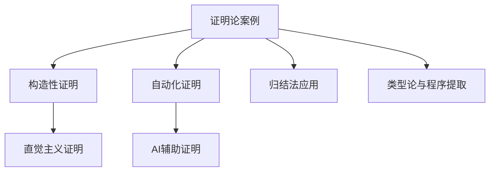

<!--
本文件部分内容迁移自 01-核心内容/Matter/MetaMath/Proof/view_证明论.md 和 view_证明论01.md。
迁移时间：2024-06。
迁移说明：分节整理为"构造性证明与直觉主义"、"BHK解释与可实现性"、"历史人物与学派"、"自动化证明与程序提取"、"证明论与认知结构"、"AI与证明论"等专题案例，便于后续规范化和引用。
-->

# 2.3.2 证明论案例分析

[返回总览](../00-数学基础与逻辑总览.md)

## 2.3.2.1 典型证明系统案例

## A. 构造性数学与证明论

### A.1 构造性数学的核心概念

构造性数学是一种强调"存在一个对象当且仅当能够给出一个构造该对象的方法"的数学哲学和实践。

**与经典数学的主要区别**：

1. **存在性的含义**：
   - **经典数学**：一个对象存在，如果其不存在会导致逻辑矛盾
   - **构造性数学**："存在一个对象X"意味着我们可以明确地构造出这样一个X

2. **对逻辑原则的接受程度**：
   - **经典数学**：基于经典逻辑，包括排中律和双重否定消除
   - **构造性数学**：基于直觉主义逻辑，不普遍接受排中律

3. **对无限的处理**：
   - **经典数学**：更自由地处理"已完成的无限"集合
   - **构造性数学**：对无限的处理更为谨慎，倾向于"潜无限"的观点

4. **证明的含义**：
   - **经典数学**：证明是一个从公理到定理的逻辑推导序列
   - **构造性数学**：证明本身被视为一种构造

### A.2 构造性证明的特征

一个构造性证明是一个提供了其所断言内容之明确证据的证明。

**特征**：

1. **存在性证明需给出实例**：证明 ∃x P(x) 必须伴随着一个构造特定对象 a 的方法
2. **析取证明需指明哪一项为真**：证明 A ∨ B 必须伴随着一个证明 A 或 B 的方法
3. **算法内容**：许多构造性证明都具有内在的算法内容
4. **避免排中律和经典反证法**：特别是当它们被用来证明没有直接构造的存在性命题时

**例子对比**：

**经典非构造性证明**：
证明"存在两个无理数 a, b 使得 a^b 是有理数"。
考虑 √2^√2。如果它是有理数，则令 a = √2, b = √2。如果它是无理数，则令 a = √2^√2, b = √2，那么 a^b = (√2^√2)^√2 = (√2)^(√2*√2) = (√2)^2 = 2，这是有理数。

**构造性要求**：
一个构造性证明需要明确指出 a 和 b 的具体值，并证明它们是无理数且 a^b 是有理数。

### A.3 直觉主义逻辑系统

直觉主义逻辑是构造性数学最主要的逻辑框架，由阿兰德·海廷在20世纪30年代形式化。

**与经典逻辑的主要区别**：

1. **排中律**：P ∨ ¬P 在直觉主义逻辑中不是公理或普遍有效的定理
2. **双重否定消除**：¬¬P → P 在直觉主义逻辑中不成立
3. **皮尔士定律**：((P → Q) → P) → P 在直觉主义逻辑中不成立
4. **反证法的限制**：虽然 (P → Q) ∧ (P → ¬Q) → ¬P 在直觉主义逻辑中成立，但从 ¬P → Q ∧ ¬Q 并不能直接推出 P

**直觉主义逻辑的可靠性与完备性**：

- 直觉主义逻辑相对于某些语义（如BHK释义、克里普克模型、代数语义如海廷代数）是可靠且完备的
- 经典逻辑可以看作是直觉主义逻辑加上排中律的结果

### A.4 BHK释义详解

BHK释义为直觉主义逻辑的联结词和量词提供了一种基于"证明"的非形式化语义。

**核心解释**：

- **p ∧ q 的证明**：由一个 p 的证明和一个 q 的证明构成
- **p ∨ q 的证明**：由给出 i (等于0或1)以及一个命题 p_i 的证明构成，其中 p_0 是 p，p_1 是 q
- **p → q 的证明**：是一个构造，该构造能将任意一个 p 的证明转化为一个 q 的证明
- **¬p 的证明**：是一个构造，该构造能将任意一个 p 的证明转化为一个对 ⊥ 的证明
- **∃x P(x) 的证明**：由给出一个特定对象 d 和一个 P(d) 的证明构成
- **∀x P(x) 的证明**：是一个构造，该构造能将任意一个对象 d 转化为一个 P(d) 的证明

**哲学意义**：
BHK释义强调了证明的构造性本质，并解释了为什么排中律在直觉主义逻辑中不被普遍接受：我们可能没有一个通用的方法来构造 P 的证明或者 ¬P 的证明。

### A.5 可实现性理论

由斯蒂芬·克利尼在1945年引入，为直觉主义算术提供了一种形式化的、基于递归函数的释义。

**核心思想**：
一个（算术）句子 φ 被认为是"可实现的"，如果存在一个自然数 e，使得 e"实现"φ。

**实现关系的递归定义**：

- e r (A ∧ B) 当且仅当 e = 2^a · 3^b 且 a r A 且 b r B
- e r (A ∨ B) 当且仅当 e = 2^0 · 3^a 且 a r A，或者 e = 2^1 · 3^b 且 b r B
- e r (A → B) 当且仅当 e 是一个部分递归函数的索引，使得对任何实现 A 的 a，{e}(a) 有定义且实现 B
- e r (∃x A(x)) 当且仅当 e = 2^d · 3^a 且 a r A(d)
- e r (∀x A(x)) 当且仅当 e 是一个部分递归函数的索引，使得对任何项 t，{e}(d) 有定义且实现 A(t)

**重要结果**：
克利尼证明了直觉主义算术中的所有定理都是可实现的。这提供了一种从直觉主义证明中提取计算内容的方法。

## B. 历史人物与思想发展

### B.1 克罗内克的构造主义先驱

利奥波德·克罗内克（1823-1891）被广泛认为是构造性数学的先驱之一。

**核心观点**：

- 他认为数学对象必须能够从整数通过有限步构造出来
- 他对那些依赖于"已完成无限"或非构造性存在证明的数学成果持批判态度
- 名言："上帝创造了整数，其余都是人的工作"

**影响**：
虽然他没有系统地建立一个构造性数学体系，但他的哲学立场对后来的构造主义者产生了重要影响。

### B.2 布劳威尔的直觉主义革命

路易斯·布劳威尔（1881-1966）是直觉主义的创始人，构造性数学中最著名和最具影响力的流派。

**核心思想**：

1. **数学是心智的构造活动**：数学对象是人类心智构造的产物，独立于语言和形式逻辑而存在
2. **对排中律的拒绝**：他认为排中律对于涉及无限集合的命题是不可靠的
3. **选择序列的概念**：用于构造性地处理实数和连续统
4. **连续性原理**：关于选择序列的任何断言，如果为真，则必须仅基于该序列的一个有限初始片段就能确定其真值

**哲学影响**：
布劳威尔的思想对数学基础研究产生了深远影响，挑战了经典数学的某些基本假设。

### B.3 海廷的形式化贡献

阿兰德·海廷（1898-1980）在20世纪30年代形式化了直觉主义逻辑。

**主要贡献**：

- 为布劳威尔的直觉主义思想提供了形式化的逻辑系统
- 建立了直觉主义逻辑的公理系统和推理规则
- 为构造性数学提供了严格的逻辑基础

**形式化意义**：
海廷的工作使得直觉主义思想能够被精确地研究和应用，为后来的构造性数学发展奠定了基础。

### B.4 毕晓普的构造分析

埃里特·毕晓普（1928-1983）发展了构造分析，为构造性数学提供了系统的方法。

**主要工作**：

- 建立了构造分析的基本框架
- 发展了构造性分析的技术方法
- 证明了经典分析中的许多重要定理都有构造性版本

**影响**：
毕晓普的工作表明，构造性数学不仅是一种哲学立场，也是一种具有强大技术力量的数学方法。

### B.5 马丁-洛夫的构造类型论

佩尔·马丁-洛夫（1942-）发展了构造类型论，为构造性数学提供了新的基础。

**核心思想**：

- 将类型论与构造性数学相结合
- 建立了证明与程序之间的对应关系
- 为计算机科学中的形式化方法提供了理论基础

**技术贡献**：
构造类型论为：

- 程序验证提供了理论基础
- 定理证明自动化提供了方法
- 逻辑程序设计提供了范式

## C. 证明论的技术应用

### C.1 自动定理证明

自动定理证明是证明论在计算机科学中的重要应用。

**技术方法**：

- 归结原理
- 表方法
- 自然演绎自动化
- 序贯演算自动化

**应用领域**：

- 程序验证
- 硬件验证
- 安全协议验证
- 数学定理证明

**挑战与限制**：

- 搜索空间爆炸问题
- 启发式策略的设计
- 证明的可读性
- 人类理解的重要性

### C.2 程序提取技术

基于 Curry-Howard 对应，可以从构造性证明中提取程序。

**基本原理**：

- 命题对应类型
- 证明对应程序
- 证明归约对应程序计算

**技术实现**：

- 从直觉主义证明中提取算法
- 从类型论证明中生成代码
- 从形式化证明中产生可执行程序

**应用价值**：

- 程序合成
- 程序优化
- 程序验证
- 算法设计

### C.3 形式验证系统

形式验证系统利用证明论的技术来验证程序和系统的正确性。

**验证方法**：

- 模型检查
- 定理证明
- 抽象解释
- 类型检查

**应用领域**：

- 安全关键系统
- 航空航天软件
- 金融系统
- 医疗设备

**技术挑战**：

- 状态空间爆炸
- 抽象精度
- 性能开销
- 可用性

### C.4 交互证明助手

交互证明助手结合了人类的直觉和机器的严格性。

**系统特点**：

- 人机协作
- 分步验证
- 交互式推理
- 可视化界面

**著名系统**：

- Coq
- Isabelle/HOL
- Agda
- Lean

**应用价值**：

- 复杂定理的证明
- 数学教育
- 研究工具
- 验证平台

## D. 哲学反思与争议

### D.1 排中律的哲学争议

排中律 P ∨ ¬P 在构造性数学中的争议是核心哲学问题。

**经典立场**：

- 排中律是逻辑的基本原理
- 任何命题要么为真要么为假
- 这是客观真理的体现

**构造主义立场**：

- 排中律不是普遍有效的
- 对于某些命题，我们可能既无法证明其为真，也无法证明其为假
- 这反映了人类认知的局限性

**哲学意义**：
这个争议反映了对数学真理本质的不同理解：

- 客观主义 vs 认知主义
- 柏拉图主义 vs 构造主义
- 绝对真理 vs 相对真理

### D.2 存在性证明的认知分析

存在性证明在构造性数学中具有特殊地位。

**非构造性存在证明**：

- 通过矛盾证明存在性
- 不提供具体的构造方法
- 依赖于排中律

**构造性存在证明**：

- 必须提供具体的构造方法
- 证明过程本身具有算法内容
- 满足认知可及性要求

**认知分析**：
存在性证明的不同形式反映了对"存在"概念的不同理解：

- 本体论存在：对象在某种意义上的"真实存在"
- 认知存在：对象在认知过程中的"可构造性"

### D.3 数学真理与证明关系

数学真理与证明之间的关系是证明论的核心哲学问题。

**经典观点**：

- 数学真理独立于证明
- 证明是发现真理的工具
- 真理是客观存在的

**构造主义观点**：

- 数学真理与证明不可分离
- 证明构造了数学真理
- 真理是认知过程的产物

**社会建构观点**：

- 数学真理是社会建构的
- 证明是社会过程
- 真理是相对的

### D.4 形式化与直觉的张力

形式化与直觉在数学中的关系是永恒的哲学问题。

**形式化的特征**：

- 精确性和严格性
- 客观性和普遍性
- 机械性和可计算性

**直觉的特征**：

- 直接性和整体性
- 主观性和个体性
- 创造性和不可预测性

**张力的表现**：

- 在数学发现中：直觉引导方向，形式化验证结果
- 在数学教育中：直觉帮助理解，形式化确保严格性
- 在数学研究中：直觉提供灵感，形式化提供工具

## E. 跨学科联系

### E.1 证明论与认知科学

证明论与认知科学的交叉研究揭示了数学思维的认知机制。

**认知过程分析**：

- 数学思维的认知机制
- 证明发现的心理学
- 理解过程的神经基础

**实验研究**：

- 专家与新手的差异
- 证明策略的个体差异
- 学习过程的认知规律

**教育应用**：
认知科学研究为：

- 数学教育提供了科学基础
- 教学方法提供了实证依据
- 学习评估提供了客观标准

### E.2 证明论与计算机科学

证明论与计算机科学的深度融合是现代逻辑学的重要特征。

**理论基础**：

- Curry-Howard 对应
- 类型论
- 程序逻辑

**技术应用**：

- 程序验证
- 定理证明自动化
- 逻辑程序设计

**发展方向**：

- 人工智能与证明论
- 量子计算与证明论
- 分布式系统与证明论

### E.3 证明论与人工智能

证明论为人工智能提供了重要的理论基础和方法。

**知识表示**：

- 逻辑知识表示
- 形式化推理
- 知识获取

**推理机制**：

- 自动推理
- 逻辑编程
- 专家系统

**学习算法**：

- 逻辑学习
- 归纳推理
- 知识发现

### E.4 证明论与数学教育

证明论的研究为数学教育提供了重要的理论基础。

**教育理念**：

- 构造性思维
- 形式化思维
- 批判性思维

**教学方法**：

- 发现式教学
- 形式化教学
- 交互式教学

**评估方法**：

- 理解性评估
- 创造性评估
- 形式化评估

**未来展望**：
证明论与数学教育的结合将为：

- 数学教育改革提供新思路
- 数学学习研究提供新方法
- 数学教师培训提供新内容

## 2.3.2.2 证明复杂性与自动化

## 2.3.2.3 相关主题与本地跳转

- 详见 [00-数学基础与逻辑总览.md](../00-数学基础与逻辑总览.md) 2.3 证明论
- 相关主题：[01-基础理论.md](01-基础理论.md)、[03-相关证明与引用.md](03-相关证明与引用.md)

## 2.3.2.4 参考文献与资源

## 2.3.2.5 多表征内容

- **Mermaid 结构图：证明论典型案例与分支关系**



- **Lean 代码示例：构造性存在性证明**

```lean
example : ∃ n : ℕ, n > 0 :=
begin
  use 1,
  exact nat.zero_lt_one,
end
```

- **Haskell 代码示例：简单的归结法实现**

```haskell
-- 归结法的一个极简模拟
resolve :: (Bool, Bool) -> Bool
resolve (a, b) = a || b
```

- **表格：典型证明案例与方法对比**

| 案例类型     | 证明方法     | 主要特征         | 代表工具/语言 |
| ---- | ---- | ---- | ---- |
| 构造性证明   | 直觉主义     | 明确构造、可计算 | Lean, Coq     |
| 自动化证明   | 归结法/搜索  | 适合复杂推理     | Prover9, Vampire |
| 程序提取     | Curry-Howard | 证明即程序       | Coq, Agda     |
| AI辅助证明   | 机器学习     | 智能搜索、交互   | Lean, Isabelle|

- **AI/认知/教育视角**
  - 典型案例（如四色定理、费马大定理）推动了自动化证明与AI辅助证明的发展。
  - 认知科学关注不同证明方法对理解与学习的影响，教育中强调交互式与可视化证明。
  - AI系统正逐步实现复杂定理的自动证明与人机协作。

---

## 2.3.2.6 参考文献与资源

- **经典文献**
  1. Curry, H. B., & Feys, R. (1958). Combinatory logic (Vol. 1). North-Holland.
  2. Howard, W. A. (1980). The formulae-as-types notion of construction. To HB Curry: essays on combinatory logic, lambda calculus and formalism.
  3. Martin-Löf, P. (1984). Intuitionistic type theory. Bibliopolis.

- **现代文献与在线资源**
  1. Troelstra, A. S., & Schwichtenberg, H. (2000). Basic proof theory. Cambridge University Press.
  2. Prawitz, D. (1965). Natural deduction: a proof-theoretical study. Almqvist & Wiksell.
  3. [Prover9 官方文档](https://www.cs.unm.edu/~mccune/prover9/)
  4. [Agda 官方文档](https://agda.readthedocs.io/en/v2.6.2.2/)
  5. [Vampire 官方文档](https://vprover.github.io/)

- **工具与平台**
  - Lean, Coq, Prover9, Agda, Vampire, Isabelle

---

[返回总览](00-证明论总览.md) | [基础理论](01-基础理论.md) | [相关证明与引用](03-相关证明与引用.md)
