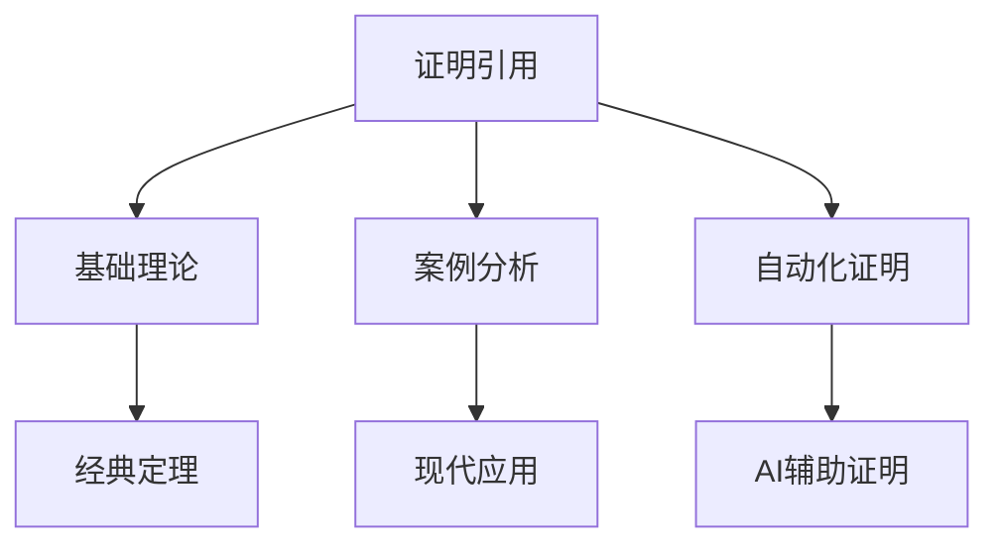

# 2.3.3 证明论相关证明与引用

[返回总览](../00-数学基础与逻辑总览.md)

## 2.3.3.1 重要证明与引用

## 2.3.3.2 相关主题与本地跳转

- 详见 [00-数学基础与逻辑总览.md](../00-数学基础与逻辑总览.md) 2.3 证明论
- 相关主题：[01-基础理论.md](01-基础理论.md)、[02-案例分析.md](02-案例分析.md)

---

## 2.3.3.3 参考文献与资源

## 2.3.3.4 多表征内容

- **Mermaid 结构图：证明引用与主题关联**



- **Lean 代码示例：引用定理的复用**

```lean
lemma add_comm (a b : ℕ) : a + b = b + a := nat.add_comm a b
example (a b c : ℕ) : a + b + c = c + b + a :=
  by rw [add_comm a b, add_comm (b + a) c]
```

- **表格：常见证明引用类型对比**

| 引用类型     | 典型场景         | 主要作用         | 代表工具/语言 |
| ---- | ---- | ---- | ---- |
| 直接引用     | 经典定理复用     | 简化推理         | Lean, Coq     |
| 交叉引用     | 多分支证明       | 结构化知识       | Isabelle      |
| 自动化引用   | 机器证明         | 提高效率         | Prover9, Vampire |

- **AI/认知/教育视角**
  - 证明引用是知识图谱和自动化推理的核心机制。
  - 认知科学关注引用在知识迁移和结构化学习中的作用。
  - 教育中强调引用与交叉链接帮助学生建立系统性理解。

---

## 2.3.3.5 参考文献与资源

- **经典文献**
  1. Gentzen, G. (1935). Untersuchungen über das logische Schließen. Mathematische Zeitschrift.
  2. Curry, H. B., & Feys, R. (1958). Combinatory logic (Vol. 1). North-Holland.

- **现代文献与在线资源**
  1. Girard, J. Y., Lafont, Y., & Taylor, P. (1989). Proofs and types. Cambridge University Press.
  2. [Lean 官方文档](https://leanprover.github.io/)
  3. [Isabelle 官方文档](https://isabelle.in.tum.de/documentation.html)

- **工具与平台**
  - Lean, Coq, Isabelle, Prover9, Vampire

---

[返回总览](00-证明论总览.md) | [基础理论](01-基础理论.md) | [案例分析](02-案例分析.md)
