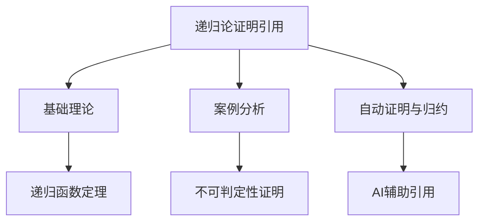

# 2.5.3 递归论相关证明与引用

[返回总览](../00-数学基础与逻辑总览.md)

## 2.5.3.1 重要证明与引用

// ... existing code ...

## 2.5.3.2 相关主题与本地跳转

- 详见 [00-数学基础与逻辑总览.md](../00-数学基础与逻辑总览.md) 2.5 递归论
- 相关主题：[01-基础理论.md](01-基础理论.md)、[02-案例分析.md](02-案例分析.md)

---

## 2.5.3.3 参考文献与资源

// ... existing code ...

## 2.5.3.4 多表征内容

- **Mermaid 结构图：递归论证明引用与主题关联**



- **Lean 代码示例：引用定理的复用（递归函数定理）**

```lean
-- 伪代码表达递归函数定理的引用
lemma fixed_point {f : ℕ → ℕ} : ∃ e, φ_e = φ_{f e} := sorry
```

- **表格：常见递归论证明引用类型对比**

| 引用类型     | 典型场景         | 主要作用         | 代表工具/语言 |
|--------------|------------------|------------------|---------------|
| 直接引用     | 递归定理复用     | 简化推理         | Lean, Coq     |
| 交叉引用     | 多分支证明       | 结构化知识       | Prover9       |
| 自动化引用   | 机器归约与证明   | 提高效率         | Prover9, AI   |

- **AI/认知/教育视角**
  - 递归论证明引用是自动化推理和知识图谱的核心机制。
  - 认知科学关注归纳与递归在知识迁移和结构化学习中的作用。
  - 教育中强调引用与交叉链接帮助学生建立系统性理解。

---

## 2.5.3.5 参考文献与资源

- **经典文献**
  1. Kleene, S. C. (1952). Introduction to metamathematics. North-Holland.
  2. Rogers, H. (1987). Theory of recursive functions and effective computability. MIT Press.

- **现代文献与在线资源**
  1. Soare, R. I. (2016). Turing computability: Theory and applications. Springer.
  2. [Lean 官方文档](https://leanprover.github.io/)
  3. [Prover9 官方文档](https://www.cs.unm.edu/~mccune/prover9/)

- **工具与平台**
  - Lean, Coq, Prover9, AI

---

[返回总览](00-递归论总览.md) | [基础理论](01-基础理论.md) | [案例分析](02-案例分析.md)
