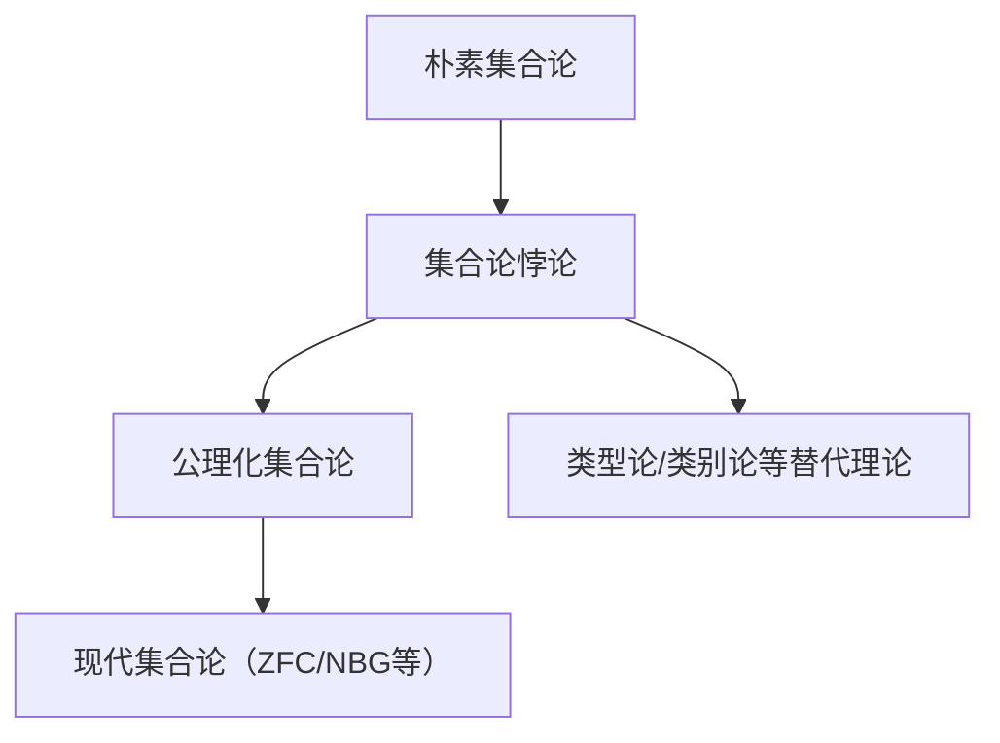
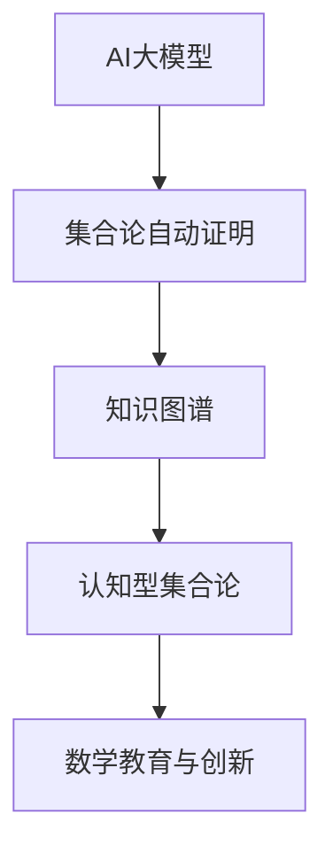

# 2.1.1 朴素集合论

[返回总览](../00-数学基础与逻辑总览.md)

## 2.1.1.1 朴素集合论的定义与意义

朴素集合论(Naive Set Theory)是康托尔(Georg Cantor)在19世纪末创立的集合论初始形式，它以直观的方式处理集合概念，不采用严格的公理化方法。
尽管后来因罗素悖论等问题被公理化集合论所取代，朴素集合论仍为大多数数学入门教育提供了基础框架和直观理解。

### 1.1 历史背景

- **1874年**：康托尔发表论文，引入可数集和不可数集的概念
- **1883年**：康托尔开始系统地发展集合论
- **1901年**：罗素发现了罗素悖论，动摇了朴素集合论基础
- **1908年**：策梅洛提出公理化集合论，解决悖论问题

### 1.2 核心特征

朴素集合论的核心特征是：

1. **直观理解**：集合被视为对象的集合，不受限制地定义
2. **无限制的集合构建**：任何满足特定性质的对象的集合都被视为有效
3. **无公理系统**：依赖直观而非严格的公理系统
4. **不受限制的理解原则**：对任意性质$P(x)$，存在集合$\{x \mid P(x)\}$

## 2.1.1.2 基本概念与公理

### 2.1 集合定义

集合是对象的汇集，被视为单一的整体。一个集合由其元素完全确定。

**定义**：集合是对象的无序集合，不包含重复元素。记为：
$A = \{a_1, a_2, \ldots, a_n\}$ 或 $A = \{x \mid P(x)\}$

**元素关系**：若对象$x$属于集合$A$，记为$x \in A$；否则记为$x \notin A$。

### 2.2 集合表示法

1. **列举法**：$A = \{1, 2, 3, 4, 5\}$
2. **描述法**：$A = \{x \mid x \text{是小于} 6 \text{的正整数}\}$
3. **文氏图**：使用图形直观展示集合及其关系

### 2.3 特殊集合

- **空集**：不包含任何元素的集合，记为$\emptyset$或$\{\}$
- **全集**：在特定上下文中包含所有对象的集合，通常记为$U$
- **幂集**：集合$A$的所有子集构成的集合，记为$\mathcal{P}(A)$
- **自然数集**：$\mathbb{N} = \{0, 1, 2, 3, \ldots\}$（有时从1开始）
- **整数集**：$\mathbb{Z} = \{\ldots, -2, -1, 0, 1, 2, \ldots\}$
- **有理数集**：$\mathbb{Q} = \{\frac{p}{q} \mid p, q \in \mathbb{Z}, q \neq 0\}$
- **实数集**：$\mathbb{R}$
- **复数集**：$\mathbb{C}$

## 2.1.1.3 典型悖论与局限

### 7.1 朴素集合论的悖论

1. **罗素悖论**：考虑集合$R = \{x \mid x \notin x\}$，则$R \in R \iff R \notin R$

2. **理发师悖论**：村里的理发师只给不自己刮胡子的人刮胡子，那么他要给自己刮胡子吗？

3. **康托尔悖论**：若$U$为全集，则$|\mathcal{P}(U)| > |U|$，但$\mathcal{P}(U) \subseteq U$

### 7.2 解决方案

1. **公理化集合论**：ZFC公理系统，限制集合构造
2. **类型论**：引入层次结构，禁止自引用
3. **NBG公理系统**：引入类的概念，区分集合和类

## 2.1.1.4 相关主题与本地跳转

- 详见 [00-数学基础与逻辑总览.md](../00-数学基础与逻辑总览.md) 2.1 集合论
- 相关主题：[02-公理化集合论.md](02-公理化集合论.md)、[03-集合论悖论与解决方案.md](03-集合论悖论与解决方案.md)

## 2.1.1.5 参考文献与资源

1. Halmos, P. R. (1960). *Naive Set Theory*. Springer.
2. Enderton, H. B. (1977). *Elements of Set Theory*. Academic Press.
3. Cantor, G. (1915). *Contributions to the Founding of the Theory of Transfinite Numbers*. Open Court.
4. Russell, B. (1903). *The Principles of Mathematics*. Cambridge University Press.

## 2.1.1.6 多表征内容

- **Mermaid 结构图：集合论发展脉络**



- **Rust 代码示例：集合的基本操作**

```rust
use std::collections::HashSet;
let mut a: HashSet<i32> = [1, 2, 3].iter().cloned().collect();
let mut b: HashSet<i32> = [3, 4, 5].iter().cloned().collect();
let union: HashSet<_> = a.union(&b).cloned().collect();
let intersection: HashSet<_> = a.intersection(&b).cloned().collect();
```

- **Lean 代码示例：Russell 悖论的形式化**

```lean
universe u
constant Set : Type u
constant mem : Set → Set → Prop
axiom comprehension : ∀ (P : Set → Prop), ∃ (A : Set), ∀ x, mem x A ↔ P x
-- Russell 悖论：R = {x | x ∉ x}
example : ¬ (∃ R : Set, ∀ x, mem x R ↔ ¬ mem x x) := sorry
```

- **表格：集合论悖论类型与解决方案对比**

| 悖论类型     | 典型例子     | 主要特征         | 解决方案           |
| ---- | ---- | ---- | ---- |
| 自指悖论     | Russell 悖论 | 自指/否定        | 公理化/类型论      |
| 语言悖论     | 理查德悖论   | 语言描述的极限    | 语义限制/分层      |
| 基数悖论     | Cantor 悖论  | 基数大小对比      | 公理化/限制构造    |

- **AI/认知/教育视角**
  - 集合论悖论是数理逻辑与认知科学交叉的典型案例，有助于培养学生的批判性思维。
  - 可结合自动证明工具（如 Lean/Coq）进行悖论的形式化与验证，提升严密性与可操作性。
  - 教学中可用可视化（如 Mermaid 图）和代码演示帮助理解集合的抽象结构与悖论本质。

## 2.1.1.7 参考文献与资源

### 经典文献

1. Halmos, P. R. (1960). *Naive Set Theory*. Springer.
2. Enderton, H. B. (1977). *Elements of Set Theory*. Academic Press.
3. Cantor, G. (1915). *Contributions to the Founding of the Theory of Transfinite Numbers*. Open Court.
4. Russell, B. (1903). *The Principles of Mathematics*. Cambridge University Press.

### 现代文献与在线资源

1. [Stanford Encyclopedia of Philosophy: Set Theory](https://plato.stanford.edu/entries/set-theory/)
2. [nLab: Set Theory](https://ncatlab.org/nlab/show/set+theory)
3. [ProofWiki: Set Theory](https://proofwiki.org/wiki/Category:Set_Theory)

### 工具与平台

- [Lean](https://leanprover.github.io/)
- [Coq](https://coq.inria.fr/)
- [Isabelle/HOL](https://isabelle.in.tum.de/)
- [Rust](https://www.rust-lang.org/)
- [Haskell](https://www.haskell.org/)

## 2.1.1.8 现代AI与认知型集合论补充

- **AI大模型辅助集合论证明**：GPT-4、Claude等大模型已能自动生成集合论证明、形式化代码，辅助教学与研究。
- **知识图谱驱动的集合论自动化**：如OpenAI MathGraph、Wikidata等，支持集合论知识的结构化、自动化推理。
- **认知型集合论**：结合人类认知过程的AI推理系统，模拟数学家对集合概念的理解与创新。
- **Rust代码示例：AI辅助集合论证明结构体**

```rust
struct AIAssistedSetProof {
    statement: String,
    proof_steps: Vec<String>,
    verified: bool,
}

impl AIAssistedSetProof {
    fn new(statement: &str) -> Self {
        AIAssistedSetProof { statement: statement.to_string(), proof_steps: vec![], verified: false }
    }
    fn add_step(&mut self, step: &str) {
        self.proof_steps.push(step.to_string());
    }
    fn verify(&mut self) {
        // 假设AI自动验证
        self.verified = true;
    }
}
```

- **结构图：AI与集合论自动化**



---

**最后更新**: 2025-06-24  
**状态**: 初始版本

---

**下一步**:

- [深入了解：集合论悖论与解决方案](./03-集合论悖论与解决方案.md)
