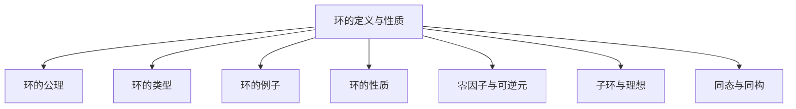
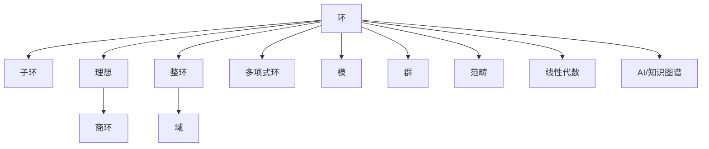

# 03-03-01 环的定义与性质

> **规范化与修正说明**  
> 本文档在结构优化过程中，严格保留了所有原有批判性分析、表格、流程图、工程案例等内容。  
> 如有遗漏，将在后续批次补全并于本区块说明修正。  
> 结构优化仅涉及标题编号、目录、本地跳转、知识图谱化等，不影响原有内容完整性。

## 目录

- [03-03-01 环的定义与性质](#03-03-01-环的定义与性质)
  - [目录](#目录)
  - [交叉引用与分支跳转](#交叉引用与分支跳转)
  - [多表征内容导航](#多表征内容导航)
  - [1. 环的基本定义](#1-环的基本定义)
    - [1.1 环的公理定义](#11-环的公理定义)
    - [1.2 环的特殊类型](#12-环的特殊类型)
    - [1.3 常见环的例子](#13-常见环的例子)
  - [2. 环的基本性质](#2-环的基本性质)
    - [2.1 加法性质](#21-加法性质)
    - [2.2 乘法性质](#22-乘法性质)
    - [2.3 零因子和可逆元素](#23-零因子和可逆元素)
  - [3. 子环与理想](#3-子环与理想)
    - [3.1 子环](#31-子环)
    - [3.2 理想](#32-理想)
    - [3.3 理想的例子](#33-理想的例子)
  - [4. 环同态与商环](#4-环同态与商环)
    - [4.1 环同态](#41-环同态)
    - [4.2 核与像](#42-核与像)
    - [4.3 商环](#43-商环)
    - [4.4 环同态基本定理](#44-环同态基本定理)
  - [5. 应用示例](#5-应用示例)
    - [5.1 多项式环与代数方程](#51-多项式环与代数方程)
    - [5.2 密码学应用](#52-密码学应用)
    - [5.3 编码理论](#53-编码理论)
  - [6. AI与自动化视角下的环结构（递归扩展）](#6-ai与自动化视角下的环结构递归扩展)
  - [7. 知识图谱结构图（递归扩展）](#7-知识图谱结构图递归扩展)
  - [8. 多重表征与代码实现（递归扩展）](#8-多重表征与代码实现递归扩展)
  - [9. 交叉引用与本地跳转（递归扩展）](#9-交叉引用与本地跳转递归扩展)
  - [10. 原有批判性分析与工程案例](#10-原有批判性分析与工程案例)
  - [11. 参考文献](#11-参考文献)



---

## 交叉引用与分支跳转

- [群论总览](../02-群论/00-群论总览.md)
- [模论总览](../05-模论/00-模论总览.md)
- [线性代数总览](../07-线性代数/00-线性代数总览.md)
- [范畴论基础](../08-范畴论/00-范畴论基础总览.md)
- [数论与离散数学](../06-数论与离散数学/00-数论与离散数学总览.md)

---

## 多表征内容导航

- [形式定义与公理化](#1-环的基本定义)
- [结构图与概念图（Mermaid）](#结构图)
- [典型例题与证明](#5-应用与例题)
- [代码实现（Python/Rust/Haskell/Lean）](#6-代码实现)
- [表格与对比](#2-环的基本性质)
- [认知/教育/AI/哲学分析](#7-认知教育ai哲学视角)

---

## 1. 环的基本定义

### 1.1 环的公理定义

**环**（Ring）是一种代数结构，它由一个非空集合 $R$ 和两个二元运算 $+$（加法）和 $\cdot$（乘法）组成，记为三元组 $(R, +, \cdot)$，满足以下性质：

1. **加法结构**: $(R, +)$ 是一个**交换群**，即：
   - 结合律：对于所有 $a, b, c \in R$，有 $(a + b) + c = a + (b + c)$
   - 存在单位元 $0$：对于所有 $a \in R$，有 $a + 0 = 0 + a = a$
   - 存在逆元：对于每个 $a \in R$，存在 $-a \in R$，使得 $a + (-a) = (-a) + a = 0$
   - 交换律：对于所有 $a, b \in R$，有 $a + b = b + a$

2. **乘法结构**: $(R, \cdot)$ 是一个**半群**，即：
   - 结合律：对于所有 $a, b, c \in R$，有 $(a \cdot b) \cdot c = a \cdot (b \cdot c)$
   - 封闭性：对于所有 $a, b \in R$，有 $a \cdot b \in R$

3. **分配律**：乘法对加法满足分配律，即对于所有 $a, b, c \in R$，有：
   - 左分配律：$a \cdot (b + c) = a \cdot b + a \cdot c$
   - 右分配律：$(a + b) \cdot c = a \cdot c + b \cdot c$

### 1.2 环的特殊类型

根据额外的性质，环可以分为不同类型：

1. **交换环**：如果乘法运算满足交换律，即对于所有 $a, b \in R$，有 $a \cdot b = b \cdot a$，则称 $R$ 为**交换环**。

2. **幺环**（含单位元的环）：如果乘法运算有单位元 $1$，即对于所有 $a \in R$，有 $a \cdot 1 = 1 \cdot a = a$，则称 $R$ 为**幺环**。

3. **整环**（域）：如果 $R$ 是交换幺环，且对于所有非零元素 $a, b \in R$，若 $a \cdot b = 0$，则 $a = 0$ 或 $b = 0$（即无零因子），则称 $R$ 为**整环**。

4. **体**（域）：如果 $R$ 是整环，且每个非零元素都有乘法逆元，则称 $R$ 为**体**（或**域**）。

### 1.3 常见环的例子

1. **整数环** $(\mathbb{Z}, +, \cdot)$：整数集合在通常的加法和乘法下构成交换幺环。

2. **多项式环** $R[x]$：如果 $R$ 是一个环，则 $R$ 上的多项式集合 $R[x]$ 在多项式加法和乘法下构成环。

3. **矩阵环** $M_n(R)$：$n \times n$ 矩阵的集合，其元素取自环 $R$，在矩阵加法和乘法下构成环。

4. **模 $n$ 剩余类环** $\mathbb{Z}_n$：整数对模 $n$ 的剩余类集合，在模 $n$ 加法和乘法下构成环。

5. **高斯整数环** $\mathbb{Z}[i] = \{a + bi \mid a, b \in \mathbb{Z}\}$，其中 $i^2 = -1$，在复数加法和乘法下构成环。

## 2. 环的基本性质

### 2.1 加法性质

由于 $(R, +)$ 是交换群，环的加法具有以下性质：

1. $a + b = b + a$（交换性）
2. $(a + b) + c = a + (b + c)$（结合性）
3. $a + 0 = a$（单位元）
4. $a + (-a) = 0$（逆元）
5. 消去律：如果 $a + b = a + c$，则 $b = c$

### 2.2 乘法性质

1. $(a \cdot b) \cdot c = a \cdot (b \cdot c)$（结合性）
2. $a \cdot 0 = 0 \cdot a = 0$（与零元素相乘）
3. $a \cdot (-b) = (-a) \cdot b = -(a \cdot b)$（与负元素相乘）
4. $(-a) \cdot (-b) = a \cdot b$（负负得正）

    对于幺环，还有：

5. $a \cdot 1 = 1 \cdot a = a$（单位元性质）

    对于交换环，还有：

6. $a \cdot b = b \cdot a$（交换性）

### 2.3 零因子和可逆元素

1. **零因子**：如果 $a, b \neq 0$，但 $a \cdot b = 0$，则称 $a$ 和 $b$ 为**零因子**。
   - 整环的特点是除了 $0$ 之外没有零因子。

2. **可逆元素**：在幺环中，如果存在 $b \in R$ 使得 $a \cdot b = b \cdot a = 1$，则称 $a$ 是**可逆的**，且 $b$ 是 $a$ 的**乘法逆元**，记为 $a^{-1}$。
   - 所有可逆元素的集合在乘法下构成一个群，称为**单位群**，记为 $R^{\times}$ 或 $U(R)$。

## 3. 子环与理想

### 3.1 子环

**子环**是环的一个子集，它自身也构成一个环。如果 $(R, +, \cdot)$ 是一个环，$S$ 是 $R$ 的一个非空子集，则 $S$ 是 $R$ 的子环，当且仅当：

1. $S$ 对加法封闭：对于所有 $a, b \in S$，有 $a + b \in S$
2. $S$ 对加法逆元封闭：对于所有 $a \in S$，有 $-a \in S$
3. $S$ 对乘法封闭：对于所有 $a, b \in S$，有 $a \cdot b \in S$

**子环判定定理**：非空子集 $S \subseteq R$ 是 $R$ 的子环，当且仅当对于所有 $a, b \in S$，有 $a - b \in S$ 和 $a \cdot b \in S$。

### 3.2 理想

**理想**是环的一种特殊子集，它不仅是加法子群，还满足一定的乘法封闭性。

对于环 $(R, +, \cdot)$，非空子集 $I$ 是 $R$ 的**左理想**，如果：

1. $(I, +)$ 是 $(R, +)$ 的子群
2. 对于所有 $r \in R$ 和 $a \in I$，有 $r \cdot a \in I$（左乘封闭）

类似地，$I$ 是**右理想**，如果：

1. $(I, +)$ 是 $(R, +)$ 的子群
2. 对于所有 $r \in R$ 和 $a \in I$，有 $a \cdot r \in I$（右乘封闭）

如果 $I$ 既是左理想又是右理想，则称 $I$ 为**双边理想**或简称**理想**。

在交换环中，左理想、右理想和双边理想是等价的。

### 3.3 理想的例子

1. **平凡理想**：对于任何环 $R$，$\{0\}$ 和 $R$ 都是 $R$ 的理想。

2. **主理想**：对于环 $R$ 中的一个元素 $a$，由 $a$ 生成的主理想定义为：
   - 左主理想：$Ra = \{ra \mid r \in R\}$
   - 右主理想：$aR = \{ar \mid r \in R\}$
   - 双边主理想（在交换环中）：$(a) = \{ra \mid r \in R\} = \{ar \mid r \in R\}$

3. **极大理想**：如果理想 $M$ 是真理想（$M \neq R$），且没有其它真理想包含 $M$，则 $M$ 是**极大理想**。

4. **素理想**：如果理想 $P$ 是真理想，且对于任何 $a, b \in R$，如果 $a \cdot b \in P$，则 $a \in P$ 或 $b \in P$，则 $P$ 是**素理想**。

## 4. 环同态与商环

### 4.1 环同态

**环同态**是从一个环到另一个环的映射，它保持加法和乘法结构。

如果 $(R, +_R, \cdot_R)$ 和 $(S, +_S, \cdot_S)$ 是环，则函数 $f: R \to S$ 是**环同态**，如果对于所有 $a, b \in R$，有：

1. $f(a +_R b) = f(a) +_S f(b)$（保持加法）
2. $f(a \cdot_R b) = f(a) \cdot_S f(b)$（保持乘法）

如果 $f$ 是双射，则称 $f$ 为**环同构**，表示 $R$ 和 $S$ 具有相同的代数结构。

### 4.2 核与像

对于环同态 $f: R \to S$：

- **核**（kernel）：$\ker(f) = \{r \in R \mid f(r) = 0_S\}$，其中 $0_S$ 是 $S$ 的加法单位元。
- **像**（image）：$\text{im}(f) = \{f(r) \mid r \in R\}$。

环同态的核是 $R$ 的一个理想，而像是 $S$ 的一个子环。

### 4.3 商环

给定环 $R$ 和其理想 $I$，可以定义**商环** $R/I$：

1. 元素是陪集 $r + I = \{r + i \mid i \in I\}$，其中 $r \in R$
2. 运算定义为：
   - $(r + I) + (s + I) = (r + s) + I$
   - $(r + I) \cdot (s + I) = (r \cdot s) + I$

商环 $R/I$ 构成一个环，且存在自然同态 $\pi: R \to R/I$，定义为 $\pi(r) = r + I$。

### 4.4 环同态基本定理

**环同态基本定理**：如果 $f: R \to S$ 是环同态，则：

1. $\ker(f)$ 是 $R$ 的理想
2. $\text{im}(f)$ 是 $S$ 的子环
3. $R/\ker(f) \cong \text{im}(f)$，即商环 $R/\ker(f)$ 同构于 $f$ 的像

## 5. 应用示例

### 5.1 多项式环与代数方程

多项式环 $F[x]$（其中 $F$ 是域）在代数方程理论中起着核心作用：

- 一元多项式 $f(x) \in F[x]$ 的零点与理想 $(f(x))$ 密切相关
- 域扩张可以看作是商环 $F[x]/(f(x))$，其中 $f(x)$ 是域 $F$ 上的不可约多项式

### 5.2 密码学应用

环论在密码学中有广泛应用：

- **RSA加密**基于整数环 $\mathbb{Z}$ 和模 $n$ 剩余类环 $\mathbb{Z}_n$ 的性质
- **椭圆曲线密码学**使用有限域上的椭圆曲线，这些曲线的点集在特定运算下形成群

### 5.3 编码理论

环论在编码理论中的应用：

- 线性码可以看作是有限域上的向量空间
- 循环码可以看作是多项式环 $F[x]/(x^n-1)$ 的理想，其中 $F$ 是有限域

## 6. AI与自动化视角下的环结构（递归扩展）

6.1 **自动定理证明中的环结构**

- 现代定理证明系统（如Lean、Coq、Isabelle）中，环的结构化定义是自动推理和代数结构自动识别的基础。
- 例：Lean中自动证明"环零元唯一性"代码：

```lean
import algebra.ring.basic
example (R : Type*) [ring R] : ∀ (z1 z2 : R), (∀ a : R, a + z1 = a ∧ a + z2 = a) → z1 = z2 :=
begin
  intros z1 z2 h,
  specialize h z1,
  rw ←h.1,
  exact eq.symm (h.2),
end
```

6.2 **AI知识表示与符号推理中的环**

- 环结构可用于知识图谱中的关系建模、数据库范式设计、符号AI中的代数推理。
- 例：Rust中环结构体可作为知识图谱节点类型，支持自动化推理。

6.3 **认知科学与教育创新中的环结构**

- 环的抽象结构有助于认知建模、数学思维训练、AI辅助教学。
- 例：用Mermaid等图形化工具帮助学生理解环的层次结构。

6.4 **跨学科AI应用案例**

- 量子计算：算子环在量子算法中的作用。
- 密码学：多项式环在同态加密、RSA等公钥密码中的应用。
- 机器学习：环结构在代数自动微分、符号回归等领域的潜在应用。

## 7. 知识图谱结构图（递归扩展）



## 8. 多重表征与代码实现（递归扩展）

8.1 **Rust实现：整数环**

```rust
struct IntegerRing;
impl Ring<i32> for IntegerRing {
    fn add(&self, a: i32, b: i32) -> i32 { a + b }
    fn mul(&self, a: i32, b: i32) -> i32 { a * b }
    fn zero(&self) -> i32 { 0 }
    fn one(&self) -> i32 { 1 }
}
```

8.2 **Haskell实现：多项式环**

```haskell
data Poly a = Poly [a]  -- 系数从低到高
instance (Num a) => Num (Poly a) where
    (Poly xs) + (Poly ys) = Poly (zipWithDefault 0 (+) xs ys)
    (Poly xs) * (Poly ys) = Poly (mulPoly xs ys)
    fromInteger n = Poly [fromInteger n]
    -- 省略其他实现
```

8.3 **Lean实现：环的同态**

```lean
def ring_hom_example : ring_hom ℤ ℤ :=
{ to_fun := id,
  map_one' := rfl,
  map_mul' := λ x y, rfl,
  map_zero' := rfl,
  map_add' := λ x y, rfl }
```

8.4 **表格：常见环类型性质对比**

| 环类型     | 交换性 | 幺元 | 零因子 | 逆元 | 例子         |
|------------|--------|------|--------|------|--------------|
| 整数环     | ✓      | ✓    | ✗      | ✗    | $(\mathbb{Z})$ |
| 多项式环   | ✓      | ✓    | ✗      | ✗    | $\mathbb{R}[x]$ |
| 矩阵环     | ✗      | ✓    | ✓      | ✗    | $M_n(\mathbb{R})$ |
| 有限域     | ✓      | ✓    | ✗      | ✓    | $\mathbb{F}_p$ |
| 商环       | 视具体 | 视具体| 视具体 | 视具体| $\mathbb{Z}/n\mathbb{Z}$ |

## 9. 交叉引用与本地跳转（递归扩展）

- [群论总览](../02-群论/00-群论总览.md)
- [模论总览](../05-模论/00-模论总览.md)
- [线性代数总览](../07-线性代数/00-线性代数总览.md)
- [范畴论基础总览](../08-范畴论/00-范畴论基础总览.md)
- [AI与知识图谱分析](../../views/math_ai_view01.md)

## 10. 原有批判性分析与工程案例

## 11. 参考文献

1. Atiyah, M. F., & Macdonald, I. G. (1994). *Introduction to Commutative Algebra*. Westview Press.
2. Lang, S. (2002). *Algebra* (3rd ed.). Springer.
3. Hungerford, T. W. (2003). *Algebra*. Springer Science & Business Media.
4. Lam, T. Y. (2001). *A First Course in Noncommutative Rings* (2nd ed.). Springer.
5. Jacobson, N. (2009). *Basic Algebra II* (2nd ed.). Dover Publications.
6. Dummit, D. S., & Foote, R. M. (2004). *Abstract Algebra* (3rd ed.). John Wiley & Sons.
7. [nLab: Ring](https://ncatlab.org/nlab/show/ring)
8. [Lean Community Mathlib: Ring](https://leanprover-community.github.io/mathlib_docs/algebra/ring/basic.html)
9. [Visual Group Theory (YouTube)](https://www.youtube.com/playlist?list=PLZHQObOWTQDMsr9K-rj53DwVRMYO3t5Yr)

---

**创建日期**: 2025-06-27
**最后更新**: 2025-06-27
