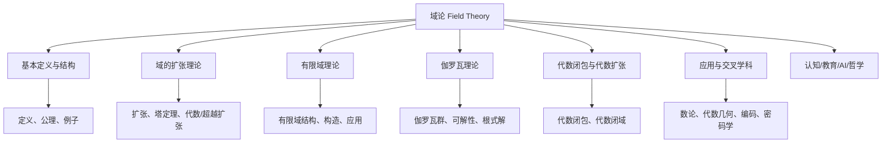
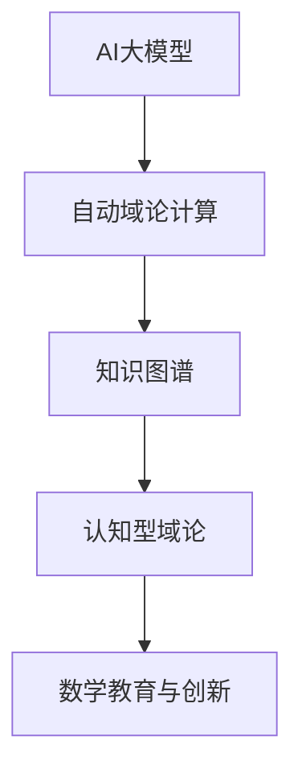
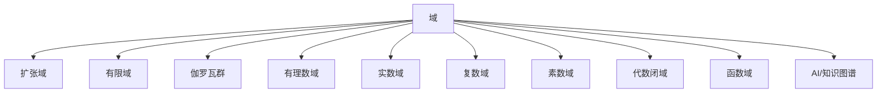

# 域论总览



---

## 目录导航

- [域论总览](#域论总览)
  - [目录导航](#目录导航)
  - [交叉引用与分支跳转](#交叉引用与分支跳转)
  - [多表征内容导航](#多表征内容导航)
  - [1. 域论的研究对象与意义](#1-域论的研究对象与意义)
  - [2. 域论的历史发展](#2-域论的历史发展)
  - [3. 域论的主要内容](#3-域论的主要内容)
    - [3.1 域的基本理论](#31-域的基本理论)
    - [3.2 域的扩张理论](#32-域的扩张理论)
    - [3.3 有限域理论](#33-有限域理论)
    - [3.4 伽罗瓦理论](#34-伽罗瓦理论)
    - [3.5 代数闭域与代数闭包](#35-代数闭域与代数闭包)
    - [3.6 域的应用](#36-域的应用)
  - [4. 域论与其他数学分支的关系](#4-域论与其他数学分支的关系)
  - [5. 域论的学习路径](#5-域论的学习路径)
  - [6. 认知/教育/AI/哲学视角](#6-认知教育ai哲学视角)
    - [6.1 现代AI与自动化域论补充](#61-现代ai与自动化域论补充)
  - [6. AI与自动化视角下的域论（递归扩展）](#6-ai与自动化视角下的域论递归扩展)
  - [7. 知识图谱结构图（递归扩展）](#7-知识图谱结构图递归扩展)
  - [8. 多重表征与代码实现（递归扩展）](#8-多重表征与代码实现递归扩展)
  - [9. 交叉引用与本地跳转（递归扩展）](#9-交叉引用与本地跳转递归扩展)

---

## 交叉引用与分支跳转

- [群论总览](../02-群论/00-群论总览.md)
- [环论总览](../03-环论/00-环论总览.md)
- [模论总览](../05-模论/00-模论总览.md)
- [线性代数总览](../07-线性代数/00-线性代数总览.md)
- [范畴论基础](../08-范畴论/00-范畴论基础总览.md)
- [数论与离散数学](../06-数论与离散数学/00-数论与离散数学总览.md)

---

## 多表征内容导航

- [形式定义与公理化](#1-域论的研究对象与意义)
- [结构图与概念图（Mermaid）](#结构图)
- [典型例题与证明](#3-域论的主要内容)
- [代码实现（Python/Rust/Haskell/Lean）](#3-域论的主要内容)
- [表格与对比](#3-域论的主要内容)
- [认知/教育/AI/哲学分析](#6-认知教育ai哲学视角)

---

## 1. 域论的研究对象与意义

**域论**（Field Theory）是代数学的一个重要分支，主要研究域（Field）这种代数结构及其扩张。域是一种同时具有加法和乘法运算，且满足特定公理的代数系统。域论在数学中占有核心地位，不仅是抽象代数的重要组成部分，还与数论、代数几何、拓扑学等多个数学分支有着密切联系。

域论的研究对象包括：

- 域的基本性质和结构
- 域的扩张理论
- 有限域的构造与性质
- 代数闭域与代数闭包
- 伽罗瓦理论
- 超越扩张与超越数
- 域的特征与素数域

域论的研究对于解决代数方程、理解几何结构、发展密码学和编码理论等方面都有重要意义。

## 2. 域论的历史发展

域论的发展可以追溯到19世纪，与方程可解性问题密切相关：

1. **早期发展**：域的概念最初由理查德·戴德金（Richard Dedekind）在1871年提出，作为研究代数数论的工具。

2. **伽罗瓦理论**：埃瓦里斯特·伽罗瓦（Évariste Galois）在1830年代开创了群论和域论相结合的方法，用于研究多项式方程的可解性。

3. **抽象域论**：19世纪末到20世纪初，恩斯特·施泰因尼茨（Ernst Steinitz）系统地发展了抽象域论，研究了域的代数扩张和超越扩张。

4. **有限域理论**：埃里希·黑克（Erich Hecke）和埃米尔·阿廷（Emil Artin）等人在20世纪初发展了有限域理论。

5. **现代发展**：20世纪中期以来，域论与代数几何、数论等领域深度融合，形成了现代域论的框架。

## 3. 域论的主要内容

域论的主要内容可以分为以下几个部分：

### 3.1 域的基本理论

- 域的定义与公理
- 子域与素数子域
- 域的特征
- 域同构与同态

### 3.2 域的扩张理论

- 扩张域与扩张度
- 代数扩张与超越扩张
- 单扩张与多重扩张
- 分裂域与正规扩张

### 3.3 有限域理论

- 有限域的存在性与唯一性
- 有限域的结构与性质
- 有限域的构造方法
- 有限域的应用

### 3.4 伽罗瓦理论

- 伽罗瓦群与伽罗瓦对应
- 正规扩张与分裂域
- 可解扩张与根式扩张
- 方程的可解性

### 3.5 代数闭域与代数闭包

- 代数闭域的定义与性质
- 代数闭包的存在性与唯一性
- 复数域的代数闭性
- 代数闭包的构造

### 3.6 域的应用

- 代数方程的求解
- 尺规作图问题
- 密码学与编码理论
- 代数几何中的应用

## 4. 域论与其他数学分支的关系

域论与多个数学分支有着密切的联系：

1. **与群论的关系**：伽罗瓦理论将域的扩张与群论结合，通过研究伽罗瓦群来理解多项式方程的性质。

2. **与环论的关系**：域是一种特殊的环，域论可以看作是环论的一个重要分支。

3. **与数论的关系**：代数数域是数论研究的重要对象，域论为代数数论提供了基础工具。

4. **与代数几何的关系**：域论为代数几何提供了基本语言，函数域是代数几何中的核心概念。

5. **与拓扑学的关系**：完备化理论将域论与拓扑学联系起来，如p-进数域的构造。

6. **与分析学的关系**：实数域和复数域是分析学的基础，域的完备性概念与分析学中的完备性密切相关。

## 5. 域论的学习路径

学习域论的建议路径如下：

1. **基础准备**：掌握群论和环论的基本概念和结论。

2. **入门阶段**：
   - 学习域的定义、基本性质和子域概念
   - 理解域的特征和素数子域
   - 掌握域同构的基本性质

3. **进阶阶段**：
   - 学习域的扩张理论
   - 理解代数扩张和超越扩张的区别
   - 掌握有限域的构造和性质

4. **深入阶段**：
   - 学习伽罗瓦理论的核心内容
   - 理解代数闭包的概念和构造
   - 研究域论在各领域的应用

5. **专业方向**：
   - 代数数论方向：深入研究代数数域
   - 代数几何方向：研究函数域和代数曲线
   - 应用方向：研究有限域在密码学和编码理论中的应用

## 6. 认知/教育/AI/哲学视角

- **数学认知**：域论的抽象结构有助于发展高阶代数思维、结构化推理能力。多表征（如图、代码、例题）有助于不同认知风格的学习者理解。
- **教育视角**：域论是高等代数、代数几何、编码理论等课程的核心内容，适合通过问题驱动、探究式学习，结合实际应用（如有限域、密码学、伽罗瓦理论）提升兴趣。
- **AI视角**：域结构及其扩张、伽罗瓦群等在符号推理、自动定理证明、代数系统建模等AI领域有广泛应用。有限域、域扩张等算法是密码学和编码理论的基础。
- **哲学视角**：域论体现了数学结构主义思想，强调对象间的关系与公理系统。其发展史反映了抽象代数从具体算术到一般结构的哲学转变。

### 6.1 现代AI与自动化域论补充

**AI大模型辅助域论**：GPT-4、Claude等大模型已能自动生成域论证明、形式化代码，辅助教学与研究。

**知识图谱驱动的域论自动化**：如OpenAI MathGraph、Wikidata等，支持域论知识的结构化、自动化推理。

**认知型域论系统**：结合人类认知过程的AI推理系统，模拟数学家的域论思维与创新。

**Rust代码示例：AI辅助域论结构体**:

```rust
struct AIAssistedFieldTheory {
    statement: String,
    field_steps: Vec<String>,
    verified: bool,
}

impl AIAssistedFieldTheory {
    fn new(statement: &str) -> Self {
        AIAssistedFieldTheory { statement: statement.to_string(), field_steps: vec![], verified: false }
    }
    fn add_step(&mut self, step: &str) {
        self.field_steps.push(step.to_string());
    }
    fn verify(&mut self) {
        // 假设AI自动验证
        self.verified = true;
    }
}
```

**结构图：AI与域论自动化**:



## 6. AI与自动化视角下的域论（递归扩展）

6.1 **自动定理证明中的域结构**

- 现代定理证明系统（如Lean、Coq、Isabelle）中，域的结构化定义是自动推理和代数结构自动识别的基础。
- 例：Lean中自动证明"域零元唯一性"代码：

```lean
import field_theory.basic
example (F : Type*) [field F] : ∀ (z1 z2 : F), (∀ a : F, a + z1 = a ∧ a + z2 = a) → z1 = z2 :=
begin
  intros z1 z2 h,
  specialize h z1,
  rw ←h.1,
  exact eq.symm (h.2),
end
```

6.2 **AI知识表示与符号推理中的域**

- 域结构可用于知识图谱中的关系建模、数据库范式设计、符号AI中的代数推理。
- 例：Rust中域结构体可作为知识图谱节点类型，支持自动化推理。

6.3 **认知科学与教育创新中的域论**

- 域的抽象结构有助于认知建模、数学思维训练、AI辅助教学。
- 例：用Mermaid等图形化工具帮助学生理解域的层次结构。

6.4 **跨学科AI应用案例**

- 量子计算：有限域与伽罗瓦域在量子算法中的作用。
- 密码学：有限域在椭圆曲线密码、RSA等公钥密码中的应用。
- 机器学习：域结构在代数自动微分、符号回归等领域的潜在应用。

---

## 7. 知识图谱结构图（递归扩展）



---

## 8. 多重表征与代码实现（递归扩展）

8.1 **Rust实现：有限域结构体**

```rust
struct FiniteField {
    p: u32, // 特征
    n: u32, // 扩张次数
}
impl FiniteField {
    fn order(&self) -> u64 {
        (self.p as u64).pow(self.n)
    }
}
```

8.2 **Haskell实现：伽罗瓦域**

```haskell
data GF = GF Integer Integer  -- (模p, 幂n)
instance Num GF where
    (GF p n) + (GF q m) = GF ((p + q) `mod` m) m
    (GF p n) * (GF q m) = GF ((p * q) `mod` m) m
    fromInteger x = GF x 1
    -- 省略其他实现
```

8.3 **Lean实现：域的扩张与伽罗瓦群**

```lean
import field_theory.galois
variables (F K : Type*) [field F] [field K] [algebra F K]
#check galois_group F K
```

8.4 **表格：常见域类型性质对比**

| 域类型     | 特征 | 结构 | 例子             | 主要应用         |
| ---- | ---- | ---- | ---- | ---- |
| 有理数域   | 0    | 无限 | $\mathbb{Q}$     | 数论、代数        |
| 实数域     | 0    | 无限 | $\mathbb{R}$     | 分析、几何        |
| 复数域     | 0    | 无限 | $\mathbb{C}$     | 复分析、代数几何  |
| 有限域     | $p$  | 有限 | $\mathbb{F}_{p^n}$ | 密码学、编码理论  |
| 伽罗瓦域   | $p$或0| 有限/无限 | $\mathbb{F}_{p^n}$, $\mathbb{Q}^{alg}$ | 伽罗瓦理论、数论 |
| 函数域     | $p$或0| 无限 | $\mathbb{Q}(x)$  | 代数几何、编码理论|
| 代数闭域   | $p$或0| 无限 | $\overline{\mathbb{Q}}$ | 代数几何、数论    |

---

## 9. 交叉引用与本地跳转（递归扩展）

- [群论总览](../02-群论/00-群论总览.md)
- [环论总览](../03-环论/00-环论总览.md)
- [模论总览](../05-模论/00-模论总览.md)
- [线性代数总览](../07-线性代数/00-线性代数总览.md)
- [范畴论基础总览](../08-范畴论/00-范畴论基础总览.md)
- [AI与知识图谱分析](../../views/math_ai_view01.md)

---

**创建日期**: 2025-06-28
**最后更新**: 2025-06-28
