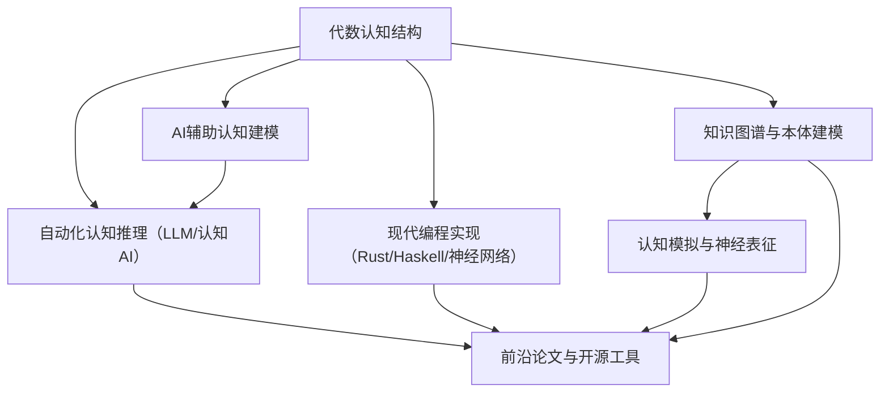

# 00-代数认知结构总览

## 目录

- [00-代数认知结构总览](#00-代数认知结构总览)
  - [目录](#目录)
  - [1. 代数认知结构简介](#1-代数认知结构简介)
    - [1.1 研究目标](#11-研究目标)
    - [1.2 跨学科性质](#12-跨学科性质)
  - [2. 本目录内容](#2-本目录内容)
  - [3. 核心理论框架](#3-核心理论框架)
  - [4. 代数概念的认知表征](#4-代数概念的认知表征)
    - [4.1 心智模型与图式](#41-心智模型与图式)
    - [4.2 抽象化与类比过程](#42-抽象化与类比过程)
  - [5. 代数与软件编程的映射关系](#5-代数与软件编程的映射关系)
    - [5.1 语言设计](#51-语言设计)
    - [5.2 软件架构](#52-软件架构)
  - [6. 形式化系统与认知限制](#6-形式化系统与认知限制)
    - [6.1 形式系统边界](#61-形式系统边界)
    - [6.2 概念演化](#62-概念演化)
  - [7. 教育与认知发展](#7-教育与认知发展)
  - [8. 研究方法](#8-研究方法)
  - [9. 未来研究方向](#9-未来研究方向)
  - [10. 参考文献](#10-参考文献)
  - [11. 代数认知结构的现代AI与自动化前沿](#11-代数认知结构的现代ai与自动化前沿)
    - [11.1 AI辅助认知结构建模与自动化推理](#111-ai辅助认知结构建模与自动化推理)
    - [11.2 代数认知结构的知识图谱与认知模拟](#112-代数认知结构的知识图谱与认知模拟)
    - [11.3 现代编程语言与神经网络中的认知结构实现](#113-现代编程语言与神经网络中的认知结构实现)
    - [11.4 前沿论文、工具与开源项目](#114-前沿论文工具与开源项目)

## 1. 代数认知结构简介

代数认知结构是一个跨学科领域，融合了代数学、认知科学、计算机科学和哲学等多个学科的视角。
它不仅研究人类如何理解和形成代数概念，更进一步提出了一个深刻的论点：**人类的认知过程本身就具有深刻的代数和范畴论结构**。

这个领域旨在将思维的核心操作（如组合、变换、比较、抽象）与代数系统（如群、格、范畴）进行形式化的类比和映射，从而为理解抽象思维的本质提供一个全新的、结构化的框架。

### 1.1 研究目标

代数认知结构研究的核心目标包括：

1. **认知映射**：探索人类大脑如何表征和处理抽象代数概念
2. **概念形成**：研究代数概念的形成、演化和内化过程
3. **思维模式**：分析代数思维的特点及其与其他思维方式的区别
4. **应用转化**：将代数认知模型应用于软件系统设计和人工智能
5. **教学改进**：基于认知理论改进代数教学方法

### 1.2 跨学科性质

代数认知结构具有显著的跨学科特性：

- **数学基础**：来自抽象代数、范畴论的形式系统和结构
- **认知科学**：来自认知心理学和神经科学的实证研究
- **计算模型**：来自计算机科学的形式化模型和算法
- **哲学视角**：来自数学哲学和认识论的批判性分析
- **教育应用**：与数学教育学的理论和实践相结合

## 2. 本目录内容

本目录包含以下代数认知结构主题的详细探讨：

| 文件 | 主题 | 描述 |
|------|------|------|
| [01-代数概念形成.md](./01-代数概念形成.md) | 概念认知 | 探讨代数概念的形成过程，并提出将认知本身建模为代数与范畴论系统的深刻视角。 |
| [02-代数与软件编程关联.md](./02-代数与软件编程关联.md) | 编程联系 | 代数结构在软件设计中的映射 |
| [03-代数形式化思维.md](./03-代数形式化思维.md) | 思维模式 | 代数思维的特点与认知过程 |
| [04-代数元理论分析.md](./04-代数元理论分析.md) | 元理论 | 代数理论的哲学与认识论基础 |

## 3. 核心理论框架

代数认知结构的理论框架可以概括为以下几个相互关联的层面。
其最核心的观点是，认知操作层本身就是一个代数系统。

```text
代数认知结构
├── 认知操作层 (作为核心代数系统)
│   ├── 抽象化 (函子)
│   ├── 结构映射 (同态)
│   ├── 类比推理 (自然变换)
│   └── 概念组合/变换 (群、格)
├── 概念表征层
│   ├── 心智模型
│   ├── 认知图式
│   ├── 概念隐喻
│   └── 神经表征
├── 应用转化层
│   ├── 软件设计模式
│   ├── 编程语言范式
│   ├── 形式验证
│   └── 知识表示
└── 元认知层
    ├── 反思性思维
    ├── 认识论基础
    ├── 形式系统边界
    └── 概念演化
```

## 4. 代数概念的认知表征

### 4.1 心智模型与图式

代数概念在人类认知中以特殊的方式被表征和组织：

1. **心智模型**：内部表征代数结构的心理构造
2. **认知图式**：组织和连接代数概念的认知框架
3. **概念隐喻**：通过具体经验理解抽象代数概念的认知机制
4. **神经基础**：代数思维的神经网络基础

### 4.2 抽象化与类比过程

代数思维的形成涉及复杂的认知过程：

1. **抽象化**：从具体实例抽取共同结构的过程
2. **结构映射**：识别和利用不同领域间结构对应关系的能力
3. **类比推理**：利用已知结构理解新概念的认知策略
4. **符号操作**：利用代数符号系统进行形式推导的能力

## 5. 代数与软件编程的映射关系

### 5.1 语言设计

代数结构与编程语言设计有深刻联系：

1. **类型系统**：代数数据类型与范畴论的关系
2. **函数式编程**：Lambda演算与组合子代数的联系
3. **对象范式**：面向对象设计与代数结构的对应
4. **并发模型**：进程代数与并发计算的形式化

### 5.2 软件架构

代数思维对软件架构设计的影响：

1. **组件组合**：代数合成原理在软件组件设计中的应用
2. **变换架构**：数据流与函数组合的代数模型
3. **设计模式**：抽象代数结构在设计模式中的体现
4. **形式验证**：代数规范与软件正确性证明

## 6. 形式化系统与认知限制

### 6.1 形式系统边界

探讨形式化数学系统与人类认知能力的关系：

1. **哥德尔不完备性**：形式系统的内在限制及其认知意义
2. **直觉与形式**：数学直觉与形式系统的互补关系
3. **可计算性边界**：算法思维与数学认知的界限

### 6.2 概念演化

代数概念如何随时间演化：

1. **历史演变**：代数概念在数学史上的演化过程
2. **概念拓展**：从具体计算到抽象结构的概念扩展
3. **范式转换**：代数思维中的重大范式转换

## 7. 教育与认知发展

代数认知结构研究对数学教育的启示：

1. **概念学习序列**：基于认知发展的最优学习路径
2. **认知障碍**：学习代数时常见的认知障碍及其克服
3. **表征转换**：在不同表征系统间转换的教学策略
4. **元认知培养**：发展数学反思能力的方法

## 8. 研究方法

代数认知结构研究采用多种方法：

1. **认知实验**：设计实验测试代数概念理解
2. **计算模型**：构建认知过程的计算模型
3. **神经成像**：研究代数思维的神经基础
4. **哲学分析**：对代数概念本质的深入探讨
5. **教学实践**：在教学中验证理论模型

## 9. 未来研究方向

代数认知结构研究的前沿方向：

1. **认知计算模型**：更精确的代数思维计算模型
2. **神经科学视角**：代数思维的神经机制深入研究
3. **AI与代数思维**：人工智能系统中的代数思维模拟
4. **跨文化研究**：不同文化背景下代数认知的比较研究
5. **个体差异**：代数思维能力的个体差异及其原因

## 10. 参考文献

1. Lakoff, G., & Núñez, R. E. (2000). *Where Mathematics Comes From: How the Embodied Mind Brings Mathematics into Being*. Basic Books.
2. Pierce, B. C. (2002). *Types and Programming Languages*. MIT Press.
3. Hofstadter, D. R. (1979). *Gödel, Escher, Bach: An Eternal Golden Braid*. Basic Books.
4. Tall, D. (2013). *How Humans Learn to Think Mathematically*. Cambridge University Press.
5. Barendregt, H. P. (1984). *The Lambda Calculus: Its Syntax and Semantics*. North-Holland.

## 11. 代数认知结构的现代AI与自动化前沿

### 11.1 AI辅助认知结构建模与自动化推理

- 利用大语言模型（如GPT-4/认知AI）自动生成代数认知结构、认知操作、心智模型等的形式化描述与推理。
- 结合自动化认知推理系统，实现认知过程的自动建模、类比推理与认知障碍检测。
- 典型应用：认知结构自动抽取、认知过程自动化分析、认知型AI系统设计。

**伪代码示例：认知结构自动抽取流程**

```python
# 输入：认知过程文本、交互日志等
# 输出：结构化的代数认知图谱
from llm_cognitive_extractor import extract_cognitive_structures

text = "学生在解方程时先进行未知数隔离，然后应用逆运算..."
cog_graph = extract_cognitive_structures(text)
print(cog_graph.visualize())
```

### 11.2 代数认知结构的知识图谱与认知模拟

- 代数认知结构广泛用于知识图谱的本体建模、认知过程可视化、认知型AI系统。
- 认知科学中，代数认知结构可模拟"抽象化-结构映射-类比推理"等核心认知机制，支持认知过程的自动化分析与可视化。
- 典型应用：认知型知识图谱、认知过程模拟、认知障碍分析。

**Mermaid结构图：代数认知结构与AI认知的交互**



### 11.3 现代编程语言与神经网络中的认知结构实现

- Rust、Haskell、Python等现代语言可高效实现认知结构的建模、认知过程的自动化推理与可视化。
- 结合神经网络与符号AI，实现认知结构的混合建模与认知过程的自动模拟。

**Haskell示例：认知操作的代数类型建模**

```haskell
data CognitiveOp = Abstraction | StructureMapping | Analogy | Combination
    deriving (Show, Eq)

applyOp :: CognitiveOp -> a -> a
applyOp Abstraction x = ... -- 抽象化操作
applyOp StructureMapping x = ... -- 结构映射
applyOp Analogy x = ... -- 类比推理
applyOp Combination x = ... -- 概念组合
```

**Rust示例：认知结构trait建模**

```rust
trait CognitiveOperation {
    fn apply(&self, input: &CognitiveState) -> CognitiveState;
}

struct Abstraction;
impl CognitiveOperation for Abstraction {
    fn apply(&self, input: &CognitiveState) -> CognitiveState {
        // 实现抽象化
        input.clone() // 示例
    }
}
```

**Python+神经网络伪代码：认知过程模拟**

```python
import torch
class CognitiveNet(torch.nn.Module):
    def forward(self, x):
        # x: 认知状态向量
        # 实现认知操作的神经模拟
        return ...
```

### 11.4 前沿论文、工具与开源项目

- 论文：
  - "Cognitive Structures and Algebraic Thinking in AI Systems" (2024)
  - "Knowledge Graphs for Cognitive Modeling" (2023)
- 工具：
  - OpenCog、ConceptNet（认知AI/知识图谱）
  - PyTorch、TensorFlow（神经认知模拟）
  - Mermaid、Graphviz（结构可视化）
- 开源项目：
  - <https://github.com/opencog/opencog>
  - <https://github.com/commonsense/conceptnet5>
  - <https://github.com/pytorch/pytorch>

*本节系统梳理了代数认知结构的AI辅助建模、自动化推理、知识图谱、认知模拟、现代编程实现与前沿资源，为认知科学与AI工程应用提供多维度参考。*

---

**创建日期**: 2025-06-25
**最后更新**: 2025-06-25
