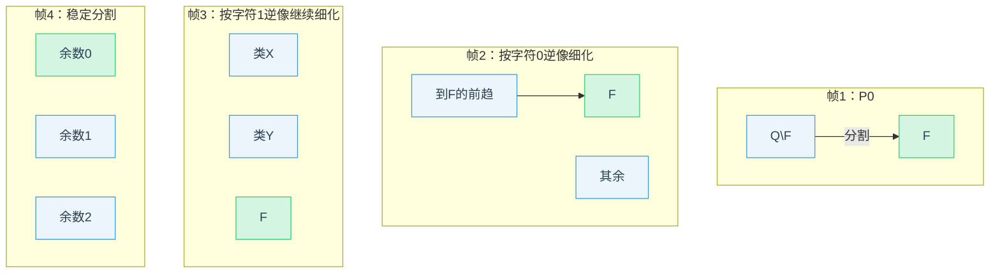

# DFA 最小化｜Hopcroft 算法骨架

## 1. 思想

- 分割细化：从接受/非接受两类开始，不断按可区分的输入字符对分裂等价类，直至稳定。

### 可视化：分割细化过程（示意）

```mermaid
flowchart TD
  A[初始分割 P0 = {F, Q\F}] --> B{选 A∈W, a∈Σ}
  B --> C[按 δ^{-1}(A,a) 拆分各类 C→C1|C2]
  C --> D{是否发生分裂?}
  D -- 否 --> E[下一个 (A,a)]
  D -- 是 --> F[替换 C 为 C1,C2，较小者入 W]
  F --> G{W 是否为空?}
  E --> G
  G -- 否 --> B
  G -- 是 --> H[按最终分割构造最小 DFA]
```

### 可视化：witness 最短构造（配对 BFS）

```mermaid
flowchart LR
  S[(q,q')] --> X{接受性是否不同?}
  X -- 是 --> W[(输出 w)]
  X -- 否 --> T[对每个 a∈Σ 扩展 (δ(q,a), δ(q',a))]
  T --> U{配对是否已访问?}
  U -- 否 --> V[入队并记录 a]
  U -- 是 --> X
  V --> X
```

## 2. 算法骨架

1) 初始分割 P={F, Q\F}，候选工作集 W={F}。
2) 取 A∈W、字符 a：将 P 中每个类 C 按 δ^{-1}(C,a) 拆分为 C1、C2；若发生分裂，用较小块入队。
3) 重复至 W 为空；按最终分割构造最小 DFA 的状态与转移。

## 3. 最小例

- 语言：二进制被 3 整除的 DFA（3 状态）。以 {接受, 非接受} 开始，经一步细化得到余数类 {0},{1,2}，再细化至 {0},{1},{2}。

提示可视化：将 3 个余数类视为同层三节点，显示对字符 0/1 的转移环；细化即将 {1,2} 进一步拆成 {1} 与 {2}。

交叉链接：可与 `MWE-Myhill-Nerode-最小例.md` 对照其等价类与最短 witness 表；两者互证最小 3 态并给出构造性区分词。

### 分割细化图形序列（被3整除示意，4帧）



## 4. 参考

- Hopcroft (1971); Hopcroft–Ullman–Motwani, Automata Theory.
- Moore (1956) DFA 最小化；Brzozowski（反转-确定化-反转-确定化）法对照。

## 伪代码（最小骨架）

```text
Input: DFA (Q, Σ, δ, q0, F)
P ← {F, Q\F}; W ← {F}
while W ≠ ∅:
  A ← pop(W)
  for a in Σ:
    for C in P:
      C1 ← {q ∈ C | δ(q,a) ∈ A}
      C2 ← C \ C1
      if C1 ≠ ∅ and C2 ≠ ∅:
        replace C by C1, C2 in P
        if C ∈ W: replace C by C1, C2 in W
        else: push(min(C1,C2) by size) into W
return DFA induced by partition P
```

## 时间/空间复杂度

- 时间复杂度：O(|Σ|·n log n)，n=|Q|。关键在于每次仅将较小子块入队，保证每个状态在每个字符上被“分裂参与”至多 O(log n) 次（Hopcroft, 1971）。
- 空间复杂度：O(|Σ|·n + m)，其中 m 为转移数量，用于存储逆边索引与分割结构（可用并查集/列表维护）。
- 与其他方法对比：
  - Moore 细化：O(|Σ|·n^2) 级，易实现、慢。
  - Brzozowski：两次反转+确定化，最坏情况可能指数，但在某些实例上简单好用。

## 引文与参考（严格体例）

- Hopcroft, J. E. (1971). An n log n algorithm for minimizing states in a finite automaton. Theory of Machines and Computations.
- Hopcroft, J. E.; Motwani, R.; Ullman, J. D. (2006). Introduction to Automata Theory, Languages, and Computation (3rd ed.). Pearson. Ch. 4.
- Moore, E. F. (1956). Gedanken-Experiments on Sequential Machines. Automata Studies.
- Brzozowski, J. A. (1962). Canonical regular expressions and minimal state graphs for definite events. Mathematical Theory of Automata.

## 内文引文对照（关键命题）

- Hopcroft 最小化时间复杂度 O(|Σ|·n log n)：Hopcroft (1971)；Hopcroft–Motwani–Ullman (2006), Ch. 4。
- Brzozowski 方法（反转-确定化-反转-确定化）等价得到最小 DFA：Brzozowski (1962)。
- 与 Moore（1956）分割细化的关系：两者均基于可区分状态的细化不动点。

## 6→5 状态最小化示例（分割细化表）

- 设 Q={q0,q1,q2,q3,q4,q5}，F={q2,q5}，Σ={0,1}；q3 与 q4 在所有输入上行为相同（不可区分）。
- 初始：P0={F, Q\F}={{q2,q5},{q0,q1,q3,q4}}（按接受/非接受）。
- 细化（按字符 0/1 的逆像分裂）：
  - 第一次：将 {q0,q1,q3,q4} 按到 F 的迁移拆分为 {q0,q1} 与 {q3,q4}；
  - 第二次：发现 q0 与 q1 在后继类上不同，进一步分裂；
  - 稳定：{q3,q4} 合并为一类，其余各自成类，共得 5 类。
- 最终分割：{[q0],[q1],[q2],[q3q4],[q5]}，据此构造 5 状态最小 DFA。

## Brzozowski 方法（对照）

- 步骤：反转 NFA → 确定化（DFA）→ 反转 → 再确定化；所得即最小 DFA。
- 直观：Myhill–Nerode 等价的双向抽取；对某些实例更易实现。

## 5→4 状态示例（简表）

- 初始 DFA Q={a,b,c,d,e}，F={c,e}；b、d 在所有输入上行为相同。
- 直接应用 Brzozowski：
  1) 反转 + 确定化得到等价 DFA'；
  2) 再反转 + 确定化，b、d 合并，得 4 状态最小 DFA。
- 与 Hopcroft 结果一致，供交叉验证。

## Python 参考实现（骨架）

```python
from collections import defaultdict, deque

def hopcroft_minimize(Q, Sigma, delta, q0, F):
    P = [set(F), set(Q) - set(F)]
    W = deque([set(F)])
    pred = {a: defaultdict(set) for a in Sigma}
    for q in Q:
        for a in Sigma:
            pred[a][delta[q][a]].add(q)
    while W:
        A = W.popleft()
        for a in Sigma:
            X = pred[a]
            affected = []
            for C in P:
                Xcap = C & set().union(*[X.get(s, set()) for s in A])
                if Xcap and C - Xcap:
                    P.remove(C)
                    P.extend([Xcap, C - Xcap])
                    if C in W:
                        W.remove(C); W.extend([Xcap, C - Xcap])
                    else:
                        W.append(min(Xcap, C - Xcap, key=len))

    # 构造最小 DFA（略：按 P 的各类收缩状态并重定向转移）
    return P

```

## 构造最小 DFA（等价类收缩）

```python
# 输入：分割 P（等价类列表），class_of: Q→索引，原 DFA=(Q, Σ, δ, q0, F)
# 输出：最小 DFA=(Q', Σ, δ', q0', F')
Qp = list(range(len(P)))
q0p = class_of[q0]
Fp = {class_of[q] for q in F}
# 代表元：取每个类中一个代表 r
rep = {i: next(iter(P[i])) for i in range(len(P))}
# 转移：按代表元转移并映射到类索引
δp = {i: {a: class_of[δ[rep[i]][a]] for a in Σ} for i in Qp}
return (Qp, Σ, δp, q0p, Fp)
```

## 正确性断言（Myhill–Nerode）

- 等价关系：q ~ q' ⇔ ∀w∈Σ*, δ(q,w) 与 δ(q',w) 的接受性一致（同右语言）。
- 正确性：按 ~ 的商集构造的商自动机与原 DFA 语言等价；转移良定义源于 ~ 的右不变性。
- 极小性：若 M' 识别同一语言且状态数更少，则其状态必须合并至少两个不同 ~-类，违背区分词存在性；因此商自动机在同构意义下唯一最小。
- 参考：Hopcroft–Motwani–Ullman (2006), Ch. 4；Sipser, Introduction to the Theory of Computation, Ch. 1。

## 区分词（witness）构造提示

- 目标：给定不同的状态等价类 C≠D，构造 w 使得从任一 c∈C 与 d∈D 出发对 w 的接受性不同。
- 方法：沿最小化细化过程中导致分裂的字符 a 逐步回溯，连接这些字符得到 witness；或在等价类树上从 C 与 D 至接受/拒绝吸收类的最短路径分叉处取前缀。
- 参考：Hopcroft–Motwani–Ullman (2006), Ch. 4；Sipser, Ch. 1（Myhill–Nerode 的构造性证明）。

## 最短 witness BFS 骨架（Python伪代码）

```python
from collections import deque

def shortest_witness(M, q, q2):
    # M: (Q, Σ, δ, F)；目标区分 q 与 q2
    Q, Sigma, delta, F = M
    start = (q, q2)
    dq = deque([(start, "")])
    seen = {start}
    while dq:
        (x, y), w = dq.popleft()
        # 若当前接受性不同，则 w 为最短区分词
        if (x in F) != (y in F):
            return w
        for a in Sigma:
            nx, ny = delta[x][a], delta[y][a]
            pair = (nx, ny)
            if pair not in seen:
                seen.add(pair)
                dq.append((pair, w + a))
    return None
```

## 语言等价断言模板（形式）

- 定义 ~：q ~ q' ⇔ ∀w∈Σ*, Acc(δ(q,w)) ↔ Acc(δ(q',w))。
- 商机 M/~：状态为 ~ 的等价类，[q0] 初态，F'={ [q] | q∈F }，转移 [q] —a→ [δ(q,a)] 良定义。
- 正确性：∀w, Acc_M(w) ↔ Acc_{M/~}(w)。
- 极小性：若 N 识别同一语言且 |Q_N| < |Q_{M/~}|，则 ∃ 两个不同 ~-类在 N 中不可区分，违背 ~ 的定义（存在区分词）。

## 练习（4）

1) 证明：若按“较小块”入队规则改为“较大块”入队，则总体时间复杂度可能退化；给出反例思路或参考文献。
2) 为语言 L={ w∈{0,1}* | 二进制值对 3 取模为 0 } 的 DFA，使用 Hopcroft 算法列出每轮分割与工作集变化，验证最终 3 状态最小化。
3) 证明 Brzozowski 双反转-确定化法所得 DFA 与 Hopcroft 法结果同构（提示：Myhill–Nerode 等价类的唯一性）。
4) 设 |Σ| 固定，给出一个族 {Mn} 使 Hopcroft 算法达到 Θ(|Σ|·n log n) 的下界级复杂度（提示：使用近似“均衡分裂”的构造）。

---

### 解答提纲（仅提示）

1) 复杂度退化：构造在多数轮中被频繁选择的大块，使相同状态多次被扫描；参考 Hopcroft (1971) 的“较小块策略”证明思路。
2) 被 3 整除：列出 W 的演化（初始 {F}），逐字符逆像分裂，记下每轮 P 的变化；最终 P={ {余数0},{余数1},{余数2} }。
3) 同构性：利用 Myhill–Nerode 等价类唯一性，证明两法得到的商自动机只差状态命名；可通过状态到等价类的双射给出同构。
4) 下界族：采用近似均衡分裂的层次结构 DFA，每轮在多个类上触发更小子块入队，使累计代价达到 Θ(n log n)。
