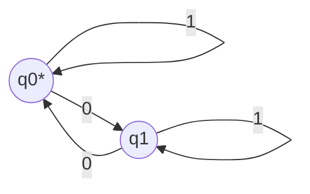

# MWE｜DFA/NFA 等价性（子集构造）

## 1. 定理（经典）

- 对任意 NFA，存在等价的 DFA 识别同一语言（子集构造）。

## 2. 子集构造（伪代码）

```text
D.states := P(N.states)            ; DFA 的状态为 NFA 状态的幂集
D.start  := ε-closure({q0})        ; 起始为 NFA 初态的 ε-闭包
D.delta(S, a) := ε-closure(⋃_{q∈S} δ_N(q,a))
D.accept := { S ⊆ N.states | S ∩ N.accept ≠ ∅ }
```

- 要点：
  - ε-闭包：从集合中所有状态出发，经任意多次 ε 转移可达的状态集合
  - 接受态：若集合中含有任一 NFA 接受态

## 3. 最小例（语言：所有含偶数个 0 的二进制串）

- NFA：两状态 q0（初/受），q1；读到“0”在 q0↔q1 切换，读到“1”自环
- 子集构造得到 DFA：状态 {∅, {q0}, {q1}, {q0,q1}}；可化简为 {q0, q1}



## 4. 提示与参考

- 提示：实际实现中先计算 ε-闭包，再按输入符号拓展；最后最小化 DFA（Hopcroft 算法）。
- 参考：Hopcroft & Ullman《Automata Theory》；Wikipedia: Subset construction / DFA minimization
