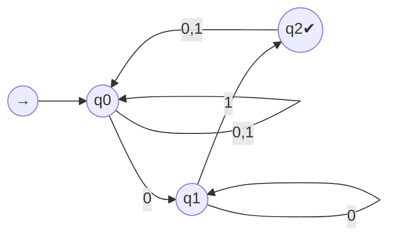

# MWE｜NFA ↔ DFA 互构（子集构造与 ε-闭包）

## 1. 目标

- 给出 NFA→DFA 的子集构造与 ε-闭包最小例；并说明 DFA→等价 NFA 的简单嵌入。

## 2. NFA 最小例

- 字母表 Σ={0,1}；语言 L：以 01 结尾的所有串。

（示意：允许自环以覆盖任意前缀，核心是识别尾部 01）

## 3. 子集构造（ε-闭包为简）

- DFA 状态为 NFA 状态集的子集；初态为 ε-闭包({q0})；接受态包含任何包含 NFA 接受态 q2 的子集。
- 逐列计算转移并合并等价死集，得到等价 DFA；再可用 Hopcroft 进行最小化。

## 4. DFA→NFA（嵌入）

- 将 DFA 的每条确定转移视为 NFA 的唯一转移；不引入 ε 边亦可，语言不变。

## 5. 练习（3）

1) 将语言改为“包含 01 作为子串”（非尾部），给出 NFA 与子集构造后的 DFA。
2) 在子集构造的 DFA 上应用 Hopcroft 最小化，画出等价最小 DFA。
3) 将“以 00 结尾”与“以 01 结尾”的 DFA 做并集构造，验证正则在并下闭包。

## 6. 交叉链接

- `../../00-形式化-元数学-自动化/03-形式语言与符号系统/MWE-DFA-NFA-等价性-最小例.md`（互证材料）
- `../../00-形式化-元数学-自动化/03-形式语言与符号系统/DFA最小化-Hopcroft算法-骨架.md`

## 7. 常见误区与检查清单

- 误将“子集构造后的所有子集”都视为必要状态：请删除不可达与等价死集。
- 忽略 ε-闭包：每次迁移前后都应取闭包。
- 构造后未最小化：若需最小 DFA，请补 Hopcroft 步骤。
- 检查清单：覆盖性（所有转移定义）、可达性（初态可达）、接受性（包含原NFA接受态的子集被标记）。
